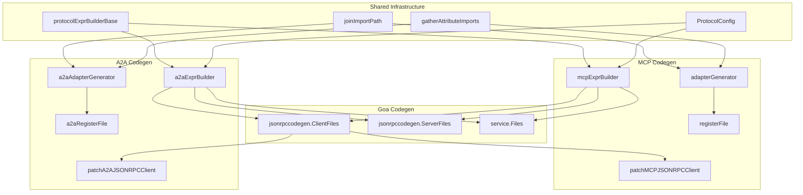

# Design Document: A2A Codegen Refactor

## Overview

This design addresses architectural debt in both A2A (Agent-to-Agent) and MCP (Model Context Protocol) code generation within goa-ai. The refactoring extracts shared infrastructure, aligns A2A's architecture with MCP's proven patterns, and eliminates code duplication while preserving protocol-specific semantics.

The key goals are:
1. Extract shared expression builder infrastructure between A2A and MCP
2. Create a dedicated A2A adapter generator mirroring MCP's pattern
3. Leverage Goa's JSON-RPC codegen for A2A client generation
4. Establish A2A types as a single source of truth via Goa expressions
5. Add retry mechanisms, policy injection, and registration helpers to A2A
6. Consolidate security scheme handling
7. Modularize A2A adapter templates
8. Replace brittle string-based patching with proper template composition

## Architecture

### Current State

The current implementation has several architectural issues:

```
┌─────────────────────────────────────────────────────────────────┐
│                     Current Architecture                        │
├─────────────────────────────────────────────────────────────────┤
│  MCP                          │  A2A                            │
│  ├── mcpExprBuilder           │  ├── a2aExprBuilder             │
│  │   ├── PrepareAndValidate   │  │   ├── PrepareAndValidate     │ ← Duplicated
│  │   ├── collectUserTypes     │  │   ├── collectUserTypes       │ ← Duplicated
│  │   ├── getOrCreateType      │  │   ├── getOrCreateType        │ ← Duplicated
│  │   └── buildHTTPService     │  │   └── buildHTTPService       │ ← Duplicated
│  ├── adapterGenerator         │  ├── (inline in a2a_service.go) │ ← Missing
│  ├── patchMCPJSONRPCClient    │  ├── (handwritten templates)    │ ← Different
│  ├── registerFile             │  ├── (missing)                  │ ← Missing
│  └── retry support            │  └── (missing)                  │ ← Missing
└─────────────────────────────────────────────────────────────────┘
```

### Target State

```
┌─────────────────────────────────────────────────────────────────┐
│                     Target Architecture                         │
├─────────────────────────────────────────────────────────────────┤
│                    Shared Infrastructure                        │
│  ├── protocolExprBuilderBase                                    │
│  │   ├── PrepareAndValidate()                                   │
│  │   ├── collectUserTypes()                                     │
│  │   ├── getOrCreateType()                                      │
│  │   ├── userTypeAttr()                                         │
│  │   └── buildHTTPServiceBase()                                 │
│  ├── joinImportPath()                                           │
│  ├── gatherAttributeImports()                                   │
│  └── ProtocolConfig interface                                   │
├─────────────────────────────────────────────────────────────────┤
│  MCP                           │  A2A                           │
│  ├── mcpExprBuilder            │  ├── a2aExprBuilder            │
│  │   └── embeds base           │  │   └── embeds base           │
│  ├── adapterGenerator          │  ├── a2aAdapterGenerator       │
│  │   └── buildAdapterData()    │  │   └── buildAdapterData()    │
│  ├── patchJSONRPCClient        │  ├── patchA2AJSONRPCClient     │
│  ├── registerFile              │  ├── a2aRegisterFile           │
│  └── retry (runtime/mcp/retry) │  └── retry (runtime/a2a/retry) │
└─────────────────────────────────────────────────────────────────┘
```

### Component Diagram



## Components and Interfaces

### 1. Shared Expression Builder Base

```go
// protocolExprBuilderBase provides common expression building functionality
// shared between MCP and A2A protocol implementations.
type protocolExprBuilderBase struct {
    types map[string]*expr.UserTypeExpr
}

// PrepareAndValidate runs Prepare, Validate, and Finalize on the provided root
// without mutating the global Goa expr.Root to keep generation reentrant.
func (b *protocolExprBuilderBase) PrepareAndValidate(root *expr.RootExpr) error

// collectUserTypes returns all user types in deterministic order for stable codegen.
func (b *protocolExprBuilderBase) collectUserTypes() []expr.UserType

// getOrCreateType retrieves or creates a named user type.
func (b *protocolExprBuilderBase) getOrCreateType(
    name string, 
    builder func() *expr.AttributeExpr,
) *expr.UserTypeExpr

// userTypeAttr returns an attribute referencing a user type.
func (b *protocolExprBuilderBase) userTypeAttr(
    name string, 
    builder func() *expr.AttributeExpr,
) *expr.AttributeExpr

// buildHTTPServiceBase creates the HTTP/JSON-RPC service expression with
// common configuration for routes and SSE endpoints.
func (b *protocolExprBuilderBase) buildHTTPServiceBase(
    service *expr.ServiceExpr,
    config ProtocolConfig,
) *expr.HTTPServiceExpr
```

### 2. Protocol Configuration Interface

```go
// ProtocolConfig defines protocol-specific settings for code generation.
type ProtocolConfig interface {
    // JSONRPCPath returns the path for JSON-RPC endpoints.
    JSONRPCPath() string
    // ProtocolVersion returns the protocol version string.
    ProtocolVersion() string
    // Capabilities returns protocol-specific capabilities for initialization.
    Capabilities() map[string]any
    // Name returns the protocol name (e.g., "MCP", "A2A").
    Name() string
}

// a2aConfig implements ProtocolConfig for A2A.
type a2aConfig struct {
    path    string
    version string
}

func (c *a2aConfig) JSONRPCPath() string           { return c.path }
func (c *a2aConfig) ProtocolVersion() string       { return c.version }
func (c *a2aConfig) Capabilities() map[string]any  { return map[string]any{"streaming": true} }
func (c *a2aConfig) Name() string                  { return "A2A" }
```

### 3. A2A Adapter Generator

```go
// a2aAdapterGenerator generates the adapter layer between A2A and agent runtime.
// It mirrors MCP's adapterGenerator pattern.
type a2aAdapterGenerator struct {
    genpkg string
    agent  *AgentData
    scope  *codegen.NameScope
}

// A2AAdapterData holds template data for A2A adapter generation.
type A2AAdapterData struct {
    Agent               *AgentData
    A2AServiceName      string
    A2APackage          string
    Skills              []*A2ASkillData
    HasSecuritySchemes  bool
    SecuritySchemes     []*A2ASecuritySchemeData
    SecurityRequirements []map[string][]string
    ProtocolVersion     string
    // Type references computed via NameScope
    TaskMessageTypeRef  string
    TaskResponseTypeRef string
    // Input schemas for skills (JSON Schema)
    SkillSchemas        map[string]string
}

// A2ASkillData represents a skill with computed type references.
type A2ASkillData struct {
    ID              string
    Name            string
    Description     string
    Tags            []string
    InputSchema     string  // JSON Schema
    PayloadTypeRef  string  // Computed via GoFullTypeRef
    ResultTypeRef   string  // Computed via GoFullTypeRef
    ExampleArgs     string  // Example JSON arguments
}

// buildAdapterData creates template data with proper type references.
func (g *a2aAdapterGenerator) buildAdapterData() *A2AAdapterData

// getTypeReference returns a Go type reference using NameScope helpers.
func (g *a2aAdapterGenerator) getTypeReference(attr *expr.AttributeExpr) string
```

### 4. Shared Utility Functions

```go
// joinImportPath constructs a full import path by joining the generation package
// base path with a relative path. Shared between MCP and A2A.
func joinImportPath(genpkg, rel string) string

// gatherAttributeImports collects import specifications for external user types
// and meta-type imports referenced by the given attribute expression.
func gatherAttributeImports(genpkg string, att *expr.AttributeExpr) []*codegen.ImportSpec
```

### 5. A2A Registration Helper

```go
// A2ARegisterData drives generation of runtime registration helpers.
type A2ARegisterData struct {
    Package            string
    HelperName         string
    AgentName          string
    Description        string
    Skills             []A2ARegisterSkill
}

// A2ARegisterSkill represents a skill entry in the registration helper.
type A2ARegisterSkill struct {
    ID            string
    QualifiedName string
    Description   string
    PayloadType   string
    ResultType    string
    InputSchema   string
    ExampleArgs   string
}

// a2aRegisterFile generates the registration helper file.
func a2aRegisterFile(data *A2AAdapterData) *codegen.File
```

### 6. A2A Retry Support

```go
// Package runtime/a2a/retry provides retry functionality for A2A clients.

// RetryConfig configures retry behavior for A2A client calls.
type RetryConfig struct {
    MaxAttempts     int
    InitialBackoff  time.Duration
    MaxBackoff      time.Duration
    BackoffFactor   float64
    RetryableErrors []int  // JSON-RPC error codes to retry
}

// DefaultRetryConfig returns sensible defaults matching MCP's retry package.
func DefaultRetryConfig() *RetryConfig

// IsRetryable determines if an error should trigger a retry.
func IsRetryable(err error) bool

// WithRetry wraps a function with retry logic using exponential backoff.
func WithRetry[T any](ctx context.Context, config *RetryConfig, fn func() (T, error)) (T, error)
```

### 7. A2A Policy Injection

```go
// Policy headers for skill filtering.
const (
    HeaderAllowSkills = "x-a2a-allow-skills"
    HeaderDenySkills  = "x-a2a-deny-skills"
)

// Context keys for policy values.
type contextKey string
const (
    ctxAllowSkills contextKey = "a2a_allow_skills"
    ctxDenySkills  contextKey = "a2a_deny_skills"
)

// ExtractPolicyFromHeaders extracts allow/deny skill lists from HTTP headers.
func ExtractPolicyFromHeaders(r *http.Request) (allow, deny []string)

// InjectPolicyToContext adds policy values to the context.
func InjectPolicyToContext(ctx context.Context, allow, deny []string) context.Context

// FilterSkills applies allow/deny policy to a skill list.
func FilterSkills(ctx context.Context, skills []*A2ASkill) []*A2ASkill

// ValidateSkillAccess checks if a skill is allowed by the current policy.
func ValidateSkillAccess(ctx context.Context, skillID string) error
```

## Data Models

### A2A Types (Generated from Goa Expressions)

All A2A protocol types are defined in `a2a_types.go` as Goa expression builders. The generated types live in the A2A service package and are imported by templates.

```go
// Core A2A types built from Goa expressions:
// - TaskMessage: Message with role and parts
// - MessagePart: Text, data, or file content
// - TaskStatus: State, message, timestamp
// - Artifact: Output artifact with parts
// - A2ASkill: Skill definition
// - A2ASecurityScheme: Security scheme definition
// - SendTaskPayload: Task submission payload
// - TaskResponse: Task result
// - TaskEvent: Streaming event
// - AgentCardResponse: Agent discovery document
```

### Security Scheme Mapping

```go
// Security scheme type mapping from Goa to A2A:
// - Basic     → http/basic
// - APIKey    → apiKey
// - JWT       → http/bearer
// - OAuth2    → oauth2 (with flows)

// buildA2ASecurityData is the single source of truth for security mapping.
// Called once and passed to adapter, card, and client generators.
func buildA2ASecurityData(agent *AgentData) ([]*A2ASecuritySchemeData, []map[string][]string)
```

## Correctness Properties

*A property is a characteristic or behavior that should hold true across all valid executions of a system-essentially, a formal statement about what the system should do. Properties serve as the bridge between human-readable specifications and machine-verifiable correctness guarantees.*

### Property 1: Deterministic User Type Collection
*For any* set of user types registered with an expression builder, collecting them should always produce the same ordered list regardless of insertion order.
**Validates: Requirements 1.5**

### Property 2: Type Reference Consistency
*For any* attribute expression with user types (including composites like arrays and maps), the type reference generated via NameScope helpers should be syntactically valid Go code and correctly qualified with package aliases.
**Validates: Requirements 2.2**

### Property 3: Schema Generation Consistency
*For any* tool payload attribute, the JSON schema generated for A2A skills should be structurally equivalent to the schema generated for MCP tools with the same payload.
**Validates: Requirements 2.4**

### Property 4: Auth Helper Generation Consistency
*For any* valid Goa security scheme (Basic, APIKey, JWT, OAuth2), the generated A2A auth provider should correctly implement the authentication mechanism.
**Validates: Requirements 3.4**

### Property 5: Structured Error Codes
*For any* JSON-RPC error returned by the A2A client, the error should contain a valid JSON-RPC error code and be wrapped in a structured error type.
**Validates: Requirements 3.5**

### Property 6: Retry Behavior
*For any* retryable error (network timeout, 503, etc.), the retry mechanism should attempt up to MaxAttempts with exponential backoff, and return a structured error when exhausted.
**Validates: Requirements 5.1, 5.4**

### Property 7: Streaming Reconnection
*For any* interrupted streaming connection, the client should attempt reconnection and resume from the last known state when possible.
**Validates: Requirements 5.3**

### Property 8: Policy Header Extraction
*For any* HTTP request with policy headers, the extracted allow/deny skill lists should exactly match the comma-separated values in the headers.
**Validates: Requirements 6.1, 6.2**

### Property 9: Skill Filtering Correctness
*For any* skill list and allow/deny policy, the filtered result should contain only skills that are in the allow list (if non-empty) and not in the deny list.
**Validates: Requirements 6.3**

### Property 10: Skill Access Validation
*For any* skill ID and policy context, validation should pass if and only if the skill would appear in the filtered skill list.
**Validates: Requirements 6.4**

### Property 11: Registration Completeness
*For any* agent with exported toolsets, the registration helper should register all skills with their complete schemas and metadata.
**Validates: Requirements 7.2, 7.3**

### Property 12: Security Scheme Mapping Round-Trip
*For any* valid Goa security scheme, mapping to A2A format and back should preserve the essential authentication semantics (type, scheme, location, flows).
**Validates: Requirements 10.4**

### Property 13: Type Serialization Round-Trip
*For any* A2A protocol type instance, JSON serialization followed by deserialization should produce an equivalent value.
**Validates: Requirements 10.5**

### Property 14: Import Path Resolution Consistency
*For any* external user type referenced in both MCP and A2A contexts, the resolved import path should be identical.
**Validates: Requirements 12.4**

### Property 15: Protocol Config Path Usage
*For any* protocol configuration with a specified JSON-RPC path, all generated routes should use that exact path.
**Validates: Requirements 13.2**

### Property 16: Capability Inclusion
*For any* protocol configuration with specified capabilities, the initialization response should include all specified capabilities.
**Validates: Requirements 13.3**

### Property 17: Template Patch Failure Detection
*For any* expected template pattern that is not found during patching, the system should return a clear error rather than silently producing incorrect code.
**Validates: Requirements 11.5**

## Error Handling

### Code Generation Errors

1. **Expression Validation Failures**: When `PrepareAndValidate` fails, return a detailed error with the validation context. Do not silently skip generation.

2. **Template Rendering Failures**: When template execution fails, include the template name, data context, and underlying error.

3. **Patch Application Failures**: When string-based patches cannot find their target, fail fast with a clear error message indicating which pattern was expected.

4. **Type Resolution Failures**: When `GoFullTypeRef` cannot resolve a type, return an error rather than producing invalid code.

### Runtime Errors

1. **Retry Exhaustion**: Return `*RetryExhaustedError` with the last error, attempt count, and total duration.

2. **Policy Violations**: Return `*PolicyViolationError` with the skill ID and policy context.

3. **Protocol Errors**: Wrap JSON-RPC errors in `*A2AError` with code, message, and optional data.

4. **Streaming Errors**: Return `*StreamError` with reconnection hints when applicable.

## Testing Strategy

### Dual Testing Approach

This implementation uses both unit tests and property-based tests:
- **Unit tests** verify specific examples, edge cases, and integration points
- **Property-based tests** verify universal properties that should hold across all inputs

### Property-Based Testing Framework

Use `gopter` (Go Property Testing) for property-based tests. Configure each test to run a minimum of 100 iterations.

### Test Categories

1. **Shared Infrastructure Tests** (`codegen/shared_test.go`)
   - Unit tests for `protocolExprBuilderBase` methods
   - Property tests for deterministic type collection (Property 1)
   - Property tests for import path resolution (Property 14)

2. **A2A Adapter Generator Tests** (`codegen/agent/a2a_adapter_test.go`)
   - Unit tests for `a2aAdapterGenerator.buildAdapterData()`
   - Property tests for type reference generation (Property 2)
   - Property tests for schema generation consistency (Property 3)
   - Golden file tests comparing generated adapter output

3. **A2A Client Tests** (`codegen/agent/a2a_client_test.go`)
   - Unit tests for client generation
   - Property tests for auth helper generation (Property 4)
   - Property tests for structured error codes (Property 5)
   - Integration tests verifying JSON-RPC communication

4. **Retry Tests** (`runtime/a2a/retry/retry_test.go`)
   - Property tests for retry behavior (Property 6)
   - Property tests for streaming reconnection (Property 7)

5. **Policy Tests** (`runtime/a2a/policy/policy_test.go`)
   - Property tests for header extraction (Property 8)
   - Property tests for skill filtering (Property 9)
   - Property tests for access validation (Property 10)

6. **Registration Tests** (`codegen/agent/a2a_register_test.go`)
   - Property tests for registration completeness (Property 11)

7. **Security Scheme Tests** (`codegen/agent/a2a_security_property_test.go`)
   - Property tests for scheme mapping round-trip (Property 12)

8. **Type Tests** (`codegen/agent/a2a_types_test.go`)
   - Property tests for serialization round-trip (Property 13)

9. **Template Patch Tests** (`codegen/mcp/patch_test.go`)
   - Property tests for patch failure detection (Property 17)

### Test Annotation Format

Each property-based test must be annotated with:
```go
// **Feature: a2a-codegen-refactor, Property N: <property_text>**
// **Validates: Requirements X.Y**
```

## File Organization

```
codegen/
├── shared/
│   ├── expr_builder_base.go      # protocolExprBuilderBase
│   ├── import_utils.go           # joinImportPath, gatherAttributeImports
│   ├── protocol_config.go        # ProtocolConfig interface
│   └── shared_test.go            # Shared infrastructure tests
├── agent/
│   ├── a2a_adapter_generator.go  # a2aAdapterGenerator (new)
│   ├── a2a_expr_builder.go       # Embeds protocolExprBuilderBase
│   ├── a2a_types.go              # Type expression builders
│   ├── a2a_methods.go            # Method expression builders
│   ├── a2a_service.go            # Service generation orchestration
│   ├── a2a_card.go               # Agent card generation
│   ├── a2a_client.go             # Client generation (uses Goa codegen)
│   ├── a2a_register.go           # Registration helper generation (new)
│   ├── a2a_policy.go             # Policy injection (new)
│   └── templates/
│       ├── a2a_adapter_core.go.tpl      # Core adapter (new)
│       ├── a2a_adapter_tasks.go.tpl     # Task operations (new)
│       ├── a2a_adapter_card.go.tpl      # Agent card (new)
│       ├── a2a_adapter_security.go.tpl  # Security (new)
│       ├── a2a_register.go.tpl          # Registration helper (new)
│       └── a2a_client_retry.go.tpl      # Client retry helpers (new)
├── mcp/
│   ├── mcp_expr_builder.go       # Embeds protocolExprBuilderBase
│   └── ... (existing files)
runtime/
├── a2a/
│   ├── retry/
│   │   ├── retry.go              # Retry logic (new)
│   │   └── retry_test.go
│   └── policy/
│       ├── policy.go             # Policy injection (new)
│       └── policy_test.go
```
