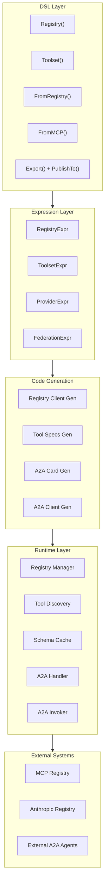

# Design Document: MCP Registry Integration

## Overview

This design describes the integration of MCP Gateway Registry functionality into goa-ai, enabling agents to discover, register, and consume tools from centralized registries. The design covers DSL extensions, expression types, code generation, runtime components, and A2A protocol support.

The integration follows goa-ai's design-first philosophy: declare intent in DSL, generate typed infrastructure, execute reliably at runtime.

## Architecture



## Components and Interfaces

### DSL Components

#### Registry DSL (`dsl/registry.go`)

```go
// Registry declares a registry source for tool discovery.
func Registry(name string, fn func()) *RegistryExpr

// URL sets the registry endpoint (implements URLHolder).
// Uses Goa's URL() function via URLHolder interface.

// Security sets authentication for the registry (implements SecurityHolder).
// Uses Goa's Security() function via SecurityHolder interface.

// APIVersion sets the registry API version (e.g., "v1", "2024-11-05").
// Defaults to "v1" for Anthropic-compatible registries.
func APIVersion(version string)

// Timeout sets HTTP request timeout for registry operations.
func Timeout(duration string)

// Retry configures retry policy for failed requests.
func Retry(maxRetries int, backoff string)

// SyncInterval sets how often to refresh the catalog.
func SyncInterval(duration string)

// CacheTTL sets local cache duration.
func CacheTTL(duration string)

// Federation configures external registry import.
func Federation(fn func())

// Include specifies namespaces to import from federated source.
func Include(patterns ...string)

// Exclude specifies namespaces to skip from federated source.
func Exclude(patterns ...string)

// PublishTo configures registry publication for exported toolsets.
func PublishTo(registry *RegistryExpr)
```

#### Toolset Provider Options (`dsl/toolset.go`)

```go
// FromMCP configures a toolset to be backed by an MCP server.
func FromMCP(service, toolset string) *ProviderExpr

// FromRegistry configures a toolset to be sourced from a registry.
func FromRegistry(registry *RegistryExpr, toolset string) *ProviderExpr

// Version pins a registry toolset to a specific version.
func Version(version string)
```

### Expression Types

#### RegistryExpr (`expr/agent/registry.go`)

```go
type RegistryExpr struct {
    Name         string
    Description  string
    URL          string
    APIVersion   string                    // API version (e.g., "v1", "2024-11-05")
    Requirements []*goaexpr.SecurityExpr
    SyncInterval time.Duration
    CacheTTL     time.Duration
    Timeout      time.Duration             // HTTP request timeout
    RetryPolicy  *RetryPolicyExpr          // Retry configuration
    Federation   *FederationExpr
    DSLFunc      func()
}

type RetryPolicyExpr struct {
    MaxRetries int
    BackoffBase time.Duration
    BackoffMax  time.Duration
}

// Implements expr.SecurityHolder
func (r *RegistryExpr) AddSecurityRequirement(sec *goaexpr.SecurityExpr) {
    r.Requirements = append(r.Requirements, sec)
}

// Implements expr.URLHolder
func (r *RegistryExpr) SetURL(url string) {
    r.URL = url
}
```

#### ProviderExpr (`expr/agent/provider.go`)

```go
type ProviderKind int

const (
    ProviderLocal ProviderKind = iota
    ProviderMCP
    ProviderRegistry
)

type ProviderExpr struct {
    Kind        ProviderKind
    MCPService  string      // For ProviderMCP
    MCPToolset  string      // For ProviderMCP
    Registry    *RegistryExpr // For ProviderRegistry
    ToolsetName string      // For ProviderRegistry
    Version     string      // Optional version pin
}
```

#### FederationExpr (`expr/agent/federation.go`)

```go
type FederationExpr struct {
    Include []string // Glob patterns to include
    Exclude []string // Glob patterns to exclude
}
```

#### Updated ToolsetExpr

```go
type ToolsetExpr struct {
    Name        string
    Description string
    Tags        []string
    Tools       []*ToolExpr
    Agent       *AgentExpr
    Origin      *ToolsetExpr
    DSLFunc     func()
    
    // NEW: Provider configuration (replaces External/MCPService/MCPToolset)
    Provider    *ProviderExpr
    
    // Publication configuration
    PublishTo   []*RegistryExpr
}
```

### Generated Code Structure

#### Registry Client (`gen/<svc>/registry/<name>/client.go`)

```go
type Client struct {
    endpoint   string
    httpClient *http.Client
    auth       AuthProvider
    cache      *SchemaCache
}

func NewClient(opts ...Option) *Client

func (c *Client) ListToolsets(ctx context.Context) ([]*ToolsetInfo, error)
func (c *Client) GetToolset(ctx context.Context, name string) (*ToolsetSchema, error)
func (c *Client) Search(ctx context.Context, query string) ([]*SearchResult, error)
func (c *Client) Register(ctx context.Context, card *AgentCard) error
func (c *Client) Deregister(ctx context.Context, agentID string) error
func (c *Client) Heartbeat(ctx context.Context, agentID string) error
```

#### A2A Agent Card (`gen/<svc>/agents/<agent>/a2a/card.go`)

```go
type AgentCard struct {
    ProtocolVersion    string               `json:"protocolVersion"`
    Name               string               `json:"name"`
    Description        string               `json:"description"`
    URL                string               `json:"url"`
    Version            string               `json:"version"`
    Capabilities       map[string]any       `json:"capabilities"`
    DefaultInputModes  []string             `json:"defaultInputModes"`
    DefaultOutputModes []string             `json:"defaultOutputModes"`
    Skills             []*Skill             `json:"skills"`
    SecuritySchemes    map[string]*Scheme   `json:"securitySchemes,omitempty"`
    Security           []map[string][]string `json:"security,omitempty"`
}

type Skill struct {
    ID          string   `json:"id"`
    Name        string   `json:"name"`
    Description string   `json:"description"`
    Tags        []string `json:"tags"`
    InputModes  []string `json:"inputModes,omitempty"`
    OutputModes []string `json:"outputModes,omitempty"`
}

func BuildAgentCard(agent *AgentExpr, baseURL string) *AgentCard
```

#### A2A Client (`gen/<svc>/agents/<agent>/a2a/client.go`)

```go
type A2AClient struct {
    endpoint string
    auth     AuthProvider
}

func NewA2AClient(card *AgentCard, auth AuthProvider) *A2AClient

func (c *A2AClient) SendTask(ctx context.Context, skillID string, input any) (*TaskResult, error)
func (c *A2AClient) SendTaskStreaming(ctx context.Context, skillID string, input any) (<-chan *TaskEvent, error)
```

### Runtime Components

#### Registry Manager (`runtime/registry/manager.go`)

```go
type Manager struct {
    registries map[string]*RegistryClient
    cache      Cache
    logger     clue.Logger
    metrics    clue.Metrics
}

func NewManager(opts ...Option) *Manager

func (m *Manager) AddRegistry(name string, client *RegistryClient)
func (m *Manager) DiscoverToolset(ctx context.Context, registry, toolset string) (*ToolsetSchema, error)
func (m *Manager) Search(ctx context.Context, query string) ([]*SearchResult, error)
func (m *Manager) StartSync(ctx context.Context) error
func (m *Manager) StopSync()
```

#### Schema Cache (`runtime/registry/cache.go`)

```go
type Cache interface {
    Get(ctx context.Context, key string) (*ToolsetSchema, error)
    Set(ctx context.Context, key string, schema *ToolsetSchema, ttl time.Duration) error
    Delete(ctx context.Context, key string) error
}

type MemoryCache struct { ... }
type RedisCache struct { ... }
```

#### A2A Service (Generated via Goa Codegen)

The A2A service follows the **same pattern as MCP server support**. Both protocols:
- Define a synthetic Goa service with protocol-specific methods
- Generate an adapter that maps protocol requests to underlying functionality
- Use Goa's JSON-RPC codegen for HTTP/SSE transport

**Pattern Comparison:**

| Aspect | MCP Server | A2A Agent |
|--------|-----------|-----------|
| Protocol | MCP JSON-RPC | A2A JSON-RPC |
| Methods | `tools/call`, `resources/read`, etc. | `tasks/send`, `tasks/sendSubscribe`, etc. |
| Routes to | Service methods (via adapter) | Agent runtime (via `runtime.MustClient`) |
| Streaming | SSE for `tools/call` | SSE for `tasks/sendSubscribe` |
| Codegen | `codegen/mcp/` | `codegen/agent/a2a_service.go` |

**A2A Codegen Structure:**

```
codegen/agent/
├── a2a_card.go          # Existing: generates agent card
├── a2a_service.go       # NEW: generates A2A service + adapter
└── templates/
    ├── a2a_card.go.tpl
    ├── a2a_service.go.tpl      # NEW: A2A service expression
    └── a2a_adapter.go.tpl      # NEW: adapter to agent runtime
```

**Generated Output:**

```
gen/<svc>/
├── a2a_<agent>/                # A2A service package (like mcp_<svc>/)
│   ├── service.go              # Goa service with A2A methods
│   ├── endpoints.go            # Goa endpoints
│   ├── adapter.go              # Maps A2A → agent runtime
│   └── protocol_version.go     # A2A protocol version constant
└── jsonrpc/a2a_<agent>/        # JSON-RPC transport (Goa generated)
    ├── server/
    └── client/
```

**Adapter Pattern:**

```go
// Generated in gen/a2a_<agent>/adapter.go

type Adapter struct {
    runtime *runtime.Runtime
    agentID agent.Ident
}

// SendTask implements the tasks/send A2A method
func (a *Adapter) SendTask(ctx context.Context, p *SendTaskPayload) (*TaskResponse, error) {
    // Convert A2A message to agent input
    messages := convertA2AToMessages(p.Message)
    
    // Execute agent run
    client := a.runtime.MustClient(a.agentID)
    out, err := client.Run(ctx, messages)
    if err != nil {
        return taskErrorResponse(p.ID, err), nil
    }
    
    // Convert agent output to A2A response
    return taskSuccessResponse(p.ID, out), nil
}
```

**Shared Helpers:**

Both MCP and A2A codegen can share:
- JSON-RPC request/response handling patterns
- SSE streaming infrastructure
- Error mapping utilities
- Schema generation helpers
- Generates specialized code rather than generic handlers
- Follows goa-ai's design-first philosophy

## Data Models

### JSON Schema Implementation

The codebase uses Goa's `openapi.Schema` type from `goa.design/goa/v3/http/codegen/openapi` directly—no custom schema package is maintained. This provides:

- Complete JSON Schema draft 2020-12 support
- Integration with Goa's type system via `TypeSchema()` and `AttributeTypeSchema()`
- Support for `$ref`, `anyOf`, `format`, `exclusiveMinimum/Maximum`, and other advanced features
- Battle-tested serialization and validation
- Automatic schema generation from Goa DSL expressions

```go
import "goa.design/goa/v3/http/codegen/openapi"

// Use openapi.Schema directly for tool input schemas
inputSchema := openapi.AttributeTypeSchema(api, toolExpr.Payload)

// Schema serialization via standard JSON marshaling
data, _ := json.Marshal(inputSchema)
```

### MCP Tool Schema (JSON)

```json
{
  "name": "search_docs",
  "description": "Search documentation",
  "inputSchema": {
    "type": "object",
    "properties": {
      "query": { "type": "string", "description": "Search query" },
      "limit": { "type": "integer", "default": 10 }
    },
    "required": ["query"]
  }
}
```

### A2A Agent Card (JSON)

```json
{
  "protocolVersion": "1.0",
  "name": "data-agent",
  "description": "Data processing agent",
  "url": "https://api.example.com/agents/data-agent",
  "version": "1.0.0",
  "capabilities": { "streaming": true },
  "defaultInputModes": ["application/json"],
  "defaultOutputModes": ["application/json"],
  "skills": [
    {
      "id": "summarize",
      "name": "Summarize",
      "description": "Summarize text documents",
      "tags": ["nlp", "summarization"]
    }
  ],
  "securitySchemes": {
    "bearer": { "type": "http", "scheme": "bearer" }
  },
  "security": [{ "bearer": [] }]
}
```

### A2A Task Request (JSON-RPC)

```json
{
  "jsonrpc": "2.0",
  "method": "tasks/send",
  "params": {
    "id": "task-123",
    "message": {
      "role": "user",
      "parts": [{ "type": "text", "text": "Summarize this document..." }]
    }
  },
  "id": "req-456"
}
```

### Registry Search Result

```go
type SearchResult struct {
    ID             string   `json:"id"`
    Name           string   `json:"name"`
    Description    string   `json:"description"`
    Type           string   `json:"type"` // "tool", "toolset", "agent"
    SchemaRef      string   `json:"schemaRef"`
    RelevanceScore float64  `json:"relevanceScore"`
    Tags           []string `json:"tags"`
    Origin         string   `json:"origin"` // Federation source
}
```

## Correctness Properties

*A property is a characteristic or behavior that should hold true across all valid executions of a system-essentially, a formal statement about what the system should do. Properties serve as the bridge between human-readable specifications and machine-verifiable correctness guarantees.*

### Property 1: Tool Schema Round-Trip Consistency
*For any* valid MCP tool schema, serializing to JSON then deserializing back SHALL produce an equivalent schema.
**Validates: Requirements 9.3**

### Property 2: Registry Catalog Merge Preserves Tools
*For any* set of registry sources with non-conflicting tool names, merging their catalogs SHALL include all tools from all sources.
**Validates: Requirements 1.3**

### Property 3: Cache Fallback on Unavailability
*For any* registry that becomes unavailable after successful initial fetch, the runtime SHALL return cached data for subsequent requests until TTL expires.
**Validates: Requirements 1.4, 8.2**

### Property 4: A2A Agent Card Conformance
*For any* goa-ai agent with Export and PublishTo, the generated agent card SHALL contain all required A2A fields (protocolVersion, name, description, url, version, capabilities).
**Validates: Requirements 13.1**

### Property 5: Tool-to-Skill Mapping Completeness
*For any* exported toolset, every tool SHALL be mapped to an A2A skill with matching name and description.
**Validates: Requirements 13.2**

### Property 6: Security Scheme Mapping
*For any* agent with Goa security requirements, the generated A2A agent card SHALL include corresponding security schemes.
**Validates: Requirements 13.3**

### Property 7: Schema Validation Rejects Invalid Payloads
*For any* tool with a JSON schema, payloads that violate the schema SHALL be rejected before invocation.
**Validates: Requirements 2.2**

### Property 8: Federation Origin Tagging
*For any* federated server or agent imported from an external registry, the runtime SHALL tag it with its origin source.
**Validates: Requirements 5.2**

### Property 9: Search Returns Required Fields
*For any* semantic search result, the result SHALL include tool ID, description, schema reference, and relevance score.
**Validates: Requirements 4.2**

### Property 10: Empty Search Returns Empty Set
*For any* search query with no matches, the runtime SHALL return an empty result set without error.
**Validates: Requirements 4.3**

### Property 11: Provider-Agnostic Specs Generation
*For any* toolset regardless of provider (local, MCP, registry), the generated tool_specs structure SHALL be identical in shape.
**Validates: Requirements 10.4, 11.1**

### Property 12: A2A Task Routing
*For any* valid A2A task request targeting a skill, the runtime SHALL route to the corresponding tool and return a valid task response.
**Validates: Requirements 13.4**

### Property 13: Static Generation Equivalence
*For any* agent with static design information, the generated static literals SHALL produce equivalent runtime values to the previous builder-function approach.
**Validates: Requirements 16.1, 16.2**

### Property 14: Type-Specific Validation Equivalence
*For any* tool payload, the generated type-specific validator SHALL accept/reject the same inputs as the generic schema validator.
**Validates: Requirements 16.3**

## Code Generation Philosophy

The code generation follows a "specialize where possible, generalize where necessary" principle:

### Static Generation (Preferred)

Generate specialized code when information is known at design time:

1. **Static Literals for Agent Cards**: Instead of `BuildAgentCard()` functions that construct data at runtime, generate static struct literals:
   ```go
   // Generated: static agent card template
   var agentCardTemplate = AgentCard{
       ProtocolVersion: "1.0",
       Name:            "data-agent",
       Description:     "Data processing agent",
       Skills: []Skill{
           {ID: "summarize", Name: "Summarize", Description: "..."},
       },
       SecuritySchemes: map[string]SecurityScheme{
           "bearer": {Type: "http", Scheme: "bearer"},
       },
   }
   
   func AgentCard(baseURL string) *AgentCard {
       card := agentCardTemplate
       card.URL = baseURL
       return &card
   }
   ```

2. **Static URL Paths**: Generate pre-computed URL patterns instead of runtime `url.JoinPath()`:
   ```go
   // Instead of: url.JoinPath(c.endpoint, c.apiVersion, "toolsets", name)
   // Generate: c.endpoint + "/v1/toolsets/" + name
   const apiPath = "/v1/toolsets/"
   ```

3. **Type-Specific Validators**: Generate validation functions specialized to the schema:
   ```go
   // Instead of generic validateType() with runtime schema parsing:
   func ValidateSearchPayload(p *SearchPayload) error {
       if p.Query == "" {
           return errors.New("query: required field missing")
       }
       if len(p.Query) > 1000 {
           return errors.New("query: exceeds maximum length 1000")
       }
       return nil
   }
   ```

4. **Security Scheme-Specific Auth**: Generate only the auth types actually used:
   ```go
   // If agent only uses bearer auth, don't generate APIKeyAuth or BasicAuth
   type BearerAuth struct { Token string }
   func (a *BearerAuth) ApplyAuth(req *http.Request) error { ... }
   ```

### Runtime Constructs (When Necessary)

Use runtime components only for genuinely dynamic behavior:

1. **Registry-Discovered Schemas**: Schemas fetched from registries at runtime require generic validation
2. **User-Provided Configuration**: Endpoints, credentials, timeouts provided at runtime
3. **Cache Management**: TTL-based caching with background refresh
4. **Federation Sync**: Periodic catalog synchronization from external registries

### Benefits

- **Compile-Time Safety**: Static code catches errors at build time
- **Performance**: No runtime reflection, parsing, or map lookups for static data
- **Debuggability**: Generated code is readable and traceable
- **Smaller Binaries**: No unused generic code paths

## Error Handling

### Registry Errors

| Error | Handling |
|-------|----------|
| Registry unavailable | Emit warning, use cached data if available, fail if no cache |
| Authentication failure | Emit error event, fail operation with structured error |
| Toolset not found | Emit error, prevent agent startup if required toolset |
| Schema validation failure | Return structured validation error with field details |
| Federation sync failure | Log failure, continue with cached data |

### A2A Errors

| Error | Handling |
|-------|----------|
| Agent unavailable | Emit error, optionally use cached agent card |
| Task timeout | Return timeout error, cancel pending request |
| Invalid task response | Return parse error with response details |
| Authentication required | Use security scheme from agent card |

## Testing Strategy

### Unit Testing

Unit tests verify specific examples and edge cases:
- DSL evaluation produces correct expression trees
- Code generation outputs expected file structure
- Schema serialization produces valid JSON
- Cache operations (get/set/delete) work correctly

### Property-Based Testing

Property-based tests verify universal properties using **fast-check** (TypeScript) or **gopter** (Go):

1. **Schema Round-Trip** (Property 1): Generate random valid tool schemas, serialize/deserialize, verify equivalence
2. **Catalog Merge** (Property 2): Generate random tool catalogs, merge, verify all tools present
3. **A2A Card Conformance** (Property 4): Generate random agent expressions, build cards, verify required fields
4. **Validation Rejection** (Property 7): Generate random invalid payloads, verify rejection

Each property test runs minimum 100 iterations.

Property tests are tagged with format: `**Feature: mcp-registry, Property {number}: {property_text}**`

### Integration Testing

Integration tests verify end-to-end flows:
- Registry client connects to mock registry server
- Tool discovery resolves schemas correctly
- A2A handler processes task requests
- Federation sync imports external servers

