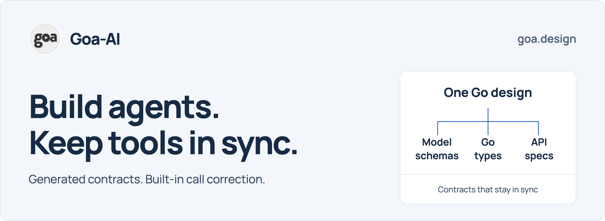
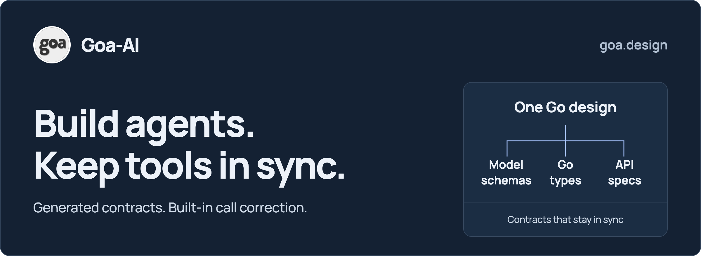

<p align="center">
  <a href="https://goa.design/docs/2-goa-ai/#gh-light-mode-only">
    <picture>
      <source media="(max-width: 600px)" srcset="docs/img/goa-ai-banner-mobile.png">
      
    </picture>
  </a>
  <a href="https://goa.design/docs/2-goa-ai/#gh-dark-mode-only">
    <picture>
      <source media="(max-width: 600px)" srcset="docs/img/goa-ai-banner-mobile-dark.png">
      
    </picture>
  </a>
</p>

<p align="center">
  <a href="https://github.com/goadesign/goa-ai/releases/latest"></a>
  <a href="https://github.com/goadesign/goa-ai/actions/workflows/ci.yml"></a>
  <a href="https://pkg.go.dev/goa.design/goa-ai"></a>
  <a href="LICENSE"></a>
</p>

# Goa-AI: AI agents, MCP servers, and tool registries in Go

Define your tools once. Generate the schemas the model sees, the Go types your
implementation uses, and the validation that connects them. Goa-AI runs the
agent loop and helps the model correct invalid tool calls with specific feedback
and valid examples from your design.

Part of the [Goa ecosystem](https://goa.design): use [Goa](https://github.com/goadesign/goa)
for services and Goa-AI for agents. They share the same Go design and generation
workflow, so a service method can also become an agent tool.

**[Quick start](#quick-start)** · **[Documentation](https://goa.design/docs/2-goa-ai/)** ·
**[What you can build](#what-you-can-build)** · **[Releases](https://github.com/goadesign/goa-ai/releases)**

## Why Goa-AI

- **Your schemas stay in sync.** A tool bound to a Goa method inherits its input
  and result types. Regenerate after a design change to update model schemas,
  typed codecs, and service bindings together. HTTP/OpenAPI and gRPC/protobuf
  come from that same design when those transports are declared.
- **Invalid tool calls get a path to recovery.** A missing field or wrong type
  produces clear correction guidance. Authored examples show the model a valid
  argument structure, and the runtime can request a replacement response within
  your recovery budget. Invalid model arguments never reach the tool implementation.
- **Coding agents have less contract code to write.** Change the design, regenerate,
  then implement the application behavior. You and your coding agent work from
  explicit types and a predictable directory structure, with compiler feedback
  when implementation code no longer matches.
- **Runs reference history in its owning store.** Preparation publishes bounded
  history and the exact compiled request before submission. Large inline
  messages use ordered literal byte parts without changing message or image
  content; complete literals keep their existing encoding. Lost replies recover
  the accepted prompt and policy; application rows retain compact references.
  New turns reference one exact completed
  run; workflows, planner commands, and checkpoints carry saved positions.
  Activities reconstruct original messages through bounded store reads. See the
  [runtime store contract](docs/runtime.md#runtime-store-storagestore) for store
  implementation and the required persisted-format cutover.
- **Closed runs retain their original start and outcome.** The four engine start
  operations bind the complete accepted request to its first stored start.
  A new execution of the same closed request returns the original records and
  stops before hooks or agent work. Synchronous callbacks use a separate exact
  command operation. Hosts must adopt all five Store methods and follow the
  [start-result upgrade requirements](docs/runtime.md#start-result-history-upgrade).

The Responses adapter preserves typed nested stream failures, including transient
server-error metadata. Retry owners must still protect already-published output;
classification does not replay streams. See the [provider stream contract](DESIGN.md#provider-stream-integrity-contract).

## Quick start

With **Go 1.26.0 or newer**, run the checked-in example:

```bash
git clone https://github.com/goadesign/goa-ai.git
cd goa-ai/quickstart
go run ./cmd/orchestrator
```

This checkout uses **Goa v3.32.0**. Run generation through
`go run goa.design/goa/v3/cmd/goa gen <design-package>` to use the version
selected by your module.

You'll see a complete tool call and response, followed by typed completion examples:

```text
Assistant: Tool helpers.answer returned {"text":"Tokyo is the capital of Japan."}
Completion draft_task: Prepare launch checklist (Confirm the service is ready to launch.), 3 steps
```

This is a deterministic demonstration of the real runtime, with an in-memory
engine and store. It needs no model API key, Temporal, Redis, or MongoDB.
The planner and example executor are application code you replace when connecting
a model and your services.

Run its evaluation suite too:

```bash
go run ./cmd/chat_quality-evals
```

Follow the [quickstart guide](quickstart/README.md) to edit the design, regenerate,
and connect a model. This README describes `main`; consult the
[release notes](https://github.com/goadesign/goa-ai/releases) and
[upgrade guide](docs/runtime.md#preview-upgrade-guide) when updating an existing application.

## How it works

### One design, from API to agent tool

Here is a complete design package. The service method and the agent tool share
`Lookup` and `Product`; `BindTo` connects the tool to the method:

```go
package design

import (
    . "goa.design/goa/v3/dsl"
    . "goa.design/goa-ai/dsl"
)

var Lookup = Type("Lookup", func() {
    Field(1, "sku", String, "Product SKU")
    Required("sku")
})

var Product = Type("Product", func() {
    Field(1, "name", String, "Product name")
    Required("name")
})

var _ = Service("catalog", func() {
    Description("Look up products for applications and shopping assistants.")
    Method("lookup", func() {
        Description("Retrieve a product by its SKU.")
        Payload(Lookup)
        Result(Product)
        HTTP(func() { GET("/products/{sku}") })
        GRPC(func() {})
    })
    Agent("shopper", "Help customers find products", func() {
        Use("products", func() {
            Tool("lookup", "Look up a product by SKU", func() {
                Args(Lookup, func() {
                    Example(map[string]any{"sku": "SKU-123"})
                })
                Return(Product)
                BindTo("lookup")
            })
        })
    })
})
```

Run `goa gen` with your design package's import path. For this design, Goa and
Goa-AI generate:

| Consumer | Generated from the same design |
| --- | --- |
| The model | JSON Schema, field descriptions, and the authored `{"sku":"SKU-123"}` example |
| Your tool implementation | Typed Go payloads/results, JSON codecs, validation, and service transforms |
| HTTP clients | Server/client code and OpenAPI specifications for `GET /products/{sku}` |
| gRPC clients | Server/client code and Protocol Buffer definitions with stable field numbers |
| The agent runtime | Tool catalog, registration helpers, agent client, and workflow definitions |

Change a field once and regenerate these artifacts together. Each transport keeps
its own representation; for example, protobuf presence and JSON required fields
are enforced through the generated transport code. You don't maintain a second,
handwritten model schema beside the service contract.

Tools can also have a smaller, purpose-built input or result. Use `Args` and
`Return` with generated transforms, and `Inject` for server-supplied fields that
the model should not fill in. [Service bindings and injection](docs/dsl.md#bindto-service-method-binding)
explain those choices.

### Tool calls that can correct themselves

Suppose the model calls `products.lookup` with `{}`. Goa-AI rejects the arguments
and supplies feedback derived from the generated contract, including:

```text
Field "sku" is required. Field description: "Product SKU".
Example illustrates structure; use values and a valid variant appropriate to the request:
{"sku":"SKU-123"}
```

The runtime schedules a replacement planning turn within `MaxRecoveryTurns`.
The model can supply the missing SKU, choose another permitted action, or ask
for information. A corrected call is validated again before execution.

When validation rejected a complete response, the replacement also receives
every submitted call in order, with its original argument text quoted as
untrusted, unexecuted data. Generated instructions remain separate. An eligible
typed input rejection with no complete retained response receives only its
generated correction.
Rejected calls never become accepted conversation or tool-execution evidence.
This context is recorded in Temporal activity history; deployments must follow
the [recovery upgrade and retention contract](docs/runtime.md#rejected-call-recovery-and-worker-upgrades).

This works for more than missing fields: wrong JSON types, invalid enum values,
and array-length errors can receive field-specific guidance. The complete
example comes from your top-level `Example(...)` and is included when it fits
the correction message. It teaches structure; the model still chooses values
appropriate to the user's request.

Generated service executors also return structured validation failures, so the
runtime can carry correction evidence back to the planner. Your application
still owns business rules and authorization. See [tool input validation and
recovery](docs/runtime.md#model-visible-tool-arguments).

## Build with a coding agent

Install the **Goa service designer skill** in your application project
(requires Node.js and npm):

```bash
npx skills add goadesign/goa --skill goa-service-designer
```

The skill guides Goa service design, transport mappings, and regeneration.
For Goa-AI wiring, also give your coding agent the generated
`AGENTS_QUICKSTART.md`: it names **your** agents, tools, packages, and registration
functions. Use the [Goa-AI guides](https://goa.design/docs/2-goa-ai/) for runtime
and agent-specific choices.

A useful task to start with:

> Add a product lookup tool backed by the catalog service. Update the Goa design,
> regenerate, implement the service method, and test a valid call and an invalid call.
> Use AGENTS_QUICKSTART.md for wiring. Do not edit gen/.

`goa gen` replaces generated contracts. `goa example` creates missing application
scaffolding without overwriting existing files. Your planner, service logic,
and tests remain yours. [The coding-agent workflow](https://goa.design/docs/ai-development/)
explains how to keep those responsibilities clear.

## What you can build

| Capability | What it gives you |
| --- | --- |
| [MCP servers](docs/dsl.md#mcp-server-definition) | Expose Goa service methods as MCP tools and resources, with static prompts and generated JSON-RPC adapters. |
| [External tools](docs/dsl.md#mcp-backed-toolsets) | Consume MCP servers over stdio or HTTP using declared tool contracts. |
| [Tool registries](docs/tool_search.md) | Consume a named toolset or a changing registry catalog. Generated contracts preserve confirmation, pagination, and exact execution across provider changes. Providers register definitions at startup or attach to a complete declaration saved beforehand, then renew exact leases without resending schemas. |
| [Deferred tool search](docs/tool_search.md) | Load definitions on demand using OpenAI native client search with BM25 or Claude hosted search. Consumers choose whole toolsets with `Deferred()` or exact compiled tools with `Deferred("search")`, keeping other tools immediately available. Claude replay preserves schema text through JSON escaping while still rejecting changed definitions. |
| [Structured output](docs/runtime.md#typed-direct-completions) | Declare `Completion(...)` and get typed unary and streaming helpers. Use [typed tool output](docs/runtime.md#forced-typed-tool-output) when you want the same generated result contract with bounded model correction. |
| [Specialist agents](docs/runtime.md#agent-as-tool-composition) | Expose compiled or dynamically configured agents as tools. Child workflows retain the selected configuration and typed result through updates and approval pauses, with linked progress and cancellation. |
| [Human input and approval](docs/runtime.md#external-input-and-workflow-continuations) | Ask structured questions or require confirmation, save the pending state, and continue from the answer. |
| [Evaluation suites](docs/evals.md) | Generate typed scenario hooks and check actual tool calls, results, and final answers. Preserve results across accepted continuations without counting earlier calls again. Add calibrated model judging for semantic checks. |
| [Large tool results](docs/runtime.md#bounded-results) | Give models bounded results and runtime-managed pagination; keep rich UI data out of model requests with `ServerData`. |
| [Policies and context](docs/runtime.md#policy-enforcement) | Enforce tool restrictions, call/recovery budgets, and timing. Configure [history compression](docs/runtime.md#history-policies) with instructions to retain critical identifiers verbatim, [prompt caching](docs/runtime.md#prompt-caching), and [prompt overrides](docs/runtime.md#prompt-registry-and-overrides). |
| [Streaming and observability](docs/runtime.md#hooks-and-streaming) | Receive assistant text, tool progress, usage, and child-run events in a trusted application host, with [OpenTelemetry tracing](docs/runtime.md#telemetry). Your host selects what to expose to users. |

## Production

Use the in-memory engine for local development. For durable execution across
worker restarts, configure the **Temporal engine** and a **host-owned durable
runtime store**. Goa-AI supplies the execution loop, cancellation, policy
checks, saved continuations, and tool/child-workflow coordination.

Choose model adapters for OpenAI, Anthropic, Amazon Bedrock, Google Vertex AI,
or a model gateway. Provider capabilities differ; the [runtime guide](docs/runtime.md)
covers their supported options. Optional integrations include MongoDB for
memory and prompt overrides, and Redis/Pulse for streams and registries.
For OpenAI Responses on Bedrock, `NewBedrockStrictProvider` selects strict tool
schemas. Existing `NewBedrock` and `NewBedrockProvider` retain complete schemas
with local output validation; constructor choice is fixed, with no fallback.
Strict function tool descriptions explain that `null` represents an omitted
optional field. The strict compiler requires explicitly closed concrete objects
and complete reference targets or union branches. Unsupported presence rules
and mixed compositions, including fixed-value constraints over structures that
need optional-member removal, fail before transport. Supported required nulls
and explicit values keep their meaning. See the
[strict schema contract](docs/runtime.md#openai-adapter-matrix) before upgrading
custom tool or structured-output schemas.
For models that estimate tokens before a call, the usage-reconciled adaptive
limiter admits work from that estimate and corrects its local balance with
tokens reported in the response. Missing usage stays unknown. Shared limiter
startup waits for Redis capacity to reach the local replicated map and fails if
that wait is cancelled or the map stops. Bedrock Responses also estimates GPT-6 Sol
image inputs from dimensions, while response usage remains the accounting total.

Tools can mark typed evidence with `NativeImage()` to retain exact image sources
in conversation history. An explicitly admitted host reader checks current access
and supplies native bytes only for actual count, summary and inference inputs.
Each current tool declaration chooses its image items; retaining an old decoder
does not mark new ordinary evidence. Model clients reject a second reader binding.
See [retained native images](docs/native_images.md) for registration, bounded read
work and the required historical-decoder upgrade before writing new records.

Adapters can report a locally measured complete-request byte failure with
[`model.ErrRequestByteCapacity`](docs/runtime.md#locally-measured-request-byte-capacity).
History selection may keep fewer optional older turns; required newest and
summary evidence still fail whole when they cannot fit.

Vertex tool arguments require valid UTF-8 text and keys. Workflow writes reject
map keys with custom JSON or text encoders; use plain strings or named string
types without those encoders. Strict lifecycle and rejection record reads
reject invalid raw UTF-8 instead of replacing bytes during JSON decoding.
See the [JSON boundary contract](docs/runtime.md#json-boundary-contract).

Application code owns planners, service behavior, authorization, side-effect
idempotency, storage, and deployment. Deploy generated packages, callers, and
workers as a coordinated release. Read the [production configuration](docs/runtime.md#production-configuration),
[workflow result migration](docs/workflow-results.md), and
[upgrade guide](docs/runtime.md#preview-upgrade-guide) before replacing existing workers.

Existing registries need an [offline catalog storage conversion](docs/runtime.md#registry-storage-upgrade)
with all old writers stopped. The new layout separates current definitions,
compact provider state, and permanent retired tokens. Wire protocol 10 and
fingerprints stay unchanged; catalog, call, and retirement history must be
preserved. Providers require the duration-only Renew callback and stop if their
lease authority is lost. The preview guide states the conversion prerequisites;
it does not yet supply a published converter.

## Learn more

- [Goa-AI documentation](https://goa.design/docs/2-goa-ai/) — guided learning paths.
- [Generated quickstart guide](quickstart/AGENTS_QUICKSTART.md) — inspect what generation produces for a real application.
- [DSL reference](docs/dsl.md) — agents, tools, completions, MCP, registries, and policies.
- [Runtime reference](docs/runtime.md) — planners, engines, model clients, storage, and execution contracts.
- [Architecture](DESIGN.md) and [generated artifact layout](docs/dsl.md#generated-artifacts) — how the framework fits together.
- [Go package reference](https://pkg.go.dev/goa.design/goa-ai) and [feature packages](docs/runtime.md#feature-modules).
- [Goa services](https://github.com/goadesign/goa) — the other entry point into the ecosystem.

## Contributing

Issues and PRs are welcome. Include a Goa design, a failing test, or a clear
reproduction when reporting behavior. See [AGENTS.md](AGENTS.md) for repository
guidelines.

Run `make setup` once after cloning or when `.tool-versions` or `.go-install`
changes. It installs the exact protobuf compiler and Go generators used by CI.
Normal `make` targets verify those versions before building or generating code.

## License

MIT License (C) Raphael Simon and the [Goa community](https://goa.design).
