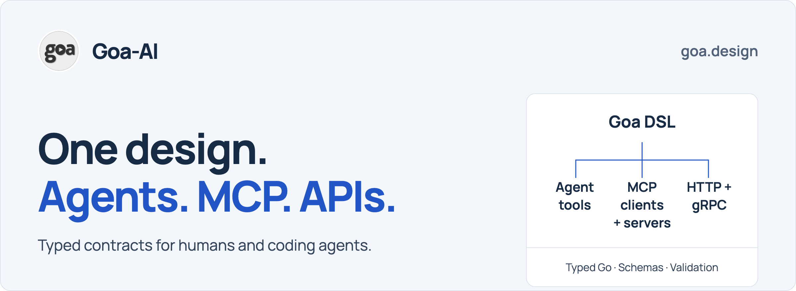
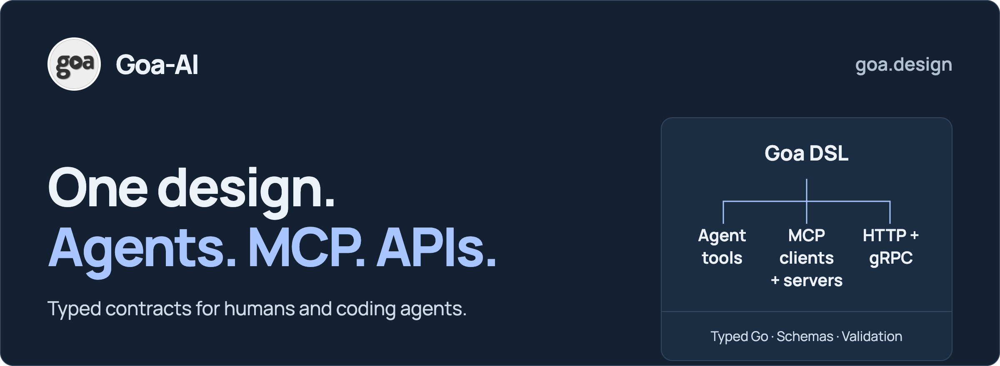

<p align="center">
  <a href="https://goa.design/docs/2-goa-ai/#gh-light-mode-only">
    <picture>
      <source media="(max-width: 600px)" srcset="docs/img/goa-ai-banner-mobile.png">
      
    </picture>
  </a>
  <a href="https://goa.design/docs/2-goa-ai/#gh-dark-mode-only">
    <picture>
      <source media="(max-width: 600px)" srcset="docs/img/goa-ai-banner-mobile-dark.png">
      
    </picture>
  </a>
</p>

<p align="center">
  <a href="https://github.com/goadesign/goa-ai/releases/latest"></a>
  <a href="https://github.com/goadesign/goa-ai/actions/workflows/ci.yml"></a>
  <a href="https://pkg.go.dev/goa.design/goa-ai"></a>
  <a href="LICENSE"></a>
</p>

# Goa-AI: AI agents, MCP servers, and tool registries in Go

Define your tools once. Generate the schemas the model sees, the Go types your
implementation uses, and the validation that connects them. Goa-AI runs the
agent loop and helps the model correct invalid tool calls with specific feedback
and valid examples from your design.

Part of the [Goa ecosystem](https://goa.design): use [Goa](https://github.com/goadesign/goa)
for services and Goa-AI for agents. They share the same Go design and generation
workflow, so a service method can also become an agent tool.

**[Quick start](#quick-start)** · **[Documentation](https://goa.design/docs/2-goa-ai/)** ·
**[What you can build](#what-you-can-build)** · **[Releases](https://github.com/goadesign/goa-ai/releases)**

## Why Goa-AI

- **Your schemas stay in sync.** A tool bound to a Goa method inherits its input
  and result types. Regenerate after a design change to update model schemas,
  typed codecs, and service bindings together. Ordinary methods can share an MCP-enabled service without entering its tool
  catalog. HTTP/OpenAPI and gRPC/protobuf
  come from that same design when those transports are declared.
- **Invalid tool calls get a path to recovery.** A missing field or wrong type
  produces clear correction guidance. Authored examples show the model a valid
  argument structure, and the runtime can request a replacement response within
  your recovery budget. Invalid model arguments never reach the tool implementation.
- **Coding agents have less contract code to write.** Change the design, regenerate,
  then implement the application behavior. You and your coding agent work from
  explicit types and a predictable directory structure, with compiler feedback
  when implementation code no longer matches.
- **Runs reference history in its owning store.** Preparation publishes bounded
  history and the exact compiled request before submission. Large inline
  messages use ordered literal byte parts without changing message or image
  content; complete literals keep their existing encoding. Lost replies recover
  the accepted prompt and policy; application rows retain compact references.
  New turns reference one exact completed
  run; workflows, planner commands, and checkpoints carry saved positions.
  Activities reconstruct original messages through bounded store reads. See the
  [runtime store contract](docs/runtime.md#runtime-store-storagestore) for store
  implementation and the required persisted-format cutover.
- **Closed runs retain their original start and outcome.** The four engine start
  operations bind the complete accepted request to its first stored start.
  A new execution of the same closed request returns the original records and
  stops before hooks or agent work. Synchronous callbacks use a separate exact
  command operation. Hosts must adopt all five Store methods and follow the
  [start-result upgrade requirements](docs/runtime.md#start-result-history-upgrade).

The Responses adapter preserves typed nested stream failures, including transient
server-error metadata. Retry owners must still protect already-published output;
classification does not replay streams. See the [provider stream contract](DESIGN.md#provider-stream-integrity-contract).

Live thinking streams send each new text fragment once. Complete reasoning
blocks remain in the accepted provider transcript and do not repeat their text
in the live stream. See the [streaming planner contract](docs/runtime.md#streaming-planners).

Bedrock Fable 5.1 requests with forced `tool` or `any` choices fail locally as
`model.RequestValidationError` before inference or counting. The adapter preserves
the caller's selected model and choice; see the
[Claude tool-choice contract](docs/runtime.md#thinking-and-tool-choice-on-claude).

## Quick start

With **Go 1.27.0 or newer**, run the checked-in example:

```bash
git clone https://github.com/goadesign/goa-ai.git
cd goa-ai/quickstart
go run ./cmd/orchestrator
```

This checkout uses the Goa revision pinned in [go.mod](go.mod). Run generation through
`go run goa.design/goa/v3/cmd/goa gen <design-package>` to use the version
selected by your module.

You'll see a complete tool call and response, followed by typed completion examples:

```text
Assistant: Tool helpers.answer returned {"text":"Tokyo is the capital of Japan."}
Completion draft_task: Prepare launch checklist (Confirm the service is ready to launch.), 3 steps
```

This is a deterministic demonstration of the real runtime, with an in-memory
engine and store. It needs no model API key, Temporal, Redis, or MongoDB.
The planner and example executor are application code you replace when connecting
a model and your services.

Run its evaluation suite too:

```bash
go run ./cmd/chat_quality-evals
```

Follow the [quickstart guide](quickstart/README.md) to edit the design, regenerate,
and connect a model. This README describes `main`; consult the
[release notes](https://github.com/goadesign/goa-ai/releases) and
[upgrade guide](docs/runtime.md#preview-upgrade-guide) when updating an existing application.

## How it works

### One design, from API to agent tool

Here is a complete design package. The service method and the agent tool share
`Lookup` and `Product`; `BindTo` connects the tool to the method:

```go
package design

import (
    . "goa.design/goa/v3/dsl"
    . "goa.design/goa-ai/dsl"
)

var Lookup = Type("Lookup", func() {
    Field(1, "sku", String, "Product SKU")
    Required("sku")
})

var Product = Type("Product", func() {
    Field(1, "name", String, "Product name")
    Required("name")
})

var _ = Service("catalog", func() {
    Description("Look up products for applications and shopping assistants.")
    Method("lookup", func() {
        Description("Retrieve a product by its SKU.")
        Payload(Lookup)
        Result(Product)
        HTTP(func() { GET("/products/{sku}") })
        GRPC(func() {})
    })
    Agent("shopper", "Help customers find products", func() {
        Use("products", func() {
            Tool("lookup", "Look up a product by SKU", func() {
                Args(Lookup, func() {
                    Example(map[string]any{"sku": "SKU-123"})
                })
                Return(Product)
                BindTo("lookup")
            })
        })
    })
})
```

Run `goa gen` with your design package's import path. For this design, Goa and
Goa-AI generate:

| Consumer | Generated from the same design |
| --- | --- |
| The model | JSON Schema, field descriptions, and the authored `{"sku":"SKU-123"}` example |
| Your tool implementation | Typed Go payloads/results, JSON codecs, validation, and service transforms |
| HTTP clients | Server/client code and OpenAPI specifications for `GET /products/{sku}` |
| gRPC clients | Server/client code and Protocol Buffer definitions with stable field numbers |
| The agent runtime | Tool catalog, registration helpers, agent client, and workflow definitions |

Change a field once and regenerate these artifacts together. Each transport keeps
its own representation; for example, protobuf presence and JSON required fields
are enforced through the generated transport code. You don't maintain a second,
handwritten model schema beside the service contract.

Tools can also have a smaller, purpose-built input or result. Use `Args` and
`Return` with generated transforms, and `Inject` for server-supplied fields that
the model should not fill in. [Service bindings and injection](docs/dsl.md#bindto-service-method-binding)
explain those choices.

### Tool calls that can correct themselves

Suppose the model calls `products.lookup` with `{}`. Goa-AI rejects the arguments
and supplies feedback derived from the generated contract, including:

```text
Field "sku" is required. Field description: "Product SKU".
Example illustrates structure; use values and a valid variant appropriate to the request:
{"sku":"SKU-123"}
```

The runtime schedules a replacement planning turn within `MaxRecoveryTurns`.
The model can supply the missing SKU, choose another permitted action, or ask
for information. A corrected call is validated again before execution.

When validation rejected a complete response, the replacement also receives
every submitted call in order, with its original argument text quoted as
untrusted, unexecuted data. Generated instructions remain separate. An eligible
typed input rejection with no complete retained response receives only its
generated correction.
Rejected calls never become accepted conversation or tool-execution evidence.
This context is recorded in Temporal activity history; deployments must follow
the [recovery upgrade and retention contract](docs/runtime.md#rejected-call-recovery-and-worker-upgrades).

This works for more than missing fields: wrong JSON types, invalid enum values,
and array-length errors can receive field-specific guidance. The complete
example comes from your top-level `Example(...)` and is included when it fits
the correction message. It teaches structure; the model still chooses values
appropriate to the user's request.

Generated service executors also return structured validation failures, so the
runtime can carry correction evidence back to the planner. Your application
still owns business rules and authorization. See [tool input validation and
recovery](docs/runtime.md#model-visible-tool-arguments).

## Build with a coding agent

Install the **Goa service designer skill** in your application project
(requires Node.js and npm):

```bash
npx skills add goadesign/goa --skill goa-service-designer
```

The skill guides Goa service design, transport mappings, and regeneration.
For Goa-AI wiring, also give your coding agent the generated
`AGENTS_QUICKSTART.md`: it names **your** agents, tools, packages, and registration
functions. Use the [Goa-AI guides](https://goa.design/docs/2-goa-ai/) for runtime
and agent-specific choices.

A useful task to start with:

> Add a product lookup tool backed by the catalog service. Update the Goa design,
> regenerate, implement the service method, and test a valid call and an invalid call.
> Use AGENTS_QUICKSTART.md for wiring. Do not edit gen/.

`goa gen` replaces generated contracts. `goa example` creates missing application
scaffolding without overwriting existing files. Your planner, service logic,
and tests remain yours. [The coding-agent workflow](https://goa.design/docs/ai-development/)
explains how to keep those responsibilities clear.

## What you can build

| Capability | What it gives you |
| --- | --- |
| [MCP servers](docs/dsl.md#mcp-server-definition) | Expose Goa methods through stateless MCP 2026-07-28 tools, fixed and parameterized text/binary resource reads, static or method-backed prompts, and generated JSON-RPC adapters. Prompt methods accept validated string arguments and return typed text, media, links or embedded resources. Generated clients preserve all five MCP content kinds; `PromptCompletion` and `ResourceCompletion` bind argument suggestions to typed methods; one resource reader owns exact URI interpretation and access. Unary methods can [report request-scoped progress](docs/runtime.md#request-scoped-mcp-progress) without changing their service interface. HTTP and stdio callers can [listen for acknowledged change subscriptions](docs/runtime.md#mcp-change-subscriptions). `ResourceSubscription()` binds an authenticated Goa stream to generated HTTP resource updates; the shared producer enforces ordering, accepted URI selection and request identity. Dynamic catalog sources remain unfinished. |
| [External tools](docs/dsl.md#mcp-backed-toolsets) | Consume MCP servers over stdio or HTTP using declared tool contracts. Generated calls honor accepted text-only run restrictions without changing shared callers. Additional-input responses follow [durable host continuations](docs/runtime.md#unfinished-calls-and-host-input); only completed replies become tool results. Explicit trust in read-only or idempotent tool hints permits bounded retries after an interrupted HTTP event stream. |
| [Tool registries](docs/tool_search.md) | Consume a named toolset or a changing registry catalog. Generated contracts preserve confirmation, pagination, and exact execution across provider changes. Providers register definitions at startup or attach to a complete declaration saved beforehand, then renew exact leases without resending schemas. Applications can attach immutable catalog identity and use bounded scoped reads without changing declaration encoding or provider messages. Native retry lookups return saved registration or explicit absence. Provider completion reports whether the registry retained the submitted result or settled the execution deadline instead. Handlers can leave an unconfirmed call to registry recovery without inventing a failure or stopping other calls. |
| [Deferred tool search](docs/tool_search.md) | Load definitions on demand using OpenAI native client search with BM25 or Claude hosted search. Consumers choose whole toolsets with `Deferred()` or exact compiled tools with `Deferred("search")`, keeping other tools immediately available. Claude replay preserves schema text through JSON escaping while still rejecting changed definitions. |
| [Structured output](docs/runtime.md#typed-direct-completions) | Declare `Completion(...)` and get typed unary and streaming helpers. Use [typed tool output](docs/runtime.md#forced-typed-tool-output) with explicit forced or automatic tool choice when you want the same generated result contract with bounded model correction. |
| [Standalone JSON codecs](docs/json_codecs.md) | Automatically generate typed encode/decode functions beside supported original Goa types using Goa’s planned shared or service-local declaration, validating complete values and rejecting ambiguous or invalid JSON. Native flat object unions preserve their discriminator and branch fields through codecs and schemas. |
| [Specialist agents](docs/runtime.md#agent-as-tool-composition) | Expose compiled or dynamically configured agents as tools. Child workflows retain the selected configuration and typed result through updates and approval pauses. A resumed child belongs to the continuing parent execution while preserving its original tool call, with linked progress and cancellation. |
| [Human input and approval](docs/runtime.md#external-input-and-workflow-continuations) | Ask structured questions or require confirmation, save the pending state, and continue from the answer. |
| [Evaluation suites](docs/evals.md) | Generate typed scenario hooks and check actual tool calls, results, and final answers. Preserve results across accepted continuations without counting earlier calls again. Add calibrated model judging for semantic checks. |
| [Large tool results](docs/runtime.md#bounded-results) | Give models bounded results and runtime-managed pagination; keep rich UI data out of model requests with `ServerData`. |
| [Policies and context](docs/runtime.md#policy-enforcement) | Enforce tool restrictions, call/recovery budgets, and timing. Opt into [durable provider recovery](docs/runtime.md#streaming-planners) before model output, with a separate finite allowance. Configure [history compression](docs/runtime.md#history-policies) with instructions to retain critical identifiers verbatim, [prompt caching](docs/runtime.md#prompt-caching), and [prompt overrides](docs/runtime.md#prompt-registry-and-overrides). |
| [Streaming and observability](docs/runtime.md#hooks-and-streaming) | Receive assistant text, tool progress, usage, and child-run events in a trusted application host, with [OpenTelemetry tracing](docs/runtime.md#telemetry). Your host selects what to expose to users. |

## Production

Use the in-memory engine for local development. For durable execution across
worker restarts, configure the **Temporal engine** and a **host-owned durable
runtime store**. Goa-AI supplies the execution loop, cancellation, policy
checks, saved continuations, and tool/child-workflow coordination.

Finish registration before calling `runtime.Seal(ctx)`. Its context bounds waits
for registration or another sealer; engine activation still runs synchronously.
See [registration and sealing](docs/runtime.md#registration-and-sealing) for
cached success, retry behavior, and the Temporal SDK startup limitation.

Saved continuations preserve completed tool inputs as historical facts.
Current input codecs still validate arguments needed for pending execution,
successful result materialization or pagination; result codecs remain current.
Delayed transcript writes consume the saved result event and its accepted
preview, including an empty preview, without rendering old inputs again.
Recovery preserves failed arguments as evidence and validates each fresh correction.
An input-schema change alone therefore does not invalidate inert history.
See [continuation compatibility](docs/runtime.md#external-input-and-workflow-continuations)
for the checks that still apply.

Choose model adapters for OpenAI, Anthropic, Amazon Bedrock, Google Vertex AI,
or a model gateway. Provider capabilities differ; the [runtime guide](docs/runtime.md)
covers their supported options. Optional integrations include MongoDB for
memory and prompt overrides, and Redis/Pulse for streams and registries.
For OpenAI Responses on Bedrock, `NewBedrockStrictProvider` selects strict tool
schemas. Existing `NewBedrock` and `NewBedrockProvider` retain complete schemas
with local output validation; constructor choice is fixed, with no fallback.
Strict function tool descriptions explain that `null` represents an omitted
optional field. The strict compiler requires explicitly closed concrete objects
and complete reference targets or union branches. Unsupported presence rules
and mixed compositions, including fixed-value constraints over structures that
need optional-member removal, fail before transport. Supported required nulls
and explicit values keep their meaning. See the
[strict schema contract](docs/runtime.md#openai-adapter-matrix) before upgrading
custom tool or structured-output schemas.
For models that estimate tokens before a call, the usage-reconciled adaptive
limiter admits work from that estimate and corrects its local balance with
tokens reported in the response. Missing usage stays unknown. Shared limiter
startup waits for Redis capacity to reach the local replicated map and fails if
that wait is cancelled or the map stops. Bedrock Responses also estimates GPT-6 Sol and GPT-6.1 Sol
image inputs from dimensions, while response usage remains the accounting total.

Tools can mark typed evidence with `NativeImage()` to retain exact image sources
in conversation history. Marked evidence uses its declared Goa attribute names
recursively in generated JSON, schemas, field metadata and examples. An explicitly admitted host reader checks current access
and supplies native bytes only for actual count, summary and inference inputs.
Each current tool declaration chooses its image items; retaining an old decoder
does not mark new ordinary evidence. Model clients reject a second reader binding.
See [retained native images](docs/native_images.md) for registration, bounded read
work and the required historical-decoder upgrade before writing new records.

Adapters can report a locally measured complete-request byte failure with
[`model.ErrRequestByteCapacity`](docs/runtime.md#locally-measured-request-byte-capacity).
History selection may keep fewer optional older turns; required newest and
summary evidence still fail whole when they cannot fit.

Vertex tool arguments require valid UTF-8 text and keys. Workflow writes reject
map keys with custom JSON or text encoders; use plain strings or named string
types without those encoders. Strict lifecycle and rejection record reads
reject invalid raw UTF-8 instead of replacing bytes during JSON decoding.
See the [JSON boundary contract](docs/runtime.md#json-boundary-contract).

MCP callers preserve empty input continuations. When a service returns an empty
request object without state, a later call still receives its native continuation
object. Generated clients and shared HTTP/stdio callers use the same behavior.

Registry users must regenerate and deploy registry replicas, providers and
consumers together for wire protocol 11. It adds workflow-owned input-round
identity and continuation metadata; earlier wire versions are rejected. Drain old
providers and workers before cutover. Generated native `BindTo` input-exchange
wiring is still being completed on the upgrade branch; see the
[implementation plan](docs/mcp_protocol_upgrade_plan.md#registry-continuation-composition--2026-10-07)
for the release gate.

Generated MCP adapters accept the application's configured Goa endpoints.
Authentication, method scopes, interceptors and endpoint middleware therefore run
through the original service contract. Regenerate and replace bare-service
adapter constructor calls; see [MCP server composition](docs/dsl.md#mcp-server-definition).
Direct and mounted MCP requests run HTTP middleware installed with the generated
server's `Use` method, including middleware installed after mounting and before
requests begin. Protocol checks run before that middleware; its context reaches
the service and request-scoped progress. Pass allowed browser origins as the
final variadic arguments to the generated server's `New` constructor, then use
`Mount(mux)`.
An empty origin list rejects requests carrying an Origin header. The old
`MountWithOrigins` API and public inner `Handler` field are removed. Use
`ServeHTTP` for direct serving.
Dependencies declared through Goa's server construction plan remain required
typed arguments before the origin list. Native example startup uses the same
planned factories; MCP retains the supplied values in private server fields.
Authored URL mappings use Goa's `Param("payload_field:url_name")` notation.
Generated clients retain the complete API and service path; adapters decode and
validate each method's own typed URL values before endpoint execution. These
values stay outside model arguments. See [URL values](docs/dsl.md#url-values-and-mapped-attributes).
`InputExchange(continuationField, outcomeField)` lets unary tools, resource readers
and prompts collect typed form input or URL consent before completion. Generation
derives the form schema and answer codec from Goa types; continuation data stays
outside model arguments and original endpoint authentication runs each round.
See [additional input](docs/dsl.md#additional-input-from-mcp-methods).
Generated adapters distinguish domain tool failures from invalid server results.
Server faults remain internal protocol errors after application message redaction
and never authorize replaying a tool call.
Fixed result views use the same selected fields in server output, advertised
schemas and generated agent codecs, including different nested views of the
same type. Views selected by the service return a tagged value that retains the
view name through agent decoding and stored results. See
[result views](docs/dsl.md#goa-result-views).
`runtime/content` owns the five ordered tool-content variants, their validating
JSON codec and independent copies. Runtime MCP callers use `content.Blocks`;
old content type names in `runtime/mcp` are removed. Generated executors, saved
agent results, child results and host events retain those blocks, including
failed invocations. Model history, copying, replay and native provider encoding
preserve supported content; unsupported media returns an explicit error. See
[the content contract](docs/runtime.md#mcp-callers). Methods author typed content
with [ToolContent](docs/dsl.md#authored-mcp-tool-content); the attachment field is
excluded from structured schemas, examples and codecs. Annotated Goa credentials
also stay outside model schemas, examples, field metadata and argument codecs.
Generated HTTP bindings fill the original typed service payload from its declared
header, query or cookie before calling the configured endpoint. An unannotated
field named `token` remains an ordinary argument. See
[secured MCP methods](docs/dsl.md#secured-mcp-methods). Protected MCP servers now
derive resource scopes from Goa security expressions and require a resource
owner before middleware or service work. Choose trusted signed-token keys or
authenticated opaque-token introspection at construction. Catalogs use basic-access scopes;
tools, resources, prompts, completions and subscriptions keep their own scope
alternatives. [Resource servers](docs/runtime.md#mcp-resource-servers) verify
issuer, audience and token validity and preserve original Goa authentication.
Introspection checks current issuer state without caching; issuer failures
receive 503 rather than an invalid-token challenge.
Enterprise clients can [exchange existing host identity credentials](docs/runtime.md#enterprise-authorization)
through separate identity-provider and resource registrations. Native forms keep
identity grants distinct from MCP bearer tokens; the existing transport owns
resource-token renewal. Supply one explicit host `AuthorizationStore` per user or
application to retain credentials across restarts and serialize rotation across
instances; `NewMemoryAuthorizationStore()` supports process-only sessions. See
[private authorization storage](docs/runtime.md#private-authorization-storage). Complete OAuth and the remaining protocol capabilities are still release gates
in the [MCP upgrade plan](docs/mcp_protocol_upgrade_plan.md).

The shared MCP HTTP transport keeps local preparation failures distinct from
lost tool responses. Cancellation observed before dispatch sends no request.
After an attempt reaches the HTTP dependency, a later failure cannot prove that the tool
did not run. Both local client failures and unknown outcomes stop agent recovery;
explicit remote rejections retain their original meaning.

HTTP failures expose the received status and exact authorization challenges
through `mcp.HTTPResponseError`, while preserving valid protocol errors for
`errors.As`. Authorization rejections do not wait for an event stream. Browser
recovery requires a successful fresh grant before one bounded repeat. A later
rejection cannot erase an earlier lost tool response. Complete OAuth remains a
release gate.

Construct an OAuth `mcp.ClientRegistration` for one issuer with explicit public,
Basic-header secret, request-body secret or signed authentication. Registrations
contain no user, resource scope or token. `mcp.NewClientCredentialsHTTPTransport`
obtains confidential machine grants before MCP dispatch; resource records remain
separate in the configured application store. Generated clients and `HTTPOptions.Client` accept
this same transport. Native Goa forms and security headers encode credentials;
only the resource bearer token reaches MCP. Metadata must support the selected
method. An omitted authentication-method list permits Basic only, as RFC 8414
requires; an explicit list keeps its declared meaning. Redirects and machine reauthorization after 401/403 are rejected.
See [client registration](docs/runtime.md#client-registration) and
[client-secret authorization](docs/runtime.md#client-secret-authorization).

Generated clients compose native domain query credentials with OAuth. A key
mapped by `Param("credential:api_key")` reaches the original service's
authentication callback while metadata and token grants use the configured
resource address without the key. Other URL differences fail before discovery.
Both client constructors consume one generated HTTP binding factory. Direct
transport users now supply `mcp.HTTPBindings` as the third constructor argument;
regenerate clients when upgrading.

`mcp.NewSignedClientRegistration` accepts a registered signer, client identity,
assertion issuer, audience and validity period. Every code, refresh or machine
exchange signs fresh authentication. See
[signed client assertions](docs/runtime.md#signed-client-assertion-authorization).

Browser clients supply any constructed registration to
`mcp.NewAuthorizationCodeHTTPTransport`. Public and signed HTTPS metadata documents
use registration constructors rather than separate browser transports. All profiles
share PKCE, issuer and redirect checks, refresh rotation and operation-specific
scope upgrades. The host owns sign-in and consent; tokens stay private to its user
and resource transport. See [browser authorization](docs/runtime.md#browser-authorization).

Application code owns planners, service behavior, authorization, side-effect
idempotency, storage, and deployment. Deploy generated packages, callers, and
workers as a coordinated release. Read the [production configuration](docs/runtime.md#production-configuration),
[workflow result migration](docs/workflow-results.md), and
[upgrade guide](docs/runtime.md#preview-upgrade-guide) before replacing existing workers.

Existing registries need an [offline catalog storage conversion](docs/runtime.md#registry-storage-upgrade)
with all old writers stopped. The new layout separates current definitions,
compact provider state, and permanent retired tokens. Wire protocol 10 and
fingerprints stay unchanged; catalog, call, and retirement history must be
preserved. Providers require the duration-only Renew callback and stop if their
lease authority is lost. The preview guide states the conversion prerequisites;
it does not yet supply a published converter.

Registry result readers use `toolregistry.DecodeToolResultMessage` to reject
unknown fields in fixed wire records while preserving raw tool values for their
existing codecs. This tightens acceptance of external and retained messages;
verify those messages before upgrading. Decoding alone does not establish a
complete tool result. After envelope and identity validation, adapters can call
`runtime.ValidateSuccessfulToolResult` to reuse the selected tool's existing
semantic-result and bounds checks before forwarding a successful result.
Server-data validation remains separate. See the [result envelope contract](docs/runtime.md#registry-result-envelope-decoding)
for identity, retry, parser semantics, and tool-value validation responsibilities.

Registry reads verify saved consumer contracts using their original JSON bytes.
New fields added by a framework upgrade do not change a saved declaration's
fingerprint or routing token merely because its Go type has changed. This
correction needs no storage conversion or provider regeneration; see
[saved declaration identity](docs/runtime.md#saved-declaration-identity).

Provider hosts can use `toolprovider.ServeAndWait` with the same arguments as
`Serve` to join invocation-owned work before returning. `Serve` keeps its bounded
settlement return. The joined call may wait longer for dependencies, preserves
incomplete-settlement errors, and never releases a lease merely because late work
finishes. See [provider execution](docs/runtime.md#registry-routed-provider-execution-service-side)
for the lifecycle and sink cleanup responsibilities.

## Learn more

- [Goa-AI documentation](https://goa.design/docs/2-goa-ai/) — guided learning paths.
- [Generated quickstart guide](quickstart/AGENTS_QUICKSTART.md) — inspect what generation produces for a real application.
- [DSL reference](docs/dsl.md) — agents, tools, completions, MCP, registries, and policies.
- [Runtime reference](docs/runtime.md) — planners, engines, model clients, storage, and execution contracts.
- [Architecture](DESIGN.md) and [generated artifact layout](docs/dsl.md#generated-artifacts) — how the framework fits together.
- [Go package reference](https://pkg.go.dev/goa.design/goa-ai) and [feature packages](docs/runtime.md#feature-modules).
- [Goa services](https://github.com/goadesign/goa) — the other entry point into the ecosystem.

## Contributing

Issues and PRs are welcome. Include a Goa design, a failing test, or a clear
reproduction when reporting behavior. See [AGENTS.md](AGENTS.md) for repository
guidelines.

Run `make setup` once after cloning or when `.tool-versions` or `.go-install`
changes. It installs the exact protobuf compiler and Go generators used by CI.
Normal `make` targets verify those versions before building or generating code.

## License

MIT License (C) Raphael Simon and the [Goa community](https://goa.design).

Text-only runs use generated tool contracts without interactive rendering or
confirmation tools. Domain result guidance remains available; declare guidance
that assumes rendered output with `UIResultReminder(...)`. See [text-only execution](docs/runtime.md#text-only-execution).
