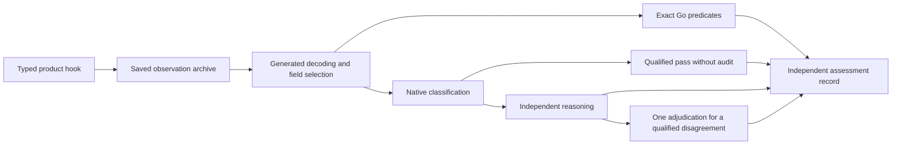

# Generated evaluations

Goa-AI evaluations capture what a product did, then assess those saved facts.
Capture and assessment are separate operations: changing an evaluator does not
require another product run, and a failed answer cannot remove its own assertions.

The design declares each scenario's input, observation type, exact checks, and
semantic requirements. Generated code owns identities, validation, and field
selection. Application hooks execute the product and return typed observations;
application predicates check exact facts. An assessment engine owns semantic
classification, reasoning, and disagreement resolution.

A native **System One classifier**, such as TypeSafe's Jev, answers constrained
questions with probabilities instead of generating an explanation. Goa-AI uses
that distribution to reduce reasoning work only after application-reviewed data
qualifies a decision band. Reasoning remains responsible for uncertain,
unqualified, predicted-failing, and audited cases.



## Declare observations and assertions

```go
import (
    . "goa.design/goa-ai/eval/dsl"
    . "goa.design/goa/v3/dsl"
)

var InventoryInput = Type("InventoryInput", func() {
    Attribute("question", String, "The request sent to the product.")
    Required("question")
})

var InventoryObservation = Type("InventoryObservation", func() {
    Attribute("question", String, "The request actually sent.")
    Attribute("answer", String, "Observed answer, including an empty answer.")
    Attribute("facts", ArrayOf(String), "Facts obtained during capture.")
    Attribute("complete", Boolean, "Whether the source read completed.")
    Attribute("statements", ArrayOf(String), "Individual observed statements.")
    Required("question", "answer", "complete")
})

var _ = Suite("records", func() {
    Description("Evaluates record inventories.")
    Timeout("2m")
    Scenario("inventory", func() {
        Description("Answers an inventory request using captured records.")
        Input(InventoryInput)
        Observation(InventoryObservation)
        Check("data_complete", "The source read completed.")
        Requirement("answers", "The answer satisfies the captured request.", func() {
            Subject("answer")
            Evidence("question", "facts", "complete")
        })
        Requirement("grounded_statements", "The statement agrees with the captured facts.", func() {
            ForEach("statements")
            Subject("@")
            Evidence("$.facts")
        })
    })
})
```

Suite, scenario, check, requirement, and tag names use `lower_snake_case`.
Descriptions and a positive suite timeout are required. A scenario timeout
replaces the suite timeout for that scenario. `Input` is optional; `Observation`
and at least one `Check` or `Requirement` are required.

Observation schemas describe possible outcomes, including empty, partial, and
failed outcomes. A desired property such as a correct answer belongs in an
assertion. Defaults are rejected: decoding must not manufacture an unrecorded
fact. Observation types use closed Goa JSON shapes; `Any`, custom Go types,
non-string map keys, recursive shapes, and `OneOf` are unsupported. Existing
input forms remain supported, except `OneOf`.

Selectors are compiled against the observation type:

| Selector | Selected value |
| --- | --- |
| `answer` | A field, relative to the current array element inside `ForEach` |
| `details.answer` | Nested object fields |
| `$` | The complete observation |
| `$.facts` | An observation field even inside `ForEach` |
| `@` | The complete current element, or observation outside `ForEach` |

`ForEach` selects an array; each element receives its own requirement instance
in captured order. An empty array has zero visible instances. Declare an exact
check when at least one item is required. A missing enclosing object is an error,
not an empty collection. Missing subject text becomes `not_addressed` without a
model call. Missing selected factual context is an assessment error. Nil and
empty arrays or maps have the same empty-collection meaning; capture availability
in an explicit field when an empty result must differ from unavailable facts.

The generated requirement identity is `suite/scenario/requirement`; quantified
instances add `[index]`. Neither the product nor a model supplies these identities.
Reference facts cannot supply information missing from the assessed subject.

## Generate and implement the suite

Importing `eval/dsl` registers the generator. Run the usual commands:

```bash
goa gen example.com/product/design
goa example example.com/product/design
```

`gen/evals/records/` contains observation and input types, strict codecs, compiled
selectors, and these interfaces:

```go
type Checks interface {
    CheckInventoryDataComplete(*InventoryObservation) string
}

type Hooks interface {
    Checks
    Inventory(context.Context, *InventoryInput) (*InventoryObservation, error)
}

func New(Hooks, Inputs) (eval.Suite, error)
func ForAssessment(Checks) (eval.Suite, error)
```

Suites without exact checks have `ForAssessment()` with no argument. A suite can
be top-level or nested inside an agent. Agent suites also generate
`MustToolContract(tools.Ident)`, covering the agent's statically reachable tool
contracts, including nested agents. Unknown names panic because the design
cannot supply their contracts; registry-discovered tools are not included.

A capture hook calls the product and copies every fact its assertions need into
the observation. Return an unsuccessful product outcome as data. Return an error
when the capture operation could not obtain or encode its evidence.

An exact predicate receives only the decoded observation:

```go
func (checks) CheckInventoryDataComplete(observed *genevals.InventoryObservation) string {
    if !observed.Complete {
        return "The source read did not complete."
    }
    return ""
}
```

Predicates must be read-only and must not call the product, reload context, or
consult current external state. Keep inputs passed to `New` immutable; the suite
records their constructor values. Record additional runtime-selected arguments
in the observation. Hooks, predicates, and reporters must support the configured
scenario concurrency.

Generated codecs reject invalid UTF-8, unknown fields, duplicate JSON members,
wrong shapes, and invalid Goa values. They do not repair evidence. Field selection
uses typed Go access, not runtime schema interpretation or reflection.

## Capture once and assess offline

```go
suite, err := genevals.New(productHooks, inputs)
if err != nil {
    return err
}
runner, err := eval.NewRunner(engine, eval.RunnerConfig{
    MaxConcurrency: 4,
    Provenance: map[string]string{"revision": revision},
})
if err != nil {
    return err
}
archive, err := runner.Capture(ctx, suite)
// Preserve the returned archive even when cancellation left partial evidence.
```

`Capture` calls no exact predicates or semantic models. The archive contains
input bytes, exact encoded observation bytes, schema identities, capture times,
per-scenario errors, and caller-supplied provenance. SHA-256 identities cover each
observation and the complete archive. Observation bytes are base64-encoded in
archive JSON so reformatting the archive cannot change them.

`Archive.WriteTo` and `ReadArchive` verify identities. The application owns
storage. A content hash detects changes; it does not authenticate the author.
Capture errors are retained per scenario. Selection, configuration, and
cancellation errors are also returned by the operation.

```go
offline, err := genevals.ForAssessment(exactChecks)
if err != nil {
    return err
}
report, err := runner.Assess(ctx, offline, archive)
if err != nil {
    return err
}
if !report.Passed {
    return errors.New("evaluation failed")
}
```

`Assess` uses only saved observations and compiled bindings. It requires no live
inputs or capture hooks. The archived scenarios and observation schemas must
match; requirement statements and assessment policy may change for an independent
reassessment. Qualifications must still match the exact new contract.

`Run` composes both operations and returns `(Archive, Report, error)`.
`RunScenarios`, `RunTags`, `CaptureScenarios`, and `CaptureTags` validate all
selectors before work begins. Tags use any-tag matching. Reports keep declaration
order regardless of worker completion order.

Concurrency bounds scenarios within one operation. Each scenario gets its own
timeout for capture and a separate timeout for assessment, including all model
calls, audits, and adjudication. Cancellation reaches in-flight contexts and
prevents new product calls. Hooks and model implementations must honor context
cancellation. Already completed evidence and assessment outcomes remain available.

The create-once command supports:

```bash
go run ./cmd/records-evals --scenario inventory
go run ./cmd/records-evals --tag smoke
go run ./cmd/records-evals --capture capture.json
go run ./cmd/records-evals --assess capture.json
```

`--capture` creates a new file with owner-only permissions and never overwrites
one. It preserves capture errors and exits nonzero if any occurred. `--assess`
uses the archive's scenario selection and cannot be combined with selection or
capture flags. `--max-concurrency` controls each operation. Application code added
to a previously generated command is never overwritten by `goa example`.

## Choose an assessment strategy

Exact checks always contribute to the final result. No model decision can
turn a failed exact check into a pass. A nil engine supports exact-only suites.

For a reasoning baseline:

```go
grader, err := judge.New(modelClient, maxOutputTokens)
if err != nil {
    return err
}
engine, err := eval.NewReasoningEngine(grader)
```

Three constructors have distinct behavior:

| Constructor | Behavior |
| --- | --- |
| `NewReasoningEngine` | Reasons about every nonempty subject |
| `NewDisagreementEngine` | Classifies and independently reasons; adjudicates qualified pass/fail conflicts |
| `NewSelectiveEngine` | Accepts qualified passes unless audited; reasons about all other predictions; adjudicates qualified conflicts |

Requirements sharing byte-identical subject and reference are batched. Initial
reasoning receives original evidence without the classifier's prediction. A
qualified pass opposed by a reasoned failure, or qualified failure opposed by a
reasoned pass, receives one additional adjudication. The adjudicator sees original
evidence and both assessments; it can abstain. There is no semantic retry loop.
Provider or protocol errors remain errors and do not select a fallback model.

Auditing uses a stable hash of the observation, requirement instance, and
qualification identity. The same archived evidence receives the same audit
selection. `AuditFraction` is explicit: zero audits none; one audits every
eligible pass. Raising it can only add audits.

### Labels and decisions

| Label | Meaning |
| --- | --- |
| `entailed` | The subject establishes the requirement |
| `contradicted` | The subject establishes that it is false |
| `not_addressed` | Required content is absent; the subject neither establishes nor contradicts it |
| `indeterminate` | The product content itself is ambiguous or conflicting |

Only `entailed` passes. Conditions are interpreted semantically: omitting a price
can satisfy a constraint on any price that is quoted, but cannot satisfy a
requirement to quote one. Code does not classify requirements using keywords.

Reports distinguish `Calibrated` decisions containing probabilities and a
qualification identity, `Reasoned` decisions containing a label and explanation,
and `Unresolved` decisions containing an abstention reason. A classifier never
fabricates a prose rationale. Evaluator uncertainty is not `indeterminate`.
An infrastructure error leaves the affected decision absent and records an error.

## Native TypeSafe classification

`features/eval/typesafe` implements `eval.Classifier` using TypeSafe's native
Choice API, rather than a chat adapter:

```go
classifier, err := typesafe.New(httpClient, typesafe.Config{
    APIKey: apiKey,
    Model: "jev-1.13.0",
    MaxResponseBytes: 1 << 20,
})
```

The response-byte ceiling in this example is an application-selected 1 MiB per
HTTP response, including unsuccessful responses. It protects response allocation;
it is not a suite-wide evidence allowance. Every call also needs a context
deadline. Runners and qualification provide their own per-operation contexts.

The adapter sends subject and captured reference as separate state fields, with
one named question per requirement and four choices. Generated Goa records and
codecs own wire validation. The client verifies exact answer coverage, all four
finite probabilities, a sum within floating-point serialization tolerance, the
selected most-probable label, and the exact returned model version. It preserves
probabilities without clipping or normalization. Mutable aliases such as
`jev-latest` are rejected. The HTTP client is supplied by the application; the
adapter performs no retries and follows no redirects.

An optional `ChoiceOrder` permutation supports controlled order-sensitivity
experiments. The resolved ordering and criterion text are recorded in evaluator
configuration, so a qualification cannot be reused under another ordering.
Routing uses `P(entailed)`, not the provider's derived confidence field. Neither
number is assumed to be an accuracy guarantee.

See TypeSafe's [API contract](https://docs.typesafe.ai/api),
[model versions](https://docs.typesafe.ai/models), and
[Choice primitive](https://docs.typesafe.ai/primitives/choice). Provider context
and rate limits apply to each native request; the adapter does not estimate token
counts, truncate evidence, or silently split an oversized request.

## Qualify automatic decisions

`Qualify` collects native predictions for one generated requirement and an
application-owned reviewed corpus:

```go
qualification, err := eval.Qualify(ctx, classifier, requirement, reviewedExamples,
    eval.QualificationConfig{
        MaxErrorRate: 0.01,
        Confidence: 0.95,
        Timeout: 10 * time.Second,
    })
if err != nil {
    return err
}
engine, err := eval.NewSelectiveEngine(classifier, grader, eval.SelectivePolicy{
    Qualifications: []eval.Qualification{qualification},
    AuditFraction: 0.1,
})
```

These numbers are explicit application choices, not framework defaults.
`Timeout` bounds one example classification; requests execute sequentially.
A `LabeledExample` records its ID, independent group, tuning or validation
partition, selected subject/reference, reviewed gold label, and review provenance.
Use generated bindings to obtain the selected fields from recorded observations.
A model's unreviewed output is not a gold label.

Dependent variants share a `Group` and cannot cross the tuning/validation split.
Identical evidence cannot appear as different independent groups. Tuning chooses
separate inclusive thresholds on `P(entailed)` for predicted passes and failures.
Held-out validation tests each chosen threshold once and never retunes it.

For accepted examples, a group is incorrect if any accepted variant in it has the
wrong pass/fail decision. The qualification computes a one-sided exact binomial
upper error bound across those groups. Half of the statistical error probability
is assigned to each band, so the requested confidence covers both bands for this
requirement. This assumes the reviewed independent groups represent the
application population; it is not a guarantee about every future example.

A band qualifies only with nonempty held-out evidence and an upper bound no
greater than `MaxErrorRate`. Missing or insufficient evidence leaves reasoning
required. The failure band authorizes disagreement detection, never automatic
product failure. Qualifications retain the complete examples, predictions,
coverage, error bounds, four-label Brier score, call usage, and duration.

The content identity binds the observation schema, requirement statement and
selectors, classifier version, instructions, and option order. Changed evidence,
statistics, thresholds, or contracts cannot silently reuse the record. The
application owns corpus review, population selection, qualification renewal,
and responses to audit findings; the library does not train or auto-promote models.

`Engine.CheckSemantics` tests four fixed synthetic label meanings under a
caller-supplied deadline. It is an explicit semantic sanity check, not statistical
qualification, and is never automatically invoked by capture or assessment.

## Challenge and compare

`Engine.Challenge(ctx, requirement, reviewedExamples, timeout)` assesses authored
examples with the normal engine policy and compares the exact labels with gold.
It reports false passes, false failures, abstentions, errors, and complete calls.
It neither tunes thresholds nor executes product hooks. Corpus grouping and
partition rules are the same as qualification. Reported counts are per example;
they are not independent-sample confidence estimates.

Include paraphrases and reordered facts that preserve meaning, plus reviewed
defects: omitted content, reference-only answers, planned work presented as done,
contradictions, ambiguous outcomes, irrelevant passages, adversarial instructions,
and conditional requirements. Run option-order experiments with separately
configured classifiers. Authored labels must account for the intended changed
meaning. Test observation encoding and field selection through the generated
bindings as well as testing the selected text with the engine.

Compare complete policies on one archive:

```go
comparison, err := eval.Compare(ctx, offlineSuite, archive,
    map[string]*eval.Runner{
        "reasoning": reasoningRunner,
        "disagreement": disagreementRunner,
        "selective": selectiveRunner,
    },
    eval.ComparisonConfig{
        Repetitions: 3,
        Currency: "USD",
        Price: priceProviderUsage,
    })
```

`Price` accepts one `model.TokenUsage` and returns its complete cost in the named
currency. The application owns tariffs and provider-specific cache accounting;
providers do not all include cached tokens in input counts in the same way.
Omit both pricing and currency to compare usage without a monetary estimate.
Missing usage makes total cost unknown, not zero. Pricing failures return an
error with completed reports retained.

Comparisons retain every assessment and report calls by stage, usage by actual
model, automatic passes, audits, disagreements, abstentions, scenario errors,
and outcomes that vary across repetitions. Duration totals and minimum/maximum
run durations exclude capture. Capture wall time is reported separately, once.
Invocation records include failed format corrections and adjudication. Existing
qualification work is recorded in its qualification rather than charged again
to each assessment. A reasoning baseline is another evaluator, not gold truth.
Use challenge results to assess accuracy alongside savings and variability.

## Reports and reasoning-model behavior

Each `Report` has its own content identity, archive identity, assessment policy,
evaluation provenance, and scenario results. `Report.WriteTo` writes an appendable
JSON record; `ReadReports` verifies a sequence of such records and restores the
concrete decision forms. `CaptureDuration` and assessment `Duration` are separate.
Per-scenario errors do not stop unrelated scenarios. Always check the returned
error and `report.Passed`; exact failures, non-entailed decisions, unresolved
assessments, and infrastructure failures all prevent a passing suite.

The reasoning adapter remains `eval/judge`. `judge.New` selects a forced named
tool; `judge.NewAutomatic` explicitly selects automatic tool choice. Both require
a positive output-token allowance per complete response, shared across that
request's claims and unchanged for corrections. A finite allowance does not
guarantee completion. The adapter never guesses model capabilities or switches
output mechanisms after a failure.

Its tool schema has one required property per claim ID, containing a label and
nonempty rationale. Association is by property name, never response position.
Strict decoding rejects missing, extra, and duplicate members. Engine calls also
admit the explicit `unresolved` outcome. The existing structural correction policy
permits one initial invocation and at most three corrections. A valid semantic
decision or abstention does not trigger correction. Adjudication is one semantic
attempt with the same bounded structural correction mechanism.

The standalone `Judge.Judge` method still returns four-label judgments. Engine
`Reason` and `Adjudicate` additionally retain abstentions and every actual call's
available usage. Provider and transport errors retain their causes. Full
requirement text and references are not truncated; the existing runtime tool
schema ceiling applies to each reasoning request. See
[typed-output diagnostics](runtime.md#forced-typed-tool-output).

## Collect tool evidence

`eval/evidence` retains its existing collector and expectation contracts.
A collector consumes stream events and correlates tool starts/results by exact
call ID. `ToolCalls` contains new invocations in causal order within one root run
tree; `ToolCompletions` contains results in observation order, including earlier
invocations completed in an accepted successor run. Copy facts needed by the
design into its typed observation during capture, then assess them offline.

After the application accepts a continuation, it can call
`NewContinuationCollector(previousEvidence, successorRunID)`. Previous evidence
must come from a collector that observed `run_stream_end`. The collector retains
only pending calls and observed ancestry, binds the same session, and rejects
changed root/session metadata. It does not submit continuations or discover
predecessors. Public evidence fields and serialized snapshots cannot create this
private continuation context. Completed earlier calls do not become new attempts;
root stream identities do not claim native child-workflow identity.

Use `evidence.ExpectCall(gentools.AnswerTool(), payloadPredicate,
resultPredicate)` with the generated typed descriptor. `Expect.Checks` evaluates
tool calls and terminal phase; `ToolChecks` evaluates tools when another product
component owns completion. The default trajectory is an in-order subsequence;
`Exact: true` requires call-for-call equality. `ExpectFailure`,
`ForbidFailureKinds`, `RequireAllAttemptsSuccessful`, forbidden tools, and
`ExpectConfirmation` retain their existing meanings for new invocations.
`Tool.Bounds` checks bounded-result metadata beside the typed result. Applications
using dynamically discovered tools can supply `evidence.Tool` with
`evidence.Decoded` predicates.

The runnable [quickstart example](../quickstart/cmd/chat_quality-evals/) captures
tool JSON bytes and completion facts, then reconstructs the inputs to these
existing exact predicates during offline assessment.

## Breaking upgrade

Regenerate suites and migrate application hooks, commands, and report readers
in the same change:

| Previous API | Replacement |
| --- | --- |
| Hooks return `eval.Result`, runtime checks, claims, and artifact links | Hooks return the declared typed observation; capture artifact identities as observation fields when needed |
| Assertions can be omitted from a hook result | Declare every `Check` and `Requirement` in the design |
| Hooks grade product results immediately | Generated typed exact predicates and semantic bindings assess saved bytes |
| `Result.Output` and `Result.Reference` | `Subject` and `Evidence` selectors over the observation |
| `NewRunner(judge, config)` | Construct an explicit engine, then `NewRunner(engine, config)` |
| `Run` returns report and error | `Run` returns archive, report, and error; use `Capture` and `Assess` independently |
| Automatic four-example “calibration” before each run | Explicit `CheckSemantics`; reviewed tuning/held-out qualification for automatic decisions |
| Report-level output/claim/judgment fields | Archived observation bytes plus requirement instances and discriminated decisions |

Input schemas, generated tool descriptors, scenario/tag selection, and
`eval/evidence` expectations remain available. Exact-only suites use a nil
engine. Existing custom judges can implement `Reasoner`; a native classifier
implements the separate probability-only contract.

Old reports are not observation archives and cannot authorize qualifications.
Retain them as historical reports; produce new typed captures for replay. No
production database migration or service deployment ordering is required by this
library change. Generated suites and hooks compile together in one Go binary;
external report readers need the new schema before consuming the new reports.
To roll back an application, restore its prior library, generated code, and hooks
together, and keep new archives separate from old-format reports.
