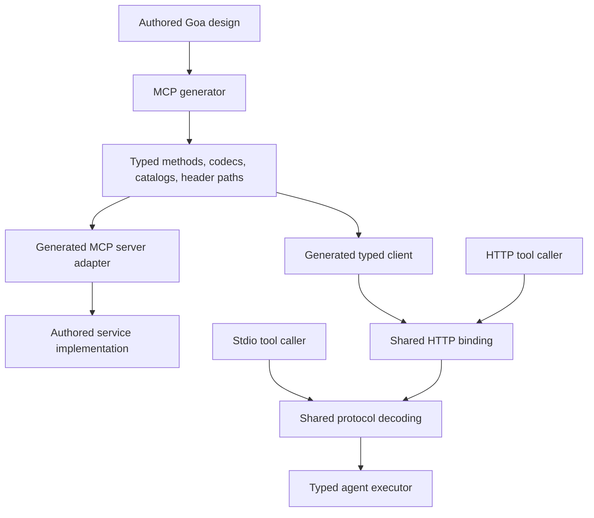

# Upgrade goa-ai to MCP 2026-07-28

Research and implementation plan, prepared 2026-10-02 and revised 2026-10-07 after tracing framework composition and prevailing retry implementations. The transport and composition foundation is implemented in the isolated clone. The full upgrade remains incomplete until every capability required below is implemented and verified. No release is authorized before then. The baseline sections describe remote main before this upgrade; they are not the current implementation. The current implementation and verified checks are recorded below.

## Outcome and scope

Target **MCP 2026-07-28**, the latest stable protocol revision verified during this research. The MCP project published it on July 28, 2026. Do not target the moving draft or stop at 2025-11-25. [Release announcement](https://blog.modelcontextprotocol.io/posts/2026-07-28/), [released specification](https://modelcontextprotocol.io/specification/2026-07-28).

The finished implementation should have one protocol revision, one request lifecycle, and one typed result path. Remove initialization, protocol sessions, reinitialization, old wire shapes, compatibility aliases, and text-based decoding of generated typed results. Preserve the framework's supported domain capabilities: generated tools, fixed resources, static prompts, HTTP and stdio tool callers, and agent toolset registration.

Implement all mandatory requirements on those paths. Include a generation/composition milestone and an unfinished-call integration milestone in the upgrade, rather than treating MCP as an isolated transport package. Optional capabilities must be advertised only when their complete producer-to-consumer path is implemented and tested.

Reassessment changes the earlier feature assessment: goa-ai already has typed schemas, durable suspension and continuation, asynchronous workflow starts, cancellation, and private run streams. These are useful foundations for current MCP features. Their existence does not make MCP elicitation, Tasks, subscriptions, or dynamic authoring implemented today. Do not restore removed preview abstractions: implement each chosen capability through current typed services, generated contracts, existing execution ownership, and the new protocol.

The user explicitly requires a breaking upgrade with no compatibility or legacy code. That authorizes removal of the old MCP contract; it does not justify removing unrelated service behavior. On 2026-10-07 the user additionally authorized extending registry calls and outcomes so native `InputExchange` methods compose through both local `BindTo` executors and registry providers. This scoped authorization supersedes the earlier exclusion of registry protocol changes.

### Deferred stdio server support

On 2026-10-06, the user authorized delaying stdio support. Generated stdio server production and the server-side stdio acceptance checks move to a follow-up and do not block this release. The current release targets generated HTTP servers. Existing HTTP and stdio callers remain supported and must preserve their verified behavior; this deferral does not authorize removing them. Dynamic HTTP catalog subscription sources, Tasks, Apps, Skills, authorization and generated server additional input remain required. Historical milestone descriptions below retain the evidence available when they were recorded; this scope decision supersedes their stdio server release gates.

### Reproducible baseline

| Item | Evidence |
| --- | --- |
| Isolated clone | a dedicated clone under the developer’s source directory |
| Repository | `goadesign/goa-ai`, cloned from its remote rather than the dirty shared checkout |
| Research starting commit | `52e69fd06b497f64b2d3d76ec58643a0db65b70f` |
| Implementation starting commit | `f3f5203c1b5c5e5f30a9431172d9603ebe02a567` (remote `main`, including typed-output automatic tool choice) |
| Plan branch | `mcp-protocol-upgrade` |
| Module | Go 1.26.0; Goa `v3.32.1-0.20260928015114-b19eb8ddfbe5` |
| Current protocol | Only `2025-06-18` passes the MCP expression's validation |
| Official schema revision | `271ecc9accafdd9b83a3c869fa67c22953b2af80`, last change to the released TypeScript schema |
| Retrieved schema SHA-256 | `742750af0bb8c716e7030c4977c992b55d1adc4407e9e66997db5846baedc2cd` |

The protocol types are defined in the [dated official schema](https://github.com/modelcontextprotocol/modelcontextprotocol/blob/271ecc9accafdd9b83a3c869fa67c22953b2af80/schema/2026-07-28/schema.ts). Use the released prose for behavioral requirements. Accepted proposals explain intent, but some contain obsolete names and error codes; the dated specification takes precedence.

Baseline verification completed with Go 1.26.3:

```sh
go test ./runtime/mcp ./expr/mcp ./codegen/mcp
```

All three packages passed. The first attempt could not access Go's build cache; rerunning with that access enabled passed. Additional focused composition tests passed across `codegen/agent`, `codegen/agent/tests`, `runtime/agent/model`, `runtime/agent/runtime`, and `features/model/openai`. They exercised MCP generation and executor compilation, external contracts, aliases, shared toolset generation, located union types, model schema validation, strict schema projection, and durable clarification/confirmation. The exact command is recorded in the composition section. These tests verify existing foundations; they do not validate the proposed upgrade. This baseline verification did not include the conformance suite or full repository suite; upgrade verification is recorded below.

## Implementation progress

Endpoint and authentication composition is required before the generated
subscription source. A compiled synthetic secured service confirmed that the
ordinary Goa endpoint rejects its credential through the declared JWT callback,
while the current MCP adapter calls the service directly without that callback.
This is evidence about generated composition, not a claim about deployed
application middleware. The terminal adapter must consume configured Goa
endpoints so declared authentication, method scopes, interceptors and endpoint
middleware keep their owner. Derive credential fields from the HTTP transport;
do not expose them as model-authored arguments. Preserve ordinary domain fields
with the same spelling when they have no security annotation. Apply this to
all authored tool, resource, prompt, completion and subscription paths, including
payload-free methods, before release. Verify rejected credentials never reach
the service, authorized calls retain exact domain input and authenticated
context, and middleware runs once. Do not add a second authentication callback
surface or silently exclude secured declarations. The generator must derive the
credential distinction from Goa's design, not field-name guesses.


Generated MCP adapters now consume the application's configured original Goa
endpoints across tools, fixed and parameterized resources, method-backed prompts
and completion. Original service/method context names are derived before dispatch.
A compiled real HTTP service verifies exact JWT scopes and authenticated context,
rejection without service execution, configured middleware and interceptors once,
payload-free and no-result methods, and an ordinary domain field named `token`.
Resource-only, prompt and completion peers verify middleware context and call
counts. An unexpected endpoint Go result type returns an internal protocol error
without application error remapping. The adapter constructor now requires the
endpoint collection; examples and callers change together. The uncached MCP
race suite, configured lint with zero issues, complete serial root race suite and
quickstart, regenerated assistant fixture race suite and build passed.
Credential-free schemas and native HTTP credential delivery are implemented
as described below. HTTP OAuth resource authorization and
challenges remain incomplete.

The shared HTTP client now preserves failed-attempt status and exact
`WWW-Authenticate` values through `HTTPResponseError`; valid protocol errors
remain available by unwrapping. HTTP 401/403 and challenged HTTP 400 responses
close their bodies before content-type or MCP decoding, including event streams.
Explicit HTTP request rejections never use the interrupted-stream retry path.
This is the client response boundary needed by authorization; server challenges,
metadata discovery and built-in OAuth flows remain required. There is no live target authorization configuration or telemetry for
this greenfield framework path, so acceptance uses independent synthetic peers
and actual generated clients without claiming deployed authorization behavior.

The generated credential path now separates domain input from every annotated
Goa security field. Argument schemas, authored examples, field metadata and exact
codecs contain only domain arguments. Private generated helpers fill the original
typed service payload from native HTTP bindings, run Goa's complete payload
validation and invoke the existing configured endpoint. They do not reconstruct
endpoints or call authentication functions separately. Ordinary fields named
`token` remain unchanged. Credential-only tools accept empty domain input, and
credential-only payloads are valid for fixed resources.

Synthetic generated HTTP peers verify JWT, OAuth, Bearer, Basic and API-key
callbacks, exact scopes and returned authentication context; header, query and
cookie bindings; named and renamed credential fields; combined schemes with
distinct inputs; and optional Basic/Bearer alternatives with inactive fields
absent. Tools, fixed and parameterized resources, method-backed prompts and both
completion paths use the same credential separation. A second secured service
verifies independent protocol payloads. Actual HTTP bodies contain neither
credential values nor transport-only fields; missing or malformed native
credentials do not invoke configured endpoint middleware. This proof establishes
native credential delivery, not issuer, audience, expiry or transport OAuth
conformance. Those checks still require a resource guard before the entire
configured endpoint pipeline.

### Server authorization: verified ownership and remaining design proof

The exact merged Goa source supplies credential names from security annotations
in `codegen/service/security_data.go`: Basic username/password, API-key fields
for the declared scheme, Bearer tokens, JWT tokens and OAuth access tokens have
distinct tags. The original payload, credential names, pointer representation,
requiredness, scheme name and method scopes are already known during generation.
An ordinary field named `token` without such an annotation remains domain input.
The normal generated constructor obtains authentication functions from the
service's generated `Auther` interface. Individual endpoint constructors already
accept `security.AuthOAuth2Func`. Compare these existing contracts and the
resource owner's verifier before adding a public verifier interface; neither a
scheme declaration nor an opaque configured endpoint proves token validity.
The generated endpoint receives the original typed payload, calls its configured
authentication function and passes the returned context to the service.
`codegen/service/templates/service_endpoint_method.go.tpl` supports alternative
authorization requirements and requirements containing several schemes. A generic
error therefore does not identify an HTTP authorization status, a scope challenge
or the scheme that must be used on the next request.

The complete credential projection must cover these paths together:

| Declared input or operation | Behavior before credential separation | Required terminal behavior and positive proof |
| --- | --- | --- |
| Secured tool with domain fields | Catalogs and codecs include the original credential field; the configured endpoint checks it | Model schema, examples, field metadata and exact codecs contain only domain arguments. The HTTP binding supplies the annotated credential before the same configured endpoint runs. Check exact domain input, authenticated context and one method authentication call. |
| Payload containing only credentials | The framework treats it as a domain payload; fixed resources reject any payload | The domain input is empty while the original endpoint still receives its typed credential input. Check a secured fixed resource and a secured tool without invented arguments. |
| Method-backed prompts, parameterized reads and completions | Original payload codecs and typed constructors retain all original fields | Apply the same projection and credential delivery; string-map, URI and suggestion contracts retain their existing meaning. |
| Unannotated domain field named `token` | It is advertised, decoded and delivered to the service | Preserve it exactly and test it beside an annotated credential with a different field name. |
| Basic or API-key security | Goa identifies distinct credential inputs and native transport bindings | Preserve the declared scheme's meaning. Never reinterpret an OAuth resource token as a password, API key or credential for a different owner. Establish the transport binding and supported authorization profile explicitly. |
| Catalogs and discovery | Static generated methods do not call an original domain endpoint or expose its captured authentication function | Authenticate according to the authored service/resource policy without invoking a tool or resource as an authentication probe. A configured method endpoint is opaque; do not unwrap it or construct another endpoint set. |
| Authentication failure | Authentication callbacks, nested service calls and middleware can return the same error before or after the outer method runs | The HTTP resource authorizer rejects invalid tokens and insufficient scope before invoking the entire configured endpoint pipeline. Errors returned after invocation retain their service meaning and never become OAuth challenges or authorize a credential retry. |
| Alternative or combined security requirements | Goa chooses the applicable requirement through its generated security flow | Preserve selection and exact required scopes. Do not merge every alternative's scopes into an overbroad authorization request. |

The HTTP transport owns the OAuth resource boundary: resource metadata, token
issuer and audience validation, expiration, required OAuth scopes and HTTP
challenges. It must finish every challenge-producing check before invoking the
configured MCP endpoints, including their outer middleware. Successful requests
carry the verified principal context and their original HTTP credentials into
the same configured endpoint. Goa continues to own the declared method's
security alternatives, authentication callback and returned context; service
methods continue to own domain authorization and effects. These responsibilities
are distinct. Do not add a second copy of a method authentication callback,
reconstruct endpoints, skip their configured authentication or infer HTTP
challenges from errors returned after dispatch.

Generate the scope requirements and credential paths already known by the Goa
design. Preserve alternative requirements instead of requiring the union of all
alternatives. Catalog authorization is a resource policy, not a call to an
arbitrary service method as an authentication probe. The composition root
constructs the token validation dependency using the resource owner's issuer,
audience and principal contract. Establish the smallest constructor and generated
binding that expresses this dependency before adding a public mechanism. A
configured endpoint is opaque and does not expose its captured authentication
callback or prove that its middleware is free of effects.

The earlier result-validation problem is fixed by merged Goa PR #4018 and the
current dependency pin. Invalid selected service output carries the existing
`goa.ServiceError.Fault` contract through MCP as an internal failure. That flag
does not identify authentication rejection or permit a retry.

Merged [Goa PR #4020](https://github.com/goadesign/goa/pull/4020) removes the
unreleased error marker added by Goa PR #4019 before this integration is
enabled. Compiled generated-endpoint reproductions establish two
counterexamples: an outer method can return an inner authentication rejection
after doing work, and configured middleware can return that rejection after the
outer method succeeds. The proposed method-return wrapper fixes only the first
case; it cannot establish what happened outside that method. The corrected
source removes the marker without adding error records, invocation tracking or
compatibility aliases. Callback error identity and native transport mappings are
preserved. No OAuth retry behavior has been enabled by this prototype. All four
modules include the corrective merge. Its full uncached race suite, lint,
Linux and Windows CI matrix, CodeQL and dependency review passed. The tested and
merged source trees have the same Git tree identifier; the completed isolated
Goa clone was verified clean and fully pushed, then removed.

Merged [Goa PR #4021](https://github.com/goadesign/goa/pull/4021) fixes native
authentication references to credential fields renamed with
`Meta("struct:field:name", ...)`. Merged
[Goa PR #4022](https://github.com/goadesign/goa/pull/4022) retains explicit HTTP
query bindings in generated JSON-RPC clients and servers. The latter was
reproduced independently without the MCP plugin: the old server referred to
undeclared query variables, and the client omitted those query values. The
corrected client and server preserve named optional values, integer validation,
arrays, maps and unchanged JSON-RPC body values.

The credential increment was verified against exact merge
`2aa4cfc90cfa3879e3109771ff17ac7c01dcd130`
(`v3.33.1-0.20261005031206-2aa4cfc90cfa`). Both prerequisites passed native
compiled HTTP checks, full uncached race suites, configured lint, Linux/Windows
CI, CodeQL and dependency review. Their tested head trees match their merged
trees. The integrated credential increment passes configured `make lint` with
zero issues, serial `make test` with the uncached root race suite and quickstart,
`make build`, the regenerated assistant's uncached race suite, and the generated
evaluation consumer against this published pin. Quickstart, assistant and registry
were regenerated with their owning tools and pinned protoc 36.2; tracked generated
output is unchanged. The compiled HTTP fixture verifies all five Goa security
schemes, renamed and named credential fields, native header/query/cookie bindings,
ordered alternatives, combined distinct headers, all authored MCP operation paths
and independent secured services. It proves credential-free arguments and rejection
of missing or malformed credentials before endpoint middleware or service work.
These checks do not establish OAuth resource authorization, complete released-set
conformance or external caller cutover. Tests using a local Goa replacement remain
development evidence only.

Merged [Goa PR #4023](https://github.com/goadesign/goa/pull/4023) fixes a
separate middleware bypass. Native JSON-RPC mounts called their dispatch
functions directly, and direct ordinary/mixed serving also skipped the handler
wrapped by `Server.Use`. Eight compiled cases now prove direct and mounted
ordinary, event-only and mixed responses, ordered middleware context, exact
successful results and rejection before endpoint work. Middleware installed
after mounting also runs; installation still precedes requests. Linux/Windows
CI, CodeQL and dependency review pass, and the tested and merged trees match.
The local full uncached race run passed every package except the X-Ray test,
whose UDP listener could not bind its fixed port. Its owner during the failure
is unverified; the failed package passed an independent uncached race rerun.

The middleware adoption used exact merged source
`9ad0a1523ac8782b491cf69ad7d9d20cac9c8df1`
(`v3.33.1-0.20261005052106-9ad0a1523ac8`). The MCP generator supplies the private
request processor selected by Goa's constructor and mounts the common public
entry point. Duplicate transport-selection branches are removed. Protocol
checks remain outside HTTP middleware, while accepted requests carry middleware
context through original authentication and service progress. Registry,
quickstart and assistant regeneration passed with protoc 36.2. The complete
published-pin acceptance passes configured lint, the uncached root race suite,
quickstart, build, regenerated assistant race checks and the evaluation consumer.
The completed Goa clone was fast-forwarded to merged `v3`, verified clean with
no unpushed commits, then deleted; all 37 capture files were moved to the ignored
Goa AI cache with matching SHA-256 hashes.
This correction supplies no OAuth verifier or challenge and does not authorize
retrying an endpoint error after effects.

A compiled standalone transport probe also confirms that existing Goa JSON-RPC
HTTP headers can provide typed protocol payload fields while remaining absent
from the generated request-body type and JSON-RPC parameters. A real generated
client/server round trip passed under the race detector: the server received the
exact header credential and unchanged domain arguments, including an ordinary
field named `token`. Prefer these generated transport fields over a public raw
HTTP-request context accessor or an untyped credential map. The integrated fixtures now prove argument separation and all authored operation
bindings. Resource authorization remains a release gate.

Native credential bindings must also remain representable on one HTTP request.
Goa's Basic scheme always reads `Authorization`; the MCP OAuth resource profile
requires a Bearer value in that same header. Those two inbound credentials cannot
share the slot in one requirement. Separate Basic/Bearer alternatives remain
valid when their inactive credential fields allow absence; Goa's original ordered
authentication flow selects the accepted requirement. Reject a combined
requirement or required inactive fields during generation instead of choosing an
owner, inventing another header or translating a Bearer token into Basic
credentials. A future OAuth-protected resource using the same header must also
reject a conflicting inner Basic binding during composition. Preserve native
profiles whose declared bindings are valid. The current native binding checks cover
combined schemes and valid optional alternatives; the future OAuth resource
composition needs its own conflict checks. This does not authorize removing Basic
or API-key support from unrelated services.

A separate native Goa metadata prototype confirms that its generated HTTP
handler can be mounted at the resource owner's metadata path. Two resource
identifiers that differ only in their query exposed a flaw in the first proof:
registering a fixed response for each identifier at the same path made the last
registration replace the earlier response. The corrected handler derives the
resource identifier per request from a configured trusted origin, the exact
escaped resource path and the raw query. It passes that private request value
to the metadata service through context, while Goa still owns response encoding
and decoding. One mux registers each metadata path once and serves six cases:
root, path-specific, sibling, two query variants and a percent-encoded slash.
The uncached race suite passes against the published Goa pin. This establishes
a typed metadata response path, not token validation, OAuth client discovery,
reverse-proxy origin configuration or framework authorization.
Prefer an owned generated metadata contract over a second handwritten HTTP JSON
response. Keep the verifier and metadata configuration at construction; a
protected generated server must require the verifier while retaining Goa's
`Mount(mux)` interface. A nil or omitted verifier must never select an unprotected
runtime branch. Goa's existing `SecurityHolder` interface permits framework
expressions to reuse `Security` and scope declarations; verify the complete
resource policy and constructor design before adding another policy DSL or a
public parsed-request record.

A native OAuth transport proof against merged Goa `562176f1e1b5` passes
35 synthetic cases under the race detector. The reproducible compiled fixture
is `TestMCPResourceAuthorizationUsesNativeContracts`. Existing
`middleware.PopulateRequestContext` carries the exact request URI to
`security.AuthOAuth2Func`; parsing that URI preserves escaped paths, raw query
order and an explicitly empty query. A configured origin owns the resource
host even when request headers or an absolute-form request name another host.
The callback preserves cancellation and returns principal context through the
original generated endpoint. Explicit synthetic token and scope rejections stop
before configured HTTP middleware; an error after service work produces no
OAuth challenge. Generated client decoding verifies returned values. This
proves native composition and ordering, not cryptographic token verification,
production OAuth support or the resource policy constructor.

The MCP cases separately supply a resource bearer token, a domain API key and
an ordinary argument named `token`. Both manual `ServeHTTP` registration and
`Mount(mux)` retain the order: resource authorization, HTTP middleware, original
endpoint middleware, domain authorization, service work. A resource token cannot
satisfy the domain key. Domain rejection and an `invalid_token` error after work
remain MCP tool errors without an OAuth challenge.

Scoped routes must enter the same mux passed to the generated constructor. Goa's
mux extracts URL parameters before the generated decoder reads them. Calling
`ServeHTTP` directly without that routing context does not supply path values;
registering it with the mux and `Mount(mux)` both do. Keep this native mechanism
rather than add another URL parser or fabricate routing context.

The constructor trace exposed a prerequisite in the MCP plugin itself. Before
this change, mounted requests entered `withMCPTransport` before `Server.Use`
middleware, but
direct `Server.ServeHTTP` requests entered that middleware without MCP's origin,
method or header/body checks. Protecting only the mount would repeat this gap
for resource authorization. The complete normal path must instead be
`Server.ServeHTTP` → MCP request checks → configured HTTP middleware → generated
protocol handler → adapter → configured original endpoint. Both direct serving
and `Mount` must call that one public entry point.

The owning change is in MCP transport generation, because these checks are MCP
requirements rather than general JSON-RPC behavior. Origin configuration moves
to the generated server constructor as an `origins ...string` collection;
empty means that no browser origin is allowed. The constructor copies that
configuration into its private guard. `Mount(mux)` only registers routes, and
`Server.Use` still installs application middleware before requests begin.
Delete both `MountWithOrigins` forms and the separate unsupported-method
handler; neither becomes a compatibility alias. This follows the requested
breaking, from-scratch upgrade. It strengthens the public serving contract:
rejected requests reach neither configured middleware nor domain work through
any serving entry point. The inner `handler` is private, so serving the
public server cannot bypass its checks through an embedded `Handler` field.
The local caller inventory uses only `ServeHTTP`, `Mount` and `Use`; ordinary
Goa HTTP and JSON-RPC servers retain their existing public contracts.

A caller-supplied outer guard was rejected because forgetting it leaves direct
serving unprotected; retaining independent mount and direct guards was rejected
because their policies could diverge. No new public configuration record is
needed for one origin list. An initially required slice was reassessed against
the full example producer: it forced explicit nil arguments without strengthening
the valid empty-origin policy. A variadic string collection represents the same
policy with no presence-dependent guard or old constructor implementation. Goa's
native example bootstrap therefore constructs the strict empty-origin policy
without another adapter or a second construction path. Update configured-origin
callers, owning fixtures, goldens, README and DESIGN together. Applications
regenerate and move
their origin list from mounting to construction. Old/new generated server code
must not be mixed, and rollback requires its matching generated callers.
Before publication, prove the direct bypass in a compiled fixture, then test
both serving paths with valid requests, invalid headers/metadata/origins,
notifications, method rejection and middleware installed after mounting.
The completed change passes the full uncached MCP generator, input, expression
and DSL race suites, configured root lint/build and regenerated assistant race
suite. Compiled fixtures verify both serving paths under fixed and service-selected
result views, including empty origin policies and middleware installed after
mounting. A second assistant regeneration produces identical output hashes.
Resource OAuth remains a separate incomplete milestone after this prerequisite.

The merged native composition prerequisite is
[Goa PR #4028](https://github.com/goadesign/goa/pull/4028). Native constructors
previously exposed only fixed transport arguments. The existing ordinary HTTP
mount wrapper receives only `http.Handler` and is unavailable on JSON-RPC; it
cannot supply a configured resource verifier to a generated server. Replacing
MCP example startup separately would create another construction mechanism.

The shared plan now declares required typed server dependencies before names
freeze. One retained `GoTypePlan` supplies the private server field, required
constructor argument, application factory and native example startup call.
Dependencies follow native arguments in private-name order. HTTP and JSON-RPC
own imports for their respective server files; the existing application package
name planner resolves factory collisions. Example imports follow configured
services only, and client commands do not construct server dependencies. An
unimplemented example factory stops startup with a configuration message.
Servers that declare no dependency keep their constructor contract.

Goa PR #4028 is merged as `0841789c6202ca603b7265c06e6e0d2e1a448383`.
Its tested and merged trees are identical. The implementation passes the
uncached repository-wide race suite, configured lint, and native JSON-RPC
integration tests. The final constructor-name correction additionally passes
the complete affected HTTP, JSON-RPC and example-generator race suites and lint.
All Linux/Windows CI, CodeQL and dependency checks pass; there are no unresolved
review comments. Eleven compiled generated-module cases cover HTTP, JSON-RPC,
combined startup, two imported dependencies, required nonvariadic signatures,
exact retained values, files-only services, multipart, WebSocket and SSE,
colliding names, declaration before or after example planning, and the valid
plain-HTTP dependency name `http`. JSON-RPC and file-serving constructors reject
that name because their bodies require the `http` import. Focused
checks cover invalid declarations, multipart/file argument collisions, copied
JSON-RPC snapshots and unconfigured services. The existing HTTP `Plan.Service`
API continues to return shared template data; copied JSON-RPC data retains its
independent-read contract.

At that milestone, all four Goa AI modules selected the merged source as
`v3.33.1-0.20261006020533-0841789c6202`, without a local Goa replacement.
Against that pin, registry, quickstart and assistant regeneration pass without
generated changes. Configured lint, root build, the full uncached root race
suite, quickstart, the regenerated assistant race suite and `TestEvalConsumer`
all pass. The last check generates and executes a downstream application.
The completed native clone was verified clean on merged `v3` with no unpushed
commits, its verification evidence was preserved with matching hashes, and it
was deleted. A compiled MCP design probe exposed a remaining consumer gap:
native example startup passes its planned typed dependencies, but MCP's custom
constructor treated them as origin strings and its server fields discarded them.
The MCP constructor and struct templates now consume the native dependency
fields and required arguments, before the final origin collection. Native
generation still owns types, names, imports, ordering and application factories.
Servers with no declared dependency retain the same output and caller contract.
The reproducible generated example and routed direct/mounted client fixture
pass under the race detector. They verify two required imported dependency
types, exact retained values, native factory-name collisions and final origin
arguments. The no-dependency example also compiles. Configured lint, root build,
the complete uncached MCP generator race suite, registry/quickstart/assistant
regeneration and the assistant race suite pass after this composition change;
regeneration leaves their existing generated output unchanged.
Next, let the MCP plugin declare its protected resource dependency
through this shared plan. Preserve native constructor names and example calls.
Do not add an
optional verifier, reconstruct domain endpoints, or introduce MCP-only startup
code. This prerequisite proves constructor composition, not built-in OAuth,
cryptographic verification, client grants or deployed authorization. Those
remain required before release.

A compiled design probe also found that the current MCP generator cannot
represent the authored route `/organizations/{organization_id}/mcp`.
Generation fails because discovery, list and call payloads lack the named route
parameter. Correct the generator before adding resource authorization. Goa's
generated transport must decode route values, and generated adapters must fill
matching fields in the original service payload before full validation and
configured endpoint execution. Route values must remain outside MCP parameters,
argument schemas, examples, field metadata and argument codecs; clients must
not select a different organization through a tool argument. Trace inherited
paths, renamed bindings, named types, validation and generated clients, rather
than copying raw path strings or introducing a public raw-request bag. Verify
catalogs, calls, resources, prompts, completions and agent specifications against
that same projection, including ordinary domain fields on routes that do not
bind them. That initial probe established the generation failure only. The complete
implementation and positive compiled evidence are recorded below.

The native Goa prerequisite is independently verified in
[Goa PR #4024](https://github.com/goadesign/goa/pull/4024). Its JSON-RPC snapshot
had discarded typed path records, its import planning omitted path constructors,
and its path-only encoder declared an unused payload. The shared HTTP request
builder also ignored authored service field renames. The correction retains
method-specific path conversion and validation, plans path imports and resolves
service field declarations. A compiled client/server fixture verifies named
strings, numeric values, arrays, optional service fields, renamed fields,
notifications, mapped request IDs, domain bodies, streaming and middleware
installed after mounting. Invalid URL values fail before configured endpoint
work. Configured lint, the full uncached root race suite and the existing
JSON-RPC integration suite pass. Linux and Windows CI, CodeQL and dependency
review passed, with no review findings. The merged commit is `a5e621d460dfecbe9888980409984bf40cd87e7d`;
its tree matches the tested head. All four Goa AI modules now select that exact
source (`v3.33.1-0.20261005065914-a5e621d460df`), without a local Goa
replacement. Registry, quickstart and assistant regeneration succeeds with no
tracked generated output changes. Configured lint reports zero issues. The
complete uncached root race suite, quickstart, regenerated assistant race suite,
root build and generated evaluation-consumer check pass against this exact pin.
Tidying all four modules removes the obsolete Goa checksums without changing
other selected versions.

This prerequisite does not by itself correct MCP composition. One `tools/call`
operation can dispatch methods with different route-field types. Keep each
method's typed conversions and validations; choosing one tool's field as a
shared type would change the others' contracts. The original binding must also
remain available to expression validation, catalogs, argument codecs and agent
specifications after the original JSON-RPC service is replaced. Preserve full
inherited paths as well as route suffixes. Verify that independent generation
roots cannot reuse another root's bindings. No public HTTP request accessor,
untyped route map or new caller-owned conversion step is required by the
protocol; justify any proposed public contract against the complete producer
and consumer path before implementation.

The argument projection now derives URL-owned fields per original method.
During DSL evaluation it uses Goa's authored shared route and inherited service
paths for methods selected only by MCP, and exact native mappings for methods
with an explicit JSON-RPC endpoint. Generation repeats that derivation from
its own source roots before replacing the transport. Private method metadata
retains only those field names; it does not annotate shared payload types or
add a runtime lookup. Source transports and MCP configuration are selected by
service identity rather than service name alone. Expression validation, MCP
schemas, examples, codecs and agent tool specifications consume one shared
projection. An equally named field without a URL binding remains domain input.

Uncached race tests pass for `internal/mcpinput`, `expr/mcp`, `dsl`,
`codegen/mcp` and `codegen/agent`. Positive DSL tests verify a fixed resource
whose organization field comes from an inherited service route. Counterexamples
verify that an unbound field remains a rejected domain argument for that same
fixed-resource contract, and that sharing a named, located payload does not
change the unscoped method's fields, required list or examples. Separate roots
with matching service names retain separate transport bindings. Missing route
configuration still reports a design error. That milestone proved projection and binding ownership only. The subsequent
implementation below verifies protocol route generation, method-specific URL
decoding, full-payload validation and native caller construction.

The follow-up trace corrected the earlier alias assessment. Goa's mapped
attribute contract separates the service payload name from the URL name through
`Param("organization_id:organization")` with `{organization}`. Colon notation
belongs in `Param`, not in the wildcard. Native route preparation, path/query
classification, validation and path constructors had inconsistently consumed
those mappings. [Goa PR #4026](https://github.com/goadesign/goa/pull/4026) fixes
that shared mechanism and exposes the existing pure HTTP attribute-copy
algorithm as `http/codegen.WireAttribute`; MCP does not rewrite wildcards or
maintain another alias implementation.

The MCP generator now retains complete native routes and mapped attributes.
Private protocol fields carry raw URL values outside MCP bodies. Each selected
method uses the existing HTTP parser templates and retained Goa conversion
plans to fill its original typed payload fields before complete validation and
configured endpoint execution. Protocol payload references and selectors come
from retained Goa layouts, including when native credentials change a complete
input's generated type. The generated caller fixes URL values at construction,
so individual tool arguments cannot select a different URL scope.

Compiled scoped client/server fixtures pass service-level and API-level
mappings, inherited path prefixes, independent domain fields with the URL name,
custom Go field selectors, located named scalar and collection types, optional
payload fields, numeric validation, fixed resources, method-backed prompts,
completion, subscriptions and the native tool caller. Invalid URL values and
argument injection stop before endpoint execution. A payload-free tool on the
same route receives no invented domain fields. The combined credential fixture
also exercises inherited mapped URLs, located named types and custom Go field
selectors with every authored credential and operation binding. Original scopes,
authenticated context and one configured endpoint invocation remain intact.

Goa PR #4026 merged the native mapping corrections as
`8e702ac6fa7633247e0009c0d8fbff981a649786`. The dependency refresh also updates
OpenAI, Redis, GJSON and Google API/RPC contracts to the current versions selected
by each module. Regeneration uses the owning tools and pinned compiler versions.
The registry's generated gRPC client retains remote cancellation and deadline
errors through the reviewed Goa correction; protocol schemas are unchanged.
The assistant's caller comment reflects construction-time URL binding.
Configured lint, root build, regenerated assistant race tests, the generated
evaluation-consumer check, the full uncached root race suite and quickstart
passed against that published source.

A subsequent negative authored-design probe found that an object-array URL field
reached type planning and returned an unrelated binder error. The correction
reuses Goa's existing parameter-validation stage before MCP type planning and
removes both MCP-specific URL-type checks. Authored HTTP endpoints and MCP-only
method bindings therefore use the same rules.
[Goa PR #4027](https://github.com/goadesign/goa/pull/4027) is merged as
`562176f1e1b5ea65458cc443a2322feedad07a5e`. Its complete root suite, configured
lint, Linux/Windows CI matrix, CodeQL and dependency review passed, and the merged
tree equals the tested tree. All four Goa AI modules then selected
`v3.33.1-0.20261005233735-562176f1e1b5` without a local Goa replacement. Against
that published pin, the complete affected MCP generator, expression,
input-binding and DSL race suites, configured lint, root build, regenerated
assistant race suite and generated evaluation consumer pass. The subsequent
checks cover the compiler composition change; the earlier full root and
quickstart acceptance remains recorded against PR #4026 above.

Both completed Goa clones were fast-forwarded to their actual merged target
branch, verified clean with no unpushed commits, and deleted. Their captured
verification remains in the ignored Goa AI cache.

Bearer header parsing must retain the token while accepting the one-or-more
ASCII spaces that separate it from the scheme. The current compiled credential
fixture verifies multiple spaces and mixed-case scheme names, exact domain
results and one endpoint invocation. Embedded spaces or tabs, a tab replacing
the scheme separator and an empty token remain rejected before endpoint work.
This is HTTP syntax handling, not token issuer, audience or expiry verification.
The final spacing correction passes configured lint with zero issues and the
complete uncached race suites for `codegen/mcp` and `internal/mcpinput`. The full
root, quickstart, regenerated assistant and downstream consumer acceptance above
applies to the preceding credential increment; it was not rerun for this syntax
correction.
[RFC 6750 §2.1](https://www.rfc-editor.org/rfc/rfc6750.html#section-2.1).

MCP defines authorization at the HTTP transport level. The pinned official Go
SDK also verifies bearer credentials before calling its HTTP handler. Reuse this
ordering, while proving operation-specific scope selection and preservation of
Goa's method contracts independently.
[MCP authorization](https://modelcontextprotocol.io/specification/2026-07-28/basic/authorization),
[official Go SDK authorization middleware](https://github.com/modelcontextprotocol/go-sdk/blob/c1ed34844f98e4d0e7643ae398122d15d87ad865/auth/auth.go).

The synthetic generator proof also confirms that credential annotations are
method-specific: Goa rejects a payload that declares credentials for schemes
absent from that method. Credential projection must follow evaluated method
requirements and original transport bindings, including shared domain types;
a fixture that tags every scheme on every method is not a valid counterexample.

Protected-resource discovery must validate the returned resource identifier,
not merely the URL's host or path prefix. For a derived well-known URL, compare
against the resource identifier used to derive that candidate. For an explicit
`WWW-Authenticate` metadata URL, compare against the resource request URL.
Comparison is exact after JSON decoding, without Unicode normalization. Reject
mismatching metadata rather than treating it as an absent discovery document or
inventing authorization endpoints. Include path-specific and root discovery,
explicit challenges, mismatched resources and distinct resources on one host in
the acceptance tests. [RFC 9728 §§3.3 and 6](https://www.rfc-editor.org/rfc/rfc9728.html#section-3.3).

A present authorization-response `iss` value must separately match the issuer
recorded from validated authorization-server metadata, even when support was not
advertised. Do not normalize URL case, ports, encoding or slashes before that
comparison. Advertised issuer support makes a missing `iss` an error. Resource
and issuer comparisons protect different decisions and must remain separate.
[MCP authorization-response validation](https://modelcontextprotocol.io/specification/2026-07-28/basic/authorization#authorization-response-validation).

There is no deployed target configuration or telemetry for this new framework
profile. Use complete synthetic generated-service paths for the design proof,
then retain the separate external caller and worker cutover gate. The proof must
include authorized catalog reads, malformed and missing credentials, invalid
and expired tokens, insufficient scope, named domain errors after effects,
nested authentication failures returned by methods and outer middleware,
alternative schemes, credential-only inputs, ordinary fields with matching names
and model-visible
schema/codec agreement. Keep credentials, authorization proofs and HTTP requests
out of workflow checkpoints, saved domain arguments and model input. These are
open acceptance requirements, not implemented authorization claims.

Fixed result views now use one selected field contract for catalog schemas,
server encoding and generated agent decoding. An original endpoint returns
already validated projected values; the MCP adapter encodes those values without
reconstructing a full service result. Required omitted fields never become zero
values. A compiled secured HTTP fixture verifies default and detailed views,
different nested views of the same result type, missing required fields,
rejection of omitted fields, and direct-client validation against advertised
schemas. Prompt and resource fixtures exercise actual view pointers, located
aliases and named unions, all five content kinds, completion values and empty
collections. Recursive field selection retains its own references and leaves
Goa's source type intact. The private codec uses Goa's existing graph copier
rather than merging different selected shapes by their original declaration.
The complete serial root race suite and quickstart, regenerated assistant
fixture race suite, evaluation consumer and build passed against the exact
merged remote Goa dependency. The MCP and agent generator suites and shared
codec suite are included in the root checks. Configured lint reports zero issues. These earlier checks establish fixed-view
behavior; the execution-selected checks are recorded separately below. Neither
establishes full release conformance.

The required Goa generator fixes were verified in a separate isolated dependency
clone: view package locations are removed before conversion identities are
saved, named union validation retains the actual receiver, saved view layouts
match their presence pointers, and missing object results fail at the endpoint
before conversion. Empty collections remain valid. The complete uncached Goa
root suite, configured lint and JSON-RPC integration suite passed with current
dependencies. [Goa PR #4017](https://github.com/goadesign/goa/pull/4017) also passed
its Linux and Windows CI matrix, CodeQL and dependency review before merging.
[Goa PR #4018](https://github.com/goadesign/goa/pull/4018) subsequently corrected
selected-result validation to return a server fault while retaining its original
cause; its uncached root race suite, lint and complete CI matrix passed.
The root and all three nested modules pin the exact merged corrective source at
`v3.33.1-0.20261005065914-a5e621d460df`; no local Goa replacement remains.
Merged Goa PR #4020 removes the unreleased authentication-marker prototype;
its compiled tests preserve exact callback errors, native transport mappings and
both nested method and outer middleware counterexamples.
Build tools and CI actions use verified current releases.

Views chosen by the service during execution use Goa's tagged OneOf contract
for tools and JSON resources. The original endpoint supplies the selected name;
private server codecs encode only that view's fields. Catalog schemas, generated
agent decoders and stored result validation preserve the same tag and branch
requirements. Compiled HTTP checks cover default and detailed selections, two
views with identical fields, missing/extra fields and empty viewed collections.
Prompt, resource-template and completion conversions keep their flat protocol
shape and reject any selectable view missing required operation fields during
generation. Consumer codecs retain result decoding. Server generation emits only the
payload decoding, result encoding, typed construction and validation that its
adapters use; unused payload encoders and result decoders are removed. The
assistant fixture is regenerated from that generator without hand-editing it. No compatibility mode, blanket optional fields or
full-result reconstruction substitutes for the selected contract.
The serial root race suite and quickstart, build, regenerated assistant fixture
race suite and configured lint passed. A separate compiled HTTP acceptance check
executes all three view selections through the generated MCP agent executor,
encodes them with the result codec, round-trips the production workflow data
converter, restores the invocation identity and validates transcript values.
This proves the serialization contract, not a deployed Temporal cluster cutover.


Current main's text-only execution restriction is preserved alongside MCP
continuation ownership. A generated executor restricts host input per operation;
HTTP and stdio callers omit form/URL capabilities and reject continuation data
before dispatch. Unfinished results, including state-only results, cannot create
restricted host suspensions. Activity, workflow and checkpoint boundaries also
reject custom executor input. Ordinary calls on the same caller retain their
support. Independent raw HTTP/stdio peers, a compiled generated executor using
real HTTP, ordinary successor-run tests and restricted checkpoint checks passed.
After merging remote main `216b59827daf648ede5888bccc922a4b92064f53`,
the complete serial root race suite and quickstart, configured lint, build and
regenerated fixture race suite passed again.


The shared HTTP/stdio consumer now supports distinct `subscriptions/listen`
operations. Typed filters and events retain exact request IDs and notification
metadata. Receivers enforce acknowledgment before changes, accepted subsets,
per-request routing, graceful completion and cancellation. They neither share
protocol sessions nor reconnect implicitly. Resource filter strings follow the
released schema without a new URI-format restriction; updated-resource
notifications retain the protocol's explicit URI requirement. Malformed or late
stdio cancellations are ignored according to the released cancellation rules.
Generated HTTP resource sources now own authenticated selection and delivery.
Dynamic catalog sources and generated stdio production remain unfinished. Fixed
catalogs cannot truthfully emit catalog-change notifications; private agent
streams are not a substitute for that source. The complete serial root race
suite and quickstart, build, lint, and the uncached MCP transport race suite
passed. Independent raw peers cover interleaved listeners, cancellation during
quiet streams and blocked callbacks, exact filter selection, invalid notification
scope and one dispatch after an interruption. These checks do not establish full
subscription or release conformance.

The shared HTTP subscription producer now separates source selection from wire
ownership. The source acknowledges its authorized subset, then reports typed
change kinds. The transport supplies the exact request ID, shares private filter
and ordering checks with the consumer, serializes delivery, and preserves the
first write failure. Source rejection before acknowledgment retains the protocol
error and HTTP status. Complete results preserve raw metadata and receive the
transport-owned subscription ID; malformed completion is rejected. Contexts
cannot report after completion, and closing a quiet HTTP listener cancels its
source. Header changes before the first event remain on the response. Configured
lint reports zero issues and the complete uncached transport race suite passes
with the final notification spans and header/cancellation checks. The generated HTTP resource producer now binds an authored Goa stream with
`ResourceSubscription()`. Its configured endpoint preserves authentication,
scopes, interceptors and middleware. Generated constructors receive URI filters;
generated codecs validate acknowledgment/update unions before transmission.
Renamed fields and located URI declarations retain their owning Go types. The
source owns accepted URIs and related sub-resources. HTTP cancellation reaches
that source, and missing acknowledgment returns a structured internal error.
Only bound services advertise resource subscription support. Dynamic catalog
sources remain a release gate; generated stdio production is deferred under the scope decision above.
Generated clients bind their notification handler with `WithSubscriptionEvents`
and call the typed `SubscriptionsListen` endpoint. Missing handlers fail before
network dispatch instead of silently discarding notifications. The generated
HTTP fixture verifies delivery, cancellation and callback errors alongside native
authentication, scopes, interceptors, middleware and renamed/located types.
The resource-source implementation passed the complete uncached serial root race
and coverage suite plus quickstart; the final generated-consumer addition passed
focused independent HTTP/stdio and compiled generated-module race checks.
Configured lint reports zero issues. The final complete MCP runtime and generator
race suites also pass. These checks do not complete the other release gates.

The dependency-adoption CI failure exposed a Registry test ordering mistake:
provider renewal extends its existing lease without synchronously restoring a
lost stream. The existing reader and periodic ping perform that recovery. The
corrected test observes the restored original generation before opening another
sink, then verifies its original registration token. The complete uncached
Docker-backed Registry race suite passes. No runtime recovery or explicit
stream-destruction semantics changed.

Progress now works through generated unary HTTP services, shared HTTP/stdio
callers, and the agent tool activity's host stream. `ReportProgress` uses the
service context; `WithProgress` binds a typed client callback. Transports own
unique tokens, increasing finite values, exact request IDs, cancellation and
per-call backpressure. Retries create separate sequences. A successful network
reply is checked against its actual ID before restoring the original ID for the
generated decoder. Callback failures stop the request without implicit retry.
Live host events retain invocation identity and create no durable result or
model input. The frozen `tools-call-with-progress` referee passed both operation
and wire-schema checks at 2026-10-04 00:22 UTC (2026-10-03 locally). Actual
generated clients/servers and parallel stdio calls passed race tests; focused
activity tests verify profile visibility and host failure. The complete serial race suite and quickstart passed, as did configured lint
with zero issues and uncached regenerated HTTP integration scenarios. The mount
golden and catalog expectations were regenerated or updated for the new producer.

Composition validation no longer requires every method in an MCP-enabled service
to have an MCP declaration. Only declared operations enter MCP catalogs, codecs,
agent specs and executors. Ordinary methods retain their authored transports.
The previous restriction rejected an HTTP-only `health` method even though Goa
already generated its independent service and route. No alternate registration
or runtime dispatch mechanism is required. The compiled HTTP/MCP test mounts both generated servers, receives the ordinary
HTTP result, excludes that method from the MCP catalog and generated contracts,
and verifies rejection as an unknown MCP tool. Fresh generator/IR/expression race
tests passed, including generated agent fixtures; configured lint has zero issues.


The clone is based on remote main `f3f5203c1b5c5e5f30a9431172d9603ebe02a567`.
Root and nested-module dependencies were upgraded and tidied. The Go protobuf
plugins were checked against their latest released versions; their existing pins
are current. The protobuf compiler pin advances to 36.2. Preserve remote main's
automatic typed-output tool choice and its forced/native alternatives.

Implemented paths include stateless HTTP and stdio, mandatory discovery, exact
metadata/header validation and error IDs, request-scoped SSE parsing, rich tool
content, arbitrary structured result roots, fresh paginated external catalogs,
local recursive JSON Schema validation, canonical generated specs, service-only
MCP executors, and explicit shared binding registration. Retired sessions,
initialization APIs, alternate registration codecs, JSON-text result fallback,
and per-agent caller ownership are deleted.

Unfinished tool calls now use trusted version-10 run suspensions. Form and URL
answers preserve exact server request IDs and opaque state across successor runs
and worker replacement. Every HTTP round uses a fresh UUID, including after a
caller is reconstructed in a new worker. They do not publish final tool results prematurely or
charge a new model tool call. Generated MCP activity registration allows one
attempt. Explicit endpoint trust and a read-only or idempotent declaration can
authorize bounded retries inside one HTTP round. Otherwise a lost tool response
returns `OutcomeUnknownError` and finishes recovery. The detailed policy and
source-backed research are recorded below.

Verified so far: standalone generated service modules, real generated-server
protocol/tools/resources/prompts scenarios, exact form and URL contracts,
paginated recursive input/output contracts, explicit null results, invalid header
annotations isolated to their tool, numeric header equivalence, side-effect
non-replay after a lost response, and stdio cancellation/late-response correlation.
The MCP transport suite passed under the race detector. Four generated consumers
share one executable while retaining distinct deferred-tool catalogs. Existing
runtime tests pass after moving current synthetic suspension fixtures to version
10; version-9 fixtures are used only to verify rejection.

| Capability | Generated server | Direct client | Agent host |
| --- | --- | --- | --- |
| Current discovery and unary tools | Implemented | Implemented | Generated executors and canonical specs |
| Fixed text/JSON/binary reads, parameterized typed reads and static/method-backed prompts | Implemented | Generated typed clients; exact text/blob validation | No implicit conversion into agent tools |
| Structured tool results and rich content | Generated declared JSON result plus typed ToolContent binding | Generated tool/prompt and runtime clients preserve five content kinds, icons, metadata and exact structured JSON | Structured result codec; generated executors, activities, saved events, child results, model history and host events retain content |
| Prompt/resource argument completion | Typed `PromptCompletion` and `ResourceCompletion` method bindings | Generated `completion/complete` clients with bounded non-null string values | Client/user interaction; no model or terminal-answer routing |
| Multi-round tool input | No producer advertised | Explicit unfinished result and successor request | Durable trusted form/URL/state-only continuation |
| Subscriptions | Generated authenticated HTTP resource source; dynamic catalogs and stdio production incomplete | HTTP and stdio `Listen` consumers implemented | Host callback owns observation; no implicit model tool |
| Tasks | Not implemented or advertised | Consumer not implemented | Durable task milestone remains required |
| OAuth and Apps | Host-owned dependencies; no built-in extension claimed | Host-built HTTP dependency | No grant/view ownership in the planner |

Binary resources now use the existing `Resource` DSL and ordinary Goa byte
results, including named byte types. The generator emits base64 `blob` content,
preserves empty content, and omits unused JSON codecs for text/byte resources.
Generated direct clients reject both/neither text/blob fields and malformed
base64. The independent `resources-read-binary` scenario passed both operation
and wire-schema checks on 2026-10-03. Compiled binary-only and mixed-resource
clients and real generated HTTP scenarios passed. This completes the binary
resource milestone. ToolContent now supplies the separate authored tool-content binding.

Generated tool and prompt clients now use one `ContentItem` representation for
all five content kinds. The generated schema declares field types, audience
values and per-item priority bounds; MCP-specific decoding checks fields whose
presence depends on the discriminator and the embedded text/blob choice.
Resource-link icons and embedded metadata survive decoding. Runtime consumers
also validate base64 and retain icons when copying tool errors. These are
direct-client capabilities. ToolContent now supplies typed authored tool
presentation, and the agent, storage and model consumers retain content as
described below. The generator converts Goa's typed union envelope to MCP's flat
content envelope without exposing an untyped application callback.

Method-backed prompts now use the `Prompt` method DSL with ordinary Goa string
payloads and message results. The generator emits typed payload construction,
Goa result checks, and specialized conversion of all five content kinds, with
base64 conversion for bytes and exactly one embedded text/blob variant. It
retains normal aliases, renamed fields, and located types. Unsupported fields,
opaque Go type replacements and weaker protocol constraints fail generation.
Null and non-string arguments fail before service dispatch. Invalid results,
including nil results, unset content branches and non-finite sizes or priorities,
return protocol errors.
Static prompts and valid prompt/tool composition remain available. These are
successful prompt producers; additional-input production remains a separate gate.
The compiled separate-module HTTP fixture verifies all five kinds, empty text
and bytes, ordered roles, defaults and explicit arguments, multiple prompt names
on one operation, and prompt/tool composition. It also compiles a prompts-only
service with a located named union and verifies renamed service fields and a
located role alias. Raw malformed requests cannot invoke the service. Nil results,
null messages, unset branches and invalid content return protocol errors.
The full serial race suite and quickstart passed; fresh focused race tests cover
the final shared-converter changes. Build, configured lint and uncached generated
HTTP scenarios passed. The frozen referee now passes five prompt scenarios: ten checks including
wire-schema validation. The original full-suite baseline has not been rerun.

Prompt argument completion now binds a declared prompt argument to an ordinary
unary Goa method. The generated constructor retains partial text and prior
argument context, applies domain validation, and calls that method once.
Typed result conversion retains suggestion order, optional totals and `hasMore`.
Known arguments without a binding return `[]`; unknown names and malformed
context fail before dispatch. Invalid output fails with an internal error rather
than truncation. This first increment completed prompt suggestions; URI-template suggestions now share its path.
The complete request path is generated HTTP client -> release-owned metadata
and raw string-map checks -> Goa decoding -> generated typed constructor ->
service method -> Goa result validation -> generated typed conversion -> client
validation. These methods are not agent tools or final assistant completions.

The protocol owns the inclusive maximum of 100 string values in one reply array.
It bounds that response's suggestion list, with no derived limit on the total
matches or a sequence of requests. Compiled HTTP checks cover 0, 99, 100 and 101
values, a later independent 100-value response, and totals of 250 and 1000.
They verify renamed fields, located string aliases, exact context, error
responses and eight valid/invalid peer shapes. Raw malformed context cannot
invoke the service. Public DSL checks reject missing context declarations,
unknown bindings, duplicates and absent/weaker array bounds. Build, the full serial root race suite and quickstart passed. Fresh affected
package race tests cover the final shared string-map validation, and configured
lint passed with zero issues. There is no deployed completion
caller evidence for this newly introduced binding. The frozen referee passes both prompt-completion checks through the actual
generated server. URI-template completion now shares that generated path; its local and
independent verification is recorded below. The original full-suite baseline
has not been rerun.


Resource templates now advertise RFC 6570 addresses through `ResourceTemplate`.
One unary typed reader per service receives the exact URI and returns ordered
text/blob contents; fixed resources retain exact dispatch. This replaces the
plan's original variable-inversion premise. RFC 6570 prefix expansion loses
information, and composite/adjacent variables can be ambiguous; the framework
cannot truthfully recover every original value. Discovery templates therefore
are not a routing or authorization mechanism. The service owns URI interpretation,
existence and access, including valid addresses beyond the catalog. The parser
is used only during design evaluation for syntax and completion-variable names,
with no runtime URI-template parser or matcher dependency.

`ResourceCompletion` shares typed input construction and result conversion with
prompt completion. Exact declared references and prior variable names are
validated before dispatch; unbound declared variables return empty suggestions.
Resource reads do not occur during suggestion calls. Nil/invalid typed outputs
fail rather than being repaired. Optional authored contents permit an existing
resource with no items; required contents declare a non-empty constraint.
Empty success never represents a missing resource.
The independent template-read scenario passes 2/2 and caching now passes 8/8;
prompt-completion regression passes 2/2. Compiled resource-only and mixed services
verify located types, renamed fields, exact URI bytes, multiple contents, empty
resources/blobs and protocol errors. Public DSL evaluation rejects invalid
syntax, competing readers and unknown completion bindings. The regenerated
integration suite, fresh affected race tests, build and configured lint passed.
The complete `GOFLAGS=-p=1 make test` command passed, including the serial root
race suite and quickstart. These targeted protocol checks do not establish
full-suite conformance.

The from-scratch alternative of inverting every template variable is unsound:
RFC 6570 [prefix expansion](https://www.rfc-editor.org/rfc/rfc6570.html#section-2.4.1)
discards suffixes, and adjacent/composite expressions may be ambiguous. A
first-matching-template router would make declaration order decide ownership.
The single typed reader instead owns the URI supplied by the protocol, with
ordinary service code deciding domain interpretation and access. Fixed bindings
have an exact address and retain their independent dispatch. No deployed caller
uses this newly introduced declaration, and it adds no persisted state.


Open `_meta` data also makes these content-containing types ineligible for the
generic standalone JSON helpers: `SupportsStandalone` excludes custom raw JSON
fields. Repository callers use generated endpoints, not those helpers. The
breaking upgrade removes the old standalone content/message/resource helpers;
current consumers use the generated protocol endpoints. ToolContent uses typed
result validation and the shared content conversion; service code returns Goa
values without serializing MCP objects.

For this client increment, build and lint passed. The initial default parallel
race run failed a killed generated-test subprocess, two Temporal non-yielding
workflow checks and a completion-order assertion. Each failed test passed when
rerun sequentially with unchanged assertions and race instrumentation. The full
race and quickstart suite then passed with `GOFLAGS="-p=1" make test`. Uncached
HTTP scenarios and Docker-backed registry tests passed. These results do not
establish the cause of the initial failures or full MCP conformance.

This table reports implementation scope, not full conformance. Verification
completed with Go 1.26.3: `make lint` (zero issues), `make test` (race-enabled root
suite and quickstart), `make itest` (regenerated server scenarios and Docker-backed
Redis tests), and focused race tests for MCP, hooks, streams, runtime, Temporal,
and MCP generation. Full agent generator tests passed after removing the unused
permissive schema-example mode. The Temporal MCP continuation test exercised
production activities and real HTTP requests on fresh workers through the SDK
test environment. It verifies exact original arguments, host answers, opaque
state, distinct request IDs, and the final typed result. It is not a live
Temporal deployment test.

The official referee was pinned to commit
`c37eec888e1c6ff140af79987a40008548b7cc5f` (`0.2.0-alpha.12`). Client tool, custom
header, invalid-annotation, and network-reference checks passed. The generated
server passed all 21 stateless checks its fixture can exercise and both localhost
Origin checks. Four stateless diagnostic checks are untestable with this fixture;
caching fails on unimplemented URI templates. The metadata peer rejects the current
revision while advertising the same revision, and warns when the client stops
instead of sending it again. Complete released-set runs now expose additional
fixture and implementation gaps; see the full audit linked from the report. See the [reproducible conformance report](../integration_tests/conformance/README.md)
for exact counts, skips, overall failures, and the broader unverified requirements.
These results do not establish a complete released-requirement-set pass.

Root and all three nested application modules were updated with `go get -u ./...`
and tidied. Final audits of the root and all three nested modules found no
updates for their explicit direct or indirect requirements. The current Goa dependency is
`v3.33.1-0.20261006190149-aa9815a0452e`; Pulse remains at
`v1.10.3-0.20261002205507-b34ad25e317d`. Provider SDKs, Temporal, MongoDB,
OpenTelemetry, schema validation, and test dependencies are updated in the module
files. The linter is pinned separately to `v2.14.0` in `.go-install` so its private
dependency graph cannot constrain application dependencies. Protoc is `36.2`;
the two existing Go protobuf plugin pins already match the latest releases.

The interrupted-SSE retry interpretation, external deployment inventory and
cutover, all required capabilities, and website documentation remain release gates.
The website belongs to `goadesign/goa.design`. Its MCP integration and DSL
reference pages now cover current callers, generated registration, typed content,
progress, resource sources and retry ownership in all five languages. The
registration and planner snippets compile against freshly generated contracts.
Website checks pass: 70 tests, the production Hugo build and 166 rendered pages
with no broken internal links. The user authorized pushing the documentation
branch. Website PR creation still requires separate explicit authorization; the
branch must remain separate from live documentation until the upgrade is ready. Local API/runtime, README,
architecture, quickstart, and integration documentation are updated.
No release or deployment has been performed. Review proceeds through a draft PR while these release gates remain open.

Shared-schema changes can also change registry declaration identity. The
`shared_toolset_consumers` golden now includes the authored description on its
string result; the registry fingerprint includes exact payload/result schema
bytes (`internal/toolregistry/admission.SchemaFingerprint`). Existing immutable
service declarations reject a changed fingerprint. Regeneration therefore needs
an explicit declaration comparison and normal registry cutover without changing catalog storage. The later registry continuation scope
separately changes wire protocol 10 to 11. Service providers use the existing
`Register` admission-revision contract; native Agent declarations use
`ReplaceAgentToolset` with the current token. Match providers and consumers to
the replacement declaration and preserve already accepted calls. The Redis
integration suite includes declaration replacement and saved-token behavior;
no external catalog migration or deployed inventory has been verified here.

## Rich tool content: complete path and provider constraints

The original generated MCP agent executor consumed only `StructuredContent` and
dropped `Content`. That consumer gap is now closed: the executor keeps validated
content beside domain JSON and preserves it on tool failures. The authored
producer uses `ToolContent(field)`: one typed attachment array becomes MCP
content while remaining fields define structured JSON. Generated views,
catalogs, agent specs, examples, field metadata and codecs exclude the marked
field from that structured contract. Content conversion reuses the typed prompt
converters; fixed content-only results omit structured JSON. Synthetic generated
HTTP services and executors verify these paths, including a service-selected
view that omits content. No model deployment or external caller cutover is
claimed by those tests.

The shared value foundation is implemented in `runtime/content`: the five
existing variants now have one ordered `Blocks` JSON codec and independent
copies. Runtime MCP callers use that contract, and the workflow codec admits
that exact type while preserving its existing complete-payload checks. The old
MCP type locations are removed without aliases. Model messages now retain the
same typed blocks, and provider encoders use native tool-result text, image and
document variants with explicit
unsupported-media errors. Complete-request preflight includes every mutable
content field before copying. The OpenAI adapter's Bedrock image estimate also
counts images nested in function outputs without changing inference bytes or
its existing per-image rules. The runtime now carries that same typed value
through activities, result events, externally provided results, planner outputs,
child final results, checkpoint version eleven, model history and host events.
Accepted saved results own model content and its correlation; no consumer chooses
an unrelated latest result. Previous checkpoint versions are rejected without a
compatibility reader.

The implementation must preserve one ordered, typed content value alongside the
structured result through these owners:

1. The MCP caller validates five content variants and their metadata. The
   generated executor keeps those values and decodes structured JSON with the
   declared result codec. Tool failures also retain the returned content.
2. The runtime materializes and validates the result, then copies content into
   activity output, canonical result events and checkpoints. Private
   `ServerData` stays private and cannot serve as a media channel.
3. Durable event decoding, planner result restoration, successor-run restoration,
   child results and host tool-end events keep the same order and metadata for
   the same invocation. No consumer can rediscover a result by choosing the
   latest event.
4. Model history and transcript replay carry typed content inside the correlated
   tool result. Message JSON decoding, deep copying and request-size accounting
   include that content. The existing structured-result transcript omission rule
   does not become a new per-media or run-wide limit.
5. Provider adapters use their typed tool-result APIs. Resource links are
   descriptions of references, not permission to fetch arbitrary addresses.
   Unsupported media must fail explicitly while durable and host content remains
   available; no base64-to-text substitution can claim the model saw media.

Inspect `codegen/agent/templates/mcp_executor.go.tpl`,
`runtime/agent/runtime/tool_result_materialization.go`, `runtime/agent/api/types.go`,
`runtime/agent/hooks/codec.go`, `runtime/agent/runtime/workflow_suspension.go`,
`runtime/agent/runtime/tool_output_hydration.go`, `runtime/agent/model/model.go`,
`runtime/agent/transcript/runlog_replay.go` and `runtime/agent/stream/subscriber.go`.
Activity and event envelopes now expose typed `Blocks` beside structured results
and private server data. Zero blocks never encodes a separate presence state.
Declared domain results remain required; content-only success is legal only for
methods without a domain result. Invalid content becomes a precise malformed
result rather than a partial result. Model copies and JSON replay retain metadata,
while provider encoding omits host metadata and honors the assistant audience.

The current provider documentation and installed SDK unions were checked before
implementation. This table names tool-result support, not general user-message
media support, and does not prove a configured model deployment accepts it.

| Adapter | Verified tool-result representation | Constraint |
| --- | --- | --- |
| OpenAI Responses | String or typed array containing text, image and file items | All nine shared document formats use MIME-qualified inline file data. The current SDK tool-result union has no audio variant. [Tool results](https://developers.openai.com/api/docs/guides/function-calling), [file formats](https://developers.openai.com/api/docs/guides/file-inputs) |
| Anthropic | Nested text, image, document and search-result blocks | This adapter accepts PDF/plain-text documents and rejects other shared document formats. Content stays inside the matching tool result; the current union has no audio variant. [Contract](https://platform.claude.com/docs/en/agents-and-tools/tool-use/handle-tool-calls) |
| Bedrock Converse | Text, JSON, image, document, search-result and video variants | All nine shared document formats use typed byte sources. Image support depends on the model; the current tool-result union has no audio variant. [Tool results](https://docs.aws.amazon.com/bedrock/latest/APIReference/API_runtime_ToolResultContentBlock.html), [document formats](https://docs.aws.amazon.com/bedrock/latest/APIReference/API_runtime_DocumentBlock.html) |
| Vertex Gen AI | Typed `FunctionResponse.Parts` containing inline or file data | Gemini 3 and later supports PNG/JPEG/WebP images and PDF/plain-text documents; the documented function-response media set excludes audio. [Contract](https://docs.cloud.google.com/vertex-ai/generative-ai/docs/multimodal/function-calling) |

Provider tests also cover content-only Bedrock results and native media on
failed results. Vertex retains its top-level error field, and Bedrock retains
its native error status, while both keep invocation correlation.

Acceptance must use all five content variants with ordering, empty text and
bytes, annotations, icons and extension metadata; combine content with a typed
structured result and test content-only and failed results. Verify canonical
storage, worker replacement, successor restoration, transcript replay, host
events, child forwarding and provider requests. Unsupported provider formats and
malformed boundary values require explicit negative checks. Focused tests now
exercise real tool activities and child workflows across two suspensions and a
worker replacement, verifying checkpoint bytes, exact stored call correlation,
planner hydration and model history. Compiled generated executors cover structured,
content-only and failed results. Additional tests cover provided results, native
workflow conversion, saved hook records, independent host copies, checkpoint
content disagreement, transcript replay and aggregate output budgets. This is
synthetic framework evidence; it does not prove deployed provider acceptance or
external caller cutover. The authored producer now has generated-service proof;
full independent conformance and downstream cutover remain release gates.

## Baseline before the upgrade


This is a partial implementation of the older protocol, not a complete implementation of every 2025-06-18 feature.

| Area | Verified behavior | Code to inspect |
| --- | --- | --- |
| DSL and version | `MCP(name, version, opts...)` describes server software identity. `ProtocolVersion(...)` is exposed, but validation accepts only 2025-06-18. | [DSL](../dsl/mcp.go), [expressions](../expr/mcp/mcp.go) |
| Generated service | Always emits `initialize`, `notifications/initialized`, and `ping`; adds list/call or list/read/get pairs only for declared capabilities. | [method builders](../codegen/mcp/mcp_methods.go), [type builders](../codegen/mcp/mcp_types.go) |
| HTTP server | One authored POST route; rejects batch arrays; checks the protocol header after initialization; present Origins must exactly match the mounted allowlist. GET returns 405. It does not create a server-side session store. | [mount template](../codegen/mcp/templates/jsonrpc_server_mount.go.tpl) |
| Generated client | Wraps its Goa HTTP client in `HTTPSession`; initializes, sends the initialized notification, and starts replacement initialization after session expiry. | [client session template](https://github.com/goadesign/goa-ai/blob/f3f5203c1b5c5e5f30a9431172d9603ebe02a567/codegen/mcp/templates/mcp_client_session.go.tpl), [caller template](../codegen/mcp/templates/mcp_client_caller.go.tpl) |
| Handwritten callers | HTTP and stdio constructors initialize. HTTP retains session headers and treats some 404s as expiry. Both handle independent server requests, including ping. | [HTTP caller](../runtime/mcp/httpcaller.go), [HTTP session](https://github.com/goadesign/goa-ai/blob/f3f5203c1b5c5e5f30a9431172d9603ebe02a567/runtime/mcp/http_session.go), [stdio caller](../runtime/mcp/stdiocaller.go) |
| Tool results | Object results have an output schema and structured content. Strings become plain text. Other JSON values become serialized text. Generated executors decode those three cases differently. | [adapter planning](../codegen/mcp/adapter_generator.go), [tool adapter](../codegen/mcp/templates/adapter_tools.go.tpl), [agent executor](../codegen/agent/templates/mcp_executor.go.tpl) |
| External content | Runtime callers already preserve text, image, audio, resource links, embedded resources, annotations, and content metadata. Generated authored tools produce text only. | [baseline content types](https://github.com/goadesign/goa-ai/blob/f3f5203c1b5c5e5f30a9431172d9603ebe02a567/runtime/mcp/content.go), [wire decoding](../runtime/mcp/rpc.go) |
| Errors | Invalid tool arguments become JSON-RPC invalid-params errors. Service failures become `isError` tool results. Runtime protocol errors retain code/message but drop `error.data`. | [tool adapter](../codegen/mcp/templates/adapter_tools.go.tpl), [caller contract](../runtime/mcp/caller.go), [failure classification](../runtime/agent/runtime/mcp_failure.go) |
| Schemas | Shared code emits inline schemas, rejects recursive types, and incorrectly documents inline expansion as an MCP requirement. | [schema generator](../codegen/shared/json_schema.go) |
| Resources and prompts | Fixed resource URIs, unary text/JSON resource methods without payloads, and static text prompt messages. Lists are one page and reject supplied cursors. | [resource adapter](../codegen/mcp/templates/adapter_resources.go.tpl), [prompt adapter](../codegen/mcp/templates/adapter_prompts.go.tpl), [design validation](../codegen/mcp/mcp_contract.go) |
| Integration harness | Automatically initializes, learns the version from that result, and then adds the HTTP version header. Protocol scenarios exercise initialization and ping. | [runner](../integration_tests/framework/runner.go), [scenarios](../integration_tests/scenarios/protocol.yaml) |

Two existing mechanisms should be reused rather than duplicated:

- Goa's `jsonrpc.RawRequest`, `RawResponse`, and `RawErrorResponse` already represent exact request IDs, raw parameters/results, and raw error data. They can replace the duplicated envelope types in `runtime/mcp/rpc.go`.
- The repository already uses `github.com/santhosh-tekuri/jsonschema/v6`, including private loaders that reject external references in [model validation](../runtime/agent/model/tool_schema_validation.go) and [registry schema validation](../runtime/toolregistry/schema/validation.go). The upgrade needs a protocol-owned use of the existing compiler, not a second schema library or an import from registry persistence code.

An important transport gap exists in the pinned Goa dependency: its generated JSON-RPC response decoder rejects non-200 HTTP responses before decoding their JSON-RPC error body, and its declared service errors use a generic data wrapper. MCP needs precise HTTP statuses and direct protocol error data. Updating only MCP payload/result types will not fix this.

## Complete paths and composition evidence

This section follows inputs through generated ownership, execution, and observable results. It also records where the earlier plan assumed a missing capability without tracing the existing framework. Repository evidence establishes local behavior; no live application inventory or deployed MCP telemetry was available.

### Path A: authored Goa service to an MCP client

1. The author marks a service with `MCP` and its methods with `Tool` or `Resource`, declares fixed prompt messages, and explicitly selects one JSON-RPC POST route. Ordinary HTTP/gRPC service contracts remain separate. [DSL](../dsl/mcp.go), [design validation](../expr/mcp/mcp.go).
2. MCP plugin `Prepare` snapshots the authored service and adds the synthetic MCP service before Goa fixes types and names. It attaches services to the appropriate API servers and evaluates their design. Changes to request/result types must happen here, not by editing generated files afterward. [Preparation](../codegen/mcp/prepare.go), [plugin](../codegen/mcp/plugin.go).
3. `Plan` obtains Goa's service plan and reserves packages, declarations, imports, codec layouts, and adapter names. Agent generation separately plans provider-owned tool packages and consuming aliases. Both plugins are registered early; correctness must depend on the Prepare/Plan/Generate phases, not incidental import order or mutable global state. [MCP registration](../codegen/mcp/init.go), [agent registration](../codegen/agent/init.go), [agent planning](../codegen/agent/plugin.go).
4. `Generate` writes method envelopes, service/client/server files, codecs, adapters, callers, and registration helpers. The shared transport validates the new protocol envelope and HTTP/body relationships before the adapter chooses a domain operation. Goa's generated codec decodes the operation's typed arguments. [Generation hooks](../codegen/mcp/generate.go), [adapter planning](../codegen/mcp/adapter_generator.go).
5. The adapter invokes the authored service with its authenticated context. The service owns authorization, resource membership, business errors, and accepted side effects. Transport metadata, client names, header annotations, and request-state strings are not authority.
6. The result goes through the generated codec into a complete MCP result, or through the deliberate unfinished-operation contract described below. Protocol failures retain exact IDs, status, code, and raw data. A generated client and an independent HTTP/stdio peer must observe the same contract.

The existing synthetic service approach fits Goa. Replace the old protocol model inside it; do not make a second reflection-based service definition or a generic runtime dispatcher that rediscovers the design.

### Path B: MCP-backed toolset to a finished agent tool result

1. `FromMCP` resolves the provider service's actual Goa tool methods. `FromExternalMCP` uses the consuming author's explicit `Args`/`Return` declarations; it does not infer the agent's typed contract from a remote catalog. [Provider DSL](../dsl/toolset.go), [provider data](../codegen/agent/data_toolsets.go), [MCP expansion](../codegen/agent/specs_builder_plan.go).
2. Expressions and the intermediate representation retain definition ownership, qualified toolset names, local aliases, and provider identity. MCP references do not undergo the same service-prefix qualification as ordinary local toolsets. Keep wire tool name, tool identifier, execution route, source package, and consuming alias distinct. [Intermediate representation](../codegen/ir/build.go), [MCP tool population](../codegen/agent/mcp.go).
3. Generation plans the provider's specs/helper packages once and links consuming packages to them. Located Go types and unions retain their original attribute locations; Goa's type plans choose qualification and pointer/value semantics. External declarations produce self-contained types. [Specs planning](../codegen/agent/specs_builder_plan.go), [helper package planning](../codegen/agent/toolset_helper_package_plan.go), [external contract tests](../codegen/agent/specs_external_mcp_test.go).
4. Today each generated agent accepts `Config.MCPCallers`/`WithMCPCaller`; `Register` constructs its MCP executors and calls `Runtime.RegisterToolset`. Generated example bootstrap code repeats this per agent. Runtime registration rejects a duplicate executable toolset name and rejects a repeated tool name with a different contract. This is a composition gap for two agents consuming the same MCP binding in one runtime, not proof that sharing is supported. [Config](../codegen/agent/templates/config.go.tpl), [registration](../codegen/agent/templates/registry.go.tpl), [bootstrap](../codegen/agent/templates/bootstrap_internal.go.tpl), [registration invariant](../runtime/agent/runtime/registration_tool_specs.go).
5. Registration compiles the model-visible schema once and pairs it with the generated codec. Advertising applies existing policy and deferred-tool selection. Provider adapters may project schemas into their supported form; validated clients check returned arguments against the advertised contract and generated decoder. MCP discovery is not a replacement for this model boundary. [Model contract](../runtime/agent/model/model.go), [schema validation](../runtime/agent/model/tool_schema_validation.go), [tool policy](../runtime/agent/runtime/tool_policy.go).
6. Workflow execution retains original model arguments, derives execution data, checks policy/confirmation, assigns execution correlation, and schedules ordinary MCP I/O through the tool activity. An MCP-backed service tool is not an agent child workflow. [Tool step](../runtime/agent/runtime/workflow_turn.go), [tool batches](../runtime/agent/runtime/tool_calls.go), [activity](../runtime/agent/runtime/activities.go).
7. The generated executor maps the qualified local tool to its exact remote name, invokes the supplied caller, and decodes the declared result. The runtime then validates/materializes the typed result, encodes it canonically, records it, publishes correlated hooks/stream updates, and supplies it to planner resume. The upgrade must reach this final point, not stop at a successful HTTP response. [Executor](../codegen/agent/templates/mcp_executor.go.tpl), [result preparation](../runtime/agent/runtime/tool_result_materialization.go), [result validation](../runtime/agent/runtime/tool_result_contract.go).
8. Stored history, child-run correlation, stream consumers, and evaluation evidence must receive one final outcome for that exact call. Intermediate input requests, task acknowledgements, protocol metadata, and opaque state are not final tool results or new model-authored calls. [Transcript](../runtime/agent/transcript/runlog_prefix.go), [streams](../runtime/agent/stream/stream.go), [evaluation evidence](../eval/evidence/collector.go).

### Path C: human input, suspension, and later continuation

The existing runtime already records pending inputs in a trusted `RunSuspension`, restores the exact predecessor checkpoint, validates one matching response, starts a successor workflow, and resumes planning after the ordered pending queue is satisfied. Confirmation pauses before a tool executes. Planner-authored questions complete the question tool itself. Tool-owned `ToolClarification`, by contrast, requires a successful tool result first and asks a free-text question afterward. [Pending input types](../runtime/agent/api/types.go), [continuation client](../runtime/agent/runtime/client.go), [await queue](../runtime/agent/runtime/workflow_await_queue.go), [clarification contract](../runtime/agent/runtime/tool_result_contract.go).

None of those contracts currently means “an external MCP operation is unfinished and must be continued with its original input.” MCP form elicitation also requires a server-authored schema and accept/decline/cancel semantics; a question string or local approval boolean is insufficient. Reuse checkpoint admission, correlation, host delivery, and successor-workflow machinery. Add the smallest truthful unfinished-tool outcome where it is missing; do not manufacture a successful result, send protocol state to the model, or make the human response pretend to satisfy the original result codec.

The host application owns authenticated human responses and any public input form/URL experience. The workflow owns durable continuation of an accepted run. The MCP layer owns protocol input IDs and exact request-state echo. There must be no network I/O inside replayed workflow code, no held activity waiting indefinitely for a person, and no fresh tool-call budget charge for each protocol round of the same domain invocation.

### Path D: asynchronous work and separate registry execution

`AgentClient.Start`/`StartOneShot`, prepared starts, engine completion queries, run snapshots, and `CancelRun` already support asynchronous agent execution. Temporal provides durable execution; the in-memory engine is useful for tests but does not establish crash durability. A run may close with a suspension and continue under a successor run ID, so a long-lived MCP task cannot simply use “latest run” or equate one workflow ID with one complete obligation. [Agent client](../runtime/agent/runtime/client.go), [engine contract](../runtime/agent/engine/engine.go), [Temporal queries](../runtime/agent/engine/temporal/queries.go), [runtime operations](../runtime/agent/runtime/runtime.go).

Registry-backed tools take a different path: the runtime retains the selected registry declaration/token, calls the registry's typed admission API, and consumes its owned result stream. They do not call `runtime/mcp`. An MCP implementation update therefore does not require changing the registry wire version. Shared schema generation and exported consumer declarations still need regression coverage because the same authored types can feed both systems. [Registry execution](../runtime/agent/runtime/registry_execution.go), [retained contract](../runtime/agent/runtime/registry_call.go), [generated registry declarations](../codegen/agent/registry_schema.go).

### Reassess schema and result restrictions at each consumer

MCP's `shared.ToJSONSchema` is currently an inline-only builder used by MCP adapters. Agent specs separately use Goa's schema builder, retain local definitions, and align schemas with the generated JSON decoder. This is two interpretations of an authored contract, even though one helper lives in a directory named `shared`. [MCP schema builder](../codegen/shared/json_schema.go), [agent schema construction](../codegen/agent/specs_builder_misc.go), [agent type materialization](../codegen/agent/specs_builder_type_info.go).

Consolidate the pure generation-time JSON contract work and make MCP catalogs, canonical `ToolSpec` factories, codecs, and registry declarations consume it. Preserve intentional model-visible versus execution-payload projections, authored examples, field metadata, JSON tags, unions, hidden fields, and server-data ownership. Do not blindly reuse an OpenAPI document as a 2020-12 schema or force model JSON and service JSON to have identical names when their contracts differ. Prove compatibility with actual emitted codecs before choosing the shared helper's location. No exported runtime schema-builder API is necessary.

Recursive schema support is feasible at the schema compiler and generation layers. It is not universally accepted by every model adapter: the current OpenAI strict projection explicitly rejects recursive references and other contracts it cannot preserve. Keep that precise provider error; do not unroll recursive schemas into weaker approximations or claim a provider accepts them without verification. [OpenAI projection](../features/model/openai/strict_schema.go).

Present JSON null is valid on the MCP wire. The agent result validator currently rejects nil decoded results for declared tools. Preserve wire absence/null distinctions, then support typed null only where the declared Goa codec and result invariant actually permit it. Do not weaken every agent result contract merely to claim “all JSON values work”; positive nullable tests and a non-nullable counterexample must establish the exact end-to-end boundary.

### Research validation performed

Alongside the three MCP baseline packages, the following existing tests passed during composition research:

```sh
go test ./codegen/agent ./codegen/agent/tests ./runtime/agent/model \
  ./runtime/agent/runtime ./features/model/openai \
  -run 'Test(ExternalMCPToolset|GoaBackedMCPToolset|Golden_MCP|GeneratedMCPExecutor|GoldenSharedToolsetConsumers|GoldenLocatedSharedOneOfServiceExport|ConfigTemplateSpecializesMCPCallerValidation|Golden_ToolSpecs_SchemaAndExamples|CallerAuthoredToolSchema|ProjectStrictSchema|RunLoopToolClarification|RunLoopBudgetedToolClarification|ConfirmationExecutesInContinuationWorkflow|ContinuationConsumesOneOrderedPendingInput)' \
  -count=1
```

These tests include generated executor compilation and existing suspension behavior. They do not cover two agents sharing one MCP registration, current MCP input exchanges, task durability, or the new wire contract. Those are explicit new acceptance requirements below.

## Protocol changes that matter

### Changes between the current baseline and 2025-11-25

The intervening revision added URL elicitation, icons, broader authorization discovery, Client ID Metadata Documents, the default JSON Schema 2020-12 dialect, and clearer tool-validation error semantics. It also introduced experimental Tasks and sampling with tools. These must be evaluated against the current revision: Tasks have since moved to an extension, and sampling is now deprecated. [2025-11-25 changes](https://modelcontextprotocol.io/specification/2025-11-25/changelog).

Do not implement the intermediate protocol as a migration layer. None of its initialization, task-result, or elicitation-completion machinery belongs in the proposed end state.

### Replace initialization with self-contained requests

The new revision removes initialization and the initialized notification. Every request carries its version and client capabilities in `params._meta`. Client identity is recommended metadata; server identity belongs in result metadata. Servers must implement `server/discover`; calling it is optional for clients. [Versioning](https://modelcontextprotocol.io/specification/2026-07-28/basic/versioning), [discovery](https://modelcontextprotocol.io/specification/2026-07-28/server/discover).

The three client metadata keys are:

```text
io.modelcontextprotocol/protocolVersion
io.modelcontextprotocol/clientCapabilities
io.modelcontextprotocol/clientInfo
```

The first two are required, including an explicit empty capabilities object when no optional client capability exists. Identity is descriptive information, never authorization. Preserve extension metadata without allowing callers or models to overwrite runtime-owned keys. [Request metadata](https://modelcontextprotocol.io/specification/2026-07-28/basic#meta).

Proposed generated client request:

```json
{
  "jsonrpc": "2.0",
  "id": "call-1",
  "method": "tools/call",
  "params": {
    "_meta": {
      "io.modelcontextprotocol/protocolVersion": "2026-07-28",
      "io.modelcontextprotocol/clientCapabilities": {},
      "io.modelcontextprotocol/clientInfo": {
        "name": "example-client",
        "version": "1.0.0"
      }
    },
    "name": "add",
    "arguments": { "a": 2, "b": 3 }
  }
}
```

No initialization or session is a prerequisite for this request. The same request must work against a fresh generated server or a different replica.

### HTTP is a POST binding with validated mirrored headers

HTTP requests need `MCP-Protocol-Version`, `Mcp-Method`, and, for tool calls, resource reads, and prompt gets, `Mcp-Name`. Values must agree with the JSON body before dispatch. GET and DELETE are unsupported; protocol sessions and SSE resumption are gone. Clients still must accept both JSON and request-scoped Server-Sent Events (SSE) responses. [Streamable HTTP](https://modelcontextprotocol.io/specification/2026-07-28/basic/transports/streamable-http).

`x-mcp-header` is optional for tool authors but mandatory for HTTP clients to support. It marks a string, integer, or boolean property whose value is mirrored to `Mcp-Param-{name}`. Paths must consist only of nested `properties` entries; annotations through arrays, composition, conditionals, or references are invalid. Missing/null values omit the header. An invalid annotation excludes that tool, not the entire catalog. [Header requirements](https://modelcontextprotocol.io/specification/2026-07-28/server/tools#x-mcp-header).

Header names are case-insensitive; string values are not normalized. Encode unsafe values, outer whitespace, and sentinel-looking literal values as `=?base64?<UTF-8 base64>?=`. Apply the same encoding to `Mcp-Name`. Compare integer values numerically without rounding through `float64`. Do not invent a protocol-wide header length limit. [Header encoding and rationale](https://modelcontextprotocol.io/seps/2243-http-standardization#value-encoding). The current dated transport rules take precedence over historical examples in that proposal.

### Results and protocol errors have new shapes

All results carry `resultType`. Ordinary results use `complete`; `input_required` identifies an unfinished interaction; extensions may define additional types. Missing `resultType` must be rejected by this current-version-only implementation. The specification's default for earlier-version results is a compatibility provision that this project deliberately will not adopt. [Result definitions](https://github.com/modelcontextprotocol/modelcontextprotocol/blob/271ecc9accafdd9b83a3c869fa67c22953b2af80/schema/2026-07-28/schema.ts).

Retain the complete JSON-RPC error data and its request ID:

| Condition | JSON-RPC code | HTTP binding |
| --- | --- | --- |
| Missing required request metadata | `-32602` | 400 |
| Mirrored headers missing, malformed, or inconsistent | `-32020` | 400 |
| Required client capability absent | `-32021` | 400; data identifies required capabilities |
| Requested version unsupported | `-32022` | 400; data contains `supported` and `requested` |
| Method unsupported | `-32601` | 404 with a JSON-RPC body |

Use the released error codes, not the earlier draft values `-32001`, `-32003`, and `-32004`. The implementation-defined range is separate from MCP's reserved codes. [Error allocation and changes](https://modelcontextprotocol.io/specification/2026-07-28/changelog), [HTTP version handling](https://modelcontextprotocol.io/specification/2026-07-28/basic/transports/streamable-http#protocol-version-header).

A malformed `tools/call` envelope remains a protocol error. A recognized tool whose arguments violate its contract returns a complete result with `isError: true`. Goa's generated argument codec remains the validation owner; the adapter changes how its rejection is represented. [Tool validation decision](https://modelcontextprotocol.io/seps/1303-input-validation-errors-as-tool-execution-errors).

### Structured output is no longer object-only

`structuredContent` may contain any JSON value. If a tool advertises an output schema, its successful structured result must satisfy that schema. A valid JSON `null` is a present result, distinct from an absent field. [Structured results](https://modelcontextprotocol.io/specification/2026-07-28/server/tools#structured-content).

The protocol recommends duplicating structured output into text for older clients. The requested breaking implementation will not generate a serialized text copy solely for compatibility. Human-readable text can remain when it serves the user, but typed consumers must use the declared structured result.

JSON Schema 2020-12 is the required default. Schemas can use the dialect's full vocabulary and local references. Unresolved external references must not become permissive schemas; network dereferencing must be disabled. Unsupported explicit dialects produce a precise error. [Schema requirements](https://modelcontextprotocol.io/specification/2026-07-28/basic#json-schema-usage), [schema design rationale](https://modelcontextprotocol.io/seps/2106-json-schema-2020-12).

### Cache hints become part of the wire contract

Discovery, the four list methods, and resource reads return `ttlMs` and `cacheScope`. Freshness is a property of one result/page; private results must not cross authorization contexts. Results participating in additional-input exchanges are not cacheable. [Caching](https://modelcontextprotocol.io/specification/2026-07-28/server/utilities/caching).

Proposed generated policy: `ttlMs: 0`, `cacheScope: "private"`. This meets the wire contract without asserting an unverified public audience or positive freshness interval. It requires no cache implementation, persistence, or DSL tuning knobs. Stable generated catalogs should be sorted by name or URI; preserve authored prompt message order. [Pagination](https://modelcontextprotocol.io/specification/2026-07-28/server/utilities/pagination).

### Server interactions move into interim results

A server now requests additional input through `input_required` results on tool calls, prompt gets, or resource reads. Input keys correlate requests and responses within that operation; `requestState` is opaque. A continuation uses a new JSON-RPC ID and the original operation's input. Independent server JSON-RPC requests are removed. [Additional-input exchanges](https://modelcontextprotocol.io/specification/2026-07-28/basic/patterns/mrtr).

Current MCP callers have no interaction handler, but the framework already has a durable host-input path. Recognize interim results in the shared decoder and integrate them with that path before advertising elicitation. A caller without a configured interaction host must return a precise unsupported-interaction outcome, never false success or invented input. Empty capabilities do not prevent a server from returning a valid state-only interim result; its continuation semantics need an explicit policy as part of the operation lifecycle.

### Cancellation is transport-specific

For HTTP, closing the request's SSE response cancels that request. For stdio, the client sends `notifications/cancelled` with the in-flight request ID. Late replies must not complete another request. [Cancellation](https://modelcontextprotocol.io/specification/2026-07-28/basic/patterns/cancellation).

Stdio keeps one newline-delimited channel and exact request correlation. It no longer replies to independent server requests. Process startup, stderr handling, and shutdown remain process ownership concerns; closing stdin and allowing graceful exit should precede forced termination. [stdio binding](https://modelcontextprotocol.io/specification/2026-07-28/basic/transports/stdio).

## Proposed architecture and contract decisions

### Keep Goa as the schema and generated-code owner

Use the authored Goa design to generate MCP method types, validation, codecs, catalogs, and static dispatch/header metadata. Keep a small shared `runtime/mcp` implementation for the dynamic HTTP/SSE and stdio operations. Generated clients and handwritten callers must consume the same result/error semantics.



Owning both compilers means a missing reusable stage should be corrected in Goa
rather than copied into the MCP plugin. Trace the normal path and the failing
variation before adding a mechanism. Retain existing contracts, names, layouts,
codecs and configured endpoints; generate only the MCP-specific adaptation.
Delete any duplicate mechanism once the shared owner can serve every caller.

| Responsibility | Shared owner to compose | MCP-specific responsibility |
| --- | --- | --- |
| URL names, payload types and conversions | Goa mapped attributes, parameter validation, HTTP parsing and retained conversion plans | Select original bound fields and keep URL values outside MCP arguments |
| Credential delivery and endpoint execution | Goa security requirements, transport bindings and configured endpoints | Apply resource authorization and protocol challenges before endpoint work |
| Request envelopes, IDs and typed payloads | Goa JSON-RPC contracts and generated codecs | Current revision metadata, MCP operation mappings and HTTP header agreement |
| Suspension and completed side effects | Existing durable execution, trusted checkpoints and typed saved results | Translate MCP input exchanges and task operations into those owned flows |
| Tool contracts and returned media | Generated tool specs, typed content and provider adapters | MCP catalog and result representations |

These are ownership requirements, not claims that each remaining capability is
already supported. OAuth verification and discovery, durable task operations,
dynamic catalogs, Apps and Skills still require complete path evidence. Add a
responsibility only after showing which existing owner cannot perform it; do
not build a second validator, authentication system or completion store.

The generated adapter is the sole owner of translating between MCP operations and the authored service. The runtime owns transport metadata, request IDs, stream decoding, cancellation, and protocol error classification. The application owns domain authorization and durable side effects. No layer invents model-visible protocol controls. Canonical contracts also feed policy, provider validation, registration, persistence, host-input delivery, and evaluation evidence; those consumers are included in the path and work-package sections.

**Alternatives considered:**

| Design | Benefit | Reason for the recommendation |
| --- | --- | --- |
| Small shared transport plus Goa-generated contracts | Keeps existing typed service ownership and lets generation remove static branches | Recommended; requires independently verified wire conformance |
| Adopt the official Go SDK as the production implementation | Outsources much protocol maintenance | Its public operations combine transport, connection negotiation and input-round execution. Replacing the existing owners would require new adapters around Goa codecs, strict version selection and durable host suspension. Compatibility support inside a dependency is not itself a reason to reject it; adoption must remove an existing responsibility rather than repeat it. |
| Generate a complete transport implementation per service | Simple local wiring | Repeats dynamic parsing, streaming, cancellation, and fixes in every generated package |
| Wrap the old initialization/session code with a new version mode | Smaller initial diff | Contradicts the requested end state and retains duplicate ownership |

The official [Go SDK v1.8.0](https://github.com/modelcontextprotocol/go-sdk/releases/tag/v1.8.0)
is an independent interoperability peer. A generated synthetic service is called
through the SDK's real HTTP client; the framework HTTP caller also completes a
form-input round through the SDK's real HTTP server. This reuses its protocol
implementation without reproducing it in a handwritten test server. Pin it only
in the temporary integration-test module; applications gain no SDK dependency.
The checks exercise catalogs, scalar tool results, invalid arguments, domain
errors, unknown tools, resource reads, static prompts, exact continuation state,
and the final result after host input. They do not establish support for every
extension or authorize a release.

Reassess individual SDK packages when implementing each remaining capability.
A useful production seam must remove duplicate algorithms and keep the owning
Goa contract and execution flow intact. Current source evidence does not justify
these replacements:

| SDK surface | Existing owner and consequence |
| --- | --- |
| [`mcp` client/server](https://github.com/modelcontextprotocol/go-sdk/blob/v1.8.0/mcp/client.go) | Goa owns service decoding and configured endpoint invocation. The SDK connection path can fall back to earlier initialization; strict revision selection needs separate enforcement. Replacing the complete peer would also replace existing HTTP error, cancellation and retry ownership. |
| [Automatic input rounds](https://github.com/modelcontextprotocol/go-sdk/blob/v1.8.0/mcp/mrtr.go) | The durable runtime saves the original invocation, obtains host input and owns its continuation. The SDK's in-call input loop would need disabling; it cannot replace saved suspension and restart handling. |
| [`oauthex` challenge parsing](https://github.com/modelcontextprotocol/go-sdk/blob/v1.8.0/oauthex/resource_meta.go) | The existing boundary rejects duplicate authentication parameters. The SDK parser overwrites them, so a surrounding parser would retain the algorithm we intended to remove. |
| [OAuth authorization flow](https://github.com/modelcontextprotocol/go-sdk/blob/v1.8.0/auth/authorization_code.go) | Generated grant clients own typed requests and responses; configured authorization policy owns issuer trust, resource identity and credential delivery. The SDK flow combines those decisions and retains earlier discovery assumptions. Wrapping it would keep both implementations. |

Independent peer checks exposed an important distinction between wire contracts
and runtime outcomes. The [MCP `Result` schema](https://github.com/modelcontextprotocol/modelcontextprotocol/blob/271ecc9accafdd9b83a3c869fa67c22953b2af80/schema/2026-07-28/schema.ts)
permits extra fields. Decode `resultType` first and validate only that branch's
fields. For example, the SDK emits `content: null` on an `input_required` result;
that field is not completed content and must not make the response malformed.
The runtime still returns exactly one outcome: input requests or final content.
Null fields belonging to that outcome remain invalid, except intentional JSON
null in completed `structuredContent`. Required state, host capabilities, exact
response correlation and completed-result validation remain enforced. Generated
servers should emit only fields belonging to the selected result.

### Decision 1: one revision, no protocol lifecycle state

**Before:** a public version option accepts one old value; callers initialize and retain session state.

**After:** `MCP(name, version)` retains server software identity only. Remove `ProtocolVersion`, the options parameter if nothing else uses it, `InitializeSession`, `HTTPSession`, initialized state, session locks, expiry/reinitialization, and handshake-specific timeout fields. One authoritative revision value feeds generated and handwritten code; do not copy independent literals into multiple implementation files.

The protocol/runtime layer owns the revision, not service authors or the model. This is a stronger contract: there is no configurable mode and no invalid version selection. Keep any shared constant/type private unless a real generated-package consumer requires export; do not make the expression package import the full runtime just to obtain a literal.

Recommend a discovery check in caller constructors, using their existing context. It returns a usable caller only if the endpoint supports 2026-07-28 and tools. It creates no session, registers nothing remotely, and is never repeated after an HTTP 404. Generated servers accept well-formed calls without discovery. This gives deterministic failure against older stdio servers that might otherwise execute an ambiguous tool call. No fallback or downgrade is permitted.

Preserve caller-owned HTTP authentication/transport configuration and the per-call context. Do not silently change existing general HTTP timeout policy as a side effect of removing initialization. Review any revised timeout separately, with its resource and lifetime stated.

### Decision 2: generate metadata and validate it at the boundary

**Before:** generated method types have no required request metadata; trace injection replaces the entire `_meta` object.

**After:** every request has typed required protocol metadata, and every successful generated result includes server identity. Required protocol values are constructed by code. Extensions remain raw JSON at their open boundary; unknown metadata/capability keys must not be mistaken for supported capabilities or rejected solely because they are unfamiliar.

This strengthens required fields without turning an extensible protocol into a closed enum. Generation emits only supported capability entries. Merge trace propagation with metadata rather than replacing it. Use the established OpenTelemetry conventions for `traceparent`, `tracestate`, and `baggage`. [Trace propagation](https://modelcontextprotocol.io/seps/414-request-meta).

Retain result-level `_meta` in `CallResponse` as raw JSON for direct consumers of server-authored metadata. Add raw `Data` to the existing protocol error type so callers can inspect required capabilities and supported versions without parsing messages. These fields represent received domain evidence; a new exported envelope or transport-plan type is unnecessary. Keep result discrimination and protocol decoding private. Trusted workflow persistence must be able to retain an unfinished operation without exposing its protocol state in model arguments, public host events, or an exported generic envelope.

Use generated wire decoding/validation for required fields and result variants. Handwritten checks are limited to relationships a schema cannot express: matching header/body values, matching response IDs, capability requirements, and content discrimination. Protocol schemas must permit empty required catalog/content arrays where the external specification permits them; the general repository preference for nonempty required arrays cannot override that external contract.

### Decision 3: one structured path for generated typed tool results

**Before:** the Go result's root kind decides whether callers read structured data, plain text, or JSON text.

**After:** every authored method with a result advertises its output schema and returns that result as raw `structuredContent`. Generated executors always use the generated result codec on those bytes. Result-less methods return `content: []` and omit structured content. No object wrapping, string parsing, null dropping, or guessed conversion is allowed.

Tool arguments remain JSON objects: the new freedom for schemas/results does not authorize scalar argument payloads or weaken the existing object-payload invariant.

For example, a method returning `[]int{2, 3}` changes from a text item containing `[2,3]` to `structuredContent: [2,3]`. An object remains an object; a string remains a JSON string. The declared Go result is unchanged. The external wire accepts more JSON root kinds, while the generated caller's typed contract becomes narrower and more consistent.

Apply the same contract to `FromMCP` and `FromExternalMCP` typed executors. An external current-version server returning text only can be valid MCP, but cannot satisfy a declared typed-result toolset without an explicit mapping. Reject that mismatch clearly; do not infer JSON from arbitrary text. Preserve text-only results for direct `mcp.Caller` consumers, which do not declare that typed result contract.

Keep the five existing runtime content kinds and their metadata. Add current resource-link icon metadata to the boundary representation and round-trip it. Rich authored-media bindings are required by the user and remain a separate producer milestone. Decoding icons does not fetch images or add presentation logic. Success output-schema validation does not require a tool-error result to match the success shape.

### Decision 4: separate protocol rejection from tool rejection

**Before:** invalid arguments and application errors take different routes, but protocol error data disappears and agent recovery sometimes asks the model to correct transport-owned facts.

**Implemented server-fault classification:** Goa PR [4018](https://github.com/goadesign/goa/pull/4018)
wraps failed service-selected result validation as an existing Goa server fault,
preserving its original cause. Generated MCP adapters classify original endpoint
errors before applying the application's message disclosure policy. Goa fault
flags and method-specific declared fault names become internal protocol errors;
domain failures keep completed tool-error results. Wrappers preserve the first
named error's meaning, and independent joined errors do not borrow a child's
fault classification. This changes invalid output from a model-correctable tool
failure into a server failure without authorizing a retry. Regenerate producers
and pin the merged Goa implementation; no new public error type or callback is
needed.

**After:** the transport preserves protocol code/message/raw data. Generated argument-codec errors for a known tool become sanitized `isError` results. Unknown tools and malformed MCP envelopes remain protocol errors. Preserve `ErrorMapper` for application-owned error redaction; internal failures must not leak payloads or credentials.

Map version, header, capability, unsupported-interaction-without-a-host, and malformed-result failures to precise terminal errors. A supported unfinished interaction follows the suspension path and is not classified as a failed tool. The model cannot repair runtime-owned version or header metadata. Keep tool error content available for semantic correction/replanning through the existing agent error path. Do not infer a validation category from error text or add an undocumented `_meta` classifier merely to recover the previous `-32602` correction path.

Retire the generated adapter `Logger` callback in favor of operation spans/events, consistent with repository observability rules. Preserve bounded method/result facts; do not record arguments, credentials, opaque request state, or full resource contents by default. This is a separate API removal and must appear in upgrade instructions.

### Decision 5: specialize HTTP header handling at the correct lifetime

A generated tool's header annotations are known at generation time. Emit exact property-path extractors and server comparisons; do not walk the schema on every generated request. An external server's catalog is dynamic, so its HTTP caller must obtain `tools/list`, follow page cursors privately, and compile validated header paths from the received schemas. Keep this transport lookup separate from the inline typed schemas used by `FromExternalMCP`.

For authored header annotations, use the existing Goa attribute metadata mechanism, with one documented key such as `Meta("mcp:header", "Region")`. This is a proposed new metadata contract, not an existing feature. It names a routing-visible field; generation owns its placement/type/uniqueness validation. An additional exported header-plan type or transport callback is unnecessary. Reject sensitive-field use during design review; mirroring exposes values to intermediaries.

The caller owns catalog refresh, not the model. A schema must not be retained beyond its declared freshness, and private discovery/catalog data must remain isolated by the caller's authorization context. With zero freshness, obtain fresh metadata for the operation; concurrent requests can share an in-progress read only when their authorization context is the same. A confirmed `HeaderMismatch` rejection permits refreshing metadata and reissuing only after proving dispatch did not happen. Do not add unbounded retries or retry protocol-version failures with another revision.

The new machinery prevents one exact invalid decision: sending a tool call whose required HTTP routing headers are absent or disagree with its arguments. Its invariant lasts for one request using one obtained schema; neither an origin-wide permanent cache nor a "latest result" lookup is correct.

### Decision 6: complete additional-input exchanges through durable execution

**Before:** MCP callers return only a complete tool result or error. `ToolExecutionResult` requires a final `ToolResult`; its optional clarification comes after success. The existing human-input machinery cannot continue an unfinished MCP call unchanged.

**After:** distinguish a finished invocation from a suspended external invocation before result materialization. The generated executor preserves the original operation and returns an unfinished execution outcome; the workflow persists it, exposes only the necessary input request to the trusted host, and resumes the same invocation after a validated response. Generate/validate a closed outcome with exactly one branch; do not add optional continuation fields to a successful `ToolResult` or use `Telemetry.Extra`/`ServerData` as control storage.

The unavoidable domain concept is an unfinished external invocation. Its lifetime is one logical tool invocation across protocol rounds and successor workflows. Raw protocol method/state/input IDs remain implementation data. Existing final-result codecs, confirmation, free-text clarification, and `ProvidedToolResult` cannot represent it honestly: each would either require a premature result or replace the remote result with host-authored data. This code-backed gap justifies extending execution and pending-input contracts; it does not justify a public generic MCP envelope, arbitrary callbacks, a new planner tool, or another persistence service.

The desired caller experience is: configure the host's supported input capabilities once at application composition; the agent invokes its ordinary typed tool; the host receives the requested input; after a valid answer, the runtime resumes the same call and the planner receives its final typed result. Clients without a host remain honest complete-only clients. This is optional capability composition required by MCP, not a legacy protocol mode.

The implementation must prove these transitions:

1. The activity receives `input_required`, validates its typed request variants and advertised capabilities, and returns an unfinished outcome without publishing `tool_end` or attempting the tool's success decoder.
2. The workflow retains the exact remote operation, original domain arguments, execution/provider call IDs, outstanding input keys, and opaque state in its trusted checkpoint. Restore a caller by its owned toolset registration; never serialize a live caller, context, HTTP client, or credential.
3. A host response is authorized for that run and pending item, validated against the actual request, and classified as accept, decline, or cancel. Form secrets remain disallowed; URL consent and fresh credentials remain host-owned.
4. A successor workflow schedules I/O that continues the original operation with a new JSON-RPC ID and exact state/input responses. A second round repeats this process without asking the model to reproduce arguments or adding a new logical tool invocation.
5. Only a complete remote result passes through the original generated result codec, materializer, stored transcript, and planner resume. Parallel calls, identical tool names, repeated input keys in different operations, and child suspensions never share state.
6. On decline, cancel, deadline, unsupported requests, or malformed responses, expose an exact unfinished/failure outcome according to the protocol and workflow contract. Do not interpret user cancellation as a successfully executed domain operation. Revalidate current authorization before a resumed side effect.

State-only continuation is mechanical, but not an excuse for an unbounded client loop or replay of uncertain effects. Define the continuation/deadline/progress policy in the shared operation owner and test repeated state-only replies. Do not invent a fixed round limit. Server-side input exchanges must occur before accepting effects that require durable completion; accepted work belongs in the service's durable executor. A server cannot rely on the client returning to finish already-accepted side effects.

For authored servers, a service operation that can require input must explicitly represent that domain outcome in its typed contract, or expose an owned durable job. The adapter translates a declared binding into MCP; it cannot infer a missing-input request from arbitrary service errors or mutable context callbacks. Final DSL/type names and the smallest binding require a generated fixture before implementation, including calls through ordinary Goa transports. No deprecated sampling/roots requests are added.

The pinned merged Goa release has been checked with an ordinary generated
JSON-RPC service: `OneOf` with `Meta("oneof:json:flatten")` and
`Meta("oneof:type:field", "resultType")`, followed by `Body("outcome")`, emits
the selected branch directly as the JSON-RPC result. Both generated server and
client preserve completed output, legitimate empty content, an explicitly empty
state string, and exact request IDs. The client selects only the input-required
branch when that reply also contains completed-content extension fields. Use
this native mechanism for tools, resource reads and prompt gets; do not add a
separate result encoder or a successful-result struct with optional continuation
fields. This verifies the transport mechanism, not the unfinished server adapter
or direct-tool execution path.

Form answer decoding must also follow the advertised form contract. MCP's
restricted schema requires a `properties` object but has no
`additionalProperties: false` slot. A flat answer can therefore contain values
beyond the declared fields. Validate the complete received form before typed
conversion; do not let the ordinary closed tool-argument codec reject a valid
form or let conversion discard an invalid nested extra value before validation.
For example, a form declaring `label` can accept an additional string field,
while an additional nested object still violates MCP's flat value contract.
Reuse the existing form validator and generated typed construction. Keep
ordinary model-authored tool arguments closed. This boundary must be proved
through generated clients and servers before publishing server input support.

**Alternatives:** a caller-local input callback holds I/O open and loses state on restart; mapping to successful clarification fabricates completion; a model-visible continuation tool delegates correlation to the model. The existing durable workflow/checkpoint owner avoids those errors and preserves the framework's execution model. Direct generated clients need the same explicit unfinished outcome even when they are not running an agent; they must never silently run a second interaction framework.

### Decision 7: compose MCP with ordinary toolset registration

**Before:** generated agent `Register` both registers its agent and registers MCP executable toolsets from `Config.MCPCallers`. The MCP service also generates a separate specs/metadata/executor registration path. The same binding used by two agents can attempt duplicate registration, while separate schema builders can produce unequal contracts.

**After:** the application composition root constructs callers and registers each executable MCP binding once using the existing toolset registration/executor mechanism. Agent registration contributes its definition and references; it does not create remote clients or register a second executable owner. Generate one canonical specs factory and one MCP executor per owned definition/binding, and reuse them in direct helpers, consuming aliases, exports, bootstrap, and quickstart examples.

Remove agent `Config.MCPCallers` and `WithMCPCaller` in this breaking upgrade; wire generated MCP executors through existing used-toolset executor options. Adapt `RegisterUsedToolsets` generation for MCP references rather than inventing another caller registry or weakening `Runtime.RegisterToolset` to silently accept duplicate executors. Delete the alternate MCP-specific specs globals, metadata reconstruction, and decoding implementation after all local helpers consume the canonical factory. A service exposing MCP without declaring an agent must still generate its contracts and usable client/helpers.

This narrows public concepts and strengthens ownership. Runtime toolset names remain unique; repeated declarative specs must be equal; different credentials/routes/executors cannot win by registration order. If two bindings are intentionally distinct, their authored identifiers must distinguish them. Keep aliases and provider names code-generated; applications must not copy route strings or derive remote names by trimming arbitrary prefixes.

The composition root owns caller construction, credentials, optional host capabilities, worker setup, and cleanup. Generated example planners may retain their documented unconfigured-tool stubs; they are scaffolding, not a protocol fallback. Replacing bootstrap wiring must preserve its usable example behavior and explicitly document required production configuration.

Prove the same contract works for two agents in one runtime, multiple services, repeated aliases, external inline schemas, located shared types, exported toolsets, deferred tools, and a service-only MCP design. Reject conflicting bindings at construction. Do not change ordinary agent-as-tool child execution or registry admission to accommodate MCP.

## Optional features and security boundaries

The protocol revision and the set of optional capabilities are different decisions. This first upgrade should publish an explicit supported-feature table.

| Feature | Current goa-ai evidence | Reassessed fit and decision |
| --- | --- | --- |
| Tools and direct/agent clients | Implemented with old envelopes and several result modes | Required upgrade: one current transport, canonical generated contracts, one structured typed-result path, and complete composition |
| Binary resource reads | Implemented from Goa byte-valued results, including aliases and empty content | The existing Resource DSL selects the URI/MIME. Generation emits blobs and strict client decoding. Compiled modules, HTTP scenarios, and the independent binary-resource referee passed. |
| Parameterized prompts | Implemented with ordinary string payloads and typed rich message results | Generated construction, Goa validation and declared union conversion preserve aliases and field names. Static prompts remain a distinct authoring form. Five frozen producer scenarios passed. |
| Resource templates | Current resources reject payloads and route only exact fixed URIs | Implemented through one generated typed reader. Pass the exact URI to one typed service reader; templates guide discovery and suggestions, while the service owns interpretation, existence and authorization. Prefix expansion can discard values and composite expansion can be ambiguous, so do not invert variables or select a first matching handler. Requires a real URI-template contract; never reinterpret free-form URIs as filesystem authority. |
| `completion/complete` | Prompt suggestions implemented through typed `PromptCompletion` bindings | Service owns ranked values; generated adapters own reference routing and validation. Compiled HTTP checks cover bounded arrays and exact context. URI-template suggestions now use the same typed path; full-suite conformance remains outstanding; assistant `Completion(...)` stays separate. |
| Additional input / form elicitation | HTTP/stdio consumers and durable agent suspensions are implemented; generated server production is incomplete | Preserve the verified multi-round consumer path. Add a typed authored producer with operation-owned state and authorization before release. No-host callers reject unsupported interactions. Accepted text-only runs forbid form, URL and state-only host suspensions per operation, while ordinary shared callers retain support. |
| URL elicitation | Consumers preserve URL requests and host consent across successor runs; generated server production is incomplete | The service must verify out-of-band completion independently of consent and bind it to the authenticated user. Host capabilities remain explicit; secrets never become form answers. |
| Progress | Implemented through unary service contexts, HTTP/stdio callers and the agent host stream | Transports own per-request tokens and ordering; activities own invocation correlation. Generated HTTP and parallel stdio checks passed; the frozen referee passed 2/2. Private host events are not public MCP payloads. |
| Subscriptions | Core HTTP/stdio listeners and generated HTTP resource sources are implemented; dynamic catalogs and stdio production are incomplete | Receivers enforce acknowledgment, accepted filters, exact request IDs, graceful closure and cancellation. `ResourceSubscription()` calls an owned authenticated Goa stream through generated `subscriptions/listen`; codecs validate its typed events. A fixed catalog needs no pretend notifications. Do not reuse private session streams, GET channels, or old broadcasters. |
| Tasks extension | Asynchronous starts, durable engine, completion queries, suspension, and cancellation exist | Viable workflow-backed extension milestone. The server owns durable work and task identity; the adapter maps its typed API. Arbitrary unary methods are not automatically tasks. Pin the extension separately and verify the complete lifecycle before advertising. |
| Roots / sampling / logging | File/domain inputs, model clients, and tracing exist, but these old protocol features are deprecated | Their absence is a deliberate new-protocol design choice, not evidence the framework cannot access files or models. Do not implement deprecated request variants. |
| OAuth | Authorized HTTP client injection and application middleware exist; built-in discovery/grant/token storage do not | Keep host/application authorization ownership. Preserve challenges/status/headers. A built-in profile needs its own complete security design and synthetic tests; do not label injection as built-in OAuth compliance. |
| Apps | Returned content can contain resource links; no view sandbox or host permission mechanism exists | Requires a separate UI host and security contract. The server-side resource layer could supply declared content, but agent streams alone cannot implement Apps. No automatic HTML execution. |
| Skills / other extensions | Open metadata can be retained; no extension-specific authored/runtime contract exists | Assess the extension's producer/consumer separately. No speculative capability or generic arbitrary-result fallback. |

The user requires every missing capability identified in this review before release. Protocol optionality does not make these implementation milestones optional for this upgrade. Keep PR #409 draft while work proceeds; commits and pushes are authorized, release is not. The required capability set is binary resources, rich authored content, parameterized prompts, URI templates, argument suggestions, server-produced additional input, progress, subscriptions, Tasks, built-in OAuth, and complete Apps and Skills integrations. Pin each extension separately. Extensions remain explicitly enabled by applications; do not advertise them before the complete path works. Deprecated roots, sampling, logging, and Dynamic Client Registration remain excluded by the from-scratch requirement. Any referee scenario that depends on a deprecated feature must be reported explicitly rather than implemented as a legacy path or silently ignored.

New long-lived notifications are scoped to a subscription request and correlated by its exact ID; ordinary progress is scoped to its originating operation. The shared consumer enforces these requirements; the generated producer must preserve them. [Subscriptions](https://modelcontextprotocol.io/specification/2026-07-28/basic/patterns/subscriptions), [progress](https://modelcontextprotocol.io/specification/2026-07-28/basic/patterns/progress).

Elicitation form and URL modes have different security responsibilities. A configured host must not request sensitive secrets in forms, and must explain a URL interaction before opening it. Server continuation state is untrusted input on return; when authorization-sensitive, it needs principal/request binding, integrity, expiry, and server-enforced replay rules. Signing data alone does not make it single-use. [Elicitation](https://modelcontextprotocol.io/specification/2026-07-28/client/elicitation), [state requirements](https://modelcontextprotocol.io/specification/2026-07-28/basic/patterns/mrtr#server-requirements-basic-workflow).

Tasks are no longer a core experiment. Pin the [dated extension contract](https://github.com/modelcontextprotocol/ext-tasks/blob/main/specification/2026-07-28/tasks.md) separately from the core. A server adapter must maintain one operation identity across successor workflows, authorize every task lookup/update/cancel, and return its original typed result. A runtime run ID is not automatically that operation identity. [Tasks extension](https://modelcontextprotocol.io/extensions/tasks/overview). Apps require a separate host/view security design. [Apps extension](https://modelcontextprotocol.io/extensions/apps/overview).

Roots, sampling, logging, the old HTTP+SSE transport, and Dynamic Client Registration are deprecated. Avoid them in a new implementation even where the specification retains them during its deprecation window. [Deprecated-feature registry](https://modelcontextprotocol.io/specification/2026-07-28/deprecated).

### Verified metadata decoding and toolchain choice

The native generated HTTP response path accepts unknown metadata extensions and
validates required fields. Its default JSON decoder also treats `RESOURCE` as
`resource`; that case-insensitive match is unsuitable for OAuth metadata identity.
The standalone tool codecs deliberately reject unknown fields and must retain
that closed contract. Neither result requires another metadata DTO, a schema
walker in service code, or a second transport generator.

Use Goa's existing response-decoder argument with Go 1.27's standard
`encoding/json/v2.UnmarshalRead`. It matches declared JSON names exactly, ignores
unknown extensions, and rejects duplicate members, invalid UTF-8 and trailing
values. The generated response type and validator still own field types,
requiredness and the nonempty issuer list. A compiled fixture now proves all
thirteen accepted and rejected response cases through an actual generated HTTP
client. It also proves that a distinct uppercase extension cannot replace the
lowercase resource value.

The root and all three nested modules now require Go 1.27.0; CI already selects
Go 1.27.1. This is part of the authorized breaking dependency upgrade. Install
Go 1.27 before rebuilding or regenerating consumers. No third-party JSON module
or experimental build flag is required. The standard setup script selects the
module's compiler before installing versioned developer tools; `go install
package@version` otherwise ignores the module and can build a linter unable to
check its Go version. The existing protocol and tool codecs
are unchanged by this choice. OAuth discovery, profile selection and token
verification still need their complete implementation and acceptance checks;
the decoding fixture does not establish them.

Acceptance passes configured lint, root build, the complete uncached root race
suite, quickstart, the assistant race suite and the generated evaluation consumer
on Go 1.27.1. The metadata fixture also passes under the race detector on the
minimum Go 1.27.0. Starting the normal setup from a Go 1.26.3 host builds the
pinned linter with the selected module compiler, and that linter reports no
issues. All four module tidies preserve their dependency versions and sums.
[Metadata names](https://www.rfc-editor.org/rfc/rfc9728.html#section-2.1),
[metadata extensions](https://www.rfc-editor.org/rfc/rfc9728.html#section-3.2),
[Go 1.27 JSON support](https://go.dev/doc/go1.27#encodingjsonv2).

### Dispatch evidence before authorization retries

The shared HTTP path now records whether this invocation handed any attempt to
its configured HTTP dependency. An invalid local progress token previously
returned an unknown tool outcome despite zero HTTP calls. It now retains the
local client error. Cancellation before an attempt stops before delegation.
Once an attempt has been delegated, that fact remains true across retries:
a later local failure cannot prove that earlier tool work never happened.
Explicit protocol and HTTP authorization rejections retain their existing
classification; lost responses remain unknown outcomes.

This is private request state in the existing transport, not a new public error
record or an authorization-specific exception. The same transport serves typed
generated clients and discovered callers. Agent recovery keeps local client
failures distinct from remote uncertainty, and both remain terminal. Built-in
credential acquisition must complete before this dispatch point; failures from
an opaque host HTTP wrapper cannot establish whether it sent a request. Test the
whole invocation, including earlier interrupted attempts, rather than interpreting
only the final attempt's failure.

Acceptance passes all MCP runtime tests under the race detector, the agent
failure and HTTP-to-agent recovery tests under the race detector, configured
lint with zero issues and the root build. Positive cases retain empty/string,
zero and large integer progress tokens; negative cases verify zero calls before
dispatch, one call for remote failures, and unchanged explicit rejection meaning.

### Required authorization implementation

Existing applications can supply authorized HTTP clients and mount authentication middleware. This investigation found no built-in MCP OAuth implementation and no live target credentials/configuration to validate. Treat a future built-in profile as greenfield; do not infer deployed authorization behavior from framework defaults.

The required profile needs protected-resource metadata and challenges, authorization-server/OIDC discovery, PKCE, resource/audience-bound access tokens, and intact 401/403 handling. [Authorization contract](https://modelcontextprotocol.io/specification/2026-07-28/basic/authorization), [authorization-server discovery](https://modelcontextprotocol.io/specification/2026-07-28/basic/authorization/authorization-server-discovery).

Token verification must enforce an access-token contract. An OpenID ID-token
verifier checks an identity token's client audience and is not a replacement
for resource-bound access-token verification. For a JWT access-token profile,
verify its access-token type, issuer, resource audience, signature and expiration
as required by that profile; reject an ID token even when the same issuer signed
it. An authenticated token-introspection profile can support opaque access tokens.
Choose the server's verification profile from constructed issuer configuration,
not from token punctuation or a failed JWT parse. MCP does not universally require
JWT tokens, and clients must treat their access tokens as opaque.
[JWT access-token validation](https://www.rfc-editor.org/rfc/rfc9068.html#section-4),
[token introspection](https://www.rfc-editor.org/rfc/rfc7662.html#section-2.2),
[OpenID verifier contract](https://github.com/coreos/go-oidc/blob/v3/oidc/verify.go).

Before the protected profile adds any public runtime type, separate facts already
owned by the design from per-request facts. Goa knows scheme names, scopes,
credential annotations and generated transport bindings. The application
constructs trusted origin, issuer and credential dependencies before serving;
the HTTP request supplies the exact resource address and token. Native OAuth
callbacks already return the authenticated context. Use the shared constructor
plan and this existing context flow, and prove precise rejection before
middleware. A parsed request record or another verifier interface is not required
merely to pass these values between helpers. Built-in cryptographic or
introspection verification remains necessary; injecting a callback alone does
not complete it.

The independently pinned [client-credentials draft](https://github.com/modelcontextprotocol/ext-auth/blob/fb374c7db2b34f18ca9183882e0beecdf661892b/specification/draft/oauth-client-credentials.mdx)
requires secret credentials in request content but lists `client_secret_basic`
in its metadata requirement. Treat that inconsistency explicitly. A Basic-only
metadata advertisement cannot authorize a POST-body secret. A server truthfully
advertising both Basic and `client_secret_post` can satisfy the literal clauses;
the body-secret profile may select only its explicitly advertised POST method.
The JWT assertion profile has a separate declared method and signing algorithm.
Do not auto-detect credential placement or copy an SDK fallback. These are
unimplemented profile requirements, not a claim of complete draft conformance.
The Go OAuth library's default authentication style tries both placements; any
use must select an explicit style from the verified external contract.

Use preregistered credentials or Client ID Metadata Documents; do not build a deprecated Dynamic Client Registration fallback. Validate a present authorization-response issuer and bind stored credentials to that issuer. [Client registration](https://modelcontextprotocol.io/specification/2026-07-28/basic/authorization/client-registration), [security requirements](https://modelcontextprotocol.io/specification/2026-07-28/basic/authorization/security-considerations).

The client acceptance fixture must exercise the protocol's actual discovery
order. Prefer a resource metadata address supplied by the Bearer challenge;
otherwise try the endpoint-specific well-known resource address before the
origin-root address. For an issuer with a path, try OAuth metadata with path
insertion, OIDC metadata with path insertion, then OIDC metadata with path
appending. For an issuer without a path, try OAuth metadata then OIDC metadata.
Every accepted document must identify exactly the issuer used for that request.
Test these ordered current-protocol alternatives and reject an issuer mismatch;
do not substitute normalization or deprecated registration paths.
[Discovery requirements](https://modelcontextprotocol.io/specification/2026-07-28/basic/authorization/authorization-server-discovery).

The same fixture must cover two issuers for one protected resource and two
resources for one issuer. Host-owned preregistered credentials and tokens remain
associated with their issuing authorization server; switching the advertised
issuer must not silently reuse another issuer's credentials. Client ID Metadata
Documents retain their exact HTTPS client identifier and declared redirects.
Prove concurrent calls under distinct principals and resources, as well as a
changed issuer during a new authorization exchange. Scope challenges select the
permissions for that operation, not the union of every catalog method's scopes.
These facts belong to protocol and credential ownership; none becomes a tool
argument or a model-selected transport value.
[Client registration and issuer binding](https://modelcontextprotocol.io/specification/2026-07-28/basic/authorization/client-registration),
[scope selection](https://modelcontextprotocol.io/specification/2026-07-28/basic/authorization#scope-selection-strategy).

The producer-to-consumer trace separates two credentials: MCP OAuth access to
this protected resource and the credential declared by an original Goa method.
Bearer/JWT/OAuth method annotations can identify a bearer field, but Basic
credentials and API keys are not equivalent OAuth tokens. Reuse exact authored
HTTP bindings where they exist; do not reinterpret one scheme as another or
invent a header from a field's spelling. The generated HTTP decoder already
supports header-derived payload values, so investigate that path before adding
an exported context credential record. Derive the credential-free domain payload
once and use it for catalogs, examples, codecs, agent field metadata and registry
declarations. Verify secured resources, prompts and completion as well as tools.

Goa authentication callbacks, service methods and endpoint middleware can return
the same errors before or after work occurs. The HTTP binding cannot infer a safe
OAuth rejection from their text, type, name or transport mapping. The HTTP resource
guard must make every challenge-producing decision before dispatch; returned
endpoint errors retain their original service meaning. The generated mount's
`withMCPTransport` already checks method and name headers against the actual body
before dispatch and is the insertion point to assess for this guard. Invalid tokens, insufficient access
and malformed authentication need distinct 401, 403 and 400 responses with
intact challenges, rather than completed tool-error content. Shared HTTP callers now retain status and ordered authorization challenges
through `HTTPResponseError`, including rejection before body decoding. Generated
server challenges and built-in OAuth remain separate requirements. Credential refresh is an authorization
operation, not a lost-response tool retry.

OAuth clients must bind registration to the exact validated issuer and tokens
to that issuer, resource and host principal. Validate discovery issuer equality
and S256 support before user authorization. Bind authorization responses to that
operation's issuer, redirect, state and verifier; check a present issuer before
sending either a code or an error to another component. Host code owns consent
and private credential storage. The framework must never forward an MCP token to
an upstream API. These are greenfield requirements, not evidence about deployed
applications. Test issuer changes, two simultaneous resources/principals, scope
changes for one operation and an ordinary sibling operation using its earlier
grant. Do not promote one operation's challenge or retry allowance to all runs.

The official Go SDK at `c1ed34844f98e4d0e7643ae398122d15d87ad865`
separates its transport's token lookup from an authorization-code handler. Its
`auth/authorization_code.go` still constructs old predefined authorization
endpoints when metadata discovery fails, falls back to the MCP server as its
issuer, supports deprecated Dynamic Client Registration, and exposes
`AcceptUnadvertisedIss` to preserve an older issuer-validation policy. Those
paths conflict with this current-only upgrade and must not be copied. A present
matching issuer is accepted under the current specification even when the server
did not advertise that response parameter; an advertised issuer parameter is
required, and any mismatch is rejected before token exchange or error display.
[SDK source](https://github.com/modelcontextprotocol/go-sdk/blob/c1ed34844f98e4d0e7643ae398122d15d87ad865/auth/authorization_code.go),
[current issuer contract](https://modelcontextprotocol.io/specification/2026-07-28/basic/authorization#authorization-response-validation).

The same SDK returns authorization success for an ordinary forbidden response,
which lets its transport repeat that request without obtaining new credentials.
This framework must preserve an ordinary forbidden response. Authorization
retry follows an actual credential or consent change for the current resource;
an insufficient-scope challenge is authoritative for that operation. Scope grants
must be isolated by issuer, resource and host principal. Refresh operations use
the active operation's cancellation context rather than permanently retaining
an expired request context or creating an unbounded background request. These
are design requirements, not implemented OAuth behavior.

Authentication/consent remain host-owned. Self-reported client/server names, tool annotations, icon URLs, mirrored headers, and opaque continuation values do not grant authority. Preserve exact Origin validation. Do not fetch icon/schema URLs or follow arbitrary redirects while interpreting a tool result.

## Built-in client-secret grant milestone

The shared MCP HTTP transport now has a built-in preregistered client-secret
profile. `NewClientCredentialsHTTPTransport(HTTPOptions, ClientCredentials)`
returns the existing transport; native generated clients and the discovery
caller both retain its grant when constructing their own caller. The only new
public grant configuration references a constructed client registration and
requested permissions. Registration owns the issuer and authentication separately. The existing endpoint identifies the resource. `HTTPOptions.Client`
uses Goa's existing HTTP dependency interface so it can accept this transport.
No credential becomes a tool argument, checkpoint field or model choice.

Goa designs in `internal/mcpauth/design` own metadata and token response shapes,
required fields, formats and scope/token validations. `make gen-mcp-auth`
regenerates those contracts. Native `FormRequest()` codecs and fixed grant
values in that design now own request encoding. The runtime supplies exact
endpoint addresses and strict response handling. Standard Go JSON v2 rejects
case-folded names, duplicates, invalid UTF-8, trailing data and null declared
values; unknown extension values remain allowed. This closes the verified case
where a null optional scope or lifetime otherwise looked omitted.

Each attempt completes local request preparation, verifies the exact resource
and configured issuer, checks advertised grant/authentication methods, and obtains
or reuses its own token before dispatch. Resource queries and escaped paths
remain intact in discovery; issuer metadata uses the current OAuth/OpenID order.
Only an explicit HTTP 404 advances to the next well-known location. An invalid
document, wrong owner, redirect or other status stops the operation. Registration
selects Basic or POST-secret placement explicitly and requires that exact advertised
method. The pinned draft inconsistency remains a conformance question; it does not
justify guessing another credential placement.
An ordinary 401 or 403 causes no token exchange or MCP retry after rejection.

A token's reported lifetime protects reuse of that one token, in seconds, with
expiration exclusive: reuse requires elapsed time to be strictly below the
reported lifetime. Time is measured from before its exchange. Missing lifetime
means acquire again for the next operation; zero lifetime is immediately expired.
There is no fixed grace period, arbitrary maximum lifetime or run-wide limit.
Independent grants do not share tokens; concurrent calls within one grant wait
with their own cancellation context. Issuer bodies and token values are excluded
from returned errors and trace failure descriptions.

Synthetic HTTPS tests cover both caller paths, exact URLs, form credentials,
opaque mixed-case bearer tokens, ordered discovery, known null and other malformed
values, unknown extensions, redirects, expiry, ordinary rejections, cancellation
and concurrent client isolation. A separately generated and compiled MCP client
proves the same path using native constructor arguments and two calls with one
token exchange. These tests exercise actual built-in token acquisition; the
server's token acceptance remains synthetic, with no live issuer configuration.

Verification passed the complete uncached root race suite, then the final
complete MCP generator/runtime race suites and agent failure checks after the
scope-validation correction. Configured lint, root build, quickstart, the
assistant race suite and the generated evaluation consumer pass. The profile
also passes with the race detector on minimum Go 1.27.0. A second owning
regeneration preserves all 44 generated file hashes. Module tidies add only
already-pinned Goa HTTP dependencies to downstream manifests; versions and sums
are unchanged. The five translated website pages build with 166 checked pages
and no broken links. Their unchanged JavaScript suite retains its pre-existing
heading-removal property failure (69 passes, one failure); no formatter change
was made to hide it.

This milestone does not complete OAuth or extension conformance. Challenge URL
selection/parsing, PKCE and host consent, token-refresh grants, current-operation
scope changes, client assertions, enterprise exchange, resource-server verification
and authoritative challenges remain required. The authorization extension is not
advertised from this partial profile. No release or caller cutover is authorized
until these and the other listed capability gates pass.

## Browser authorization and challenge milestone

The current client implementation shares one resource-bound credential owner
across client-secret and public browser grants. Native Goa contracts now describe
code exchange, refresh exchange, browser callback query fields and self-hosted
client metadata. Callback `issuer` is mapped to transport `iss`; no parallel
query decoder owns the OAuth response. Standard grant defaults are declared in
the design. Regeneration produces all clients, servers and validators.

Browser constructors select preregistered public clients or current HTTPS
client metadata documents. A host callback owns sign-in and consent; the runtime
owns state, PKCE, exact issuer and redirect checks, private refresh rotation, and
cancellation. Client metadata must bind its document URL and configured redirect,
use public authentication and contain no shared-secret members. Deprecated
dynamic registration is absent. This public-client profile requires explicit
`none` token authentication and S256 support in issuer metadata.

Shared discovery uses a syntactically valid Bearer challenge when well-known
resource metadata is absent. Runtime browser rejections prioritize their
advertised metadata document. Multiple fields and realms remain separate; exact
resource and configured issuer checks precede any credential exchange. Initial
challenged scopes take priority for browser grants. Machine grants preserve
configured permissions and return rejections without automatic escalation.

A browser operation may recover once after a definite authorization rejection
and only resend after a successful fresh grant. Insufficient scope requires a new
challenged scope; prior requested and granted scopes are preserved. The limit
protects one HTTP request round from a consent loop, including its possible
stream retries. A second rejection stops; stream-loss retry eligibility remains
a separate tool-trust decision. Concurrent calls share credential replacement,
including when an issuer renews the same opaque token value. Private grant
identity distinguishes renewal from unchanged cached credentials. The resource
server owns scope hierarchies. The earlier client-secret milestone's exact
returned-scope subset check is removed: valid broader scopes must reach the
resource owner rather than be rejected by a client string comparison.

A lost response remains an unknown tool outcome when a later attempt is rejected.
The later HTTP status and challenge remain inspectable through the error chain.
A compiled HTTPS test renews one grant, loses an accepted SSE response and receives
a later 401; it observes three POSTs, two token exchanges and no second recovery.
This also proves the two limits have different owners: the stream policy bounds
execution attempts within one request round; authorization recovery is at most
one within the complete HTTP request round. Two successive request rounds may
each renew one rejected credential; the synthetic HTTPS test verifies both
finish. The stream allowance does not count a separately bounded resend after an authorization rejection. This is an explicit
change from the former documentation that counted every physical POST.

The complete MCP runtime race suite and generated OAuth client fixture pass.
Initial challenges, the full advertised/unadvertised callback issuer matrix,
public metadata defaults, registered refresh, JSON suffix media types and private
host isolation have synthetic acceptance checks. Owning regeneration preserves
all 67 generated artifact hashes. Serial `make test` passes the uncached root
race suite and quickstart. After the final scope-cache correction, the complete
MCP runtime, MCP generator and agent runtime race suites pass. Configured lint
reports no issues; root build and the assistant race suite pass. The evaluation
fixture initially failed before tests because its module lacked the already-pinned
OAuth SDK checksum. Its corrected module manifest passes compilation, and
`TestEvalConsumer` passes generation, example scaffolding, compilation and
execution of the downstream application.

The earlier concurrent acceptance run failed generator and workflow deadlines and
was interrupted. Its failures are retained; the subsequent serial run verifies
the same checks without increasing their timeouts.

This is greenfield framework behavior verified with synthetic HTTPS peers; no
deployed OAuth configuration or telemetry establishes a production cutover.
Resource-server token verification and generated policy, JWT client assertions,
enterprise exchange, independent conformance and all other nondeferred capability
gates remain required. OAuth is not complete and no release is authorized.

## OAuth composition work before the next capability

Client-secret, authorization-code and refresh exchanges now use native
`FormRequest()` declarations. Goa selects generated codecs from finalized body
mappings, types, defaults and validators. The private runtime form field encoders
have been deleted; exact discovered URLs and strict external-response decoding
retain their existing ownership.

[Goa #4030](https://github.com/goadesign/goa/pull/4030) is merged as
`aa9815a0452eff552ea6499e472dbc688947eec2`. All four Goa AI modules select
`v3.33.1-0.20261006190149-aa9815a0452e` without a local replacement. This source
also includes the shared HTTP transport-name correction in
[Goa #4029](https://github.com/goadesign/goa/pull/4029). Registry, quickstart and
assistant regeneration produce no unrelated tracked changes. OAuth regeneration
produces native form codecs, fixed grant defaults and form OpenAPI descriptions.

Native Goa verification passes configured lint, the full repository suite,
native HTTP integration tests and focused uncached race checks that compile and
exercise generated forms, ordinary JSON, JSON-RPC, examples and OpenAPI together.
All Linux/Windows CI, CodeQL and dependency-review checks pass. The completed
native clone was clean on merged `v3` with no unpushed commits; its verification
evidence was preserved with matching hashes before deletion. Goa AI's configured
lint, full uncached root race suite and quickstart checks pass against this pin.
A second owning regeneration preserves all 134 generated artifact hashes across
OAuth, registry, quickstart and assistant. After integrating current main, the
root build, affected agent-runtime race checks, HTTP integration scenarios,
downstream evaluation consumer and regenerated assistant race suite pass.
These checks do not complete OAuth; resource-server verification, generated policy, signed client assertions,
enterprise exchange and durable host authorization remain required.

The independently versioned authorization extension remains pinned to
[`fb374c7`](https://github.com/modelcontextprotocol/ext-auth/tree/fb374c7db2b34f18ca9183882e0beecdf661892b),
verified against its current main revision on October 6. Signed client
authentication and enterprise identity grants have separate purposes and
credential owners. The client-credentials assertion authenticates a registered
client at its issuer; its subject identifies that client and its audience is
the authorization-server identity agreed during registration. RFC 7523 permits
a token endpoint as that identity but does not require it, so do not guess it
from discovery. Assertion lifetime is registration policy for one assertion,
not a fixed framework maximum or the access token's lifetime.
[RFC 7523](https://www.rfc-editor.org/rfc/rfc7523.html),
[client-credentials profile](https://github.com/modelcontextprotocol/ext-auth/blob/fb374c7db2b34f18ca9183882e0beecdf661892b/specification/draft/oauth-client-credentials.mdx).

Enterprise authorization first sends a host-owned identity credential to the
identity provider for a signed identity authorization grant. Its audience is
the exact resource authorization-server issuer. The client then sends that
grant to the resource issuer for an MCP access token. The MCP resource accepts
only the final audience-bound access token; it neither trusts the original
identity token nor consumes the intermediate grant. Model arguments and stored
agent continuations must not carry any of these credentials. Generate separate
typed exchanges and compose them with the shared access-token owner; do not add
a generic callback that can return any token. The current core client-registration
page also allows private-key client metadata, rather than limiting that option
to enterprise clients. The implemented public metadata profile remains explicit
about public authentication; signed metadata registration must compose with
browser and enterprise grants through shared client authentication. Verify those
contracts before choosing new public configuration.
[enterprise profile](https://github.com/modelcontextprotocol/ext-auth/blob/fb374c7db2b34f18ca9183882e0beecdf661892b/specification/stable/enterprise-managed-authorization.mdx),
[client metadata authentication](https://www.ietf.org/archive/id/draft-ietf-oauth-client-id-metadata-document-01.html#section-6.2).

## Signed client-assertion milestone

Registered machine clients use a signed `ClientRegistration` with
`NewClientCredentialsHTTPTransport`. The host
supplies its constructed JOSE signer and registered client, assertion issuer,
audience and validity. The shared credential owner handles discovery, exact
resource binding, token reuse and cancellation. Each acquisition creates fresh
issued-at, expiration and random identifier claims. The go-jose library owns
signatures and compact JWT encoding; Goa owns the typed form with fixed grant
and assertion types. The client identifier travels in the signed subject and
is omitted from that form, as required by the pinned extension. No additional
token cache, transport DTO or handwritten form encoder exists.

The issuer must advertise `client_credentials`, `private_key_jwt` and the
actual asymmetric algorithm. Signing-algorithm metadata remains optional for
browser and client-secret issuers; only the signed profile requires a nonempty
list. RSA, RSA-PSS, ECDSA and Ed25519 use the library's implementations. A
shared-secret signature, unsupported algorithm, invalid metadata, failed signing,
cancellation or expired assertion stops before exchange. Signer diagnostics and
assertion bytes stay out of errors, traces, MCP arguments and continuations.
Machine resource rejections remain terminal.

Validity is a positive whole-second duration for one assertion, with exclusive
expiration and no framework maximum. It does not limit an operation or expire a
separately cached access token. The constructed signer owns any key-operation
timeout; the transport checks cancellation before and after signing. The SDK's
signing interface has no cancellation argument, so this does not promise to
interrupt a blocked external key provider. All four modules select go-jose
`v4.1.5`, the verified current stable release, instead of the previously
transitive `v4.1.4`.

Synthetic HTTPS issuers verify signatures and registered claims before issuing
tokens, including a registered audience distinct from the discovered issuer and
token endpoint. Positive checks cover all four signer families, exact escaped
URLs, a separately cached access token after assertion expiration, and a fresh
assertion identity for each acquisition. Negative checks cover wrong registration,
metadata, signing, cancellation and machine rejections without MCP dispatch.
The compiled generated caller verifies native client construction and both calls
sharing one token. The corrected complete MCP runtime race suite, compiled
caller race check, configured lint and full uncached root race suite with
quickstart pass. A second owning OAuth regeneration preserves all 68 artifact
hashes. The root build, assistant race checks and HTTP integration suite,
including the generated evaluation consumer, also pass.

This completes signed machine-client authentication, not resource-server OAuth,
enterprise exchange or durable host authorization. Those capabilities and the
other nondeferred release gates remain required. PR #409 stays draft.
[RFC 7523](https://www.rfc-editor.org/rfc/rfc7523.html),
[client-credentials profile](https://github.com/modelcontextprotocol/ext-auth/blob/fb374c7db2b34f18ca9183882e0beecdf661892b/specification/draft/oauth-client-credentials.mdx),
[go-jose v4.1.5](https://github.com/go-jose/go-jose/releases/tag/v4.1.5).

### Former resource-policy composition gap

A synthetic API-level OAuth declaration with one secured tool failed MCP
preparation before the resource guard: attached `server/discover`, `tools/list` and `tools/call`
methods inherit authentication without a corresponding access-token payload.
The original method has that payload and retains its correct native requirement.
This is a verified generation gap, not evidence about deployed middleware.
The fix must keep original endpoint authentication while assigning the attached
protocol service's access policy to the resource guard before middleware.
Do not add credentials to model arguments or disable the resource requirement
just to make generation succeed. Native `Security` already accepts plugin
expressions through `SecurityHolder`; use that mechanism when authoring resource
policy. Verify API and service inheritance, catalog access, selected-operation
scopes, alternatives and unaffected ordinary HTTP paths together. The signed-token
resource milestone below implements and verifies conditional composition through
the required guard; this paragraph records the original failing evidence.

## Removal and preservation matrix

Remove obsolete source and generated output in the same breaking change. Keep no deprecated forwarding alias, alternate decoder, negotiated older version, or runtime feature flag.

| Surface or outcome | Current caller/dependency evidence | Required new outcome |
| --- | --- | --- |
| `ProtocolVersion(...)`, expression field, per-service revision literals | DSL docs, fixtures, expression validation, generator planning | Remove the option/field and regenerate all local consumers; one release-owned revision |
| `initialize`, `notifications/initialized`, `ping` | Generated method/type builders, adapter core, caller constructors, integration harness | No registered/generated lifecycle methods; current well-formed unknown-method calls fail precisely |
| `InitializeSession`, `HTTPSession`, `ensureSession`, `startNewSession` | Runtime files and generated client templates/planning | Delete lifecycle state and session repair; discovery is an ordinary read |
| Independent server request handling | HTTP session SSE processing and stdio reader | Reject forbidden server requests; never post/write JSON-RPC replies |
| Object/plain-text/JSON-text result modes | Adapter flags, register template, client template, agent executor data | One codec-based structured path for every declared result |
| Agent `Config.MCPCallers` / `WithMCPCaller` and implicit registration | Per-agent config/registry/bootstrap templates; runtime rejects duplicate executable names | Remove per-agent caller ownership; compose one generated MCP executor through existing toolset registration, then register agent definitions |
| MCP-specific specs globals and alternate executor registration | MCP registration template duplicates agent specs/decoding | One fresh canonical specs factory, metadata source, and generated executor consumed by every helper |
| Existing suspensions/checkpoints | `RunSuspensionVersion` currently `goa-ai.run-suspension.v9`; saved calls/results/pending inputs validated on continuation | New unfinished-operation state has one current checkpoint contract; drain affected old runs before worker cutover; no old-format reader |
| Confirmation / planner questions / post-success clarification | Different existing pending-input contracts and positive runtime tests | Preserve their meanings; no human answer substitutes for an unfinished MCP tool's final typed result |
| Generated `CorrectionFailure` compatibility alias | Definition in register template and name reservation; no repository callers found | Delete the alias and reservation; migrate any downstream build errors explicitly |
| Other pass-through generated error helpers | Registration/executor templates | Inline or privatize when they add no domain contract; keep the one shared failure classifier |
| Adapter `Logger` | Generated adapter option and log calls | Replace with bounded spans/events; document consumer API removal |
| Domain `ErrorMapper` | Generated adapter's application error path | Preserve sanitized service error behavior |
| HTTP Origin allowlist and caller-supplied transport | Mount template and caller options | Preserve exact origin checks, credentials, middleware, and HTTP policy |
| Fixed resource URIs and results | Resource expression/contract validators | Preserve URI identity, service authorization, MIME behavior, and data |
| Static prompt messages | Prompt expressions/template | Preserve content, roles, and authored ordering |
| Empty content for result-less tools | Adapter/codec/executor tests | Preserve empty success with new discriminator |
| External image/audio/link/embedded content | Runtime union and error cloning | Preserve all content types/metadata; add missing current icon fields |
| Single-page generated lists | List templates and cursor rejection | Keep one complete deterministic page; do not invent pagination state |
| Registry wire version/storage | Separate registry contracts; no dependency requiring an MCP bump found | No change to registry version, storage, or service ownership |
| Historical migration documentation | Existing preview migration section in `docs/runtime.md` | Replace MCP upgrade advice with the new end state; do not retain operational instructions for removed APIs |

The repository proves these local consumers, not all downstream deployments. Before implementation publication, enumerate public Go imports, generated API users, and configured external MCP endpoints in the authorized deployment inventory. Store private application evidence in its owning repository. Since no deployed MCP targets were supplied for this planning task, mixed-version and caller preservation are release gates, not verified facts.

## Dependency upgrade and implementation authorization

Implementation and PR publication are authorized against current remote `main`. Preserve the newly merged forced and automatic typed-output operations while replacing MCP. Update every root runtime/test/tool dependency to current compatible releases, retain a newer explicitly pinned Goa/Pulse revision when the latest release is older, and update their active upstream revisions when necessary for generator contracts. Record the exact resolved versions in committed module files rather than fetching moving revisions at build time.

Update all nested modules (`quickstart`, `integration_tests/fixtures/assistant`, and `integration_tests/fixtures/eval_consumer`) with the same dependency generation. Their local goa-ai replace directives continue to point to this checkout; do not replace them with an older published framework build. Update pinned Go code-generation tools together with their owning modules and regenerate fixtures. Verify provider SDK API changes with synthetic transport tests, generator changes with compiled emitted packages, and Temporal changes with workflow/replay tests. No application-dependent behavior or new production library is justified solely by refreshing dependencies.

Perform dependency changes first, establish compile/test evidence, then work through the numbered contract packages below. Keep dependency failures attributable instead of compensating for SDK drift with casts, duplicate types, or silent fallbacks. Dependency updates do not authorize changing model/provider semantics outside the necessary API migration.

## Implementation sequence

These are dependency-ordered work packages for one breaking release. Intermediate commits are not separately deployable protocol upgrades. Each package must leave a reviewable diff, and the finished branch must contain only the new implementation. Do not publish a dual-version release to make the sequence easier.

### 1. Pin the contract and prove transport and composition ownership

1. Pin the released schema and primary source revision in conformance fixtures/tooling; do not fetch moving schemas during tests.
2. Build a small synthetic generated-service fixture proving direct JSON-RPC `error.data`, required 400/404 responses, request metadata, exact string/numeric IDs, and zero batch support.
3. Inspect the pinned Goa JSON-RPC generator's request encoder, handler, response decoder, and error encoder. Current MCP code replaces only the mount section. Extend section-driven MCP generation at the actual owner of each behavior; do not rewrite emitted Go strings or normalize an HTTP error to 200 to fool the ordinary decoder.
4. If current generation hooks cannot produce the contract, identify the smallest generic Goa generator change, its consumers, and tests before making it. Update the dependency only after that change is available. Keep ordinary Goa JSON-RPC behavior unchanged unless its own contract requires a separate change.
5. Prove a service-only MCP design, local `FromMCP`, external inline contracts, two agents sharing one binding, consuming aliases, and named/located union types. Trace JSON field names and schemas from both generators into their actual codecs. Establish the canonical contract/helper package owner before changing public wiring.
6. Prototype an unfinished invocation through activity output, stored suspension, authenticated host input, successor workflow, second protocol round, final decoding, and correlated evidence. This is a contract proof, not a permanent alternate implementation. Settle the smallest public pending-input/execution changes before widespread template edits.
7. Resolve interrupted-request and activity-retry behavior before selecting retry policy. Include worker loss between remote acceptance and activity completion; transport conformance alone cannot prove safety.

**Files:** [MCP generation hooks](../codegen/mcp/generate.go), [generation planning](../codegen/mcp/plugin.go), [contract validation](../codegen/mcp/mcp_contract.go); pinned dependency's `jsonrpc/codegen` templates, if necessary.

**Acceptance:** a generated server emits protocol errors at the correct HTTP status with unwrapped data, and a generated client decodes them without message parsing. Ordinary non-MCP JSON-RPC fixtures are unchanged. Transport error ownership, canonical generated contracts, shared registration, and unfinished-call ownership are the highest-risk integration proofs; do them before extensive template edits.

### 2. Replace the DSL/expression and generated protocol model

1. Remove protocol selection and old lifecycle method/type builders. Preserve software identity and the explicitly authored POST route.
2. Generate mandatory `server/discover`, truthful capability metadata, typed request metadata, complete result discriminators, cacheable-result fields, and current protocol errors.
3. Keep open extension data raw; model closed domain choices as precise typed fields. No arbitrary `Any` data-transfer objects for known protocol structures.
4. Generate metadata construction for every direct generated client endpoint, not only the `mcp.Caller` wrapper. Client code supplies its identity once; it must not copy version/capability fields into each method payload or remember to add required headers. Enrich a request before its generated encoder validates it, using private execution-owned data; preserve the original caller/model arguments separately.
5. Consolidate the pure generation-time JSON contract source used by MCP and agent specs. Emit the required 2020-12 dialect and local definitions without losing codegen's field names, locations, examples, pointer semantics, or unions. Model/execution schema projections remain intentional and explicit; remove the alternate inline-only builder after its consumers move.
6. Keep result arrays present where required, including legitimate empty arrays. Validate union branches without turning absent fields into guessed defaults. Define complete versus unfinished outcomes before generating optional elicitation capabilities.

**Files:** [DSL](../dsl/mcp.go), [expression](../expr/mcp/mcp.go), [expression builder](../codegen/mcp/mcp_expr_builder.go), [method builders](../codegen/mcp/mcp_methods.go), [type builders](../codegen/mcp/mcp_types.go), associated tests and generator planning.

**Acceptance:** generation emits only applicable methods and metadata; a direct generated call and an agent-backed call use the same protocol contract. The generated service has no initialization or ping symbols. New public fields/types have a documented producer, consumer, and domain reason.

### 3. Implement one shared current-only caller transport

1. Reuse Goa raw JSON-RPC types; retain raw result/error bytes and exact IDs. Replace duplicated request/response envelope types.
2. Remove HTTP session state and handshake helpers. Implement request metadata/header construction, direct protocol-error decoding on 400/404, and shared JSON/SSE result decoding.
3. Decode `resultType` first; preserve content/metadata/raw structured values; distinguish absent structured content from JSON null. Represent supported unfinished operations without requiring success content; fail precisely when their required host/capability is absent.
4. Make HTTP tool-schema/header discovery private. Follow external catalog pagination and validate header annotations before compiling extraction paths. Unsupported tools must fail before execution; one malformed tool must not hide valid siblings.
5. Replace stdio initialization with discovery. Keep write serialization and per-ID pending calls; remove server-request replies; send cancellation for canceled/deadlined in-flight calls. Do not kill unrelated concurrent calls when one operation is canceled.
6. Make shutdown follow the current stdio contract. Establish any grace-period value through the numeric-policy gate rather than copying an arbitrary timeout.
7. Keep every pending operation's outcome honest on EOF, wrong IDs, malformed results, and process exit. Never auto-replay an uncertain side effect.

**Files:** [caller contract](../runtime/mcp/caller.go), [wire decoding](../runtime/mcp/rpc.go), [HTTP caller](../runtime/mcp/httpcaller.go), [HTTP session to delete](https://github.com/goadesign/goa-ai/blob/f3f5203c1b5c5e5f30a9431172d9603ebe02a567/runtime/mcp/http_session.go), [stdio caller](../runtime/mcp/stdiocaller.go), [content contract](../runtime/content/content.go), [content codec](../runtime/content/codec.go), [errors](../runtime/mcp/errors.go), [trace propagation](../runtime/mcp/trace.go).

**Acceptance:** constructors reject older endpoints; every request is independently valid; HTTP 404 never restarts initialization; concurrent stdio responses are correlated correctly; no legacy envelope default, server-request reply, or stream-resumption path remains.

### 4. Regenerate the server and client adapters around the new contract

1. Generate discovery and result metadata at the adapter boundary. Sort static catalogs once during generation.
2. Replace mount-only legacy checks with correct protocol request handling, direct errors/statuses, header/body comparisons, and cancellation propagation to the service context.
3. Mount GET and DELETE rejection explicitly with Origin checking. Ignore obsolete session/resumption headers as the current transport recommends; do not add a new rejection policy for harmless headers. Never create/echo a session or implement resumption.
4. Emit successful results with `resultType: "complete"`; use one structured result codec for every declared tool result. Preserve fixed resource serialization and static prompt content.
5. Convert known-tool argument-codec rejection into sanitized tool-error content, without calling the authored method. Retain domain `ErrorMapper`; replace adapter log hooks with spans/events.
6. Replace generated caller initialization with the shared current-only HTTP binding. Delete session file generation, session imports/plans, and name reservations. Do not retain empty obsolete files.
7. Remove unused batch-processing and unreachable streaming/lifecycle sections specifically from MCP output. Do not remove supported ordinary Goa JSON-RPC behavior.

**Files:** [adapter planner](../codegen/mcp/adapter_generator.go), [plugin](../codegen/mcp/plugin.go), [generation hooks](../codegen/mcp/generate.go), [adapter core](../codegen/mcp/templates/adapter_core.go.tpl), [tools](../codegen/mcp/templates/adapter_tools.go.tpl), [resources](../codegen/mcp/templates/adapter_resources.go.tpl), [prompts](../codegen/mcp/templates/adapter_prompts.go.tpl), [mount](../codegen/mcp/templates/jsonrpc_server_mount.go.tpl), [client caller](../codegen/mcp/templates/mcp_client_caller.go.tpl), [client session template to delete](https://github.com/goadesign/goa-ai/blob/f3f5203c1b5c5e5f30a9431172d9603ebe02a567/codegen/mcp/templates/mcp_client_session.go.tpl), corresponding client-file generators.

**Acceptance:** current-only independent peers can call the generated service; invalid transport input invokes no service method; generated and handwritten clients preserve the same protocol errors. The service context is canceled when its response stream disconnects.

### 5. Complete canonical contracts and application-owned registration

1. Use the contract source established in phases 1–2 in MCP catalog generation, service-only helpers, agent specs, result codecs, examples, field metadata, and registry exports. Remove duplicate MCP spec globals and public pass-through helpers after their last consumer moves.
2. Add validated authored header metadata to schemas and generated exact extractors. Imported catalogs remain raw and compile only at the dynamic boundary. Do not parse JSON Schema to rediscover generated `TypeSpec.Fields`.
3. Remove `HasStructuredResult`/`TextResult` result modes throughout adapters, registration, and agent executors. Preserve MIME-driven resource encoding as a separate domain contract.
4. Make `FromMCP` and `FromExternalMCP` executors decode the declared structured result directly. Retain one canonical failure classifier; avoid duplicating raw structured payload in telemetry when the canonical tool record already owns it.
5. Move executable registration to the application composition root. Remove `Config.MCPCallers`/`WithMCPCaller` and per-agent registration side effects. Reuse generated used-toolset executor options and the runtime's unique-owner invariant. Generate one registration per shared binding in bootstrap, with matching caller construction/cleanup.
6. Update intermediate representation, package/import/name planning, helper linking, `Use`/`Export` aliases, service-only designs, generated quickstarts, and example bootstrap in the same change. Preserve developer scaffolding separately from required production wiring.
7. Verify model advertising, policy, deferred tool definitions, execution payload enrichment, confirmation, typed result materialization, transcript restoration, registry export declarations, telemetry, and evaluation evidence against the same generated contract. Do not change independent registry or child-agent semantics.

**Files:** [shared schema generation](../codegen/shared/json_schema.go), [agent JSON contract](../codegen/agent/specs_builder_misc.go), [type planning](../codegen/agent/specs_builder_plan.go), [type materialization](../codegen/agent/specs_builder_type_info.go), [intermediate representation](../codegen/ir/build.go), [adapter generation](../codegen/mcp/adapter_generator.go), [MCP registration](https://github.com/goadesign/goa-ai/blob/f3f5203c1b5c5e5f30a9431172d9603ebe02a567/codegen/mcp/templates/mcp_register.go.tpl), [config](../codegen/agent/templates/config.go.tpl), [agent registration](../codegen/agent/templates/registry.go.tpl), [helper planning](../codegen/agent/toolset_helper_package_plan.go), [agent imports](../codegen/agent/agent_package_plan.go), [example planning](../codegen/agent/example_bootstrap_plan.go), [bootstrap](../codegen/agent/templates/bootstrap_internal.go.tpl), [quickstart](../codegen/agent/templates/agents_quickstart.go.tpl), [executor](../codegen/agent/templates/mcp_executor.go.tpl), [failure mapping](../runtime/agent/runtime/mcp_failure.go), and their compile/runtime fixtures.

**Acceptance:** two agents share one registered MCP binding without duplicate ownership; aliases and exports use correct packages and routes; a service-only design still works. Every declared supported root kind and named/located/union value round-trips through the actual codec. Direct wire null and codec-permitted typed null remain distinct from absence; forbidden typed nil still fails. Recursive schemas work where the codec and consumer support them, with precise provider rejection elsewhere. There is no JSON-text result decoder, duplicate specs implementation, route-string reconstruction, or runtime schema inspection for static facts.

### 6. Integrate unfinished operations with durable host input

1. Implement the closed execution outcome proved in phase 1 and the smallest pending-input response contracts. Keep protocol decoding/state internal to the MCP operation owner; trusted workflow state stores only the data needed to resume the exact invocation.
2. Extend activity input/output, workflow batch records, checkpoint validation/restoration, and host delivery so an unfinished call has no success result, no `tool_end`, and no planner resume before completion. Validate payload/engine storage budgets at their actual lifetime without creating a new run-wide limit.
3. Implement form schema validation and accept/decline/cancel response handling through an actual configured trusted host. Keep local tool confirmation, planner questions, and post-success clarification independent. Bind responses to exact run/suspension/tool/input IDs and current authenticated context.
4. Resume through activity I/O with original parameters, new RPC ID, exact opaque state, and only the corresponding input responses. Restore the registered caller in the worker composition root; never checkpoint a client or credential. Handle further rounds and state-only results deliberately.
5. Propagate deadlines/cancellation across suspension and successor workflows. Preserve one logical domain invocation and its policy accounting. Apply the explicit trusted-tool HTTP policy to interrupted response streams; stop uncertain non-repeatable outcomes; verify engine retry configuration and crash behavior as well as transport behavior.
6. Keep transcript, hooks, host stream conversion, child-run links, and evidence collection faithful: one unfinished call before input, one final typed result afterward. Test an unrelated parallel call to prove continuation state does not escape its owning invocation.
7. Give direct generated clients an honest unfinished outcome and a protocol-owned way to fulfill supported input without a model-visible replay method. Their host integration must obey the same semantics; do not duplicate the protocol algorithm in each generated package.
8. Advance the affected checkpoint schema as one breaking contract where required. Inventory and drain affected old suspensions/workflows before cutover; no old schema reader, mode switch, or automatic coercion enters the new runtime.

**Files:** [MCP caller/outcome](../runtime/mcp/caller.go), [protocol decoding](../runtime/mcp/rpc.go), [generated executor](../codegen/agent/templates/mcp_executor.go.tpl), [execution types](../runtime/agent/runtime/types.go), [activity transport types](../runtime/agent/api/types.go), [activities](../runtime/agent/runtime/activities.go), [tool batching](../runtime/agent/runtime/tool_calls.go), [workflow step](../runtime/agent/runtime/workflow_turn.go), [await queue](../runtime/agent/runtime/workflow_await_queue.go), [suspension](../runtime/agent/runtime/workflow_suspension.go), [continuation validation](../runtime/agent/runtime/continuation_contract.go), [result materialization](../runtime/agent/runtime/tool_result_materialization.go), [host stream](../runtime/agent/stream/stream.go), [evidence](../eval/evidence/collector.go), and engine replay/continuation tests.

**Acceptance:** suspend, restart the worker, answer through the trusted host, survive a second input round, and receive the original typed result without a new model call or duplicated side effect. No-host clients advertise no elicitation and fail truthfully. Existing confirmation/question/clarification outcomes still pass. Host-visible data contains no private checkpoint, credential, or opaque request state.

### 7. Implement all required authoring and extension capabilities

Every milestone below is required before this upgrade can release, except generated stdio server production and its server-side acceptance checks, which are deferred above. Define the typed caller experience and complete generated fixture before editing each public contract. The current framework foundations are evidence of feasibility, not proof that the capability already exists.

1. **Resource/prompt authoring:** prove byte-valued resource reads and parameterized prompt methods using existing Goa types. Bind static facts at generation time, including MIME, messages, arguments, and routing. Use URI templates for discovery and pass exact URI inputs to the service-owned reader; suggestions use declared variable names; framework assistant `Completion` remains separate. Use generated transforms, not runtime payload coercion. Preserve fixed URI and static message outcomes.
2. **Subscriptions/progress:** identify the owning change/progress producer, authenticated selection, ordering, cancellation, and backpressure. Add request-scoped protocol events through a purpose-built generated binding and shared transport. Do not forward private session streams or install a generic global broadcaster. A subscription is a distinct operation, not streamed chunks of an otherwise unary tool/resource result.
3. **Tasks consumer:** after declaring the extension, persist the exact remote task ID with its original invocation in trusted execution state. Schedule `tasks/get` through durable execution; polling observes server-owned work and must not reissue `tools/call`. Route task input through the same host path and use `tasks/update`/`tasks/cancel` with the required transport headers. Honor server polling guidance without inventing run-wide budgets.
4. **Tasks server:** use an owned typed execution API over a durable workflow/job. Prove accepted-start recovery and readable task state before returning a handle. Derive identity from owner-authorized identifiers where possible; if a stable operation-to-successor mapping needs storage, only the initiating service owns it and exposes it through typed APIs. The adapter never reads another service's workflow tables. No universal scheduler, automatic taskification of unary methods, or global MCP deduplication store.
5. **Task semantics:** pin the released extension independently; map working/input-required/terminal states, partial input, cancellation races, retained results, and authorization deliberately. A closed suspended workflow is not a completed task. A domain tool error remains a completed `isError` result; `failed` represents the extension's protocol-error outcome. Cancellation acknowledgement is intent, not proof work stopped. Set retention/TTL and polling policy only after the numeric and operational ownership gates.
6. **Server-produced additional input:** bind an authored operation to typed input requests and validated responses. The operation owner preserves its original arguments and continuation state; generated adapters validate capability support before producing an interim result. Bind authorization-sensitive state to the current principal and operation, with owner-enforced integrity, expiry and replay rules. Prove multiple requests, multiple rounds, altered state rejection, cancellation, and non-tool methods. Reuse the implemented durable agent-host continuation path rather than inventing a second successful-result shape.
7. **Rich authored content:** use declared result contracts for text, image, audio, embedded resources and resource links in tools and prompt messages. Keep structured output and presentation content distinct and preserve their declared relationship. Generate transforms and exact content variants; do not infer images or JSON from strings. Verify all variants against an independent peer.
8. **Built-in authorization:** implement current protected-resource and authorization-server discovery, client registration metadata, grants, token handling, challenge-driven scope updates and issuer/resource checks. The application owns credential persistence, user consent and redirect handling through constructed dependencies; the MCP caller owns the protocol exchange. Include separately pinned client-credentials and enterprise-managed authorization profiles. Assess DPoP and workload identity scenarios against their current primary contracts before claiming them. Prove credential isolation across endpoints and concurrent calls, rejection of mismatched issuers/resources, cancellation, and bounded challenge handling. A host-supplied authenticated HTTP client alone does not complete this milestone.
9. **Apps:** pin the official extension, expose declared app resources and implement the corresponding host message, sandbox and permission contract. Do not count metadata retention or returned HTML as a complete integration. Prove an actual host/view exchange, blocked unauthorized operations, resource policy and teardown independently from agent execution.
10. **Skills:** pin the official extension and implement its authored discovery/content contract and consuming host path. Preserve owner authorization and typed resources; do not substitute generic open metadata or automatic planner execution for extension support.

**Acceptance:** publish a per-feature matrix of implemented server, direct-client, and agent-host paths. Every advertised capability has a positive independent-peer test and its security/cancellation counterexample. Document all omitted features honestly. No release may proceed while any requested milestone remains incomplete. No milestone is complete at the envelope or parser layer alone. Record server, direct-client and agent-host acceptance separately; a feature with no meaningful role in one layer must explain that ownership, not claim an untested implementation.


### 8. Replace the integration harness and document the breaking release

1. Delete `auto_initialize`, handshake constants/state, initializer stub cases, and initialization/ping scenarios. Construct version/capability metadata and mirrored headers for each request. Discovery is a scenario, not hidden session setup.
2. Update protocol/tools/resources/prompts scenarios, fixture designs, generated compile tests, and golden files by regeneration. Add independent HTTP and stdio peers using only 2026-07-28.
3. Assert rejection before service dispatch, cancellation, supported structured root kinds, direct wire null, codec-permitted typed null, raw error data, metadata, and private/no-cache hints. Cover configured host input, no-host rejection, shared registration, generated bootstrap, and stored continuation after restart. Replace old tests that enforce object-only results, session expiry, or compatibility defaults.
4. Update [README](../README.md), [DESIGN](../DESIGN.md), [DSL docs](dsl.md), [runtime docs](runtime.md), and [overview](overview.md). Keep customer-facing guidance about capabilities, generated code, visible errors, and upgrade action separate from engineering transport internals.
5. Update `content/{en,fr,ja,it,es}/docs/2-goa-ai/mcp-integration.md` in the isolated `goadesign/goa.design` clone after the final caller contracts are implemented. Verify its documentation tests, links and production Hugo build. Publish its review PR under the user's standing repository authorization; do not publish unfinished capabilities as available.
6. Publish notes explaining removals, regeneration, changed result encoding, client/server cutover, optional feature scope, and rollback. Derive actual notes from the final diff, not this proposed plan.

**Files:** [scenario runner](../integration_tests/framework/runner.go), [runner tests](../integration_tests/framework/runner_test.go), [MCP integration suite](../integration_tests/tests/mcp_integration_test.go), [fixture](../integration_tests/fixtures/assistant/mcp_assistant.go), [protocol](../integration_tests/scenarios/protocol.yaml), [tools](../integration_tests/scenarios/tools.yaml), [resources](../integration_tests/scenarios/resources.yaml), [prompts](../integration_tests/scenarios/prompts.yaml), fixture design files and docs above.

**Acceptance:** tests no longer depend on prior protocol state; documented examples compile after regeneration; supported-feature claims match capabilities and independently exercised behavior.

### 9. Present the completed MCP capability on the website homepage

Do this after the protocol upgrade passes its complete capability and conformance
gates. Update the homepage and final MCP guidance together; do not advertise
unfinished capabilities. The user requested a dedicated vertical MCP section on
`goa.design`, with a professional graphic showing authored DSL on the left and
concrete generated results on the right.

Design for a developer deciding whether to build an MCP server with Goa AI.
Show one small, useful, runnable service example and the actual tools, resources
or prompts it produces. Make the relationship between the DSL and those results
obvious. Use a polished diagram that fits the site's visual language, remains
legible on mobile and has an accessible text equivalent. Choose the final layout
and copy after reviewing the existing homepage and the shipped authoring path.

Explain the benefits separately and concretely. For human developers, show how
one reviewable contract provides typed service inputs and outputs, generated
protocol handling and validation, and composition with existing Goa services.
For coding LLMs, show how the concise DSL, explicit contracts and repeatable
regeneration reduce the amount of transport code they must invent and provide
compiler and validation feedback. Distinguish coding assistance from an MCP
client model using the generated tool schemas. Support each claim with the
finished implementation; avoid broad promises about correctness or productivity.

Provide one unmistakable primary action leading to a tested MCP quickstart.
The visitor should understand what they write, what Goa AI generates, what
service behavior they still implement, and how to run their first server. Use
that developer journey to judge the section rather than the number of features
listed. Keep the homepage's other audiences and primary navigation coherent.

**Acceptance:** the displayed DSL compiles and generates the illustrated results;
the linked quickstart works from a clean environment using the available version;
copy and translations describe shipped capabilities; responsive and accessible
behavior passes browser and visual review; website tests, links and the production
build pass. Keep the work reviewable in the isolated website clone, follow its
publication rules, and clean up the clone only after the published work is complete.

## Verification and release gates

### Focused acceptance matrix

| Boundary | Positive proof | Rejection/counterexample proof |
| --- | --- | --- |
| Stateless dispatch | A tool call to a fresh server succeeds without discovery; successive calls can reach different replicas | Missing metadata fails; old versions never downgrade or initialize |
| Direct generated clients | Every generated endpoint includes runtime-owned metadata/headers | Caller cannot override the compiled revision or fabricate optional capability support |
| JSON-RPC | Exact string and numeric IDs; raw error data preserved; zero-result method succeeds | Batch array, invalid envelope, wrong response ID, missing result discriminator, and forbidden server requests |
| HTTP | JSON and SSE peers; all required standard headers; exact Origin allowlist | Header/body disagreement invokes no method; GET/DELETE 405; unknown method 404 JSON-RPC body |
| Header metadata | Nested property paths; fresh catalog pages; valid sibling tools remain usable | Duplicate names, invalid tokens/types/locations, missing/mismatched headers, stale schema, malformed sentinel |
| Typed results | All wire root kinds, codec-permitted typed null, named/located/union values, supported recursive contracts | Missing versus null versus forbidden typed nil; schema/codec mismatch; provider rejection stays precise; no text coercion |
| Content | All five existing block kinds, annotations, metadata, link icons | Invalid block shape, invalid base64 where applicable, and malformed resource content |
| Tool errors | Known-tool validation feedback and sanitized domain failure reach the model as errors | Invalid protocol metadata is never reported as model-correctable tool arguments |
| Cache hints | Zero/private fields on every applicable result, deterministic lists | No cross-principal reuse, stale retention, or caching of unfinished/continuation results |
| Generation composition | Service-only and multi-service generation; repeated commands deterministic; located aliases and shared unions compile | No import-order reliance, second contract source, package/name collisions, or lost type locations |
| Toolset ownership | Two agents share one runtime registration; intentional distinct bindings retain separate identities | Duplicate/conflicting executor or credential binding fails; no last-registration-wins behavior |
| Model and execution | Same canonical contract feeds specs, provider validation, policy, deferred tools, confirmation, and codec | Model never authors version/capabilities/state/transport IDs; provider projection never weakens canonical schema |
| Host input | Worker restart, two rounds, validated accept/decline/cancel, exact original invocation | No premature result, no model replay, no state leak; reject wrong principal/input/correlation; parallel call remains independent |
| Durable records | One final tool result through materialization, transcript, hooks, host stream, and evidence | No duplicate tool end, fake successful interim result, task ack as output, or human answer as domain result |
| Runtime retries | Worker loss and interrupted transport preserve honest outcome; owner-enforced idempotence only where declared | No implicit activity retry silently duplicates an accepted effect; no global deduplication store |
| Selected optional capabilities | Typed binary/prompt fixture; subscription owner; task survives restart and successor workflows | No private stream forwarding, URI authority inference, automatic HTML execution, or task failure/status guessing |
| Cancellation | Cancel one HTTP/stdin request while another completes; graceful process shutdown | Late reply, EOF, process exit, lost final SSE response, and repeated cancellation races |
| Optional capabilities | Discovery advertises exactly implemented features | Valid `input_required` is recognized; no invented consent/input; unnegotiated extensions cannot produce false success |
| Scope preservation | Fixed resource MIME/data and static prompt roles/message order; typed registration still works | Ordinary JSON-RPC, registry wire/storage, non-MCP toolsets, and existing model schemas do not change accidentally |

Use an independent peer and the [official conformance project](https://github.com/modelcontextprotocol/conformance), pinned to a revision supporting the released requirement set. Run client and server roles at `2026-07-28`; do not accidentally score a handshake-era default or a moving draft. Distinguish failures in the test harness from implementation failures, and optional/unclaimed capabilities from mandatory requirements. Do not hide mandatory failures in an expected-failures file. Include newer unscored scenarios as additional evidence where relevant, especially schema/header cases.

The released requirement set covers a broader SDK fixture, including authorization, argument suggestions, additional-input exchanges, and content authoring. Classify each case against the final implemented feature table; the revised plan includes host-input work and optional authoring milestones, but existing baseline tests do not prove those paths. A supported-profile report must name those gaps explicitly, not relabel a required full-SDK scenario as an optional test or claim an entire requirement-set pass. Protocol-required behavior on every implemented path must still pass.

For the official suite, inspect its pinned CLI first. Its documented released-set server command currently has this shape:

```sh
npx @modelcontextprotocol/conformance server \
  --url http://localhost:3000/mcp \
  --requirements 2026-07-28
```

Pin the package version before using that command in CI. Add a small client-under-test executable adapting the existing HTTP/stdio caller contract, rather than exporting new framework APIs solely for the harness. Report exactly which optional/auth scenarios are applicable to the chosen support profile; make no full-SDK tier claim from a partial run.

Repository checks after implementation:

```sh
go fmt ./...
make lint
make test
make itest
```

Run focused package/generator tests while iterating, including `./runtime/mcp`, `./expr/mcp`, `./codegen/mcp`, affected `./codegen/agent` tests, and the integration runner. Use the repository's generator to refresh fixtures/goldens; never edit generated output directly. Reread every changed non-trivial file and comment end to end. Do not run browser/visual tests for documentation-only changes.

### Numeric policies must remain narrow

| Value | Owner and purpose | Units, boundary, lifetime | Required counterexample |
| --- | --- | --- | --- |
| HTTP `MaxAttempts` | Application bounds execution attempts after unexpected SSE interruption | Counts the first attempt; zero selects one; negative is rejected; applies to one HTTP request round; a resend after a definite authorization rejection has a separate allowance | Two host-input rounds may each use two stream attempts; one round with two stream attempts and one successful credential recovery may send three POSTs |
| Browser authorization recovery | Credential owner prevents repeated consent or refresh after definite resource rejection | At most one fresh-grant resend within one HTTP request round, including its stream attempts | Two later request rounds may each recover once; a second rejection after stream loss stops without erasing the first attempt's unknown outcome |
| Mirrored integer range | MCP HTTP binding preserves exact interoperability with JavaScript header consumers | Inclusive `[-9007199254740991, 9007199254740991]`; one annotated field in one HTTP request | A larger integer in an unannotated field or a stdio tool remains valid if its declared codec permits it |
| Generated `ttlMs: 0` | Server result declares no freshness claim | Integer milliseconds; a result is fresh only before its receipt time plus TTL; zero allows no subsequent freshness interval | Multiple pages/results do not share a cumulative TTL or quota |
| Existing HTTP timeout | Caller/application transport policy | One HTTP request, not a complete agent run or all transport calls | Several individually valid calls may exceed that duration in aggregate |
| Schema/frame/body/shutdown budgets | Respective compiler, transport, and process owners | Determine from measured allocations/calls and documented transport constraints before selecting values | Test the next wider lifetime, valid large schemas/results, and concurrent calls |

Test both integer endpoints immediately below, at, and above the bound, fractional invalid inputs, and mathematically integral JSON notation such as `42.0`. Test header names that differ only in case and strings containing non-ASCII, control characters, outer whitespace, and the literal encoding sentinel.

The header integer bound is required by the external contract; it is not a general MCP numeric or run-wide limit. [Header constraints](https://modelcontextprotocol.io/specification/2026-07-28/basic/transports/streamable-http#schema-extension). Do not copy existing model-schema byte limits into unrelated MCP catalogs, turn header limits into argument limits, or invent positive cache/shutdown durations in tests before their design gate passes.

### Interrupted HTTP responses and operation ownership

Research on October 3 traced current source paths rather than inferring retries
from option names. The official Go v1.8.0, TypeScript v2.3.0, Python v2.3.0, and
C# clients reconnect response streams using event IDs where available. Without
resumption evidence, they surface failure or leave a pending request to time
out; the inspected paths do not automatically reissue `tools/call` with a new
ID. TypeScript separately retries a pre-dispatch header mismatch. VS Code retries
specific session failures and URL elicitation. FastMCP exposes optional
server-side retry middleware; its client drives explicit host-input rounds.
These paths do not establish an ecosystem-wide annotation-based replay policy.

Sources: [Go transport](https://github.com/modelcontextprotocol/go-sdk/blob/v1.8.0/mcp/streamable.go),
[TypeScript transport](https://github.com/modelcontextprotocol/typescript-sdk/blob/v2.3.0/packages/client/src/client/streamableHttp.ts),
[Python transport](https://github.com/modelcontextprotocol/python-sdk/blob/v2.3.0/src/mcp/client/streamable_http.py),
[C# transport](https://github.com/modelcontextprotocol/csharp-sdk/blob/c40ee044fd415c70da5176c749cb5ef02f2b59f6/src/ModelContextProtocol.Core/Client/StreamableHttpClientSessionTransport.cs),
[VS Code tool retries](https://github.com/microsoft/vscode/blob/45373f06ff77cc97a7754a376548d8937fb3af54/src/vs/workbench/contrib/mcp/common/mcpServer.ts),
[FastMCP middleware](https://github.com/PrefectHQ/fastmcp/blob/affd31d52a345c02fe037b2367f4e5bb4100aa28/fastmcp_slim/fastmcp/server/middleware/error_handling.py).

The released changelog says clients MUST reissue a broken SSE response request
with a new ID. The dated transport page removes response resumption and treats
disconnect as cancellation. The inspected implementations do not establish that
the requirement means unconditional automatic execution retries. This difference
remains unresolved: do not claim full conformance or describe our policy as an
authoritative protocol clarification. [Released wording](https://modelcontextprotocol.io/specification/2026-07-28/changelog),
[transport rules](https://modelcontextprotocol.io/specification/2026-07-28/basic/transports/streamable-http).

Tool annotations already describe repeatability: `readOnlyHint` and
`idempotentHint` default to false. `destructiveHint: false` is not a repeatability
promise. Maintainers identify retry decisions as a use for trusted hints while
stating that hints do not enforce server behavior. [Maintainer explanation](https://blog.modelcontextprotocol.io/posts/2026-03-16-tool-annotations/).

**Implemented policy and complete path:**

1. A service author declares the five standard hints in its method's `Tool`
   block. Typed design expressions generate the optional `ToolAnnotations`
   catalog object, preserving omission and false. The same design precomputes
   HTTP tool bindings; runtime code does not rediscover static tool behavior.
2. An imported caller reads the selected tool's repeatability hints and header
   bindings from all catalog pages under the current authorization context.
   It does not share trust decisions or catalog state across credentials.
3. The application constructs its caller with `HTTPRetryPolicy`. The default is
   one attempt. Explicit endpoint trust plus a read-only or idempotent declaration
   can authorize a finite attempt count for one HTTP request round.
4. The shared HTTP transport retries only unexpected SSE interruption before a
   final response. It preserves exact arguments, host answers, and opaque state,
   changes only the request ID, and sends another POST. It never resumes a stream.
5. Cancellation, malformed messages, HTTP/JSON-RPC errors, completed tool errors,
   untrusted hints, and absent safe hints do not cause these retries. Exhaustion
   returns `OutcomeUnknownError`; runtime recovery stops. A missing response is
   unavailable, while observed deadline expiry remains timeout.
6. Generated MCP worker activities retain one total attempt. Worker replacement
   cannot blindly rerun an uncertain operation. Host-input continuation is a new
   explicit protocol round with its own HTTP allowance, not another model call.
7. The service owns preventing additional business effects for identical arguments.
   Hints and JSON-RPC IDs supply no deduplication guarantee. No shared store,
   model-owned retry token, or new operation-identity protocol is introduced.

The public settings are needed because the existing engine retry policy governs
whole activities, cannot read remote behavior declarations, and cannot distinguish
lost responses from returned tool failures. Tool bindings carry only the facts
needed for headers and repeatability; full schemas and codecs remain owned by
the existing generated or discovered contracts. Trust is fixed by the application
for its endpoint, never selected by the agent model.

Verification covers trusted and untrusted declarations; omitted and false hints;
attempt counts zero, one, two, and three; negative configuration; cancellation;
truncated events, malformed fully framed messages, and completed-error responses; fresh IDs with unchanged parameters;
compiled generated catalogs/callers; and real HTTP with one owner-enforced effect
across two dispatches. Two host-input rounds can each use two attempts, proving
the per-round allowance is not a run-wide limit. A non-idempotent synthetic tool
still has one dispatch after its effect completes and the reply is lost.

An EOF before the event's terminating blank line is stream loss, even when
pending bytes look like incomplete JSON. A fully framed malformed event fails
validation without retry. Framing tests cover LF, CRLF, and CR lines, a leading
UTF-8 byte-order mark, multiple data lines, and fully framed empty data. This follows the [SSE framing rules](https://html.spec.whatwg.org/multipage/server-sent-events.html#event-stream-interpretation).

The pinned official SSE retry scenario still excludes the new revision and tests
removed session resumption. Resolving the changelog/implementation discrepancy
remains a gate for a blanket conformance claim; it does not justify restoring the
old protocol or replaying arbitrary side effects. Stdio process loss is not retried.

### Publication and deployment

This is a breaking wire and generated-Go API change. Both locally generated sides must upgrade/regenerate together. An independently deployed external server/client must explicitly support 2026-07-28. Old clients cannot use the new endpoint, and new clients cannot use old endpoints. Do not support mixed revisions on one endpoint or implement an in-process compatibility flag.

1. Inventory each caller, endpoint, generated API import, and typed output dependency; record before/after behavior and owner. Public evidence stays synthetic and application-independent.
2. Build and verify new artifacts before cutover. Regenerate whole services and consumers; remove copied old generated helpers.
3. Deploy coordinated clients/servers or a separate complete new deployment, then switch only callers proven ready. A separate deployment is a rollout artifact, not a dual-protocol implementation. Remove it when cutover/rollback needs end.
4. Before any production change, record the exact target/action, current conformance/caller evidence, stop conditions, and rollback to complete previous client/server artifacts. Rolling back only one side leaves incompatible peers.
5. Stop promotion on new rejection, wrong data, changed routing, duplicate effects, or material latency regression. Observe discovery/catalog overhead separately from tool execution.
6. The core MCP wire has no protocol session migration. The revised unfinished-operation design changes workflow/checkpoint contracts and needs a separate cutover: inventory active/suspended runs and child chains, finish or deliberately settle affected obligations using the existing release, then switch all affected workers and regenerate clients. Keep rollback artifacts paired. Never discard accepted work or assume an old checkpoint can be decoded by the new worker. The terminal new release contains no old-version reader. Verify downstream stored caller/task/authorization dependencies separately.
7. Inspect the final complete diff, generated output, branch name, commit attribution, and release text. Document all removed public options/aliases, structured encoding changes, regeneration requirements, optional feature support, and the interrupted-request decision.

### Publication and clone cleanup

The isolated branch contains the implementation, regenerated consumers, dependency upgrades, tests, and this revised plan. Publish verified changes through a draft review PR and keep its description aligned with the current implementation and evidence. Commits and pushes may continue on that PR. Publication does not satisfy the release gates above.

Keep the isolated clone until the work is complete and published without losing review work. After the task's PR is merged, use its actual base branch, verify a clean worktree and no commits in `git log @{upstream}..`, and remove only the verified task clone directory. If it contains uncommitted or unpushed work, stop and preserve it. This implements the user's cleanup request; do not delete the original shared checkout or delete the plan before publication.

### Definition of done

The replacement is complete when every claimed current-protocol path passes independent validation; all local generated consumers and docs use the new contract; no old version/lifecycle/session/text-coercion/compatibility path remains; domain outcomes in the preservation matrix are proven; complete generation/composition and configured host-input paths pass; every capability in the revised release scope is implemented and its complete path independently verified (generated stdio server production is deferred); extension advertisements match configured implementations; and downstream worker/checkpoint rollout, rollback, and interrupted-request semantics are explicit.

A changed version literal, green legacy tests, or a successful tools/list request is insufficient evidence. The final implementation must have the same ownership and public surface it would have had if the old MCP implementation had never existed.


### Native query credential and OAuth resource composition

A compiled native client probe proved that Goa correctly encoded
`Param("credential:api_key")`, but the shared OAuth owner rejected the resulting
request as a different resource before dispatch. The correction belongs to the
MCP client composition: original evaluated Goa mappings already identify the
query credential and its protocol methods. Both client constructors now use one
private generated binding factory. `HTTPBindings` replaces the previous
tools-only transport constructor argument and includes native credential query
names by protocol method. All in-tree callers change together without an old
signature or compatibility overload.

For each request, only that protocol method's declared credential query segments
are excluded from the exact resource-address comparison. Other query bytes,
ordering, escaped paths, hosts and schemes retain their meaning. The configured
resource itself may contain none of the service's credential query fields,
including fields used only by later methods. This check precedes discovery and
trace resource attributes. It prevents an earlier catalog call from forwarding
a domain credential to metadata or token endpoints. Native Goa still owns
encoding, decoding, requiredness and original endpoint authentication.

Acceptance requires real generated clients and servers for tools, fixed and
parameterized resources, prompts, both completion references and resource
subscriptions; the original domain authentication must receive its key while
metadata and token grants do not. Positive header and cookie controls remain.
Boundary checks cover unknown and method-inapplicable query fields, malformed
credentials, exact ordinary query/path identity, constructor-owned copies and
configured credential leakage before catalog discovery. The server token
verifier, generated resource policy and all other unfinished release gates
remain required; this correction supplies none of those capabilities.

The completed query-composition increment passes configured lint, the full
uncached root race suite and quickstart, the root build and the regenerated
assistant race suite. The compiled original-client/server fixture sends fourteen
requests across all operation paths, runs fourteen original domain authentication
callbacks and service operations, and obtains one resource access token. Metadata
and token requests contain no domain key. The HTTP integration suite and generated
evaluation consumer also pass. A second owning assistant regeneration preserves
all 29 generated artifact hashes. The original failing probe and fixture
corrections remain recorded separately; no server-verifier completion or live
issuer behavior is inferred from these synthetic checks.

## Signed-access-token resource-server milestone

Protected MCP servers now derive basic access from native Goa `Security` inside
an optional `MCP` design function, or from an inherited bearer policy. Generation
requires one concrete resource owner through Goa's native constructor dependency
plan. Normal generation and application examples use the same dependency planner;
the example compiler check caught and corrected an omitted startup argument.
Unprotected servers emit no verifier dependency or authorization branches.

The generator computes complete scope alternatives from the evaluated security
expressions. Basic access combines only with scopes owned by the same authored
resource scheme. It emits typed selection for tools, fixed and parameterized
resources, prompts, both completion references and subscriptions. The selector
uses the endpoint's native Goa request decoder before any middleware or original
endpoint runs. Alternatives retain their meaning; catalog access never requires
the union of all tool permissions. Independent domain credentials keep their
native bindings and callbacks. A different owner cannot occupy Authorization.

`NewJWTResourceServer` selects the signed access-token profile explicitly. Trusted
issuer, audience, public keys and algorithms are constructor inputs. The JOSE
library verifies the signature and access-token purpose; the private Goa decoder
checks required claims and exact JSON names. Standard audience strings and arrays
use the SDK's concrete audience type because Goa's unions have tagged wire
representations. This is a private custom-type exception, not an exported raw
claims contract. Fractional timestamps retain their value; not-before is
inclusive and expiration is exclusive. Token-selected keys and key URLs never
participate in trust or discovery.

The resource guard rejects missing or invalid credentials with 401 and missing
operation scopes with 403 before middleware. It rejects query access tokens and
serves generated public resource metadata with basic-access scopes. The original
Goa endpoint still owns authentication, scope validation and domain decisions.
Verified issuer, subject and client identity travel through the request context.
Native OAuth2, JWT and Bearer callbacks can delegate to the same owner; reuse
requires that owner, the exact token hash and a still-valid interval. Ordinary
Goa calls without that verified context validate the token themselves.

Focused race checks cover real asymmetric signatures, exact issuer/audience,
wrong token purposes, missing or malformed claims, scope alternatives, timestamps,
constructor-owned key copies and native context identity. Compiled client/server
fixtures cover all operation paths, API and service inheritance, catalog-only
access and complete alternative policies. Each full fixture performs fourteen
original domain and resource authentication calls and fourteen service operations
while sharing one client token acquisition. Missing or invalid tokens and missing
operation scopes reach no configured middleware or domain operation. Both normal
and protected generated application startup compile from native dependencies.

This milestone does not complete OAuth. Authenticated opaque-token introspection,
enterprise identity exchange, durable host credentials, independent conformance
and external cutover remain required, alongside the other nondeferred protocol
capabilities. No live issuer configuration or deployment evidence was supplied.
PR #409 remains draft and the release remains blocked on those gates.
[JWT access-token profile](https://www.rfc-editor.org/rfc/rfc9068.html),
[MCP authorization](https://modelcontextprotocol.io/specification/2026-07-28/basic/authorization).

Completed acceptance passes configured lint with zero issues, the full uncached
root race suite and quickstart, root build, regenerated assistant race checks
and HTTP integration with the generated evaluation consumer. A second owning
OAuth regeneration preserves all 80 artifact hashes. The existing assistant's
29 generated artifacts remain identical through regeneration and integration.
These checks use synthetic issuers; they establish no live deployment cutover.

Final cryptographic review proved that go-jose's default RSA verifier accepts a
1024-bit RSA signature and PS256 with a 16-byte salt. RFC 7518 requires an
inclusive minimum of 2048 bits per RSA signing key, and a salt equal to the
selected hash's byte length per PSS signature. Those constraints protect the
algorithm's security; they set no operation or key-set budget. The resource owner
enforces the key minimum at construction. Its private JOSE verifier extension
keeps the SDK's signed-input parsing and invokes Go's RSA primitives with the
required PSS salt length. It adds no public verifier callback or alternate token
parser. Tests exercise 1024, 2047, 2048 and 2049-bit keys, multiple accepted keys,
and salts below, at and above the hash length for all three PSS algorithms.
[RSA JWT algorithms](https://www.rfc-editor.org/rfc/rfc7518.html#section-3.3),
[RSA-PSS parameters](https://www.rfc-editor.org/rfc/rfc7518.html#section-3.5).

Acceptance after the RSA parameter correction passes configured lint with zero
issues, root build, and the complete uncached root race suite plus quickstart.
The runtime checks verify standard PSS signatures and reject nonstandard salt
lengths through the same resource owner used by generated transports.

## Opaque-access-token resource verification

The resource-server path now has two explicit construction profiles: trusted
signed access tokens, and authenticated RFC 7662 introspection. Both return the
same required `ResourceServer`; generated policies, operation selection, metadata,
HTTP guard, native scope validation and original endpoints remain shared.
No public verifier callback, raw claims record or parallel middleware is added.

The private OAuth design declares native Basic authentication, a form containing
only the submitted token and access-token lookup hint, and a typed issuer response.
A compiled native-client probe proved that credentials stay outside the form.
The resource registration is separately configured; each Basic credential is
form encoded before Goa constructs the header. The exact trusted HTTPS endpoint,
escaped path and query survive native request construction. Redirects are rejected
on a private HTTP client copy; the host owns network timeouts.

Active introspection responses must identify the configured resource audience.
Supplied issuer and integer validity claims are checked; absent subject, client
and times remain optional as RFC 7662 specifies. The trusted issuer owns current
revocation and access-token purpose. The lookup hint is advisory, so it cannot
authorize a refresh token. No token-format heuristic or signed-token fallback is
used. Invalid bearer grammar is rejected through generated Goa validation before
any issuer request.

Each guard and native callback asks the issuer again, including when an earlier
context carries a grant for the same token. There is no introspection cache.
Generated operations with an original resource callback perform two read-only
checks; catalogs perform one. This pays issuer latency for a current decision.
Inactive or wrongly addressed tokens receive 401, insufficient permissions 403,
and issuer transport, registration or response-contract failures 503 without an
invalid-token challenge. Request cancellation is preserved. No response body,
submitted token or registration credential enters returned errors or spans.

Focused runtime race checks pass real HTTPS exchanges, strict generated response
decoding, optional identity, exact audience, timestamps, revocation, cancellation,
redirect rejection and safe issuer failures. A compiled generated MCP fixture
passes all seven operation paths twice: fourteen original domain authentications,
resource callbacks and service operations, one client token acquisition, and
twenty-eight introspection requests. Catalog-only tokens and missing/invalid
credentials exercise the shared pre-middleware rejection path.

This increment has no live issuer or deployment evidence. Enterprise exchange,
durable host credentials, complete independent conformance and external cutover
remain OAuth gates. All other nondeferred protocol capabilities remain required
before PR #409 can merge or the upgrade can release.
[Token introspection](https://www.rfc-editor.org/rfc/rfc7662.html),
[MCP resource authorization](https://modelcontextprotocol.io/specification/2026-07-28/basic/authorization).

Completed introspection acceptance passes configured lint with zero issues,
root build, and the full uncached root race suite plus quickstart. A second owning
OAuth regeneration preserves all 92 generated artifact hashes. Verification
uses synthetic issuers; no live authorization service or deployment was changed.

### Signed metadata registration and grant composition reassessment

The current versioned client-registration page explicitly permits
`private_key_jwt` with client-hosted public-key configuration. The existing
`client_metadata.read` contract selects public authentication, while
`clientAssertionGrant.validateIssuer` selects machine client-credentials grants.
Neither alone composes signed registration with browser or enterprise grants.
The remaining OAuth work must separate client authentication from the selected
grant and reuse it across those flows, retaining one credential owner. Public
and signed metadata contracts should remain explicit; do not widen a public
profile's enum and infer authentication from field presence. Do not add a second
cache or issuer discovery path. This corrects the earlier assumption that signed
metadata registration was exclusively an enterprise-extension concern.
[Current client-registration contract](https://modelcontextprotocol.io/specification/2026-07-28/basic/authorization/client-registration).

### Signed browser registration and grant composition

Signed browser constructors now select preregistration or a self-hosted metadata
document. `AuthorizationCode` references a constructed signed registration and
adds the host's redirect and consent callback. Machine and browser grants share
one private assertion signer; browser authentication adds no token cache or
issuer discovery path. Public browser constructors retain public authentication.

The private Goa design uses a loop to emit separate public and signed code and
refresh operations. Every form has its profile's required fields and fixed grant
and assertion types. A shared metadata type contains only shared fields; profile
operations declare their own required authentication enum. A native probe caught
that `Extend` replaces same-named local attributes with base attributes, so the
authentication field must belong to each profile rather than a generic base.
Compiled probe checks confirm each profile rejects the other enum and preserve
typed inline keys and required empty arrays without an alternate codec.

Browser metadata must identify the exact document, include the registered
callback and permit authorization-code responses. Signed metadata requires
exactly one HTTPS public-key address or an inline set containing only valid
public keys. The existing JOSE dependency decodes algorithm-specific flat key
shapes through a private concrete Goa field type; no public key DTO is added.
The authorization server resolves key addresses and verifies client signatures.
The client validates the document before consent without fetching a second
key catalog. Shared-secret registration members and public authentication
are rejected by a signed metadata client; neither causes fallback.

PKCE, callback state/issuer checks, refresh rotation and scope recovery remain
one browser lifecycle. Every signed code or refresh request receives a fresh
assertion. Assertions remain confined to the authorization-server token form;
the MCP resource receives only its access token. Enterprise exchange, durable
host credentials, independent conformance and caller cutover remain OAuth gates.
[Client metadata authentication](https://www.ietf.org/archive/id/draft-ietf-oauth-client-id-metadata-document-01.html#section-6.2),
[public key registration](https://www.rfc-editor.org/rfc/rfc7591.html#section-2).

Synthetic HTTPS peers verify preregistration, metadata key URLs and inline
public keys through both transport composition and catalog-discovered callers.
One consent exchange and two refresh rounds preserve PKCE checks, rotate or
retain refresh credentials as specified, and use distinct signed identifiers.
Invalid registration, duplicate/null values and private or malformed keys stop
before consent. The complete MCP runtime race suite, configured lint with zero
issues, root build and full uncached root race suite plus quickstart pass.
Owning regeneration preserves all 92 OAuth artifact hashes.
No live issuer or deployment was changed. Enterprise composition remains
unfinished; signed browser support does not complete the OAuth release gate.

### Client registration ownership for enterprise composition

The from-scratch contract separates an immutable client registration from a
user/resource grant. Registration contains the exact issuer and client identity
and selects public, Basic, body-secret or signed authentication through explicit
constructors. Public and signed metadata registrations have separate constructors.
It contains no access token, user identity or requested scope. Those facts vary
across users and resources even when the application registration is unchanged.
Each existing resource-token owner retains its own permissions and credentials.

Browser and machine grant configuration now references this constructed
registration. Grant-specific authentication constructors added on this unreleased
branch have been removed, with all owned callers and documentation updated in the
same change; no aliases or legacy configuration will remain. Keeping per-grant
credential formats would duplicate registration across enterprise's two issuers.
A generic callback editing token forms would hide the authentication contract.
Neither is needed: native Goa Basic security and form requests already express
all four profiles. A compiled HTTPS probe verifies exact fields and defaults,
including separately form-encoded Basic credentials excluded from the body.

The private design specializes required authentication fields and fixed
grant types for each operation. Runtime selection follows the constructed
registration, never credential-field presence or a guessed authentication method.
Issuer metadata must support that selected method. An omitted authentication-method
list has RFC 8414’s Basic default; explicit lists do not select an alternate
authentication method. The later independent acceptance results below supersede
the earlier machine-fixture ambiguity: Basic and signed scenarios pass after
explicit HTTPS trust and fixture-owned issuer configuration.

Shared client metadata must require the `redirect_uris` property while accepting
an empty list for grants with no redirect. Browser callback membership remains
required before consent. This is an external protocol contract exception to the
repository's default rule for required arrays; the native probe verifies the
required-property distinction without a custom decoder.

Implementation order is native profile specialization, shared registration and
owned caller migration, then the enterprise identity-provider exchange and
resource-issuer redemption. The identity provider and resource issuer use
different registrations. Host-owned SSO supplies the user's identity credential;
neither that credential nor the intermediate grant enters MCP requests, agent
arguments or checkpoints. Durable host credentials and independent conformance
remain subsequent gates. No live issuer, deployment or external caller migration
is authorized by this draft; regeneration and external cutover remain required
before release.

Shared registration acceptance passes focused runtime boundaries, compiled native
client/resource fixtures, configured lint, root build, the full uncached root race
suite and quickstart. A second owning generation preserves all 92 OAuth artifact
hashes. Positive checks cover Basic-only and body-secret-only issuers, exact
credential encoding, browser refresh, independent resource-token owners sharing
one registration, and signed machine metadata with an empty redirect list.
Enterprise authorization and durable host credentials remain unfinished.

### Enterprise authorization composition gate


The current shared registration obtains client-credentials and browser grants.
`authorizationClient.prepare` performs protected-resource discovery, checks the
resource issuer, serializes a resource grant and sends only its final bearer token
to MCP. `ClientRegistration` owns the exact application identity and token-endpoint
authentication. `authorizationCodeGrant` alone owns consent, PKCE and browser
refresh. Neither a registration nor a resource grant owns host SSO credentials.

The stable extension at ext-auth fb374c7db2b34f18ca9183882e0beecdf661892b
uses identity-grant draft 04. The new path is host SSO credential → IdP token
exchange → signed identity authorization grant → resource-issuer redemption →
resource bearer token → the existing MCP transport. Different IdP and resource
registrations can have different client identifiers and authentication methods.
The IdP owns their mapping; the client never guesses it. The resource issuer owns
signature, purpose, audience and client binding of the intermediate grant.

## Ownership and smallest public contract

Add one opaque, user-specific `EnterpriseIdentity` owner, constructed from an
existing IdP `ClientRegistration`, an already-built trusted HTTP client and the
host's existing SSO credential callback. Three constructors select an ID token,
SAML assertion or IdP refresh token. Their private implementation shares identity
discovery, authentication and token exchange. This avoids a public credential DTO,
token-type enum or callback that edits HTTP authentication fields.

The host callback supplies a credential already validated for this exact IdP
registration and user; it owns sign-in, identity validation and any new user
interaction. Cancellation and safe error text remain mandatory. An ID token may
be signed or encrypted; MCP code must not assume three compact JWT components.
The SAML callback supplies the validated assertion itself. The shared owner applies
RFC 8693 base64url encoding, requests openid/offline_access, and obtains an IdP
refresh credential before requesting identity grants. It retains that credential
only for its own host user and IdP registration, shared across resource transports.

`EnterpriseAuthorization` references that constructed identity, a separate resource
`ClientRegistration` and resource scopes. `NewEnterpriseHTTPTransport` installs a
new grant strategy in the existing `authorizationClient`; discovery, access-token
isolation, generated callers, scope challenges and request-round recovery remain
shared. No enterprise token cache or special MCP dispatch track is added.

Registration remains reusable across users. Enterprise identity is reusable only
within one user and IdP registration. Resource access tokens remain scoped to one
user, issuer, client registration, resource and permission request. SAML refresh
credentials never belong to the resource registration. Counterexample: two MCP
resources may share SSO bootstrap but must obtain different resource grants and
must never exchange their access tokens.

Alternatives rejected: embedding SSO credentials in resource transports duplicates
bootstrap/refresh ownership; putting them on application registration shares user
credentials; making every profile supply a custom token-form callback abandons
native validation and permits arbitrary authentication fields. Starting from scratch
would retain these same three lifetimes and reuse one resource-token owner.

## Native expressions and external contracts

Factor one private design-time authentication-profile table for machine, browser,
identity exchange and redemption. Loop over expressions to specialize required
fields, native Basic security and fixed grant/requested/subject types. Runtime
dispatch follows constructed registration and identity owners. Emit separate
identity-grant and identity-refresh results: both require token_type=N_A and their
exact issued_token_type, and neither is a BearerToken. Resource redemption alone
returns the existing native bearer contract. SDK/native clients own all forms and
response decoding; there is no handwritten JSON, map DTO or form parser.

Extract the existing issuer discovery algorithm to receive its constructed HTTP
client and exact issuer so both resource and IdP owners reuse it. This does not
change discovery ordering, redirects, identity checks or error semantics.

Always request the exact resource-issuer identifier as audience and the exact MCP
resource identifier. Include only that resource's requested scopes in the IdP grant
exchange; SSO bootstrap scopes are separate. If the IdP returns narrowed scope,
request those permissions during redemption. A final omitted scope retains the
permissions requested for that redemption, just as browser refresh omission retains
its existing grant; it cannot silently restore permissions denied by the IdP.

Metadata profile advertisements are SHOULD, not universal prerequisites. Explicit
enterprise configuration must work when optional advertisements are omitted. When
an issuer positively advertises the identity-grant profile, enforce its mandatory
JWT-bearer grant relationship. Client metadata positively advertising that profile
must include both exchange and redemption grants. Selected authentication is always
required. Do not invent a metadata fallback mode or infer support from token syntax.

## Lifetimes, recovery and validation

Intermediate expires_in protects only redemption of that one grant, measured in
seconds from before its exchange, with exclusive expiration; zero is already
expired. Omission creates no invented maximum. Do not persist or reuse intermediate
grants in the first implementation; a resource renewal requests a fresh one. Final
resource-token lifetimes use the existing owner. An IdP bootstrap expires_in, when
supplied, protects only reuse of that returned identity refresh credential. An
unreported refresh lifetime remains issuer-owned; rejection stops rather than
automatically repeating a consumed assertion or changing user credentials.

The resource issuer SHOULD NOT return a refresh credential for identity grants.
Enterprise renewal uses the IdP path instead of the browser refresh path; optional
credentials are never treated as permission to substitute that path. Any later
durable-store contract must preserve these owners, serialized rotation, account
binding, restart behavior and ambiguous exchange outcomes. It remains a separate
design gate before the OAuth release gate can close.

Prove the complete flow with independent HTTPS IdP/resource peers, different client
identities and secrets/keys, generated and discovery callers, all authentication
profiles, no MCP credential leakage, SAML bootstrap shared across resources, user
isolation, narrowed scopes, missing advertisements, wrong metadata, malformed or
Bearer intermediate responses, grant expiration, cancellation and safe errors.
No live issuer or deployment is changed. This unreleased branch changes its owned
callers atomically; external regeneration and coordinated cutover remain mandatory
before release. PR409 stays draft until every nondeferred release gate completes.

Enterprise identity exchange and resource redemption are now implemented through
the native design and existing authorization owner. Focused race checks pass in
2.9 seconds, covering all 16 authentication combinations with three identity
source kinds, signed issuer/client/resource binding, scope restriction, metadata,
shared bootstrap across resources, independent identity owners, lifetime,
cancellation and explicit rejection recovery. These are synthetic protocol checks;
no live issuer migration is claimed. Durable host credential ownership and
independent conformance remain OAuth gates. Expensive generated-application
fixtures run once per relevant generator increment; full-suite acceptance belongs
to a substantive integration checkpoint.

Native enterprise composition review: ID tokens and identity refresh credentials
use one token-exchange request and result. The design now emits one exchange per
authentication profile with the two legal subject-purpose values, derived by the
constructed identity owner. SAML bootstrap remains a distinct operation and
result. This removes duplicated dispatch rather than suppressing its lint finding.
No public mode or alternate decoder is introduced.

Enterprise publication evidence: the composed enterprise and affected OAuth race
checks pass in 10.2 seconds. The generated-caller fixture passes in 14.6 seconds.
Configured lint reports zero issues. A second owning generation preserves all 104
OAuth artifact hashes. No full repository suite was repeated for this increment.
The earlier full root race and quickstart acceptance covers shared registration;
it does not close the remaining durable-store, conformance or cutover gates.


## Durable host credentials and complete record ownership

The public integration is an explicit `AuthorizationStore` for one authenticated
host user or application. Registrations remain reusable across users; the host
owns their separate private storage namespaces. Machine/browser configuration
requires the store, and enterprise identity supplies it to resource transports.
An explicit memory store has the same acquisition path as durable implementations.
No new public token DTO, serializer, parsed identity grant or lease timeout is added.

A storage callback owns all records required by one operation. An enterprise
operation acquires resource and identity records together rather than nesting
store calls. This design replaced the first singular callback after the complete
SAML path exposed its nested-lock requirement. Memory storage acquires keys in a
fixed order. The host implementation serializes record sets across its instances,
commits every Save independently and respects cancellation. It never rolls back
a saved pending state merely because a later token exchange fails.

Private Goa types declare ready/pending unions, existing native token types,
exact authorization binding, issue time, issuance identity and permission history.
The existing complete-value codec plugin emits strict encoders/decoders in their
owning packages; no hand JSON or separate persistence codec is introduced. A native
probe verified union round trips and rejection of null, unknown fields and invalid
branch values. Its boolean-enum candidate exposed a generated `boolean` Go type;
the final private design uses a singleton string branch instead.

Before browser refresh or SAML bootstrap, record the pending state. Save the new
credential before MCP dispatch. Pending resource state retains prior permissions
without the possibly consumed refresh credential. After an uncertain exchange or
save, load storage truth: ready means the result committed; pending means a fresh
host authorization is required. SAML sources now explicitly obtain a fresh
assertion on each callback. Token exchange does not ordinarily invalidate its
input under RFC 8693 section 2.1; do not invent consumption for reusable identity
refresh inputs or globally invalidate them for an unrelated resource failure.

The current breaking branch has no shipped durable format, deployment or stored
caller to migrate. Update all constructors and generated caller fixtures together.
Independent conformance, complete external caller cutover and the remaining MCP
capabilities still gate release. No release or Goa-AI merge is authorized here.

Goa #4033 is merged at `0feb72e53c785064290f5e831a3959749eebaaa3`; all four module
pins now use that commit. It fixes the shared explicit HTTP body and mapped
validation paths, including ordinary JSON, form, command-line and JSON-RPC callers.
The FormRequest website documentation is in goa.design #269. The completed clean
Goa clone was removed after verifying its merged target and absence of unpushed work.

Acceptance uses Go 1.27.1 and the final merged Goa pin. The final storage race
checks pass in 1.8 seconds, including restart reuse, one rotation for concurrent
stale rejections, independent users, uncertain committed/uncommitted saves,
corrupt owner records, enterprise recovery and cancellation. Existing affected
OAuth paths pass in 8.4 seconds. The two compiled generated MCP caller fixtures
pass in 44.1 seconds. Configured lint reports zero issues. Repeating the owning
`make gen-mcp-auth` preserves all 106 generated file hashes. The complete root
suite was not repeated for this increment; earlier root acceptance does not
substitute for the remaining independent protocol and caller-cutover evidence.

Next, trace the independent authorization referee's actual client entrypoint and
issuer expectations before selecting its applicable scenarios. Preserve missing
fixture coverage and revision conflicts rather than add old initialization or
session behavior. Server-produced additional input, Tasks in both directions,
dynamic catalogs, Apps and Skills remain unfinished; generated stdio servers
remain deferred. Reassess sender-constrained tokens and workload identity against
the current owning protocol contracts before adding a public mechanism.

## Published Goa dependency and additional-input foundation

All four modules now select published Goa `v3.34.0` rather than its earlier
pseudo-version. Module tidying removes the obsolete Goa checksums. Native
authorization regeneration changes only generated Goa version metadata; its
typed contracts remain unchanged. Focused authorization race checks pass in
1.7 seconds on Go 1.27.1. The complete suite is not repeated for this dependency
publication change.

Server-produced additional input needs a closed result union whose branch
fields sit beside `resultType`. Native Goa's existing union metadata renames
the discriminator and value properties but cannot remove the nested value
property. A compiled service, HTTP, JSON-RPC, CLI and protobuf fixture verifies
the shared compiler change: `Meta("oneof:json:flatten")` selects object branches
without changing ordinary tagged unions. This change belongs in Goa, including
its expression copies, retained plans, defaults, views, wire identities and
OpenAPI. Goa-AI must consume that mapping in its existing strict schema and codec
owners before implementing the typed additional-input contract. No MCP-specific
serializer or parallel transport path is needed. [Goa #4035](https://github.com/goadesign/goa/pull/4035) is merged at
`59d49f2fc90496f7f4304f3d720a2ad2cf424df1`. The dependency now selects that
merged commit after the v3.34.0 release.

The authorization extension's main revision is still `fb374c7`; its DPoP and
workload-identity proposals remain open and unmerged. They are not claimed as
released capabilities. The referee's localhost HTTP issuer fixtures conflict
with the protocol's mandatory HTTPS authorization-server endpoints. A loopback
HTTP redirect exception does not authorize an HTTP issuer. The tracked local
`integration_tests/conformance/https_fixture.mjs` selects an HTTPS listener and
base URL while retaining the original command, OAuth handlers and assertions.
Both peers explicitly trust the local test CA and verify certificates. Do not
relax production transport security or describe this adaptation as a stock pass.

The existing Goa-AI complete-value codec and schema builders now consume that
mapping. Strict codecs reject duplicate keys, extra fields, nulls, invalid branch
values and old envelopes while preserving original caller values. Compiled
flat-union schema/codec acceptance passes in 1.5 seconds; preservation checks
covering ordinary strict tagged unions and the new mapping pass in 2.6 seconds.
Agent field metadata and authored examples retain the selected flat paths; a
flat example must supply its discriminator rather than request branch guessing.
Configured lint reports zero issues. No new public runtime type, callback or
MCP-only serializer is added. These foundations do not by themselves implement
server-produced additional input.

## Native result views for additional-input outcomes

An ordinary generated Goa HTTP receipt response exposed an internal field even
though its union branch declared `View("public")`. The owning service conversion
had a separate direct-child path, and shared projection did not follow union
branches and maps. Nested validation also selected default-view rules rather
than the branch's view. This was a native Goa contract defect, not an MCP serializer
requirement.

[Goa #4036](https://github.com/goadesign/goa/pull/4036) fixes projection, conversion
and validation in their shared owners. View constructors are reused through the
shared transform plan for direct fields, collections and union branches. Generated
HTTP and JSON-RPC peers prove public/default sibling views, absent and present
optional fields, nested arrays/maps/result collections, and selected-field
validation. All cross-platform CI checks pass on Go 1.26.8 and 1.27.1.

All four Goa-AI modules select merge commit
`7e04829cef481b172bbfba29146b99036a9d31e9`, published as
`v3.34.1-0.20261007074038-7e04829cef48`. Regenerate affected services and transports
and deploy clients and servers together: an older client may require the wrongly
included fields. There is no stored-data migration. Rolling back a server can
expose excluded fields again. These foundations do not claim completed
server-produced additional-input support.

## Independent preregistered authorization acceptance

On 2026-10-07, the pinned referee's HTTPS-adapted `auth/pre-registration`
scenario passes all 13 checks with no failures or warnings through Goa-AI's
production browser authorization transport. It checks protected-resource and
issuer discovery, S256 PKCE and verifier matching, issuer-bound preregistered
Basic authentication, token exchange, and bearer-authorized tool list/call.
The final tracked setup and rebuilt driver pass; focused driver lint reports
zero issues. No complete suite was repeated for this driver change.

The original scenario and lifecycle source hashes are unchanged:
`pre-registration.ts` is
`c5745afaabc02efc37dac45e93a7799420827f89af6f0c7bbce217ef77ddc545`, and
`serverLifecycle.ts` is
`648d29aaeab63b3a5954d9b1f65a3e665eabd69c8823bd0229b059bf796c5dc7`.
The [driver instructions](../integration_tests/conformance/README.md#https-authorization-fixture)
record the reproducible command and trust setup. Raw reports remain local because
OAuth captures contain synthetic secrets and credentials.

The HTTPS-adapted Basic and signed machine scenarios also pass eight checks
each with no failures or warnings. They require explicit `--force` selection
because the referee excludes extensions from the dated core timeline. The first
commands were skipped, not passed; the scored runs select the extensions and
retain the current wire revision. Signed authentication is independently verified
with ES256, the registered client as issuer/subject and the exact authorization
issuer as audience. Driver lint reports zero issues.

The pinned machine and enterprise scenario contexts omit the resource
registration's exact issuer. A host must bind credentials to that issuer before
discovery; inferring it from a resource URL or sending credentials to any
discovered issuer would weaken the production trust contract. Machine fixture
setup now supplies that issuer from its owned authorization-server configuration
before spawning the client, without changing its OAuth handlers or assertions.
Enterprise and selected browser negative cases now pass as recorded below. Other
registration/grant profiles, interrupted SSE acceptance and external caller cutover
remain release gates. No release or deployment is performed.

## Native issuer authentication default

The independent enterprise trace exposed a shared metadata-decoding gap.
[RFC 8414 section 2](https://www.rfc-editor.org/rfc/rfc8414.html#section-2) defines
`client_secret_basic` when `token_endpoint_auth_methods_supported` is omitted.
The private Goa design now declares that default; regenerated clients apply it
before the existing registration check. No runtime fallback or alternate secret
placement is added. An explicit list preserves its values, including an empty
list; null remains invalid at the metadata boundary.

Focused race checks pass in 2.8 seconds across the new omission/list/null cases,
machine and browser secret profiles, signed browser metadata, and enterprise
renewal. Positive cases complete one token exchange and one MCP call. Negative
cases stop before either operation. The complete suite was not repeated for this
schema default. The enterprise fixture needs explicit registration issuer and identity-provider
authentication configuration. The independent acceptance below supplies those
facts from fixture ownership; production clients do not infer trust.

## Independent enterprise and browser boundary acceptance

On 2026-10-07, the final HTTPS-adapted driver passes nine independent enterprise
checks. The host validates its synthetic signed ID token against the fixture's
configured key, issuer, client audience, user and validity. Existing generated
clients exchange that identity for a resource-issuer-bound grant, redeem the grant
with Basic authentication and send only the resource bearer token to MCP.

The setup explicitly supplies the missing resource registration issuer and
identity trust from fixture ownership. It also adds `none` to IdP authentication
metadata, matching its existing public-client handler. The native RFC 8414 default
would otherwise correctly reject public authentication. Token handlers and
assertions are unchanged; this is not stock or complete enterprise conformance.
SAML and identity-refresh paths retain their separate local acceptance evidence.

Eleven focused browser scenarios pass all 109 scored checks with no failures,
warnings or skips: 18 each for Basic/POST-secret/public authentication, 13 each
for matching advertised issuer and unadvertised issuer omission, six each for
four invalid callback issuer cases, three for mismatched issuer metadata and two
for mismatched resource metadata. The referee requires retrieval of the relevant
metadata and, for callback cases, reaching consent before its rejection verdict.
Explicit host registrations replace no protocol logic; production clients own
PKCE, exact issuer comparison, resource binding and credential placement.
Each selected browser command returns in under one second; no root suite is
repeated for these driver changes. Configured driver lint reports zero issues.

The referee source remains unchanged: enterprise scenario SHA-256 is
`caec7e9a28f6de14678612682115cb5b6f3125d3e233f6a52250435f6a0383c2`;
authentication-method scenario is
`45f8d9b9752c9481de070cdf085d315220acb05cf90e7fdd27799e967426b3f6`;
issuer scenario is
`4d103f10f01397096070ae29c10b5e0d0b0dd92bf50d356baf24ec223698fe7b`;
resource-mismatch scenario is
`3cc9428c82e3f3c1088b553bf50467e2d6fe35179310f1f6548669bf6a2756c1`.
Reproduction and adaptation limits live in the
[conformance instructions](../integration_tests/conformance/README.md).
Other profiles, external caller cutover and the remaining MCP capabilities still
gate release. No deployment or release is performed.

## Current POST interruption acceptance

The pinned referee’s `sse-retry` source explicitly removes that scenario at
`2026-07-28`; it verifies GET reconnection, sessions and `Last-Event-ID`, which
this breaking upgrade removes. Reusing it would require restoring legacy
behavior and would prove the wrong contract. The
[current HTTP binding](https://modelcontextprotocol.io/specification/2026-07-28/basic/transports/streamable-http)
uses request-scoped POST streams and does not support stream resumption.

`integration_tests/conformance/sse_retry.mjs` is a separate Node implementation
with no Goa-AI imports. Twelve real HTTP cases pass in about 0.55 seconds.
The production caller retries only when the host grants endpoint trust and the
tool declares repeatability. Every retry has a new JSON-RPC ID with identical
round parameters. Unsafe and untrusted tools are not repeated; idempotent
execution has one effect across three attempts. Cancellation, completed invalid
events and delivered errors are terminal. A later HTTP 401 retains the earlier
unknown execution and exact HTTP error. Two host-input rounds each receive their
own attempt allowance.

The peer independently validates body/header agreement, client identity and empty
capabilities, and rejects GET, session or event-resumption headers. One ten-second
case deadline bounds its child process and sockets; this is test infrastructure,
not a runtime timeout or operation-wide limit. Configured driver lint passes.
No product code, public API, dependency or replay policy changes for this check.
Reproduction and scope are recorded in the
[conformance instructions](../integration_tests/conformance/README.md#independent-interrupted-post-peer).
This closes the local current-protocol POST-interruption acceptance gap. It does
not claim a stock referee tier or external rollout; all remaining capability and
caller-cutover gates still apply.


## Generated server input exchanges

`InputExchange(continuationField, outcomeField)` now binds a unary Goa method's
optional continuation and required complete/input-required outcome union. The
method retains its native types, locations and Go field names. Catalogs omit
continuation and advertise only completion. Forms derive their schema from the
same native accepted-answer type that supplies decoding and Goa validation;
there is no separately authored schema or runtime schema interpreter for those
static fields. Unsupported form rules fail generation.

Tools, resource reads and method-backed prompts preserve their configured Goa
endpoint, security, scopes, interceptors and middleware on every round. Native
flattened JSON-RPC unions supply result discrimination and typed form/URL
requests. Current request capabilities govern selected questions. An empty
elicitation capability object means form support under the current protocol;
explicit URL-only support cannot satisfy a form, and malformed declarations
return invalid params. Missing support returns typed `-32021` data without Goa's
designed-error name wrapper. Other designed errors retain their existing shape.

Empty state strings and empty request objects remain present. Unknown answer
identifiers are ignored; missing declared answers remain absent. Form answers
accept protocol extension fields only within the allowed flat content grammar;
URL acceptance is consent, not evidence that an external action finished. The
service owns state integrity, user binding and domain completion. Fixed and
service-selected views continue to govern completed fields and validation.

The shared private JSON codecs now preserve authored JSON tags. Schema and
strict checks use Goa's tag precedence, reject duplicate wire names and retain
each field's constraints when JSON names are swapped. Shared runtime checks and
generated answer decoders match field names exactly; case-distinct extension
fields cannot populate or overwrite declared values. Exact integer decoding
accepts whole-number decimal/exponent spellings and checks the native field's
range without floating-point rounding. Both ordinary and original-value codecs
share those rules; custom Go representations retain their own decoder.

A compiled synthetic HTTP peer verifies form and URL accept/decline/cancel,
missing and unknown answers, empty state/requests, malformed answers, model
argument separation, authentication on each round, tool/resource/prompt results
and fixed/service-selected views. Generation plus its race-tested peer passes
in 13.2 seconds. An official Go SDK v1.8.0 client also completes explicit rounds
through this generated server with nonempty opaque state. Its current string
representation loses explicitly empty request state, so that independent check
cannot establish empty-state preservation; the framework peer covers that
case. The SDK remains a test-module dependency only.

Focused codec, schema, mapping, DSL and expression packages pass; ordinary and
original-value generated codecs verify renamed fields and native integer
boundaries. Existing endpoint, core-plan, independent SDK, generator golden and
agent transport-name checks remain covered. A runtime package check found a
stale OAuth span-parent assertion after credential storage gained its own child
span. The corrected focused test verifies preparation → credential storage →
HTTP request and keeps its credential-exclusion checks; OAuth runtime behavior
is unchanged. No full root suite is repeated for this increment.

Direct local `BindTo` continuation remains required. It must consume this same
native mapping and generated answer/schema ownership, then return the existing
`AwaitMCPInput` result to the durable workflow. It must not add an HTTP loop,
model-owned continuation fields or a second question/answer conversion stack.
Tasks, dynamic catalogs, remaining authorization evidence, Apps, Skills and
external caller cutover still gate release. Generated stdio servers remain
deferred under the user's scope decision.


### Registry continuation composition — 2026-10-07

The user authorized extending registry calls and outcomes for native
`InputExchange` methods. This extends the upgrade scope; it does not permit
unrelated registry behavior changes.

The existing registry admits an immutable request, claims provider execution,
and saves its exact outcome for repeated delivery. The consumer decodes only
completed tool results. The native service executor and registry provider both
map the method's full payload and full result. Those paths currently expose
continuation fields or unfinished outcomes when inheriting `BindTo` contracts.
The durable runtime already saves unfinished MCP calls and resumes the exact
invocation after worker replacement. It must remain the owner of host input.

The complete change is:

1. Save an input-round number with each invocation and carry it into execution
   activities. Derive registry transport identity from run ID, tool call ID and
   round number. Include the round and continuation in the immutable request
   digest. Duplicate delivery reuses one round's outcome; a subsequent round
   receives its own admission even when state and answers are identical.
2. Carry opaque state and raw host answers outside model arguments through the
   generated registry contract. Use generated typed clients and servers. Reject
   text-only continuation and inconsistent round/continuation combinations.
3. Extend the registry's validated outcome union with unfinished input, mutually
   exclusive with success, error, retry, bounds and server data. Saving this
   outcome completes the admitted service invocation, not the logical tool call.
4. Keep shared registry admission and stream reading independent of workflow
   scheduling. Decode completed results using generated tool codecs; pass
   unfinished input to the existing durable runtime suspension contract.
5. Share native input-exchange planning and generated conversion logic between
   MCP, local `BindTo` and registry providers. Generate static answer decoders and
   request schemas once. Inherit only domain arguments and completed results;
   retain original native payload/result layouts for service invocation.
6. Prove duplicate delivery, repeated identical state and answers, partial and
   multiple input rounds, worker replacement, parallel-call correlation,
   text-only rejection, authenticated service context and unchanged model
   history through synthetic generated callers and providers.
7. Update framework and website contracts and publish one coordinated registry
   protocol upgrade. Regenerate applications and drain old workers/providers
   before cutover; mixed protocol versions are rejected. Rollback requires the
   prior binaries and their compatible saved registry/workflow data.

The number counts service invocations within one logical tool call. It is a
`uint64` representation, not a product limit on input rounds, attempts, tools or
runs. Initial invocation is zero; each accepted continuation increments once
before its activity is recorded. Worker replay retains that recorded value.
Opaque state and answers cannot replace this number: identical state and answers
are valid across distinct rounds. Random identity generated in the provider
would prevent duplicate delivery from finding its saved outcome. Identity owned
by the host would assign a mechanical execution decision to the wrong caller.

Implementation and acceptance remain incomplete until all seven steps pass.


Registry continuation foundation verification:

- Registry protocol is now 11. Generated gRPC metadata carries the input-round
  number, optional opaque state and keyed raw JSON answers. Admission validates
  the round/continuation relationship and copies state and answer bytes before
  hashing or publication.
- Registry outcomes can carry required input, exclusive with every completed
  field. Their record remains replayable through the ordinary admission and
  settlement implementation. Text-only providers and consumers reject host
  input; a consumer classifies unexpected input as malformed output with the
  existing finish recovery action.
- The shared registry call implementation now returns the existing activity
  output. Static and discovered consumers suspend required input before completed
  result decoding. No new public execution-result type or persistence owner was
  introduced.
- The owning registry packages passed: provider 1.655 s, registry service 1.381 s,
  executor 0.637 s, message boundary 0.355 s, contract 0.369 s and schema 0.291 s.
  New focused input checks passed: message boundary 0.426 s; admission 0.446 s;
  saved rounds through worker replacement 0.857 s, including identical state
  on consecutive rounds. The final activity and immutable
  admission checks passed in 0.658 s and 0.434 s respectively. Early activity-test
  setup failures were corrected by using the existing generated tool contract,
  in-memory store, codec type and metadata pointer.
- The final focused message checks passed in 0.372 s, and scoped registry/runtime
  lint reported zero issues. The root suite was not repeated for this milestone.
- Shared native generation, generated registry-provider continuation, and the
  complete generated caller/provider acceptance milestone remain unfinished.
  These foundations do not advertise that complete capability or permit release.

Tasks research is pinned to the official dated specification and schema at
[revision `0d0a6bd4c258b35caa3c810a1dd506cf105b1501`](https://github.com/modelcontextprotocol/ext-tasks/blob/0d0a6bd4c258b35caa3c810a1dd506cf105b1501/specification/2026-07-28/tasks.md).
That commit locks the 2026-07-28 documents. Task creation is server-directed and
only augments `tools/call` in this revision. `tasks/get` returns the complete
current state, including the completed result, required input or JSON-RPC error;
there is no separate `tasks/result` method. Task IDs must refer to durably created
work before the initial response. Cancellation acknowledges intent and does not
prove that work stopped. The implementation must use these current contracts,
including the inline creation shape, rather than the superseded preview API.
