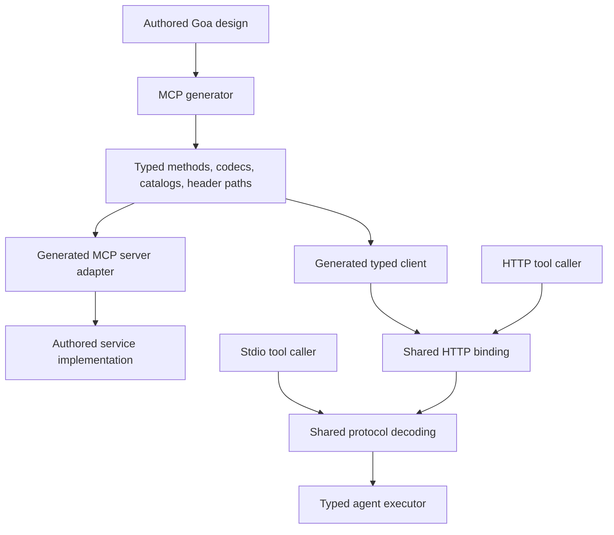

# Upgrade goa-ai to MCP 2026-07-28

Research and implementation plan, prepared 2026-10-02 and revised 2026-10-03 after tracing framework composition and prevailing retry implementations. The transport and composition foundation is implemented in the isolated clone. The full upgrade remains incomplete until every capability required below is implemented and verified. No release is authorized before then. The baseline sections describe remote main before this upgrade; they are not the current implementation. The current implementation and verified checks are recorded below.

## Outcome and scope

Target **MCP 2026-07-28**, the latest stable protocol revision verified during this research. The MCP project published it on July 28, 2026. Do not target the moving draft or stop at 2025-11-25. [Release announcement](https://blog.modelcontextprotocol.io/posts/2026-07-28/), [released specification](https://modelcontextprotocol.io/specification/2026-07-28).

The finished implementation should have one protocol revision, one request lifecycle, and one typed result path. Remove initialization, protocol sessions, reinitialization, old wire shapes, compatibility aliases, and text-based decoding of generated typed results. Preserve the framework's supported domain capabilities: generated tools, fixed resources, static prompts, HTTP and stdio tool callers, and agent toolset registration.

Implement all mandatory requirements on those paths. Include a generation/composition milestone and an unfinished-call integration milestone in the upgrade, rather than treating MCP as an isolated transport package. Optional capabilities must be advertised only when their complete producer-to-consumer path is implemented and tested.

Reassessment changes the earlier feature assessment: goa-ai already has typed schemas, durable suspension and continuation, asynchronous workflow starts, cancellation, and private run streams. These are useful foundations for current MCP features. Their existence does not make MCP elicitation, Tasks, subscriptions, or dynamic authoring implemented today. Do not restore removed preview abstractions: implement each chosen capability through current typed services, generated contracts, existing execution ownership, and the new protocol.

The user explicitly requires a breaking upgrade with no compatibility or legacy code. That authorizes removal of the old MCP contract; it does not justify removing unrelated service behavior or changing registry protocols.

### Reproducible baseline

| Item | Evidence |
| --- | --- |
| Isolated clone | `/Users/raphael/src/goa-ai-mcp-upgrade` |
| Repository | `goadesign/goa-ai`, cloned from its remote rather than the dirty shared checkout |
| Research starting commit | `52e69fd06b497f64b2d3d76ec58643a0db65b70f` |
| Implementation starting commit | `f3f5203c1b5c5e5f30a9431172d9603ebe02a567` (remote `main`, including typed-output automatic tool choice) |
| Plan branch | `mcp-protocol-upgrade` |
| Module | Go 1.26.0; Goa `v3.32.1-0.20260928015114-b19eb8ddfbe5` |
| Current protocol | Only `2025-06-18` passes the MCP expression's validation |
| Official schema revision | `271ecc9accafdd9b83a3c869fa67c22953b2af80`, last change to the released TypeScript schema |
| Retrieved schema SHA-256 | `742750af0bb8c716e7030c4977c992b55d1adc4407e9e66997db5846baedc2cd` |

The protocol types are defined in the [dated official schema](https://github.com/modelcontextprotocol/modelcontextprotocol/blob/271ecc9accafdd9b83a3c869fa67c22953b2af80/schema/2026-07-28/schema.ts). Use the released prose for behavioral requirements. Accepted proposals explain intent, but some contain obsolete names and error codes; the dated specification takes precedence.

Baseline verification completed with Go 1.26.3:

```sh
go test ./runtime/mcp ./expr/mcp ./codegen/mcp
```

All three packages passed. The first attempt could not access Go's build cache; rerunning with that access enabled passed. Additional focused composition tests passed across `codegen/agent`, `codegen/agent/tests`, `runtime/agent/model`, `runtime/agent/runtime`, and `features/model/openai`. They exercised MCP generation and executor compilation, external contracts, aliases, shared toolset generation, located union types, model schema validation, strict schema projection, and durable clarification/confirmation. The exact command is recorded in the composition section. These tests verify existing foundations; they do not validate the proposed upgrade. This baseline verification did not include the conformance suite or full repository suite; upgrade verification is recorded below.

## Implementation progress

The clone is based on remote main `f3f5203c1b5c5e5f30a9431172d9603ebe02a567`.
Root and nested-module dependencies were upgraded and tidied. The Go protobuf
plugins were checked against their latest released versions; their existing pins
are current. The protobuf compiler pin advances to 36.2. Preserve remote main's
automatic typed-output tool choice and its forced/native alternatives.

Implemented paths include stateless HTTP and stdio, mandatory discovery, exact
metadata/header validation and error IDs, request-scoped SSE parsing, rich tool
content, arbitrary structured result roots, fresh paginated external catalogs,
local recursive JSON Schema validation, canonical generated specs, service-only
MCP executors, and explicit shared binding registration. Retired sessions,
initialization APIs, alternate registration codecs, JSON-text result fallback,
and per-agent caller ownership are deleted.

Unfinished tool calls now use trusted version-10 run suspensions. Form and URL
answers preserve exact server request IDs and opaque state across successor runs
and worker replacement. Every HTTP round uses a fresh UUID, including after a
caller is reconstructed in a new worker. They do not publish final tool results prematurely or
charge a new model tool call. Generated MCP activity registration allows one
attempt. Explicit endpoint trust and a read-only or idempotent declaration can
authorize bounded retries inside one HTTP round. Otherwise a lost tool response
returns `OutcomeUnknownError` and finishes recovery. The detailed policy and
source-backed research are recorded below.

Verified so far: standalone generated service modules, real generated-server
protocol/tools/resources/prompts scenarios, exact form and URL contracts,
paginated recursive input/output contracts, explicit null results, invalid header
annotations isolated to their tool, numeric header equivalence, side-effect
non-replay after a lost response, and stdio cancellation/late-response correlation.
The MCP transport suite passed under the race detector. Four generated consumers
share one executable while retaining distinct deferred-tool catalogs. Existing
runtime tests pass after moving current synthetic suspension fixtures to version
10; version-9 fixtures are used only to verify rejection.

| Capability | Generated server | Direct client | Agent host |
| --- | --- | --- | --- |
| Current discovery and unary tools | Implemented | Implemented | Generated executors and canonical specs |
| Fixed text/JSON/binary reads, parameterized typed reads and static/method-backed prompts | Implemented | Generated typed clients; exact text/blob validation | No implicit conversion into agent tools |
| Rich structured tool results | Generated declared JSON result | Generated tool/prompt and runtime clients preserve five content kinds, icons, metadata and exact structured JSON | Declared result codec |
| Prompt/resource argument completion | Typed `PromptCompletion` and `ResourceCompletion` method bindings | Generated `completion/complete` clients with bounded non-null string values | Client/user interaction; no model or terminal-answer routing |
| Multi-round tool input | No producer advertised | Explicit unfinished result and successor request | Durable trusted form/URL/state-only continuation |
| Tasks, subscriptions | Not advertised | No extension claimed | Capability milestones remain separate |
| OAuth and Apps | Host-owned dependencies; no built-in extension claimed | Host-built HTTP dependency | No grant/view ownership in the planner |

Binary resources now use the existing `Resource` DSL and ordinary Goa byte
results, including named byte types. The generator emits base64 `blob` content,
preserves empty content, and omits unused JSON codecs for text/byte resources.
Generated direct clients reject both/neither text/blob fields and malformed
base64. The independent `resources-read-binary` scenario passed both operation
and wire-schema checks on 2026-10-03. Compiled binary-only and mixed-resource
clients and real generated HTTP scenarios passed. This completes the binary
resource milestone; rich authored tool content remains separate.

Generated tool and prompt clients now use one `ContentItem` representation for
all five content kinds. The generated schema declares field types, audience
values and per-item priority bounds; MCP-specific decoding checks fields whose
presence depends on the discriminator and the embedded text/blob choice.
Resource-link icons and embedded metadata survive decoding. Runtime consumers
also validate base64 and retain icons when copying tool errors. These are
consumer capabilities; rich authored tool presentation remains
required producer work. The ordinary Goa union envelope differs from MCP's flat
content envelope, so that producer design must explicitly own conversion rather
than exposing untyped application callbacks.

Method-backed prompts now use the `Prompt` method DSL with ordinary Goa string
payloads and message results. The generator emits typed payload construction,
Goa result checks, and specialized conversion of all five content kinds, with
base64 conversion for bytes and exactly one embedded text/blob variant. It
retains normal aliases, renamed fields, and located types. Unsupported fields,
opaque Go type replacements and weaker protocol constraints fail generation.
Null and non-string arguments fail before service dispatch. Invalid results,
including nil results, unset content branches and non-finite sizes or priorities,
return protocol errors.
Static prompts and valid prompt/tool composition remain available. These are
successful prompt producers; additional-input production remains a separate gate.
The compiled separate-module HTTP fixture verifies all five kinds, empty text
and bytes, ordered roles, defaults and explicit arguments, multiple prompt names
on one operation, and prompt/tool composition. It also compiles a prompts-only
service with a located named union and verifies renamed service fields and a
located role alias. Raw malformed requests cannot invoke the service. Nil results,
null messages, unset branches and invalid content return protocol errors.
The full serial race suite and quickstart passed; fresh focused race tests cover
the final shared-converter changes. Build, configured lint and uncached generated
HTTP scenarios passed. The frozen referee now passes five prompt scenarios: ten checks including
wire-schema validation. The original full-suite baseline has not been rerun.

Prompt argument completion now binds a declared prompt argument to an ordinary
unary Goa method. The generated constructor retains partial text and prior
argument context, applies domain validation, and calls that method once.
Typed result conversion retains suggestion order, optional totals and `hasMore`.
Known arguments without a binding return `[]`; unknown names and malformed
context fail before dispatch. Invalid output fails with an internal error rather
than truncation. This first increment completed prompt suggestions; URI-template suggestions now share its path.
The complete request path is generated HTTP client -> release-owned metadata
and raw string-map checks -> Goa decoding -> generated typed constructor ->
service method -> Goa result validation -> generated typed conversion -> client
validation. These methods are not agent tools or final assistant completions.

The protocol owns the inclusive maximum of 100 string values in one reply array.
It bounds that response's suggestion list, with no derived limit on the total
matches or a sequence of requests. Compiled HTTP checks cover 0, 99, 100 and 101
values, a later independent 100-value response, and totals of 250 and 1000.
They verify renamed fields, located string aliases, exact context, error
responses and eight valid/invalid peer shapes. Raw malformed context cannot
invoke the service. Public DSL checks reject missing context declarations,
unknown bindings, duplicates and absent/weaker array bounds. Build, the full serial root race suite and quickstart passed. Fresh affected
package race tests cover the final shared string-map validation, and configured
lint passed with zero issues. There is no deployed completion
caller evidence for this newly introduced binding. The frozen referee passes both prompt-completion checks through the actual
generated server. URI-template completion now shares that generated path; its local and
independent verification is recorded below. The original full-suite baseline
has not been rerun.


Resource templates now advertise RFC 6570 addresses through `ResourceTemplate`.
One unary typed reader per service receives the exact URI and returns ordered
text/blob contents; fixed resources retain exact dispatch. This replaces the
plan's original variable-inversion premise. RFC 6570 prefix expansion loses
information, and composite/adjacent variables can be ambiguous; the framework
cannot truthfully recover every original value. Discovery templates therefore
are not a routing or authorization mechanism. The service owns URI interpretation,
existence and access, including valid addresses beyond the catalog. The parser
is used only during design evaluation for syntax and completion-variable names,
with no runtime URI-template parser or matcher dependency.

`ResourceCompletion` shares typed input construction and result conversion with
prompt completion. Exact declared references and prior variable names are
validated before dispatch; unbound declared variables return empty suggestions.
Resource reads do not occur during suggestion calls. Nil/invalid typed outputs
fail rather than being repaired. Optional authored contents permit an existing
resource with no items; required contents declare a non-empty constraint.
Empty success never represents a missing resource.
The independent template-read scenario passes 2/2 and caching now passes 8/8;
prompt-completion regression passes 2/2. Compiled resource-only and mixed services
verify located types, renamed fields, exact URI bytes, multiple contents, empty
resources/blobs and protocol errors. Public DSL evaluation rejects invalid
syntax, competing readers and unknown completion bindings. The regenerated
integration suite, fresh affected race tests, build and configured lint passed.
The complete `GOFLAGS=-p=1 make test` command passed, including the serial root
race suite and quickstart. These targeted protocol checks do not establish
full-suite conformance.

The from-scratch alternative of inverting every template variable is unsound:
RFC 6570 [prefix expansion](https://www.rfc-editor.org/rfc/rfc6570.html#section-2.4.1)
discards suffixes, and adjacent/composite expressions may be ambiguous. A
first-matching-template router would make declaration order decide ownership.
The single typed reader instead owns the URI supplied by the protocol, with
ordinary service code deciding domain interpretation and access. Fixed bindings
have an exact address and retain their independent dispatch. No deployed caller
uses this newly introduced declaration, and it adds no persisted state.


Open `_meta` data also makes these content-containing types ineligible for the
generic standalone JSON helpers: `SupportsStandalone` excludes custom raw JSON
fields. Repository callers use generated endpoints, not those helpers. The
breaking upgrade removes the old standalone content/message/resource helpers;
current consumers use the generated protocol endpoints. Rich authored tool methods
must get a complete typed codec and protocol conversion rather than restoring
text-only helpers or teaching service code to serialize MCP objects.

For this client increment, build and lint passed. The initial default parallel
race run failed a killed generated-test subprocess, two Temporal non-yielding
workflow checks and a completion-order assertion. Each failed test passed when
rerun sequentially with unchanged assertions and race instrumentation. The full
race and quickstart suite then passed with `GOFLAGS="-p=1" make test`. Uncached
HTTP scenarios and Docker-backed registry tests passed. These results do not
establish the cause of the initial failures or full MCP conformance.

This table reports implementation scope, not full conformance. Verification
completed with Go 1.26.3: `make lint` (zero issues), `make test` (race-enabled root
suite and quickstart), `make itest` (regenerated server scenarios and Docker-backed
Redis tests), and focused race tests for MCP, hooks, streams, runtime, Temporal,
and MCP generation. Full agent generator tests passed after removing the unused
permissive schema-example mode. The Temporal MCP continuation test exercised
production activities and real HTTP requests on fresh workers through the SDK
test environment. It verifies exact original arguments, host answers, opaque
state, distinct request IDs, and the final typed result. It is not a live
Temporal deployment test.

The official referee was pinned to commit
`c37eec888e1c6ff140af79987a40008548b7cc5f` (`0.2.0-alpha.12`). Client tool, custom
header, invalid-annotation, and network-reference checks passed. The generated
server passed all 21 stateless checks its fixture can exercise and both localhost
Origin checks. Four stateless diagnostic checks are untestable with this fixture;
caching fails on unimplemented URI templates. The metadata peer rejects the current
revision while advertising the same revision, and warns when the client stops
instead of sending it again. Complete released-set runs now expose additional
fixture and implementation gaps; see the full audit linked from the report. See the [reproducible conformance report](../integration_tests/conformance/README.md)
for exact counts, skips, overall failures, and the broader unverified requirements.
These results do not establish a complete released-requirement-set pass.

Root and all three nested application modules were updated with `go get -u ./...`
and tidied. Final audits of the root and all three nested modules found no
updates for their explicit direct or indirect requirements. Goa is pinned to
`v3.32.1-0.20261002212739-eccc91aee2e5`; Pulse to
`v1.10.3-0.20261002205507-b34ad25e317d`. Provider SDKs, Temporal, MongoDB,
OpenTelemetry, schema validation, and test dependencies are updated in the module
files. The linter is pinned separately to `v2.14.0` in `.go-install` so its private
dependency graph cannot constrain application dependencies. Protoc is `36.2`;
the two existing Go protobuf plugin pins already match the latest releases.

The interrupted-SSE retry interpretation, external deployment inventory and
cutover, all required capabilities, and website documentation remain release gates.
The website belongs to `goadesign/goa.design`; its five translated MCP pages are
being prepared in `/Users/raphael/src/goa-ai-mcp-website`. That repository requires
separate explicit authorization before PR creation. Local API/runtime, README,
architecture, quickstart, and integration documentation are updated.
No release or deployment has been performed. Review proceeds through a draft PR while these release gates remain open.

Shared-schema changes can also change registry declaration identity. The
`shared_toolset_consumers` golden now includes the authored description on its
string result; the registry fingerprint includes exact payload/result schema
bytes (`internal/toolregistry/admission.SchemaFingerprint`). Existing immutable
service declarations reject a changed fingerprint. Regeneration therefore needs
an explicit declaration comparison and normal registry cutover even though wire
protocol 10 and storage do not change. Service providers use the existing
`Register` admission-revision contract; native Agent declarations use
`ReplaceAgentToolset` with the current token. Match providers and consumers to
the replacement declaration and preserve already accepted calls. The Redis
integration suite includes declaration replacement and saved-token behavior;
no external catalog migration or deployed inventory has been verified here.

## Baseline before the upgrade


This is a partial implementation of the older protocol, not a complete implementation of every 2025-06-18 feature.

| Area | Verified behavior | Code to inspect |
| --- | --- | --- |
| DSL and version | `MCP(name, version, opts...)` describes server software identity. `ProtocolVersion(...)` is exposed, but validation accepts only 2025-06-18. | [DSL](../dsl/mcp.go), [expressions](../expr/mcp/mcp.go) |
| Generated service | Always emits `initialize`, `notifications/initialized`, and `ping`; adds list/call or list/read/get pairs only for declared capabilities. | [method builders](../codegen/mcp/mcp_methods.go), [type builders](../codegen/mcp/mcp_types.go) |
| HTTP server | One authored POST route; rejects batch arrays; checks the protocol header after initialization; present Origins must exactly match the mounted allowlist. GET returns 405. It does not create a server-side session store. | [mount template](../codegen/mcp/templates/jsonrpc_server_mount.go.tpl) |
| Generated client | Wraps its Goa HTTP client in `HTTPSession`; initializes, sends the initialized notification, and starts replacement initialization after session expiry. | [client session template](https://github.com/goadesign/goa-ai/blob/f3f5203c1b5c5e5f30a9431172d9603ebe02a567/codegen/mcp/templates/mcp_client_session.go.tpl), [caller template](../codegen/mcp/templates/mcp_client_caller.go.tpl) |
| Handwritten callers | HTTP and stdio constructors initialize. HTTP retains session headers and treats some 404s as expiry. Both handle independent server requests, including ping. | [HTTP caller](../runtime/mcp/httpcaller.go), [HTTP session](https://github.com/goadesign/goa-ai/blob/f3f5203c1b5c5e5f30a9431172d9603ebe02a567/runtime/mcp/http_session.go), [stdio caller](../runtime/mcp/stdiocaller.go) |
| Tool results | Object results have an output schema and structured content. Strings become plain text. Other JSON values become serialized text. Generated executors decode those three cases differently. | [adapter planning](../codegen/mcp/adapter_generator.go), [tool adapter](../codegen/mcp/templates/adapter_tools.go.tpl), [agent executor](../codegen/agent/templates/mcp_executor.go.tpl) |
| External content | Runtime callers already preserve text, image, audio, resource links, embedded resources, annotations, and content metadata. Generated authored tools produce text only. | [content types](../runtime/mcp/content.go), [wire decoding](../runtime/mcp/rpc.go) |
| Errors | Invalid tool arguments become JSON-RPC invalid-params errors. Service failures become `isError` tool results. Runtime protocol errors retain code/message but drop `error.data`. | [tool adapter](../codegen/mcp/templates/adapter_tools.go.tpl), [caller contract](../runtime/mcp/caller.go), [failure classification](../runtime/agent/runtime/mcp_failure.go) |
| Schemas | Shared code emits inline schemas, rejects recursive types, and incorrectly documents inline expansion as an MCP requirement. | [schema generator](../codegen/shared/json_schema.go) |
| Resources and prompts | Fixed resource URIs, unary text/JSON resource methods without payloads, and static text prompt messages. Lists are one page and reject supplied cursors. | [resource adapter](../codegen/mcp/templates/adapter_resources.go.tpl), [prompt adapter](../codegen/mcp/templates/adapter_prompts.go.tpl), [design validation](../codegen/mcp/mcp_contract.go) |
| Integration harness | Automatically initializes, learns the version from that result, and then adds the HTTP version header. Protocol scenarios exercise initialization and ping. | [runner](../integration_tests/framework/runner.go), [scenarios](../integration_tests/scenarios/protocol.yaml) |

Two existing mechanisms should be reused rather than duplicated:

- Goa's `jsonrpc.RawRequest`, `RawResponse`, and `RawErrorResponse` already represent exact request IDs, raw parameters/results, and raw error data. They can replace the duplicated envelope types in `runtime/mcp/rpc.go`.
- The repository already uses `github.com/santhosh-tekuri/jsonschema/v6`, including private loaders that reject external references in [model validation](../runtime/agent/model/tool_schema_validation.go) and [registry schema validation](../runtime/toolregistry/schema/validation.go). The upgrade needs a protocol-owned use of the existing compiler, not a second schema library or an import from registry persistence code.

An important transport gap exists in the pinned Goa dependency: its generated JSON-RPC response decoder rejects non-200 HTTP responses before decoding their JSON-RPC error body, and its declared service errors use a generic data wrapper. MCP needs precise HTTP statuses and direct protocol error data. Updating only MCP payload/result types will not fix this.

## Complete paths and composition evidence

This section follows inputs through generated ownership, execution, and observable results. It also records where the earlier plan assumed a missing capability without tracing the existing framework. Repository evidence establishes local behavior; no live application inventory or deployed MCP telemetry was available.

### Path A: authored Goa service to an MCP client

1. The author marks a service with `MCP` and its methods with `Tool` or `Resource`, declares fixed prompt messages, and explicitly selects one JSON-RPC POST route. Ordinary HTTP/gRPC service contracts remain separate. [DSL](../dsl/mcp.go), [design validation](../expr/mcp/mcp.go).
2. MCP plugin `Prepare` snapshots the authored service and adds the synthetic MCP service before Goa fixes types and names. It attaches services to the appropriate API servers and evaluates their design. Changes to request/result types must happen here, not by editing generated files afterward. [Preparation](../codegen/mcp/prepare.go), [plugin](../codegen/mcp/plugin.go).
3. `Plan` obtains Goa's service plan and reserves packages, declarations, imports, codec layouts, and adapter names. Agent generation separately plans provider-owned tool packages and consuming aliases. Both plugins are registered early; correctness must depend on the Prepare/Plan/Generate phases, not incidental import order or mutable global state. [MCP registration](../codegen/mcp/init.go), [agent registration](../codegen/agent/init.go), [agent planning](../codegen/agent/plugin.go).
4. `Generate` writes method envelopes, service/client/server files, codecs, adapters, callers, and registration helpers. The shared transport validates the new protocol envelope and HTTP/body relationships before the adapter chooses a domain operation. Goa's generated codec decodes the operation's typed arguments. [Generation hooks](../codegen/mcp/generate.go), [adapter planning](../codegen/mcp/adapter_generator.go).
5. The adapter invokes the authored service with its authenticated context. The service owns authorization, resource membership, business errors, and accepted side effects. Transport metadata, client names, header annotations, and request-state strings are not authority.
6. The result goes through the generated codec into a complete MCP result, or through the deliberate unfinished-operation contract described below. Protocol failures retain exact IDs, status, code, and raw data. A generated client and an independent HTTP/stdio peer must observe the same contract.

The existing synthetic service approach fits Goa. Replace the old protocol model inside it; do not make a second reflection-based service definition or a generic runtime dispatcher that rediscovers the design.

### Path B: MCP-backed toolset to a finished agent tool result

1. `FromMCP` resolves the provider service's actual Goa tool methods. `FromExternalMCP` uses the consuming author's explicit `Args`/`Return` declarations; it does not infer the agent's typed contract from a remote catalog. [Provider DSL](../dsl/toolset.go), [provider data](../codegen/agent/data_toolsets.go), [MCP expansion](../codegen/agent/specs_builder_plan.go).
2. Expressions and the intermediate representation retain definition ownership, qualified toolset names, local aliases, and provider identity. MCP references do not undergo the same service-prefix qualification as ordinary local toolsets. Keep wire tool name, tool identifier, execution route, source package, and consuming alias distinct. [Intermediate representation](../codegen/ir/build.go), [MCP tool population](../codegen/agent/mcp.go).
3. Generation plans the provider's specs/helper packages once and links consuming packages to them. Located Go types and unions retain their original attribute locations; Goa's type plans choose qualification and pointer/value semantics. External declarations produce self-contained types. [Specs planning](../codegen/agent/specs_builder_plan.go), [helper package planning](../codegen/agent/toolset_helper_package_plan.go), [external contract tests](../codegen/agent/specs_external_mcp_test.go).
4. Today each generated agent accepts `Config.MCPCallers`/`WithMCPCaller`; `Register` constructs its MCP executors and calls `Runtime.RegisterToolset`. Generated example bootstrap code repeats this per agent. Runtime registration rejects a duplicate executable toolset name and rejects a repeated tool name with a different contract. This is a composition gap for two agents consuming the same MCP binding in one runtime, not proof that sharing is supported. [Config](../codegen/agent/templates/config.go.tpl), [registration](../codegen/agent/templates/registry.go.tpl), [bootstrap](../codegen/agent/templates/bootstrap_internal.go.tpl), [registration invariant](../runtime/agent/runtime/registration_tool_specs.go).
5. Registration compiles the model-visible schema once and pairs it with the generated codec. Advertising applies existing policy and deferred-tool selection. Provider adapters may project schemas into their supported form; validated clients check returned arguments against the advertised contract and generated decoder. MCP discovery is not a replacement for this model boundary. [Model contract](../runtime/agent/model/model.go), [schema validation](../runtime/agent/model/tool_schema_validation.go), [tool policy](../runtime/agent/runtime/tool_policy.go).
6. Workflow execution retains original model arguments, derives execution data, checks policy/confirmation, assigns execution correlation, and schedules ordinary MCP I/O through the tool activity. An MCP-backed service tool is not an agent child workflow. [Tool step](../runtime/agent/runtime/workflow_turn.go), [tool batches](../runtime/agent/runtime/tool_calls.go), [activity](../runtime/agent/runtime/activities.go).
7. The generated executor maps the qualified local tool to its exact remote name, invokes the supplied caller, and decodes the declared result. The runtime then validates/materializes the typed result, encodes it canonically, records it, publishes correlated hooks/stream updates, and supplies it to planner resume. The upgrade must reach this final point, not stop at a successful HTTP response. [Executor](../codegen/agent/templates/mcp_executor.go.tpl), [result preparation](../runtime/agent/runtime/tool_result_materialization.go), [result validation](../runtime/agent/runtime/tool_result_contract.go).
8. Stored history, child-run correlation, stream consumers, and evaluation evidence must receive one final outcome for that exact call. Intermediate input requests, task acknowledgements, protocol metadata, and opaque state are not final tool results or new model-authored calls. [Transcript](../runtime/agent/transcript/runlog_prefix.go), [streams](../runtime/agent/stream/stream.go), [evaluation evidence](../eval/evidence/collector.go).

### Path C: human input, suspension, and later continuation

The existing runtime already records pending inputs in a trusted `RunSuspension`, restores the exact predecessor checkpoint, validates one matching response, starts a successor workflow, and resumes planning after the ordered pending queue is satisfied. Confirmation pauses before a tool executes. Planner-authored questions complete the question tool itself. Tool-owned `ToolClarification`, by contrast, requires a successful tool result first and asks a free-text question afterward. [Pending input types](../runtime/agent/api/types.go), [continuation client](../runtime/agent/runtime/client.go), [await queue](../runtime/agent/runtime/workflow_await_queue.go), [clarification contract](../runtime/agent/runtime/tool_result_contract.go).

None of those contracts currently means “an external MCP operation is unfinished and must be continued with its original input.” MCP form elicitation also requires a server-authored schema and accept/decline/cancel semantics; a question string or local approval boolean is insufficient. Reuse checkpoint admission, correlation, host delivery, and successor-workflow machinery. Add the smallest truthful unfinished-tool outcome where it is missing; do not manufacture a successful result, send protocol state to the model, or make the human response pretend to satisfy the original result codec.

The host application owns authenticated human responses and any public input form/URL experience. The workflow owns durable continuation of an accepted run. The MCP layer owns protocol input IDs and exact request-state echo. There must be no network I/O inside replayed workflow code, no held activity waiting indefinitely for a person, and no fresh tool-call budget charge for each protocol round of the same domain invocation.

### Path D: asynchronous work and separate registry execution

`AgentClient.Start`/`StartOneShot`, prepared starts, engine completion queries, run snapshots, and `CancelRun` already support asynchronous agent execution. Temporal provides durable execution; the in-memory engine is useful for tests but does not establish crash durability. A run may close with a suspension and continue under a successor run ID, so a long-lived MCP task cannot simply use “latest run” or equate one workflow ID with one complete obligation. [Agent client](../runtime/agent/runtime/client.go), [engine contract](../runtime/agent/engine/engine.go), [Temporal queries](../runtime/agent/engine/temporal/queries.go), [runtime operations](../runtime/agent/runtime/runtime.go).

Registry-backed tools take a different path: the runtime retains the selected registry declaration/token, calls the registry's typed admission API, and consumes its owned result stream. They do not call `runtime/mcp`. An MCP implementation update therefore does not require changing the registry wire version. Shared schema generation and exported consumer declarations still need regression coverage because the same authored types can feed both systems. [Registry execution](../runtime/agent/runtime/registry_execution.go), [retained contract](../runtime/agent/runtime/registry_call.go), [generated registry declarations](../codegen/agent/registry_schema.go).

### Reassess schema and result restrictions at each consumer

MCP's `shared.ToJSONSchema` is currently an inline-only builder used by MCP adapters. Agent specs separately use Goa's schema builder, retain local definitions, and align schemas with the generated JSON decoder. This is two interpretations of an authored contract, even though one helper lives in a directory named `shared`. [MCP schema builder](../codegen/shared/json_schema.go), [agent schema construction](../codegen/agent/specs_builder_misc.go), [agent type materialization](../codegen/agent/specs_builder_type_info.go).

Consolidate the pure generation-time JSON contract work and make MCP catalogs, canonical `ToolSpec` factories, codecs, and registry declarations consume it. Preserve intentional model-visible versus execution-payload projections, authored examples, field metadata, JSON tags, unions, hidden fields, and server-data ownership. Do not blindly reuse an OpenAPI document as a 2020-12 schema or force model JSON and service JSON to have identical names when their contracts differ. Prove compatibility with actual emitted codecs before choosing the shared helper's location. No exported runtime schema-builder API is necessary.

Recursive schema support is feasible at the schema compiler and generation layers. It is not universally accepted by every model adapter: the current OpenAI strict projection explicitly rejects recursive references and other contracts it cannot preserve. Keep that precise provider error; do not unroll recursive schemas into weaker approximations or claim a provider accepts them without verification. [OpenAI projection](../features/model/openai/strict_schema.go).

Present JSON null is valid on the MCP wire. The agent result validator currently rejects nil decoded results for declared tools. Preserve wire absence/null distinctions, then support typed null only where the declared Goa codec and result invariant actually permit it. Do not weaken every agent result contract merely to claim “all JSON values work”; positive nullable tests and a non-nullable counterexample must establish the exact end-to-end boundary.

### Research validation performed

Alongside the three MCP baseline packages, the following existing tests passed during composition research:

```sh
go test ./codegen/agent ./codegen/agent/tests ./runtime/agent/model \
  ./runtime/agent/runtime ./features/model/openai \
  -run 'Test(ExternalMCPToolset|GoaBackedMCPToolset|Golden_MCP|GeneratedMCPExecutor|GoldenSharedToolsetConsumers|GoldenLocatedSharedOneOfServiceExport|ConfigTemplateSpecializesMCPCallerValidation|Golden_ToolSpecs_SchemaAndExamples|CallerAuthoredToolSchema|ProjectStrictSchema|RunLoopToolClarification|RunLoopBudgetedToolClarification|ConfirmationExecutesInContinuationWorkflow|ContinuationConsumesOneOrderedPendingInput)' \
  -count=1
```

These tests include generated executor compilation and existing suspension behavior. They do not cover two agents sharing one MCP registration, current MCP input exchanges, task durability, or the new wire contract. Those are explicit new acceptance requirements below.

## Protocol changes that matter

### Changes between the current baseline and 2025-11-25

The intervening revision added URL elicitation, icons, broader authorization discovery, Client ID Metadata Documents, the default JSON Schema 2020-12 dialect, and clearer tool-validation error semantics. It also introduced experimental Tasks and sampling with tools. These must be evaluated against the current revision: Tasks have since moved to an extension, and sampling is now deprecated. [2025-11-25 changes](https://modelcontextprotocol.io/specification/2025-11-25/changelog).

Do not implement the intermediate protocol as a migration layer. None of its initialization, task-result, or elicitation-completion machinery belongs in the proposed end state.

### Replace initialization with self-contained requests

The new revision removes initialization and the initialized notification. Every request carries its version and client capabilities in `params._meta`. Client identity is recommended metadata; server identity belongs in result metadata. Servers must implement `server/discover`; calling it is optional for clients. [Versioning](https://modelcontextprotocol.io/specification/2026-07-28/basic/versioning), [discovery](https://modelcontextprotocol.io/specification/2026-07-28/server/discover).

The three client metadata keys are:

```text
io.modelcontextprotocol/protocolVersion
io.modelcontextprotocol/clientCapabilities
io.modelcontextprotocol/clientInfo
```

The first two are required, including an explicit empty capabilities object when no optional client capability exists. Identity is descriptive information, never authorization. Preserve extension metadata without allowing callers or models to overwrite runtime-owned keys. [Request metadata](https://modelcontextprotocol.io/specification/2026-07-28/basic#meta).

Proposed generated client request:

```json
{
  "jsonrpc": "2.0",
  "id": "call-1",
  "method": "tools/call",
  "params": {
    "_meta": {
      "io.modelcontextprotocol/protocolVersion": "2026-07-28",
      "io.modelcontextprotocol/clientCapabilities": {},
      "io.modelcontextprotocol/clientInfo": {
        "name": "example-client",
        "version": "1.0.0"
      }
    },
    "name": "add",
    "arguments": { "a": 2, "b": 3 }
  }
}
```

No initialization or session is a prerequisite for this request. The same request must work against a fresh generated server or a different replica.

### HTTP is a POST binding with validated mirrored headers

HTTP requests need `MCP-Protocol-Version`, `Mcp-Method`, and, for tool calls, resource reads, and prompt gets, `Mcp-Name`. Values must agree with the JSON body before dispatch. GET and DELETE are unsupported; protocol sessions and SSE resumption are gone. Clients still must accept both JSON and request-scoped Server-Sent Events (SSE) responses. [Streamable HTTP](https://modelcontextprotocol.io/specification/2026-07-28/basic/transports/streamable-http).

`x-mcp-header` is optional for tool authors but mandatory for HTTP clients to support. It marks a string, integer, or boolean property whose value is mirrored to `Mcp-Param-{name}`. Paths must consist only of nested `properties` entries; annotations through arrays, composition, conditionals, or references are invalid. Missing/null values omit the header. An invalid annotation excludes that tool, not the entire catalog. [Header requirements](https://modelcontextprotocol.io/specification/2026-07-28/server/tools#x-mcp-header).

Header names are case-insensitive; string values are not normalized. Encode unsafe values, outer whitespace, and sentinel-looking literal values as `=?base64?<UTF-8 base64>?=`. Apply the same encoding to `Mcp-Name`. Compare integer values numerically without rounding through `float64`. Do not invent a protocol-wide header length limit. [Header encoding and rationale](https://modelcontextprotocol.io/seps/2243-http-standardization#value-encoding). The current dated transport rules take precedence over historical examples in that proposal.

### Results and protocol errors have new shapes

All results carry `resultType`. Ordinary results use `complete`; `input_required` identifies an unfinished interaction; extensions may define additional types. Missing `resultType` must be rejected by this current-version-only implementation. The specification's default for earlier-version results is a compatibility provision that this project deliberately will not adopt. [Result definitions](https://github.com/modelcontextprotocol/modelcontextprotocol/blob/271ecc9accafdd9b83a3c869fa67c22953b2af80/schema/2026-07-28/schema.ts).

Retain the complete JSON-RPC error data and its request ID:

| Condition | JSON-RPC code | HTTP binding |
| --- | --- | --- |
| Missing required request metadata | `-32602` | 400 |
| Mirrored headers missing, malformed, or inconsistent | `-32020` | 400 |
| Required client capability absent | `-32021` | 400; data identifies required capabilities |
| Requested version unsupported | `-32022` | 400; data contains `supported` and `requested` |
| Method unsupported | `-32601` | 404 with a JSON-RPC body |

Use the released error codes, not the earlier draft values `-32001`, `-32003`, and `-32004`. The implementation-defined range is separate from MCP's reserved codes. [Error allocation and changes](https://modelcontextprotocol.io/specification/2026-07-28/changelog), [HTTP version handling](https://modelcontextprotocol.io/specification/2026-07-28/basic/transports/streamable-http#protocol-version-header).

A malformed `tools/call` envelope remains a protocol error. A recognized tool whose arguments violate its contract returns a complete result with `isError: true`. Goa's generated argument codec remains the validation owner; the adapter changes how its rejection is represented. [Tool validation decision](https://modelcontextprotocol.io/seps/1303-input-validation-errors-as-tool-execution-errors).

### Structured output is no longer object-only

`structuredContent` may contain any JSON value. If a tool advertises an output schema, its successful structured result must satisfy that schema. A valid JSON `null` is a present result, distinct from an absent field. [Structured results](https://modelcontextprotocol.io/specification/2026-07-28/server/tools#structured-content).

The protocol recommends duplicating structured output into text for older clients. The requested breaking implementation will not generate a serialized text copy solely for compatibility. Human-readable text can remain when it serves the user, but typed consumers must use the declared structured result.

JSON Schema 2020-12 is the required default. Schemas can use the dialect's full vocabulary and local references. Unresolved external references must not become permissive schemas; network dereferencing must be disabled. Unsupported explicit dialects produce a precise error. [Schema requirements](https://modelcontextprotocol.io/specification/2026-07-28/basic#json-schema-usage), [schema design rationale](https://modelcontextprotocol.io/seps/2106-json-schema-2020-12).

### Cache hints become part of the wire contract

Discovery, the four list methods, and resource reads return `ttlMs` and `cacheScope`. Freshness is a property of one result/page; private results must not cross authorization contexts. Results participating in additional-input exchanges are not cacheable. [Caching](https://modelcontextprotocol.io/specification/2026-07-28/server/utilities/caching).

Proposed generated policy: `ttlMs: 0`, `cacheScope: "private"`. This meets the wire contract without asserting an unverified public audience or positive freshness interval. It requires no cache implementation, persistence, or DSL tuning knobs. Stable generated catalogs should be sorted by name or URI; preserve authored prompt message order. [Pagination](https://modelcontextprotocol.io/specification/2026-07-28/server/utilities/pagination).

### Server interactions move into interim results

A server now requests additional input through `input_required` results on tool calls, prompt gets, or resource reads. Input keys correlate requests and responses within that operation; `requestState` is opaque. A continuation uses a new JSON-RPC ID and the original operation's input. Independent server JSON-RPC requests are removed. [Additional-input exchanges](https://modelcontextprotocol.io/specification/2026-07-28/basic/patterns/mrtr).

Current MCP callers have no interaction handler, but the framework already has a durable host-input path. Recognize interim results in the shared decoder and integrate them with that path before advertising elicitation. A caller without a configured interaction host must return a precise unsupported-interaction outcome, never false success or invented input. Empty capabilities do not prevent a server from returning a valid state-only interim result; its continuation semantics need an explicit policy as part of the operation lifecycle.

### Cancellation is transport-specific

For HTTP, closing the request's SSE response cancels that request. For stdio, the client sends `notifications/cancelled` with the in-flight request ID. Late replies must not complete another request. [Cancellation](https://modelcontextprotocol.io/specification/2026-07-28/basic/patterns/cancellation).

Stdio keeps one newline-delimited channel and exact request correlation. It no longer replies to independent server requests. Process startup, stderr handling, and shutdown remain process ownership concerns; closing stdin and allowing graceful exit should precede forced termination. [stdio binding](https://modelcontextprotocol.io/specification/2026-07-28/basic/transports/stdio).

## Proposed architecture and contract decisions

### Keep Goa as the schema and generated-code owner

Use the authored Goa design to generate MCP method types, validation, codecs, catalogs, and static dispatch/header metadata. Keep a small shared `runtime/mcp` implementation for the dynamic HTTP/SSE and stdio operations. Generated clients and handwritten callers must consume the same result/error semantics.



The generated adapter is the sole owner of translating between MCP operations and the authored service. The runtime owns transport metadata, request IDs, stream decoding, cancellation, and protocol error classification. The application owns domain authorization and durable side effects. No layer invents model-visible protocol controls. Canonical contracts also feed policy, provider validation, registration, persistence, host-input delivery, and evaluation evidence; those consumers are included in the path and work-package sections.

**Alternatives considered:**

| Design | Benefit | Reason for the recommendation |
| --- | --- | --- |
| Small shared transport plus Goa-generated contracts | Keeps existing typed service ownership and lets generation remove static branches | Recommended; requires independently verified wire conformance |
| Adopt the official Go SDK as the production implementation | Outsources much protocol maintenance | Its current client connection path falls back from discovery to legacy initialization; its public surface also retains sessions and multiple revisions. Adoption needs proof of a strict current-only path and must not replace Goa codecs with reflection-generated contracts. |
| Generate a complete transport implementation per service | Simple local wiring | Repeats dynamic parsing, streaming, cancellation, and fixes in every generated package |
| Wrap the old initialization/session code with a new version mode | Smaller initial diff | Contradicts the requested end state and retains duplicate ownership |

The SDK supports the new revision, but its [compatibility table](https://github.com/modelcontextprotocol/go-sdk#version-compatibility) and [client connection implementation](https://github.com/modelcontextprotocol/go-sdk/blob/main/mcp/client.go) show why simply updating to it would not establish the requested contract. It is useful as an independent test peer, with explicit current-version configuration. No new production dependency is justified by this plan.

### Decision 1: one revision, no protocol lifecycle state

**Before:** a public version option accepts one old value; callers initialize and retain session state.

**After:** `MCP(name, version)` retains server software identity only. Remove `ProtocolVersion`, the options parameter if nothing else uses it, `InitializeSession`, `HTTPSession`, initialized state, session locks, expiry/reinitialization, and handshake-specific timeout fields. One authoritative revision value feeds generated and handwritten code; do not copy independent literals into multiple implementation files.

The protocol/runtime layer owns the revision, not service authors or the model. This is a stronger contract: there is no configurable mode and no invalid version selection. Keep any shared constant/type private unless a real generated-package consumer requires export; do not make the expression package import the full runtime just to obtain a literal.

Recommend a discovery check in caller constructors, using their existing context. It returns a usable caller only if the endpoint supports 2026-07-28 and tools. It creates no session, registers nothing remotely, and is never repeated after an HTTP 404. Generated servers accept well-formed calls without discovery. This gives deterministic failure against older stdio servers that might otherwise execute an ambiguous tool call. No fallback or downgrade is permitted.

Preserve caller-owned HTTP authentication/transport configuration and the per-call context. Do not silently change existing general HTTP timeout policy as a side effect of removing initialization. Review any revised timeout separately, with its resource and lifetime stated.

### Decision 2: generate metadata and validate it at the boundary

**Before:** generated method types have no required request metadata; trace injection replaces the entire `_meta` object.

**After:** every request has typed required protocol metadata, and every successful generated result includes server identity. Required protocol values are constructed by code. Extensions remain raw JSON at their open boundary; unknown metadata/capability keys must not be mistaken for supported capabilities or rejected solely because they are unfamiliar.

This strengthens required fields without turning an extensible protocol into a closed enum. Generation emits only supported capability entries. Merge trace propagation with metadata rather than replacing it. Use the established OpenTelemetry conventions for `traceparent`, `tracestate`, and `baggage`. [Trace propagation](https://modelcontextprotocol.io/seps/414-request-meta).

Retain result-level `_meta` in `CallResponse` as raw JSON for direct consumers of server-authored metadata. Add raw `Data` to the existing protocol error type so callers can inspect required capabilities and supported versions without parsing messages. These fields represent received domain evidence; a new exported envelope or transport-plan type is unnecessary. Keep result discrimination and protocol decoding private. Trusted workflow persistence must be able to retain an unfinished operation without exposing its protocol state in model arguments, public host events, or an exported generic envelope.

Use generated wire decoding/validation for required fields and result variants. Handwritten checks are limited to relationships a schema cannot express: matching header/body values, matching response IDs, capability requirements, and content discrimination. Protocol schemas must permit empty required catalog/content arrays where the external specification permits them; the general repository preference for nonempty required arrays cannot override that external contract.

### Decision 3: one structured path for generated typed tool results

**Before:** the Go result's root kind decides whether callers read structured data, plain text, or JSON text.

**After:** every authored method with a result advertises its output schema and returns that result as raw `structuredContent`. Generated executors always use the generated result codec on those bytes. Result-less methods return `content: []` and omit structured content. No object wrapping, string parsing, null dropping, or guessed conversion is allowed.

Tool arguments remain JSON objects: the new freedom for schemas/results does not authorize scalar argument payloads or weaken the existing object-payload invariant.

For example, a method returning `[]int{2, 3}` changes from a text item containing `[2,3]` to `structuredContent: [2,3]`. An object remains an object; a string remains a JSON string. The declared Go result is unchanged. The external wire accepts more JSON root kinds, while the generated caller's typed contract becomes narrower and more consistent.

Apply the same contract to `FromMCP` and `FromExternalMCP` typed executors. An external current-version server returning text only can be valid MCP, but cannot satisfy a declared typed-result toolset without an explicit mapping. Reject that mismatch clearly; do not infer JSON from arbitrary text. Preserve text-only results for direct `mcp.Caller` consumers, which do not declare that typed result contract.

Keep the five existing runtime content kinds and their metadata. Add current resource-link icon metadata to the boundary representation and round-trip it. Rich authored-media bindings are required by the user and remain a separate producer milestone. Decoding icons does not fetch images or add presentation logic. Success output-schema validation does not require a tool-error result to match the success shape.

### Decision 4: separate protocol rejection from tool rejection

**Before:** invalid arguments and application errors take different routes, but protocol error data disappears and agent recovery sometimes asks the model to correct transport-owned facts.

**After:** the transport preserves protocol code/message/raw data. Generated argument-codec errors for a known tool become sanitized `isError` results. Unknown tools and malformed MCP envelopes remain protocol errors. Preserve `ErrorMapper` for application-owned error redaction; internal failures must not leak payloads or credentials.

Map version, header, capability, unsupported-interaction-without-a-host, and malformed-result failures to precise terminal errors. A supported unfinished interaction follows the suspension path and is not classified as a failed tool. The model cannot repair runtime-owned version or header metadata. Keep tool error content available for semantic correction/replanning through the existing agent error path. Do not infer a validation category from error text or add an undocumented `_meta` classifier merely to recover the previous `-32602` correction path.

Retire the generated adapter `Logger` callback in favor of operation spans/events, consistent with repository observability rules. Preserve bounded method/result facts; do not record arguments, credentials, opaque request state, or full resource contents by default. This is a separate API removal and must appear in upgrade instructions.

### Decision 5: specialize HTTP header handling at the correct lifetime

A generated tool's header annotations are known at generation time. Emit exact property-path extractors and server comparisons; do not walk the schema on every generated request. An external server's catalog is dynamic, so its HTTP caller must obtain `tools/list`, follow page cursors privately, and compile validated header paths from the received schemas. Keep this transport lookup separate from the inline typed schemas used by `FromExternalMCP`.

For authored header annotations, use the existing Goa attribute metadata mechanism, with one documented key such as `Meta("mcp:header", "Region")`. This is a proposed new metadata contract, not an existing feature. It names a routing-visible field; generation owns its placement/type/uniqueness validation. An additional exported header-plan type or transport callback is unnecessary. Reject sensitive-field use during design review; mirroring exposes values to intermediaries.

The caller owns catalog refresh, not the model. A schema must not be retained beyond its declared freshness, and private discovery/catalog data must remain isolated by the caller's authorization context. With zero freshness, obtain fresh metadata for the operation; concurrent requests can share an in-progress read only when their authorization context is the same. A confirmed `HeaderMismatch` rejection permits refreshing metadata and reissuing only after proving dispatch did not happen. Do not add unbounded retries or retry protocol-version failures with another revision.

The new machinery prevents one exact invalid decision: sending a tool call whose required HTTP routing headers are absent or disagree with its arguments. Its invariant lasts for one request using one obtained schema; neither an origin-wide permanent cache nor a "latest result" lookup is correct.

### Decision 6: complete additional-input exchanges through durable execution

**Before:** MCP callers return only a complete tool result or error. `ToolExecutionResult` requires a final `ToolResult`; its optional clarification comes after success. The existing human-input machinery cannot continue an unfinished MCP call unchanged.

**After:** distinguish a finished invocation from a suspended external invocation before result materialization. The generated executor preserves the original operation and returns an unfinished execution outcome; the workflow persists it, exposes only the necessary input request to the trusted host, and resumes the same invocation after a validated response. Generate/validate a closed outcome with exactly one branch; do not add optional continuation fields to a successful `ToolResult` or use `Telemetry.Extra`/`ServerData` as control storage.

The unavoidable domain concept is an unfinished external invocation. Its lifetime is one logical tool invocation across protocol rounds and successor workflows. Raw protocol method/state/input IDs remain implementation data. Existing final-result codecs, confirmation, free-text clarification, and `ProvidedToolResult` cannot represent it honestly: each would either require a premature result or replace the remote result with host-authored data. This code-backed gap justifies extending execution and pending-input contracts; it does not justify a public generic MCP envelope, arbitrary callbacks, a new planner tool, or another persistence service.

The desired caller experience is: configure the host's supported input capabilities once at application composition; the agent invokes its ordinary typed tool; the host receives the requested input; after a valid answer, the runtime resumes the same call and the planner receives its final typed result. Clients without a host remain honest complete-only clients. This is optional capability composition required by MCP, not a legacy protocol mode.

The implementation must prove these transitions:

1. The activity receives `input_required`, validates its typed request variants and advertised capabilities, and returns an unfinished outcome without publishing `tool_end` or attempting the tool's success decoder.
2. The workflow retains the exact remote operation, original domain arguments, execution/provider call IDs, outstanding input keys, and opaque state in its trusted checkpoint. Restore a caller by its owned toolset registration; never serialize a live caller, context, HTTP client, or credential.
3. A host response is authorized for that run and pending item, validated against the actual request, and classified as accept, decline, or cancel. Form secrets remain disallowed; URL consent and fresh credentials remain host-owned.
4. A successor workflow schedules I/O that continues the original operation with a new JSON-RPC ID and exact state/input responses. A second round repeats this process without asking the model to reproduce arguments or adding a new logical tool invocation.
5. Only a complete remote result passes through the original generated result codec, materializer, stored transcript, and planner resume. Parallel calls, identical tool names, repeated input keys in different operations, and child suspensions never share state.
6. On decline, cancel, deadline, unsupported requests, or malformed responses, expose an exact unfinished/failure outcome according to the protocol and workflow contract. Do not interpret user cancellation as a successfully executed domain operation. Revalidate current authorization before a resumed side effect.

State-only continuation is mechanical, but not an excuse for an unbounded client loop or replay of uncertain effects. Define the continuation/deadline/progress policy in the shared operation owner and test repeated state-only replies. Do not invent a fixed round limit. Server-side input exchanges must occur before accepting effects that require durable completion; accepted work belongs in the service's durable executor. A server cannot rely on the client returning to finish already-accepted side effects.

For authored servers, a service operation that can require input must explicitly represent that domain outcome in its typed contract, or expose an owned durable job. The adapter translates a declared binding into MCP; it cannot infer a missing-input request from arbitrary service errors or mutable context callbacks. Final DSL/type names and the smallest binding require a generated fixture before implementation, including calls through ordinary Goa transports. No deprecated sampling/roots requests are added.

**Alternatives:** a caller-local input callback holds I/O open and loses state on restart; mapping to successful clarification fabricates completion; a model-visible continuation tool delegates correlation to the model. The existing durable workflow/checkpoint owner avoids those errors and preserves the framework's execution model. Direct generated clients need the same explicit unfinished outcome even when they are not running an agent; they must never silently run a second interaction framework.

### Decision 7: compose MCP with ordinary toolset registration

**Before:** generated agent `Register` both registers its agent and registers MCP executable toolsets from `Config.MCPCallers`. The MCP service also generates a separate specs/metadata/executor registration path. The same binding used by two agents can attempt duplicate registration, while separate schema builders can produce unequal contracts.

**After:** the application composition root constructs callers and registers each executable MCP binding once using the existing toolset registration/executor mechanism. Agent registration contributes its definition and references; it does not create remote clients or register a second executable owner. Generate one canonical specs factory and one MCP executor per owned definition/binding, and reuse them in direct helpers, consuming aliases, exports, bootstrap, and quickstart examples.

Remove agent `Config.MCPCallers` and `WithMCPCaller` in this breaking upgrade; wire generated MCP executors through existing used-toolset executor options. Adapt `RegisterUsedToolsets` generation for MCP references rather than inventing another caller registry or weakening `Runtime.RegisterToolset` to silently accept duplicate executors. Delete the alternate MCP-specific specs globals, metadata reconstruction, and decoding implementation after all local helpers consume the canonical factory. A service exposing MCP without declaring an agent must still generate its contracts and usable client/helpers.

This narrows public concepts and strengthens ownership. Runtime toolset names remain unique; repeated declarative specs must be equal; different credentials/routes/executors cannot win by registration order. If two bindings are intentionally distinct, their authored identifiers must distinguish them. Keep aliases and provider names code-generated; applications must not copy route strings or derive remote names by trimming arbitrary prefixes.

The composition root owns caller construction, credentials, optional host capabilities, worker setup, and cleanup. Generated example planners may retain their documented unconfigured-tool stubs; they are scaffolding, not a protocol fallback. Replacing bootstrap wiring must preserve its usable example behavior and explicitly document required production configuration.

Prove the same contract works for two agents in one runtime, multiple services, repeated aliases, external inline schemas, located shared types, exported toolsets, deferred tools, and a service-only MCP design. Reject conflicting bindings at construction. Do not change ordinary agent-as-tool child execution or registry admission to accommodate MCP.

## Optional features and security boundaries

The protocol revision and the set of optional capabilities are different decisions. This first upgrade should publish an explicit supported-feature table.

| Feature | Current goa-ai evidence | Reassessed fit and decision |
| --- | --- | --- |
| Tools and direct/agent clients | Implemented with old envelopes and several result modes | Required upgrade: one current transport, canonical generated contracts, one structured typed-result path, and complete composition |
| Binary resource reads | Implemented from Goa byte-valued results, including aliases and empty content | The existing Resource DSL selects the URI/MIME. Generation emits blobs and strict client decoding. Compiled modules, HTTP scenarios, and the independent binary-resource referee passed. |
| Parameterized prompts | Implemented with ordinary string payloads and typed rich message results | Generated construction, Goa validation and declared union conversion preserve aliases and field names. Static prompts remain a distinct authoring form. Independent producer conformance remains outstanding. |
| Resource templates | Current resources reject payloads and route only exact fixed URIs | Implemented through one generated typed reader. Pass the exact URI to one typed service reader; templates guide discovery and suggestions, while the service owns interpretation, existence and authorization. Prefix expansion can discard values and composite expansion can be ambiguous, so do not invert variables or select a first matching handler. Requires a real URI-template contract; never reinterpret free-form URIs as filesystem authority. |
| `completion/complete` | Prompt suggestions implemented through typed `PromptCompletion` bindings | Service owns ranked values; generated adapters own reference routing and validation. Compiled HTTP checks cover bounded arrays and exact context. URI-template suggestions now use the same typed path; full-suite conformance remains outstanding; assistant `Completion(...)` stays separate. |
| Additional input / form elicitation | Durable suspensions, ordered pending input, generated codecs, and host events exist; MCP caller/executor has no unfinished-call branch | Include the durable unfinished-call integration in the upgrade sequence. Advertise form support only with a real configured host and verified schema/response path. No-host callers reject honestly. |
| URL elicitation | Host input can pause a run; no MCP URL consent/completion integration exists | Feasible host integration with consent, authenticated completion, and fresh-credential handling. Do not launch arbitrary URLs or return secrets through form answers. Advertise only the implemented mode. |
| Progress | Shared callers can consume request-scoped SSE; agent hooks already carry execution progress | Add current request-ID/progress-token correlation in the transport. Any generated progress producer needs an explicit operation binding. Private agent events are not a public MCP payload. |
| Subscriptions | Private session/run stream and hooks exist; generated resource-change producers and MCP listeners were removed | Technically feasible, not implemented. Add only with an owned change source and a generated `subscriptions/listen` binding; filter by authenticated subscription and exact request. A fixed catalog needs no pretend notifications. Do not reuse session streams, GET channels, or old broadcasters. |
| Tasks extension | Asynchronous starts, durable engine, completion queries, suspension, and cancellation exist | Viable workflow-backed extension milestone. The server owns durable work and task identity; the adapter maps its typed API. Arbitrary unary methods are not automatically tasks. Pin the extension separately and verify the complete lifecycle before advertising. |
| Roots / sampling / logging | File/domain inputs, model clients, and tracing exist, but these old protocol features are deprecated | Their absence is a deliberate new-protocol design choice, not evidence the framework cannot access files or models. Do not implement deprecated request variants. |
| OAuth | Authorized HTTP client injection and application middleware exist; built-in discovery/grant/token storage do not | Keep host/application authorization ownership. Preserve challenges/status/headers. A built-in profile needs its own complete security design and synthetic tests; do not label injection as built-in OAuth compliance. |
| Apps | Returned content can contain resource links; no view sandbox or host permission mechanism exists | Requires a separate UI host and security contract. The server-side resource layer could supply declared content, but agent streams alone cannot implement Apps. No automatic HTML execution. |
| Skills / other extensions | Open metadata can be retained; no extension-specific authored/runtime contract exists | Assess the extension's producer/consumer separately. No speculative capability or generic arbitrary-result fallback. |

The user requires every missing capability identified in this review before release. Protocol optionality does not make these implementation milestones optional for this upgrade. Keep PR #409 draft while work proceeds; commits and pushes are authorized, release is not. The required capability set is binary resources, rich authored content, parameterized prompts, URI templates, argument suggestions, server-produced additional input, progress, subscriptions, Tasks, built-in OAuth, and complete Apps and Skills integrations. Pin each extension separately. Extensions remain explicitly enabled by applications; do not advertise them before the complete path works. Deprecated roots, sampling, logging, and Dynamic Client Registration remain excluded by the from-scratch requirement. Any referee scenario that depends on a deprecated feature must be reported explicitly rather than implemented as a legacy path or silently ignored.

New long-lived notifications are scoped to a subscription request and correlated by its exact ID; ordinary progress is scoped to its originating operation. Those requirements must govern any future subscription API. [Subscriptions](https://modelcontextprotocol.io/specification/2026-07-28/basic/patterns/subscriptions), [progress](https://modelcontextprotocol.io/specification/2026-07-28/basic/patterns/progress).

Elicitation form and URL modes have different security responsibilities. A configured host must not request sensitive secrets in forms, and must explain a URL interaction before opening it. Server continuation state is untrusted input on return; when authorization-sensitive, it needs principal/request binding, integrity, expiry, and server-enforced replay rules. Signing data alone does not make it single-use. [Elicitation](https://modelcontextprotocol.io/specification/2026-07-28/client/elicitation), [state requirements](https://modelcontextprotocol.io/specification/2026-07-28/basic/patterns/mrtr#server-requirements-basic-workflow).

Tasks are no longer a core experiment. Pin the [dated extension contract](https://github.com/modelcontextprotocol/ext-tasks/blob/main/specification/2026-07-28/tasks.md) separately from the core. A server adapter must maintain one operation identity across successor workflows, authorize every task lookup/update/cancel, and return its original typed result. A runtime run ID is not automatically that operation identity. [Tasks extension](https://modelcontextprotocol.io/extensions/tasks/overview). Apps require a separate host/view security design. [Apps extension](https://modelcontextprotocol.io/extensions/apps/overview).

Roots, sampling, logging, the old HTTP+SSE transport, and Dynamic Client Registration are deprecated. Avoid them in a new implementation even where the specification retains them during its deprecation window. [Deprecated-feature registry](https://modelcontextprotocol.io/specification/2026-07-28/deprecated).

### Authorization work, if a built-in profile is separately chosen

Existing applications can supply authorized HTTP clients and mount authentication middleware. This investigation found no built-in MCP OAuth implementation and no live target credentials/configuration to validate. Treat a future built-in profile as greenfield; do not infer deployed authorization behavior from framework defaults.

Such a profile needs protected-resource metadata and challenges, authorization-server/OIDC discovery, PKCE, resource/audience-bound access tokens, and intact 401/403 handling. [Authorization contract](https://modelcontextprotocol.io/specification/2026-07-28/basic/authorization), [authorization-server discovery](https://modelcontextprotocol.io/specification/2026-07-28/basic/authorization/authorization-server-discovery).

Use preregistered credentials or Client ID Metadata Documents; do not build a deprecated Dynamic Client Registration fallback. Validate a present authorization-response issuer and bind stored credentials to that issuer. [Client registration](https://modelcontextprotocol.io/specification/2026-07-28/basic/authorization/client-registration), [security requirements](https://modelcontextprotocol.io/specification/2026-07-28/basic/authorization/security-considerations).

Authentication/consent remain host-owned. Self-reported client/server names, tool annotations, icon URLs, mirrored headers, and opaque continuation values do not grant authority. Preserve exact Origin validation. Do not fetch icon/schema URLs or follow arbitrary redirects while interpreting a tool result.

## Removal and preservation matrix

Remove obsolete source and generated output in the same breaking change. Keep no deprecated forwarding alias, alternate decoder, negotiated older version, or runtime feature flag.

| Surface or outcome | Current caller/dependency evidence | Required new outcome |
| --- | --- | --- |
| `ProtocolVersion(...)`, expression field, per-service revision literals | DSL docs, fixtures, expression validation, generator planning | Remove the option/field and regenerate all local consumers; one release-owned revision |
| `initialize`, `notifications/initialized`, `ping` | Generated method/type builders, adapter core, caller constructors, integration harness | No registered/generated lifecycle methods; current well-formed unknown-method calls fail precisely |
| `InitializeSession`, `HTTPSession`, `ensureSession`, `startNewSession` | Runtime files and generated client templates/planning | Delete lifecycle state and session repair; discovery is an ordinary read |
| Independent server request handling | HTTP session SSE processing and stdio reader | Reject forbidden server requests; never post/write JSON-RPC replies |
| Object/plain-text/JSON-text result modes | Adapter flags, register template, client template, agent executor data | One codec-based structured path for every declared result |
| Agent `Config.MCPCallers` / `WithMCPCaller` and implicit registration | Per-agent config/registry/bootstrap templates; runtime rejects duplicate executable names | Remove per-agent caller ownership; compose one generated MCP executor through existing toolset registration, then register agent definitions |
| MCP-specific specs globals and alternate executor registration | MCP registration template duplicates agent specs/decoding | One fresh canonical specs factory, metadata source, and generated executor consumed by every helper |
| Existing suspensions/checkpoints | `RunSuspensionVersion` currently `goa-ai.run-suspension.v9`; saved calls/results/pending inputs validated on continuation | New unfinished-operation state has one current checkpoint contract; drain affected old runs before worker cutover; no old-format reader |
| Confirmation / planner questions / post-success clarification | Different existing pending-input contracts and positive runtime tests | Preserve their meanings; no human answer substitutes for an unfinished MCP tool's final typed result |
| Generated `CorrectionFailure` compatibility alias | Definition in register template and name reservation; no repository callers found | Delete the alias and reservation; migrate any downstream build errors explicitly |
| Other pass-through generated error helpers | Registration/executor templates | Inline or privatize when they add no domain contract; keep the one shared failure classifier |
| Adapter `Logger` | Generated adapter option and log calls | Replace with bounded spans/events; document consumer API removal |
| Domain `ErrorMapper` | Generated adapter's application error path | Preserve sanitized service error behavior |
| HTTP Origin allowlist and caller-supplied transport | Mount template and caller options | Preserve exact origin checks, credentials, middleware, and HTTP policy |
| Fixed resource URIs and results | Resource expression/contract validators | Preserve URI identity, service authorization, MIME behavior, and data |
| Static prompt messages | Prompt expressions/template | Preserve content, roles, and authored ordering |
| Empty content for result-less tools | Adapter/codec/executor tests | Preserve empty success with new discriminator |
| External image/audio/link/embedded content | Runtime union and error cloning | Preserve all content types/metadata; add missing current icon fields |
| Single-page generated lists | List templates and cursor rejection | Keep one complete deterministic page; do not invent pagination state |
| Registry wire version/storage | Separate registry contracts; no dependency requiring an MCP bump found | No change to registry version, storage, or service ownership |
| Historical migration documentation | Existing preview migration section in `docs/runtime.md` | Replace MCP upgrade advice with the new end state; do not retain operational instructions for removed APIs |

The repository proves these local consumers, not all downstream deployments. Before implementation publication, enumerate public Go imports, generated API users, and configured external MCP endpoints in the authorized deployment inventory. Store private application evidence in its owning repository. Since no deployed MCP targets were supplied for this planning task, mixed-version and caller preservation are release gates, not verified facts.

## Dependency upgrade and implementation authorization

Implementation and PR publication are authorized against current remote `main`. Preserve the newly merged forced and automatic typed-output operations while replacing MCP. Update every root runtime/test/tool dependency to current compatible releases, retain a newer explicitly pinned Goa/Pulse revision when the latest release is older, and update their active upstream revisions when necessary for generator contracts. Record the exact resolved versions in committed module files rather than fetching moving revisions at build time.

Update all nested modules (`quickstart`, `integration_tests/fixtures/assistant`, and `integration_tests/fixtures/eval_consumer`) with the same dependency generation. Their local goa-ai replace directives continue to point to this checkout; do not replace them with an older published framework build. Update pinned Go code-generation tools together with their owning modules and regenerate fixtures. Verify provider SDK API changes with synthetic transport tests, generator changes with compiled emitted packages, and Temporal changes with workflow/replay tests. No application-dependent behavior or new production library is justified solely by refreshing dependencies.

Perform dependency changes first, establish compile/test evidence, then work through the numbered contract packages below. Keep dependency failures attributable instead of compensating for SDK drift with casts, duplicate types, or silent fallbacks. Dependency updates do not authorize changing model/provider semantics outside the necessary API migration.

## Implementation sequence

These are dependency-ordered work packages for one breaking release. Intermediate commits are not separately deployable protocol upgrades. Each package must leave a reviewable diff, and the finished branch must contain only the new implementation. Do not publish a dual-version release to make the sequence easier.

### 1. Pin the contract and prove transport and composition ownership

1. Pin the released schema and primary source revision in conformance fixtures/tooling; do not fetch moving schemas during tests.
2. Build a small synthetic generated-service fixture proving direct JSON-RPC `error.data`, required 400/404 responses, request metadata, exact string/numeric IDs, and zero batch support.
3. Inspect the pinned Goa JSON-RPC generator's request encoder, handler, response decoder, and error encoder. Current MCP code replaces only the mount section. Extend section-driven MCP generation at the actual owner of each behavior; do not rewrite emitted Go strings or normalize an HTTP error to 200 to fool the ordinary decoder.
4. If current generation hooks cannot produce the contract, identify the smallest generic Goa generator change, its consumers, and tests before making it. Update the dependency only after that change is available. Keep ordinary Goa JSON-RPC behavior unchanged unless its own contract requires a separate change.
5. Prove a service-only MCP design, local `FromMCP`, external inline contracts, two agents sharing one binding, consuming aliases, and named/located union types. Trace JSON field names and schemas from both generators into their actual codecs. Establish the canonical contract/helper package owner before changing public wiring.
6. Prototype an unfinished invocation through activity output, stored suspension, authenticated host input, successor workflow, second protocol round, final decoding, and correlated evidence. This is a contract proof, not a permanent alternate implementation. Settle the smallest public pending-input/execution changes before widespread template edits.
7. Resolve interrupted-request and activity-retry behavior before selecting retry policy. Include worker loss between remote acceptance and activity completion; transport conformance alone cannot prove safety.

**Files:** [MCP generation hooks](../codegen/mcp/generate.go), [generation planning](../codegen/mcp/plugin.go), [contract validation](../codegen/mcp/mcp_contract.go); pinned dependency's `jsonrpc/codegen` templates, if necessary.

**Acceptance:** a generated server emits protocol errors at the correct HTTP status with unwrapped data, and a generated client decodes them without message parsing. Ordinary non-MCP JSON-RPC fixtures are unchanged. Transport error ownership, canonical generated contracts, shared registration, and unfinished-call ownership are the highest-risk integration proofs; do them before extensive template edits.

### 2. Replace the DSL/expression and generated protocol model

1. Remove protocol selection and old lifecycle method/type builders. Preserve software identity and the explicitly authored POST route.
2. Generate mandatory `server/discover`, truthful capability metadata, typed request metadata, complete result discriminators, cacheable-result fields, and current protocol errors.
3. Keep open extension data raw; model closed domain choices as precise typed fields. No arbitrary `Any` data-transfer objects for known protocol structures.
4. Generate metadata construction for every direct generated client endpoint, not only the `mcp.Caller` wrapper. Client code supplies its identity once; it must not copy version/capability fields into each method payload or remember to add required headers. Enrich a request before its generated encoder validates it, using private execution-owned data; preserve the original caller/model arguments separately.
5. Consolidate the pure generation-time JSON contract source used by MCP and agent specs. Emit the required 2020-12 dialect and local definitions without losing codegen's field names, locations, examples, pointer semantics, or unions. Model/execution schema projections remain intentional and explicit; remove the alternate inline-only builder after its consumers move.
6. Keep result arrays present where required, including legitimate empty arrays. Validate union branches without turning absent fields into guessed defaults. Define complete versus unfinished outcomes before generating optional elicitation capabilities.

**Files:** [DSL](../dsl/mcp.go), [expression](../expr/mcp/mcp.go), [expression builder](../codegen/mcp/mcp_expr_builder.go), [method builders](../codegen/mcp/mcp_methods.go), [type builders](../codegen/mcp/mcp_types.go), associated tests and generator planning.

**Acceptance:** generation emits only applicable methods and metadata; a direct generated call and an agent-backed call use the same protocol contract. The generated service has no initialization or ping symbols. New public fields/types have a documented producer, consumer, and domain reason.

### 3. Implement one shared current-only caller transport

1. Reuse Goa raw JSON-RPC types; retain raw result/error bytes and exact IDs. Replace duplicated request/response envelope types.
2. Remove HTTP session state and handshake helpers. Implement request metadata/header construction, direct protocol-error decoding on 400/404, and shared JSON/SSE result decoding.
3. Decode `resultType` first; preserve content/metadata/raw structured values; distinguish absent structured content from JSON null. Represent supported unfinished operations without requiring success content; fail precisely when their required host/capability is absent.
4. Make HTTP tool-schema/header discovery private. Follow external catalog pagination and validate header annotations before compiling extraction paths. Unsupported tools must fail before execution; one malformed tool must not hide valid siblings.
5. Replace stdio initialization with discovery. Keep write serialization and per-ID pending calls; remove server-request replies; send cancellation for canceled/deadlined in-flight calls. Do not kill unrelated concurrent calls when one operation is canceled.
6. Make shutdown follow the current stdio contract. Establish any grace-period value through the numeric-policy gate rather than copying an arbitrary timeout.
7. Keep every pending operation's outcome honest on EOF, wrong IDs, malformed results, and process exit. Never auto-replay an uncertain side effect.

**Files:** [caller contract](../runtime/mcp/caller.go), [wire decoding](../runtime/mcp/rpc.go), [HTTP caller](../runtime/mcp/httpcaller.go), [HTTP session to delete](https://github.com/goadesign/goa-ai/blob/f3f5203c1b5c5e5f30a9431172d9603ebe02a567/runtime/mcp/http_session.go), [stdio caller](../runtime/mcp/stdiocaller.go), [content](../runtime/mcp/content.go), [errors](../runtime/mcp/errors.go), [trace propagation](../runtime/mcp/trace.go).

**Acceptance:** constructors reject older endpoints; every request is independently valid; HTTP 404 never restarts initialization; concurrent stdio responses are correlated correctly; no legacy envelope default, server-request reply, or stream-resumption path remains.

### 4. Regenerate the server and client adapters around the new contract

1. Generate discovery and result metadata at the adapter boundary. Sort static catalogs once during generation.
2. Replace mount-only legacy checks with correct protocol request handling, direct errors/statuses, header/body comparisons, and cancellation propagation to the service context.
3. Mount GET and DELETE rejection explicitly with Origin checking. Ignore obsolete session/resumption headers as the current transport recommends; do not add a new rejection policy for harmless headers. Never create/echo a session or implement resumption.
4. Emit successful results with `resultType: "complete"`; use one structured result codec for every declared tool result. Preserve fixed resource serialization and static prompt content.
5. Convert known-tool argument-codec rejection into sanitized tool-error content, without calling the authored method. Retain domain `ErrorMapper`; replace adapter log hooks with spans/events.
6. Replace generated caller initialization with the shared current-only HTTP binding. Delete session file generation, session imports/plans, and name reservations. Do not retain empty obsolete files.
7. Remove unused batch-processing and unreachable streaming/lifecycle sections specifically from MCP output. Do not remove supported ordinary Goa JSON-RPC behavior.

**Files:** [adapter planner](../codegen/mcp/adapter_generator.go), [plugin](../codegen/mcp/plugin.go), [generation hooks](../codegen/mcp/generate.go), [adapter core](../codegen/mcp/templates/adapter_core.go.tpl), [tools](../codegen/mcp/templates/adapter_tools.go.tpl), [resources](../codegen/mcp/templates/adapter_resources.go.tpl), [prompts](../codegen/mcp/templates/adapter_prompts.go.tpl), [mount](../codegen/mcp/templates/jsonrpc_server_mount.go.tpl), [client caller](../codegen/mcp/templates/mcp_client_caller.go.tpl), [client session template to delete](https://github.com/goadesign/goa-ai/blob/f3f5203c1b5c5e5f30a9431172d9603ebe02a567/codegen/mcp/templates/mcp_client_session.go.tpl), corresponding client-file generators.

**Acceptance:** current-only independent peers can call the generated service; invalid transport input invokes no service method; generated and handwritten clients preserve the same protocol errors. The service context is canceled when its response stream disconnects.

### 5. Complete canonical contracts and application-owned registration

1. Use the contract source established in phases 1–2 in MCP catalog generation, service-only helpers, agent specs, result codecs, examples, field metadata, and registry exports. Remove duplicate MCP spec globals and public pass-through helpers after their last consumer moves.
2. Add validated authored header metadata to schemas and generated exact extractors. Imported catalogs remain raw and compile only at the dynamic boundary. Do not parse JSON Schema to rediscover generated `TypeSpec.Fields`.
3. Remove `HasStructuredResult`/`TextResult` result modes throughout adapters, registration, and agent executors. Preserve MIME-driven resource encoding as a separate domain contract.
4. Make `FromMCP` and `FromExternalMCP` executors decode the declared structured result directly. Retain one canonical failure classifier; avoid duplicating raw structured payload in telemetry when the canonical tool record already owns it.
5. Move executable registration to the application composition root. Remove `Config.MCPCallers`/`WithMCPCaller` and per-agent registration side effects. Reuse generated used-toolset executor options and the runtime's unique-owner invariant. Generate one registration per shared binding in bootstrap, with matching caller construction/cleanup.
6. Update intermediate representation, package/import/name planning, helper linking, `Use`/`Export` aliases, service-only designs, generated quickstarts, and example bootstrap in the same change. Preserve developer scaffolding separately from required production wiring.
7. Verify model advertising, policy, deferred tool definitions, execution payload enrichment, confirmation, typed result materialization, transcript restoration, registry export declarations, telemetry, and evaluation evidence against the same generated contract. Do not change independent registry or child-agent semantics.

**Files:** [shared schema generation](../codegen/shared/json_schema.go), [agent JSON contract](../codegen/agent/specs_builder_misc.go), [type planning](../codegen/agent/specs_builder_plan.go), [type materialization](../codegen/agent/specs_builder_type_info.go), [intermediate representation](../codegen/ir/build.go), [adapter generation](../codegen/mcp/adapter_generator.go), [MCP registration](https://github.com/goadesign/goa-ai/blob/f3f5203c1b5c5e5f30a9431172d9603ebe02a567/codegen/mcp/templates/mcp_register.go.tpl), [config](../codegen/agent/templates/config.go.tpl), [agent registration](../codegen/agent/templates/registry.go.tpl), [helper planning](../codegen/agent/toolset_helper_package_plan.go), [agent imports](../codegen/agent/agent_package_plan.go), [example planning](../codegen/agent/example_bootstrap_plan.go), [bootstrap](../codegen/agent/templates/bootstrap_internal.go.tpl), [quickstart](../codegen/agent/templates/agents_quickstart.go.tpl), [executor](../codegen/agent/templates/mcp_executor.go.tpl), [failure mapping](../runtime/agent/runtime/mcp_failure.go), and their compile/runtime fixtures.

**Acceptance:** two agents share one registered MCP binding without duplicate ownership; aliases and exports use correct packages and routes; a service-only design still works. Every declared supported root kind and named/located/union value round-trips through the actual codec. Direct wire null and codec-permitted typed null remain distinct from absence; forbidden typed nil still fails. Recursive schemas work where the codec and consumer support them, with precise provider rejection elsewhere. There is no JSON-text result decoder, duplicate specs implementation, route-string reconstruction, or runtime schema inspection for static facts.

### 6. Integrate unfinished operations with durable host input

1. Implement the closed execution outcome proved in phase 1 and the smallest pending-input response contracts. Keep protocol decoding/state internal to the MCP operation owner; trusted workflow state stores only the data needed to resume the exact invocation.
2. Extend activity input/output, workflow batch records, checkpoint validation/restoration, and host delivery so an unfinished call has no success result, no `tool_end`, and no planner resume before completion. Validate payload/engine storage budgets at their actual lifetime without creating a new run-wide limit.
3. Implement form schema validation and accept/decline/cancel response handling through an actual configured trusted host. Keep local tool confirmation, planner questions, and post-success clarification independent. Bind responses to exact run/suspension/tool/input IDs and current authenticated context.
4. Resume through activity I/O with original parameters, new RPC ID, exact opaque state, and only the corresponding input responses. Restore the registered caller in the worker composition root; never checkpoint a client or credential. Handle further rounds and state-only results deliberately.
5. Propagate deadlines/cancellation across suspension and successor workflows. Preserve one logical domain invocation and its policy accounting. Apply the explicit trusted-tool HTTP policy to interrupted response streams; stop uncertain non-repeatable outcomes; verify engine retry configuration and crash behavior as well as transport behavior.
6. Keep transcript, hooks, host stream conversion, child-run links, and evidence collection faithful: one unfinished call before input, one final typed result afterward. Test an unrelated parallel call to prove continuation state does not escape its owning invocation.
7. Give direct generated clients an honest unfinished outcome and a protocol-owned way to fulfill supported input without a model-visible replay method. Their host integration must obey the same semantics; do not duplicate the protocol algorithm in each generated package.
8. Advance the affected checkpoint schema as one breaking contract where required. Inventory and drain affected old suspensions/workflows before cutover; no old schema reader, mode switch, or automatic coercion enters the new runtime.

**Files:** [MCP caller/outcome](../runtime/mcp/caller.go), [protocol decoding](../runtime/mcp/rpc.go), [generated executor](../codegen/agent/templates/mcp_executor.go.tpl), [execution types](../runtime/agent/runtime/types.go), [activity transport types](../runtime/agent/api/types.go), [activities](../runtime/agent/runtime/activities.go), [tool batching](../runtime/agent/runtime/tool_calls.go), [workflow step](../runtime/agent/runtime/workflow_turn.go), [await queue](../runtime/agent/runtime/workflow_await_queue.go), [suspension](../runtime/agent/runtime/workflow_suspension.go), [continuation validation](../runtime/agent/runtime/continuation_contract.go), [result materialization](../runtime/agent/runtime/tool_result_materialization.go), [host stream](../runtime/agent/stream/stream.go), [evidence](../eval/evidence/collector.go), and engine replay/continuation tests.

**Acceptance:** suspend, restart the worker, answer through the trusted host, survive a second input round, and receive the original typed result without a new model call or duplicated side effect. No-host clients advertise no elicitation and fail truthfully. Existing confirmation/question/clarification outcomes still pass. Host-visible data contains no private checkpoint, credential, or opaque request state.

### 7. Implement all required authoring and extension capabilities

Every milestone below is required before this upgrade can release. Define the typed caller experience and complete generated fixture before editing each public contract. The current framework foundations are evidence of feasibility, not proof that the capability already exists.

1. **Resource/prompt authoring:** prove byte-valued resource reads and parameterized prompt methods using existing Goa types. Bind static facts at generation time, including MIME, messages, arguments, and routing. Use URI templates for discovery and pass exact URI inputs to the service-owned reader; suggestions use declared variable names; framework assistant `Completion` remains separate. Use generated transforms, not runtime payload coercion. Preserve fixed URI and static message outcomes.
2. **Subscriptions/progress:** identify the owning change/progress producer, authenticated selection, ordering, cancellation, and backpressure. Add request-scoped protocol events through a purpose-built generated binding and shared transport. Do not forward private session streams or install a generic global broadcaster. A subscription is a distinct operation, not streamed chunks of an otherwise unary tool/resource result.
3. **Tasks consumer:** after declaring the extension, persist the exact remote task ID with its original invocation in trusted execution state. Schedule `tasks/get` through durable execution; polling observes server-owned work and must not reissue `tools/call`. Route task input through the same host path and use `tasks/update`/`tasks/cancel` with the required transport headers. Honor server polling guidance without inventing run-wide budgets.
4. **Tasks server:** use an owned typed execution API over a durable workflow/job. Prove accepted-start recovery and readable task state before returning a handle. Derive identity from owner-authorized identifiers where possible; if a stable operation-to-successor mapping needs storage, only the initiating service owns it and exposes it through typed APIs. The adapter never reads another service's workflow tables. No universal scheduler, automatic taskification of unary methods, or global MCP deduplication store.
5. **Task semantics:** pin the released extension independently; map working/input-required/terminal states, partial input, cancellation races, retained results, and authorization deliberately. A closed suspended workflow is not a completed task. A domain tool error remains a completed `isError` result; `failed` represents the extension's protocol-error outcome. Cancellation acknowledgement is intent, not proof work stopped. Set retention/TTL and polling policy only after the numeric and operational ownership gates.
6. **Server-produced additional input:** bind an authored operation to typed input requests and validated responses. The operation owner preserves its original arguments and continuation state; generated adapters validate capability support before producing an interim result. Bind authorization-sensitive state to the current principal and operation, with owner-enforced integrity, expiry and replay rules. Prove multiple requests, multiple rounds, altered state rejection, cancellation, and non-tool methods. Reuse the implemented durable agent-host continuation path rather than inventing a second successful-result shape.
7. **Rich authored content:** use declared result contracts for text, image, audio, embedded resources and resource links in tools and prompt messages. Keep structured output and presentation content distinct and preserve their declared relationship. Generate transforms and exact content variants; do not infer images or JSON from strings. Verify all variants against an independent peer.
8. **Built-in authorization:** implement current protected-resource and authorization-server discovery, client registration metadata, grants, token handling, challenge-driven scope updates and issuer/resource checks. The application owns credential persistence, user consent and redirect handling through constructed dependencies; the MCP caller owns the protocol exchange. Include separately pinned client-credentials and enterprise-managed authorization profiles. Assess DPoP and workload identity scenarios against their current primary contracts before claiming them. Prove credential isolation across endpoints and concurrent calls, rejection of mismatched issuers/resources, cancellation, and bounded challenge handling. A host-supplied authenticated HTTP client alone does not complete this milestone.
9. **Apps:** pin the official extension, expose declared app resources and implement the corresponding host message, sandbox and permission contract. Do not count metadata retention or returned HTML as a complete integration. Prove an actual host/view exchange, blocked unauthorized operations, resource policy and teardown independently from agent execution.
10. **Skills:** pin the official extension and implement its authored discovery/content contract and consuming host path. Preserve owner authorization and typed resources; do not substitute generic open metadata or automatic planner execution for extension support.

**Acceptance:** publish a per-feature matrix of implemented server, direct-client, and agent-host paths. Every advertised capability has a positive independent-peer test and its security/cancellation counterexample. Document all omitted features honestly. No release may proceed while any requested milestone remains incomplete. No milestone is complete at the envelope or parser layer alone. Record server, direct-client and agent-host acceptance separately; a feature with no meaningful role in one layer must explain that ownership, not claim an untested implementation.


### 8. Replace the integration harness and document the breaking release

1. Delete `auto_initialize`, handshake constants/state, initializer stub cases, and initialization/ping scenarios. Construct version/capability metadata and mirrored headers for each request. Discovery is a scenario, not hidden session setup.
2. Update protocol/tools/resources/prompts scenarios, fixture designs, generated compile tests, and golden files by regeneration. Add independent HTTP and stdio peers using only 2026-07-28.
3. Assert rejection before service dispatch, cancellation, supported structured root kinds, direct wire null, codec-permitted typed null, raw error data, metadata, and private/no-cache hints. Cover configured host input, no-host rejection, shared registration, generated bootstrap, and stored continuation after restart. Replace old tests that enforce object-only results, session expiry, or compatibility defaults.
4. Update [README](../README.md), [DESIGN](../DESIGN.md), [DSL docs](dsl.md), [runtime docs](runtime.md), and [overview](overview.md). Keep customer-facing guidance about capabilities, generated code, visible errors, and upgrade action separate from engineering transport internals.
5. Update `content/{en,fr,ja,it,es}/docs/2-goa-ai/mcp-integration.md` in the isolated `goadesign/goa.design` clone after the final caller contracts are implemented. Verify its documentation tests, links and production Hugo build. Obtain explicit authorization for that repository's PR only after the changes are concrete and reviewable; do not publish unfinished capabilities as available.
6. Publish notes explaining removals, regeneration, changed result encoding, client/server cutover, optional feature scope, and rollback. Derive actual notes from the final diff, not this proposed plan.

**Files:** [scenario runner](../integration_tests/framework/runner.go), [runner tests](../integration_tests/framework/runner_test.go), [MCP integration suite](../integration_tests/tests/mcp_integration_test.go), [fixture](../integration_tests/fixtures/assistant/mcp_assistant.go), [protocol](../integration_tests/scenarios/protocol.yaml), [tools](../integration_tests/scenarios/tools.yaml), [resources](../integration_tests/scenarios/resources.yaml), [prompts](../integration_tests/scenarios/prompts.yaml), fixture design files and docs above.

**Acceptance:** tests no longer depend on prior protocol state; documented examples compile after regeneration; supported-feature claims match capabilities and independently exercised behavior.

## Verification and release gates

### Focused acceptance matrix

| Boundary | Positive proof | Rejection/counterexample proof |
| --- | --- | --- |
| Stateless dispatch | A tool call to a fresh server succeeds without discovery; successive calls can reach different replicas | Missing metadata fails; old versions never downgrade or initialize |
| Direct generated clients | Every generated endpoint includes runtime-owned metadata/headers | Caller cannot override the compiled revision or fabricate optional capability support |
| JSON-RPC | Exact string and numeric IDs; raw error data preserved; zero-result method succeeds | Batch array, invalid envelope, wrong response ID, missing result discriminator, and forbidden server requests |
| HTTP | JSON and SSE peers; all required standard headers; exact Origin allowlist | Header/body disagreement invokes no method; GET/DELETE 405; unknown method 404 JSON-RPC body |
| Header metadata | Nested property paths; fresh catalog pages; valid sibling tools remain usable | Duplicate names, invalid tokens/types/locations, missing/mismatched headers, stale schema, malformed sentinel |
| Typed results | All wire root kinds, codec-permitted typed null, named/located/union values, supported recursive contracts | Missing versus null versus forbidden typed nil; schema/codec mismatch; provider rejection stays precise; no text coercion |
| Content | All five existing block kinds, annotations, metadata, link icons | Invalid block shape, invalid base64 where applicable, and malformed resource content |
| Tool errors | Known-tool validation feedback and sanitized domain failure reach the model as errors | Invalid protocol metadata is never reported as model-correctable tool arguments |
| Cache hints | Zero/private fields on every applicable result, deterministic lists | No cross-principal reuse, stale retention, or caching of unfinished/continuation results |
| Generation composition | Service-only and multi-service generation; repeated commands deterministic; located aliases and shared unions compile | No import-order reliance, second contract source, package/name collisions, or lost type locations |
| Toolset ownership | Two agents share one runtime registration; intentional distinct bindings retain separate identities | Duplicate/conflicting executor or credential binding fails; no last-registration-wins behavior |
| Model and execution | Same canonical contract feeds specs, provider validation, policy, deferred tools, confirmation, and codec | Model never authors version/capabilities/state/transport IDs; provider projection never weakens canonical schema |
| Host input | Worker restart, two rounds, validated accept/decline/cancel, exact original invocation | No premature result, no model replay, no state leak; reject wrong principal/input/correlation; parallel call remains independent |
| Durable records | One final tool result through materialization, transcript, hooks, host stream, and evidence | No duplicate tool end, fake successful interim result, task ack as output, or human answer as domain result |
| Runtime retries | Worker loss and interrupted transport preserve honest outcome; owner-enforced idempotence only where declared | No implicit activity retry silently duplicates an accepted effect; no global deduplication store |
| Selected optional capabilities | Typed binary/prompt fixture; subscription owner; task survives restart and successor workflows | No private stream forwarding, URI authority inference, automatic HTML execution, or task failure/status guessing |
| Cancellation | Cancel one HTTP/stdin request while another completes; graceful process shutdown | Late reply, EOF, process exit, lost final SSE response, and repeated cancellation races |
| Optional capabilities | Discovery advertises exactly implemented features | Valid `input_required` is recognized; no invented consent/input; unnegotiated extensions cannot produce false success |
| Scope preservation | Fixed resource MIME/data and static prompt roles/message order; typed registration still works | Ordinary JSON-RPC, registry wire/storage, non-MCP toolsets, and existing model schemas do not change accidentally |

Use an independent peer and the [official conformance project](https://github.com/modelcontextprotocol/conformance), pinned to a revision supporting the released requirement set. Run client and server roles at `2026-07-28`; do not accidentally score a handshake-era default or a moving draft. Distinguish failures in the test harness from implementation failures, and optional/unclaimed capabilities from mandatory requirements. Do not hide mandatory failures in an expected-failures file. Include newer unscored scenarios as additional evidence where relevant, especially schema/header cases.

The released requirement set covers a broader SDK fixture, including authorization, argument suggestions, additional-input exchanges, and content authoring. Classify each case against the final implemented feature table; the revised plan includes host-input work and optional authoring milestones, but existing baseline tests do not prove those paths. A supported-profile report must name those gaps explicitly, not relabel a required full-SDK scenario as an optional test or claim an entire requirement-set pass. Protocol-required behavior on every implemented path must still pass.

For the official suite, inspect its pinned CLI first. Its documented released-set server command currently has this shape:

```sh
npx @modelcontextprotocol/conformance server \
  --url http://localhost:3000/mcp \
  --requirements 2026-07-28
```

Pin the package version before using that command in CI. Add a small client-under-test executable adapting the existing HTTP/stdio caller contract, rather than exporting new framework APIs solely for the harness. Report exactly which optional/auth scenarios are applicable to the chosen support profile; make no full-SDK tier claim from a partial run.

Repository checks after implementation:

```sh
go fmt ./...
make lint
make test
make itest
```

Run focused package/generator tests while iterating, including `./runtime/mcp`, `./expr/mcp`, `./codegen/mcp`, affected `./codegen/agent` tests, and the integration runner. Use the repository's generator to refresh fixtures/goldens; never edit generated output directly. Reread every changed non-trivial file and comment end to end. Do not run browser/visual tests for documentation-only changes.

### Numeric policies must remain narrow

| Value | Owner and purpose | Units, boundary, lifetime | Required counterexample |
| --- | --- | --- | --- |
| HTTP `MaxAttempts` | Application bounds repeated POST dispatches after unexpected SSE interruption | Counts the first attempt; zero selects one; negative is rejected; applies to one HTTP request round | Two host-input rounds may each use two attempts without exceeding either round's allowance |
| Mirrored integer range | MCP HTTP binding preserves exact interoperability with JavaScript header consumers | Inclusive `[-9007199254740991, 9007199254740991]`; one annotated field in one HTTP request | A larger integer in an unannotated field or a stdio tool remains valid if its declared codec permits it |
| Generated `ttlMs: 0` | Server result declares no freshness claim | Integer milliseconds; a result is fresh only before its receipt time plus TTL; zero allows no subsequent freshness interval | Multiple pages/results do not share a cumulative TTL or quota |
| Existing HTTP timeout | Caller/application transport policy | One HTTP request, not a complete agent run or all transport calls | Several individually valid calls may exceed that duration in aggregate |
| Schema/frame/body/shutdown budgets | Respective compiler, transport, and process owners | Determine from measured allocations/calls and documented transport constraints before selecting values | Test the next wider lifetime, valid large schemas/results, and concurrent calls |

Test both integer endpoints immediately below, at, and above the bound, fractional invalid inputs, and mathematically integral JSON notation such as `42.0`. Test header names that differ only in case and strings containing non-ASCII, control characters, outer whitespace, and the literal encoding sentinel.

The header integer bound is required by the external contract; it is not a general MCP numeric or run-wide limit. [Header constraints](https://modelcontextprotocol.io/specification/2026-07-28/basic/transports/streamable-http#schema-extension). Do not copy existing model-schema byte limits into unrelated MCP catalogs, turn header limits into argument limits, or invent positive cache/shutdown durations in tests before their design gate passes.

### Interrupted HTTP responses and operation ownership

Research on October 3 traced current source paths rather than inferring retries
from option names. The official Go v1.8.0, TypeScript v2.3.0, Python v2.3.0, and
C# clients reconnect response streams using event IDs where available. Without
resumption evidence, they surface failure or leave a pending request to time
out; the inspected paths do not automatically reissue `tools/call` with a new
ID. TypeScript separately retries a pre-dispatch header mismatch. VS Code retries
specific session failures and URL elicitation. FastMCP exposes optional
server-side retry middleware; its client drives explicit host-input rounds.
These paths do not establish an ecosystem-wide annotation-based replay policy.

Sources: [Go transport](https://github.com/modelcontextprotocol/go-sdk/blob/v1.8.0/mcp/streamable.go),
[TypeScript transport](https://github.com/modelcontextprotocol/typescript-sdk/blob/v2.3.0/packages/client/src/client/streamableHttp.ts),
[Python transport](https://github.com/modelcontextprotocol/python-sdk/blob/v2.3.0/src/mcp/client/streamable_http.py),
[C# transport](https://github.com/modelcontextprotocol/csharp-sdk/blob/c40ee044fd415c70da5176c749cb5ef02f2b59f6/src/ModelContextProtocol.Core/Client/StreamableHttpClientSessionTransport.cs),
[VS Code tool retries](https://github.com/microsoft/vscode/blob/45373f06ff77cc97a7754a376548d8937fb3af54/src/vs/workbench/contrib/mcp/common/mcpServer.ts),
[FastMCP middleware](https://github.com/PrefectHQ/fastmcp/blob/affd31d52a345c02fe037b2367f4e5bb4100aa28/fastmcp_slim/fastmcp/server/middleware/error_handling.py).

The released changelog says clients MUST reissue a broken SSE response request
with a new ID. The dated transport page removes response resumption and treats
disconnect as cancellation. The inspected implementations do not establish that
the requirement means unconditional automatic execution retries. This difference
remains unresolved: do not claim full conformance or describe our policy as an
authoritative protocol clarification. [Released wording](https://modelcontextprotocol.io/specification/2026-07-28/changelog),
[transport rules](https://modelcontextprotocol.io/specification/2026-07-28/basic/transports/streamable-http).

Tool annotations already describe repeatability: `readOnlyHint` and
`idempotentHint` default to false. `destructiveHint: false` is not a repeatability
promise. Maintainers identify retry decisions as a use for trusted hints while
stating that hints do not enforce server behavior. [Maintainer explanation](https://blog.modelcontextprotocol.io/posts/2026-03-16-tool-annotations/).

**Implemented policy and complete path:**

1. A service author declares the five standard hints in its method's `Tool`
   block. Typed design expressions generate the optional `ToolAnnotations`
   catalog object, preserving omission and false. The same design precomputes
   HTTP tool bindings; runtime code does not rediscover static tool behavior.
2. An imported caller reads the selected tool's repeatability hints and header
   bindings from all catalog pages under the current authorization context.
   It does not share trust decisions or catalog state across credentials.
3. The application constructs its caller with `HTTPRetryPolicy`. The default is
   one attempt. Explicit endpoint trust plus a read-only or idempotent declaration
   can authorize a finite attempt count for one HTTP request round.
4. The shared HTTP transport retries only unexpected SSE interruption before a
   final response. It preserves exact arguments, host answers, and opaque state,
   changes only the request ID, and sends another POST. It never resumes a stream.
5. Cancellation, malformed messages, HTTP/JSON-RPC errors, completed tool errors,
   untrusted hints, and absent safe hints do not cause these retries. Exhaustion
   returns `OutcomeUnknownError`; runtime recovery stops. A missing response is
   unavailable, while observed deadline expiry remains timeout.
6. Generated MCP worker activities retain one total attempt. Worker replacement
   cannot blindly rerun an uncertain operation. Host-input continuation is a new
   explicit protocol round with its own HTTP allowance, not another model call.
7. The service owns preventing additional business effects for identical arguments.
   Hints and JSON-RPC IDs supply no deduplication guarantee. No shared store,
   model-owned retry token, or new operation-identity protocol is introduced.

The public settings are needed because the existing engine retry policy governs
whole activities, cannot read remote behavior declarations, and cannot distinguish
lost responses from returned tool failures. Tool bindings carry only the facts
needed for headers and repeatability; full schemas and codecs remain owned by
the existing generated or discovered contracts. Trust is fixed by the application
for its endpoint, never selected by the agent model.

Verification covers trusted and untrusted declarations; omitted and false hints;
attempt counts zero, one, two, and three; negative configuration; cancellation;
truncated events, malformed fully framed messages, and completed-error responses; fresh IDs with unchanged parameters;
compiled generated catalogs/callers; and real HTTP with one owner-enforced effect
across two dispatches. Two host-input rounds can each use two attempts, proving
the per-round allowance is not a run-wide limit. A non-idempotent synthetic tool
still has one dispatch after its effect completes and the reply is lost.

An EOF before the event's terminating blank line is stream loss, even when
pending bytes look like incomplete JSON. A fully framed malformed event fails
validation without retry. Framing tests cover LF, CRLF, and CR lines, a leading
UTF-8 byte-order mark, multiple data lines, and fully framed empty data. This follows the [SSE framing rules](https://html.spec.whatwg.org/multipage/server-sent-events.html#event-stream-interpretation).

The pinned official SSE retry scenario still excludes the new revision and tests
removed session resumption. Resolving the changelog/implementation discrepancy
remains a gate for a blanket conformance claim; it does not justify restoring the
old protocol or replaying arbitrary side effects. Stdio process loss is not retried.

### Publication and deployment

This is a breaking wire and generated-Go API change. Both locally generated sides must upgrade/regenerate together. An independently deployed external server/client must explicitly support 2026-07-28. Old clients cannot use the new endpoint, and new clients cannot use old endpoints. Do not support mixed revisions on one endpoint or implement an in-process compatibility flag.

1. Inventory each caller, endpoint, generated API import, and typed output dependency; record before/after behavior and owner. Public evidence stays synthetic and application-independent.
2. Build and verify new artifacts before cutover. Regenerate whole services and consumers; remove copied old generated helpers.
3. Deploy coordinated clients/servers or a separate complete new deployment, then switch only callers proven ready. A separate deployment is a rollout artifact, not a dual-protocol implementation. Remove it when cutover/rollback needs end.
4. Before any production change, record the exact target/action, current conformance/caller evidence, stop conditions, and rollback to complete previous client/server artifacts. Rolling back only one side leaves incompatible peers.
5. Stop promotion on new rejection, wrong data, changed routing, duplicate effects, or material latency regression. Observe discovery/catalog overhead separately from tool execution.
6. The core MCP wire has no protocol session migration. The revised unfinished-operation design changes workflow/checkpoint contracts and needs a separate cutover: inventory active/suspended runs and child chains, finish or deliberately settle affected obligations using the existing release, then switch all affected workers and regenerate clients. Keep rollback artifacts paired. Never discard accepted work or assume an old checkpoint can be decoded by the new worker. The terminal new release contains no old-version reader. Verify downstream stored caller/task/authorization dependencies separately.
7. Inspect the final complete diff, generated output, branch name, commit attribution, and release text. Document all removed public options/aliases, structured encoding changes, regeneration requirements, optional feature support, and the interrupted-request decision.

### Publication and clone cleanup

The isolated branch contains the implementation, regenerated consumers, dependency upgrades, tests, and this revised plan. Publish verified changes through a draft review PR and keep its description aligned with the current implementation and evidence. Commits and pushes may continue on that PR. Publication does not satisfy the release gates above.

Keep the isolated clone until the work is complete and published without losing review work. After the task's PR is merged, use its actual base branch, verify a clean worktree and no commits in `git log @{upstream}..`, and remove the exact clone directory `/Users/raphael/src/goa-ai-mcp-upgrade`. If it contains uncommitted or unpushed work, stop and preserve it. This implements the user's cleanup request; do not delete the original shared checkout or delete the plan before publication.

### Definition of done

The replacement is complete when every claimed current-protocol path passes independent validation; all local generated consumers and docs use the new contract; no old version/lifecycle/session/text-coercion/compatibility path remains; domain outcomes in the preservation matrix are proven; complete generation/composition and configured host-input paths pass; every requested capability is implemented and its complete path independently verified; extension advertisements match configured implementations; and downstream worker/checkpoint rollout, rollback, and interrupted-request semantics are explicit.

A changed version literal, green legacy tests, or a successful tools/list request is insufficient evidence. The final implementation must have the same ownership and public surface it would have had if the old MCP implementation had never existed.
