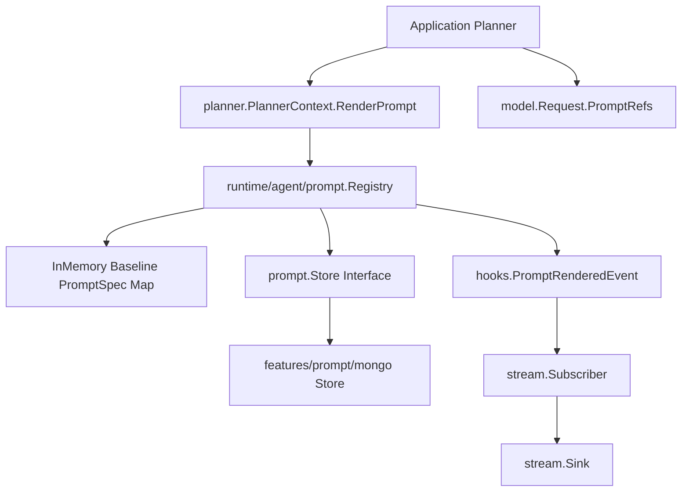
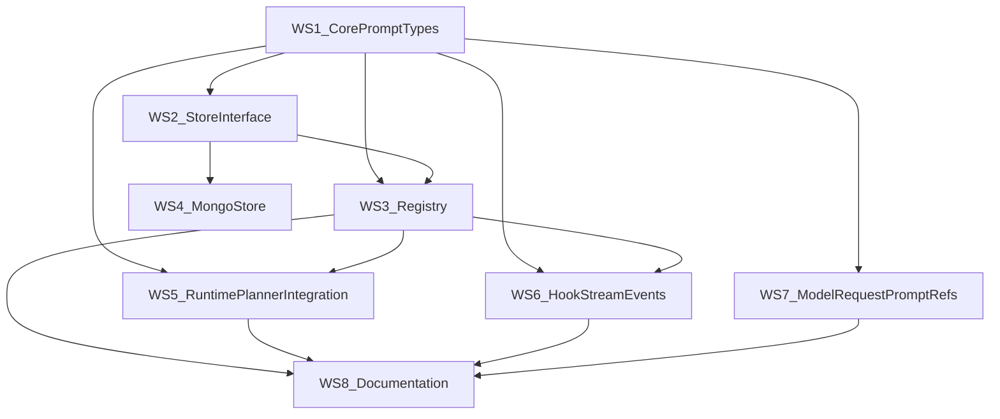

# Prompt Management Feature for goa-ai

## 1. Executive Summary

This document specifies the full set of changes required to add first-class prompt
management to goa-ai, including:

- Prompt identity and typed contracts in runtime packages.
- Dynamic override resolution backed by MongoDB.
- Runtime and planner integration for prompt rendering.
- Hook and stream observability for rendered prompts.
- Model request annotation for inference-aware behavior.

The goal is to make prompts runtime-managed artifacts, not opaque strings assembled
independently by each application.

This design is intentionally executable by an agent with no prior context: it names
the exact files to create or modify, the required type signatures, data model shape,
tests, sequencing, and independent parallel work streams.

---

## 2. Problem Statement

Today, goa-ai has robust contracts for:

- Workflow execution (`runtime/agent/runtime`),
- Planners (`runtime/agent/planner`),
- Model I/O (`runtime/agent/model`),
- Events and streaming (`runtime/agent/hooks`, `runtime/agent/stream`),
- Durable stores (`runtime/agent/memory`, `runtime/agent/session`, `runtime/agent/runlog` + Mongo providers).

Prompt content is currently handled as ad hoc strings/templates owned by applications,
with no framework-level identity, no dynamic override store, and no uniform
observability signal linking "prompt version used" to run outcomes.

---

## 3. Goals and Non-Goals

### 3.1 Goals

1. Introduce a runtime prompt domain with strong contracts:
   - `PromptSpec`, `PromptRef`, `PromptContent`, `Scope`, `Override`.
2. Provide a `prompt.Store` interface and `features/prompt/mongo` implementation.
3. Add a runtime registry that resolves baseline specs + dynamic overrides.
4. Expose prompt rendering through planner runtime context.
5. Emit prompt-rendered events into hooks and stream.
6. Annotate `model.Request` with prompt references.
7. Keep all additions backward compatible by default (feature is optional).

### 3.2 Non-Goals

1. No prompt authoring UI in this change set.
2. No optimizer/EVAL/RL orchestration in this change set.
3. No mandatory DSL change in the first increment (DSL/codegen extension is optional
   follow-up; runtime API enables prompt management immediately).

---

## 4. Current Runtime Seams (Reference Baseline)

These files define the current extension points and must be used as anchors:

- Runtime and options:
  - `runtime/agent/runtime/runtime.go`
- Planner contracts:
  - `runtime/agent/planner/planner.go`
  - `runtime/agent/runtime/agent_context.go`
- Model request contracts:
  - `runtime/agent/model/model.go`
- Hook events and encoding:
  - `runtime/agent/hooks/hooks.go`
  - `runtime/agent/hooks/events.go`
  - `runtime/agent/hooks/codec.go`
- Stream event contracts and mapping:
  - `runtime/agent/stream/stream.go`
  - `runtime/agent/stream/subscriber.go`
- Existing durable store patterns:
  - `runtime/agent/memory/memory.go`
  - `runtime/agent/session/session.go`
  - `runtime/agent/runlog/runlog.go`
  - `features/memory/mongo/*`
  - `features/session/mongo/*`
  - `features/runlog/mongo/*`
- Agent-as-tool prompt-related options:
  - `runtime/agent/runtime/agent_tools.go`

---

## 5. Proposed Architecture



### 5.1 Core principle

Prompt content resolution is centralized in runtime. Planners ask for prompt rendering
through context; the runtime resolves, renders, records references, and emits events.

### 5.2 Scope precedence

Override lookup order:

1. Session scope
2. Facility scope
3. Org scope
4. Global scope
5. Embedded baseline spec (registered at startup)

---

## 6. Work Stream 1: Core Prompt Package

### 6.1 New package

Create directory:

- `runtime/agent/prompt/`

Create files:

- `runtime/agent/prompt/types.go`
- `runtime/agent/prompt/store.go`
- `runtime/agent/prompt/registry.go`
- `runtime/agent/prompt/inmem_store.go`
- `runtime/agent/prompt/errors.go`

### 6.2 Required types and contracts

```go
package prompt

import (
    "context"
    "text/template"
    "time"
)

type PromptRole string

const (
    PromptRoleSystem   PromptRole = "system"
    PromptRoleUser     PromptRole = "user"
    PromptRoleTool     PromptRole = "tool"
    PromptRoleSynthesis PromptRole = "synthesis"
)

type PromptSpec struct {
    ID          string
    AgentID     string
    Role        PromptRole
    Description string
    Template    string
    Version     string
    Funcs       template.FuncMap
}

type PromptRef struct {
    ID      string
    Version string
}

type PromptContent struct {
    Text string
    Ref  PromptRef
}

type Scope struct {
    OrgID      string
    FacilityID string
    SessionID  string
}

type Override struct {
    PromptID   string
    Scope      Scope
    Template   string
    Version    string
    CreatedAt  time.Time
    Metadata   map[string]string
}

type Store interface {
    Resolve(ctx context.Context, promptID string, scope Scope) (*Override, error)
    Set(ctx context.Context, promptID string, scope Scope, template string, metadata map[string]string) error
    History(ctx context.Context, promptID string) ([]*Override, error)
    List(ctx context.Context) ([]*Override, error)
}
```

### 6.3 Registry behavior

`Registry` owns baseline specs and optional dynamic store:

```go
type Registry struct {
    // Baseline map: prompt ID -> immutable spec
    // Optional store for overrides.
    // Optional hook publisher callback for observability.
}

func NewRegistry(store Store) *Registry
func (r *Registry) Register(spec PromptSpec) error
func (r *Registry) List() []*PromptSpec
func (r *Registry) Render(ctx context.Context, promptID string, scope Scope, data any) (*PromptContent, error)
```

Rendering rules:

1. Validate prompt ID exists in baseline map.
2. Resolve override (if store configured).
3. Use baseline `Funcs` for both baseline and override templates.
4. Parse with `missingkey=error`.
5. Execute with provided `data`.
6. Return `PromptContent{Text, Ref}` where `Ref.Version` is resolved version.
7. Emit hook event callback (if configured).

### 6.4 Error contracts

Define explicit errors in `errors.go`:

- `ErrPromptNotFound`
- `ErrDuplicatePromptSpec`
- `ErrPromptStoreUnavailable`
- `ErrTemplateParse`
- `ErrTemplateExecute`

---

## 7. Work Stream 2: MongoDB Prompt Store

### 7.1 New feature package

Create:

- `features/prompt/mongo/store.go`
- `features/prompt/mongo/clients/mongo/client.go`
- `features/prompt/mongo/clients/mongo/client_test.go`
- `features/prompt/mongo/clients/mongo/mocks/...` (generated via `cmg gen .`)

This must follow the same architecture used by:

- `features/memory/mongo/clients/mongo/client.go`
- `features/session/mongo/clients/mongo/client.go`
- `features/runlog/mongo/clients/mongo/client.go`

### 7.2 Collection and index design

Collection name:

- `prompt_overrides` (default; configurable via options)

Document shape:

```json
{
  "_id": "ObjectId",
  "prompt_id": "chat.system",
  "scope_org": "org_123",
  "scope_facility": "fac_456",
  "scope_session": "sess_789",
  "template": "...",
  "version": "sha256:...",
  "created_at": "2026-02-22T00:00:00Z",
  "metadata": {
    "experiment_id": "exp_42",
    "author": "operator@example.com"
  }
}
```

Indexes:

1. Lookup index for precedence queries:
   - `{prompt_id:1, scope_org:1, scope_facility:1, scope_session:1, created_at:-1}`
2. History index:
   - `{prompt_id:1, created_at:-1}`

No delete/mutation needed for v1 (append-only history). `Resolve` selects latest.

### 7.3 Client interface

In `features/prompt/mongo/clients/mongo/client.go`:

```go
//go:generate cmg gen .

type Client interface {
    health.Pinger
    Resolve(ctx context.Context, promptID string, scope prompt.Scope) (*prompt.Override, error)
    Set(ctx context.Context, promptID string, scope prompt.Scope, template string, metadata map[string]string) error
    History(ctx context.Context, promptID string) ([]*prompt.Override, error)
    List(ctx context.Context) ([]*prompt.Override, error)
}
```

### 7.4 Wrapper store

In `features/prompt/mongo/store.go`:

- Implement `prompt.Store`.
- Follow the same thin delegation pattern as existing stores.

---

## 8. Work Stream 3: Runtime Integration

### 8.1 Modify runtime options and state

Update:

- `runtime/agent/runtime/runtime.go`

Add to `Options`:

```go
PromptStore prompt.Store
```

Add to `Runtime`:

```go
PromptRegistry *prompt.Registry
```

Add option function:

```go
func WithPromptStore(s prompt.Store) RuntimeOption {
    return func(o *Options) { o.PromptStore = s }
}
```

In `newFromOptions`:

- Always initialize `PromptRegistry = prompt.NewRegistry(opts.PromptStore)`.
- Do not fail runtime creation when `PromptStore` is nil.

### 8.2 Hook integration from registry

Use existing hook publishing seam:

- `runtime/agent/runtime/helpers.go`
  - `publishHookErr(...)`

Registry event emission should call runtime hook publisher callback, not publish
directly to bus, so canonical runlog append behavior remains consistent.

---

## 9. Work Stream 4: PlannerContext Integration

### 9.1 Planner interface extension

Update:

- `runtime/agent/planner/planner.go`

Add method to `PlannerContext`:

```go
RenderPrompt(ctx context.Context, id string, data any) (*prompt.PromptContent, error)
```

### 9.2 Concrete implementation

Update:

- `runtime/agent/runtime/agent_context.go`

`simplePlannerContext.RenderPrompt(...)` delegates to runtime registry:

1. Build scope from run context:
   - `SessionID` from run context.
   - org/facility from labels (v1 convention):
     - `labels["org_id"]`
     - `labels["facility_id"]`
2. Call `c.rt.PromptRegistry.Render(...)`.
3. Return `PromptContent`.

Implementation note:

- `simplePlannerContext` currently has no run context field; add required fields
  through `agentContextOptions` and constructor wiring.

---

## 10. Work Stream 5: Agent-as-Tool PromptSpec Integration

Update:

- `runtime/agent/runtime/agent_tools.go`

### 10.1 New option

Add:

```go
func WithPromptSpec(id tools.Ident, promptID string) AgentToolOption
```

and add map to config:

```go
PromptSpecs map[tools.Ident]string
```

### 10.2 Resolution behavior

During agent-as-tool execution:

1. If `PromptSpecs[toolID]` is present:
   - resolve via prompt registry,
   - render using tool payload as `data`,
   - use rendered text as user prompt.
2. Else fallback to current behavior (`Templates` -> `Texts` -> `PromptBuilder`).

This is additive and non-breaking.

---

## 11. Work Stream 6: Hook + Stream Observability

### 11.1 Hook event type and event struct

Update:

- `runtime/agent/hooks/hooks.go`
- `runtime/agent/hooks/events.go`

Add constant:

```go
PromptRendered EventType = "prompt_rendered"
```

Add event type:

```go
type PromptRenderedEvent struct {
    baseEvent
    PromptID   string
    Version    string
    OutputLen  int
    DataHash   string
}
```

Add constructor:

```go
func NewPromptRenderedEvent(runID string, agentID agent.Ident, sessionID, promptID, version string, outputLen int, dataHash string) *PromptRenderedEvent
```

### 11.2 Hook codec wiring

Update:

- `runtime/agent/hooks/codec.go`

Add explicit encode/decode cases for `PromptRendered`:

- `EncodeToHookInput`: typed payload case
- `DecodeFromHookInput`: switch case and constructor call

This keeps parity with typed special handling already used for
`RunCompletedEvent` and `ToolResultReceivedEvent`.

### 11.3 Stream event wiring

Update:

- `runtime/agent/stream/stream.go`
- `runtime/agent/stream/subscriber.go`

Add:

```go
EventPromptRendered EventType = "prompt_rendered"

type PromptRendered struct {
    Base
    Data PromptRenderedPayload
}

type PromptRenderedPayload struct {
    PromptID  string `json:"prompt_id"`
    Version   string `json:"version"`
    OutputLen int    `json:"output_len"`
    DataHash  string `json:"data_hash,omitempty"`
}
```

Update `StreamProfile`:

```go
PromptRendered bool
```

Default behavior:

- Enabled in `DefaultProfile()` and `AgentDebugProfile()`.
- Disabled in `MetricsProfile()` unless intentionally needed.

Map hook event in `Subscriber.HandleEvent(...)` to stream event.

---

## 12. Work Stream 7: model.Request Prompt References

Update:

- `runtime/agent/model/model.go`

Add to `Request`:

```go
PromptRefs []prompt.PromptRef
```

Import constraint:

- Keep `runtime/agent/prompt` free of model imports to avoid cycles.

Behavior:

- Pure metadata in v1.
- No provider/wire changes required.
- Decorators can consume this later for caching/routing/analytics.

---

## 13. Work Stream 8: Documentation Updates (goa-ai + goa.design)

Documentation updates are required deliverables, not follow-up polish.

### 13.1 Update goa-ai internal docs

Update the following files to reflect new prompt-management primitives and runtime
integration points:

- `docs/overview.md`
  - Add prompt management to the architecture overview and capability matrix.
- `docs/runtime.md`
  - Document `WithPromptStore(...)`, prompt registry behavior, and
    `PlannerContext.RenderPrompt(...)`.
  - Document `PromptRendered` observability flow.
- `docs/dsl.md`
  - Document current state (no mandatory agent prompt DSL in v1), and reference
    runtime-level prompt registration as the supported mechanism.

### 13.2 Update goa.design docs (`content/en/docs/2-goa-ai/`)

Update public docs to describe the new feature surface and operational model:

- `content/en/docs/2-goa-ai/runtime.md`
  - Prompt runtime contracts (`PromptSpec`, store, registry, planner rendering).
- `content/en/docs/2-goa-ai/production.md`
  - Mongo prompt store setup, operational guidance, rollout/override strategy.
- `content/en/docs/2-goa-ai/registry.md`
  - Clarify distinction between tool registry and prompt registry.
- `content/en/docs/2-goa-ai/dsl-reference.md`
  - Add reference note describing v1 prompt-management integration path.
- `content/en/docs/2-goa-ai/quickstart.md`
  - Add minimal setup snippet showing runtime prompt store wiring.

### 13.3 Localization follow-up

If the docs workflow requires localization parity, mirror the key changes into the
non-English `2-goa-ai` docs sets (or open explicit follow-up tasks when translation
is intentionally deferred).

---

## 14. File-Level Change List

### 14.1 New files

1. `runtime/agent/prompt/types.go`
2. `runtime/agent/prompt/store.go`
3. `runtime/agent/prompt/registry.go`
4. `runtime/agent/prompt/inmem_store.go`
5. `runtime/agent/prompt/errors.go`
6. `features/prompt/mongo/store.go`
7. `features/prompt/mongo/clients/mongo/client.go`
8. `features/prompt/mongo/clients/mongo/client_test.go`
9. `features/prompt/mongo/clients/mongo/mocks/*` (generated)

### 14.2 Modified files

1. `runtime/agent/runtime/runtime.go`
2. `runtime/agent/runtime/agent_context.go`
3. `runtime/agent/planner/planner.go`
4. `runtime/agent/runtime/agent_tools.go`
5. `runtime/agent/model/model.go`
6. `runtime/agent/hooks/hooks.go`
7. `runtime/agent/hooks/events.go`
8. `runtime/agent/hooks/codec.go`
9. `runtime/agent/stream/stream.go`
10. `runtime/agent/stream/subscriber.go`
11. `docs/overview.md`
12. `docs/runtime.md`
13. `docs/dsl.md`
14. `goa.design/content/en/docs/2-goa-ai/runtime.md`
15. `goa.design/content/en/docs/2-goa-ai/production.md`
16. `goa.design/content/en/docs/2-goa-ai/registry.md`
17. `goa.design/content/en/docs/2-goa-ai/dsl-reference.md`
18. `goa.design/content/en/docs/2-goa-ai/quickstart.md`

---

## 15. Testing Plan

## 15.1 Prompt package tests

Create:

- `runtime/agent/prompt/registry_test.go`
- `runtime/agent/prompt/inmem_store_test.go`

Cases:

1. Register duplicate prompt IDs fails.
2. Baseline render succeeds with FuncMap.
3. Store override takes precedence.
4. Missing prompt ID returns `ErrPromptNotFound`.
5. Invalid override template parse fails.
6. Render emits prompt ref with expected version.

## 15.2 Mongo client tests

Create/update:

- `features/prompt/mongo/clients/mongo/client_test.go`
- wrapper tests in `features/prompt/mongo/store_test.go` if needed.

Cases:

1. `Set` writes documents with defaults.
2. `Resolve` precedence order is correct.
3. `History` returns newest-first.
4. `List` returns active records.
5. Required indexes are created.

## 15.3 Runtime/planner tests

Update/add:

- `runtime/agent/runtime/*_test.go`
- `runtime/agent/planner/*_test.go`

Cases:

1. `WithPromptStore` wires registry.
2. `PlannerContext.RenderPrompt` delegates and returns content.
3. Scope extraction from run context labels/session.

## 15.4 Hooks/stream tests

Update/add:

- `runtime/agent/hooks/codec_test.go`
- `runtime/agent/stream/subscriber_test.go`

Cases:

1. PromptRendered encode/decode round-trip.
2. Subscriber maps prompt hook event to stream event.
3. StreamProfile toggles event emission.

## 15.5 Backward compatibility tests

1. Runtime without `PromptStore` still works.
2. Existing planner code still compiles when not using `RenderPrompt`.
3. Existing agent-tools using `WithText/WithTemplate` unchanged.

---

## 16. Rollout Strategy

### Phase 1 (Framework core)

- Implement work streams 1, 3, 4, 6, 7 with in-memory store only.
- Keep all defaults no-op for applications not opting in.

### Phase 2 (Mongo store)

- Implement work stream 2.
- Enable via `runtime.WithPromptStore(...)`.

### Phase 3 (Agent-as-tool adoption)

- Implement work stream 5.
- Migrate selected toolsets from inline text/templates to PromptSpec IDs.

### Phase 4 (Documentation publication)

- Implement work stream 8.
- Publish goa-ai internal docs updates.
- Publish goa.design docs updates (and localization follow-ups as needed).

---

## 17. Parallelization and Independent Work



### 17.1 Concurrency matrix

1. Start immediately (parallel):
   - WS1 core prompt types
   - WS7 model request prompt refs (depends only on WS1 types existing)
2. After WS1:
   - WS2 store interface and in-memory store
3. After WS2:
   - WS4 Mongo store (fully independent from WS5/WS6)
4. After WS1 + WS2:
   - WS3 registry implementation
5. After WS3:
   - WS5 runtime/planner integration
   - WS6 hook/stream events
6. Final merge:
   - WS5 + WS6 + WS7 integration tests
7. Documentation track:
   - WS8 starts once core APIs stabilize (WS3 + WS5/WS6/WS7 interfaces frozen)
   - WS8 can run in parallel with late test hardening.

### 17.2 Suggested team split

- Engineer A: WS1 + WS2 + WS3
- Engineer B: WS4 (Mongo)
- Engineer C: WS5 (Runtime/Planner + AgentTools)
- Engineer D: WS6 + WS7 (Events + model request metadata)
- Engineer E: WS8 (goa-ai + goa.design docs)

---

## 18. Acceptance Criteria

1. New `prompt` runtime package compiles and is covered by tests.
2. Runtime can render prompts through `PlannerContext` without application-specific
   prompt loaders.
3. Mongo store resolves scoped overrides with deterministic precedence.
4. Prompt rendered events appear in hooks and stream with prompt ID/version.
5. `model.Request` carries prompt refs end-to-end without breaking providers.
6. Existing runtime behavior remains unchanged when prompt features are unused.
7. goa-ai internal docs are updated for runtime usage and contracts.
8. goa.design docs are updated for runtime, production, registry, and quickstart
   guidance (with localization plan documented).

---

## 19. Follow-Up Extensions (Out of Scope for This Change)

1. Agent DSL additions for prompt declarations (`Prompt(...)`).
2. Codegen prompt manifests under generated agent packages.
3. Administrative APIs for prompt override CRUD and rollout gates.
4. Prompt experiment routing helpers (A/B by labels/session).

---

## 20. Implementation Notes for the Next Agent

1. Preserve existing goa-ai style:
   - strong contracts, fail-fast errors, minimal fallback behavior.
2. Match existing Mongo feature pattern exactly:
   - `features/<domain>/mongo/store.go` wrapper + `clients/mongo/client.go`.
3. Wire new hook event through both encode/decode and stream subscriber.
4. Keep package dependencies acyclic:
   - `model` may import `prompt`, but `prompt` must not import `model`.
5. Keep defaults safe:
   - no `PromptStore` means baseline-only behavior and no runtime failure.

