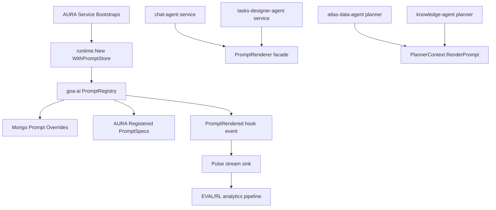
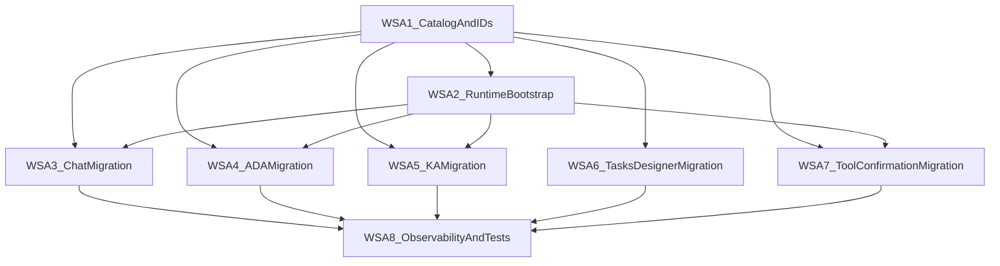

# Prompt Management Adoption in AURA

## 1. Executive Summary

This document specifies all AURA-side changes required to adopt the goa-ai prompt
management feature defined in `docs/wips/prompt_management.md`.

The outcome is:

- All AURA prompts become runtime-managed (identity + version + scope resolution).
- Prompt content is dynamically overrideable (Mongo-backed store via goa-ai).
- Prompt usage is observable for EVAL/RL loops.
- Existing behavior remains functionally equivalent while removing ad hoc prompt
  ownership across services.

This is written so an agent with no context from prior conversations can execute it.

---

## 2. Scope and Preconditions

### 2.1 In Scope (AURA repo)

- Prompt inventory codification (IDs + ownership).
- Runtime wiring to `WithPromptStore(...)` in AURA services that host goa-ai runtime.
- Prompt rendering migration in:
  - `services/chat-agent`
  - `services/atlas-data-agent`
  - `services/knowledge-agent`
  - `services/tasks-designer-agent` (direct model path)
- Tool confirmation prompt migration plan for design-defined `PromptTemplate(...)`.
- AURA test updates.

### 2.2 Out of Scope (this document)

- goa-ai implementation details (covered by `prompt_management.md`).
- prompt authoring UI.
- optimizer orchestration (EVAL/RL runner implementation).

### 2.3 Required goa-ai prereq

The following must already exist in goa-ai:

- `runtime/agent/prompt/*`
- `features/prompt/mongo/*`
- `runtime.WithPromptStore(...)`
- `planner.PlannerContext.RenderPrompt(...)`
- `WithPromptSpec(...)` for agent-tools
- `PromptRendered` hook/stream events
- `model.Request.PromptRefs`

---

## 3. Complete AURA Prompt Inventory (Source of Truth)

This section enumerates all prompt sources to migrate.

## 3.1 Shared prompts

- `shared/prompts/aura.go`
  - `AURAPreamble`
  - `PowerMeasurementGuidance`
  - `TimeGroundingGuidance`
- `shared/prompts/analytics_ops_guidance.go`
- `shared/prompts/assets/analytics_ops_guidance.md`
- `shared/prompts/assets/analytics_ops_guidance_internal.md`

## 3.2 Chat agent prompt templates

- `services/chat-agent/prompts/templates/chat.go.tpl`
- `services/chat-agent/prompts/templates/brief_context.go.tpl`
- `services/chat-agent/prompts/templates/partials/guidance_common.go.tpl`
- `services/chat-agent/prompts/templates/partials/retry_policy.go.tpl`
- `services/chat-agent/prompts/templates/partials/tool_use_rules.go.tpl`
- `services/chat-agent/prompts/templates/partials/evidence_citations.go.tpl`

Current render/injection points:

- `services/chat-agent/prompts/templates.go`
- `services/chat-agent/service.go` (`BuildChatPrompt`, system message assembly)

## 3.3 Atlas Data Agent prompt templates

Templates:

- `services/atlas-data-agent/prompts/templates/system.go.tpl`
- `services/atlas-data-agent/prompts/templates/analyze_sensor_patterns.go.tpl`
- `services/atlas-data-agent/prompts/templates/build_alarm_context.go.tpl`
- `services/atlas-data-agent/prompts/templates/compare_periods.go.tpl`
- `services/atlas-data-agent/prompts/templates/count_events.go.tpl`
- `services/atlas-data-agent/prompts/templates/explain_control_logic.go.tpl`
- `services/atlas-data-agent/prompts/templates/find_related_alarms.go.tpl`
- `services/atlas-data-agent/prompts/templates/get_application_status.go.tpl`
- `services/atlas-data-agent/prompts/templates/get_control_context.go.tpl`
- `services/atlas-data-agent/prompts/templates/get_device_snapshot.go.tpl`
- `services/atlas-data-agent/prompts/templates/get_ehs_context.go.tpl`
- `services/atlas-data-agent/prompts/templates/get_energy_rates.go.tpl`
- `services/atlas-data-agent/prompts/templates/get_equipment_key_events.go.tpl`
- `services/atlas-data-agent/prompts/templates/get_equipment_status.go.tpl`
- `services/atlas-data-agent/prompts/templates/get_grid_load_forecast.go.tpl`
- `services/atlas-data-agent/prompts/templates/get_key_events.go.tpl`
- `services/atlas-data-agent/prompts/templates/get_time_series.go.tpl`
- `services/atlas-data-agent/prompts/templates/get_topology.go.tpl`
- `services/atlas-data-agent/prompts/templates/get_weather_forecast.go.tpl`
- `services/atlas-data-agent/prompts/templates/get_weather_observations.go.tpl`
- `services/atlas-data-agent/prompts/templates/list_alarms.go.tpl`
- `services/atlas-data-agent/prompts/templates/list_device_settings.go.tpl`
- `services/atlas-data-agent/prompts/templates/list_equipment_mode_changes.go.tpl`
- `services/atlas-data-agent/prompts/templates/list_setting_changes.go.tpl`
- `services/atlas-data-agent/prompts/templates/render_chart.go.tpl`
- `services/atlas-data-agent/prompts/templates/resolve_time_series_sources.go.tpl`
- `services/atlas-data-agent/prompts/templates/review_recent_changes.go.tpl`
- `services/atlas-data-agent/prompts/templates/search_documentation.go.tpl`
- `services/atlas-data-agent/prompts/templates/trace_control_dependencies.go.tpl`
- `services/atlas-data-agent/prompts/templates/partials/guidance_common.go.tpl`
- `services/atlas-data-agent/prompts/templates/partials/inputs_common.go.tpl`
- `services/atlas-data-agent/prompts/templates/partials/resolve_scope_context.go.tpl`
- `services/atlas-data-agent/prompts/templates/partials/resolve_time_context.go.tpl`

Synthesis templates:

- `services/atlas-data-agent/prompts/synthesis/system.tmpl`
- `services/atlas-data-agent/prompts/synthesis/preamble.tmpl`
- `services/atlas-data-agent/prompts/synthesis/get_key_events.tmpl`
- `services/atlas-data-agent/prompts/synthesis/get_time_series.tmpl`
- `services/atlas-data-agent/prompts/synthesis/get_topology.tmpl`
- `services/atlas-data-agent/prompts/synthesis/review_recent_changes.tmpl`
- `services/atlas-data-agent/prompts/synthesis/trace_control_dependencies.tmpl`

Current render/injection points:

- `services/atlas-data-agent/prompts/templates.go`
- `services/atlas-data-agent/prompts/synthesis_render.go`
- `services/atlas-data-agent/planner/planner.go`

## 3.4 Knowledge agent prompt templates

- `services/knowledge-agent/prompts/templates/system.go.tpl`
- `services/knowledge-agent/prompts/templates.go`
- `services/knowledge-agent/planner/planner.go`

## 3.5 Tasks-designer-agent prompts

- `services/tasks-designer-agent/prompts/system.tmpl`
- `services/tasks-designer-agent/prompts/user.tmpl`
- `services/tasks-designer-agent/prompts.go`
- `services/tasks-designer-agent/service.go` (direct `model.Client` request build)

## 3.6 Tool confirmation prompts in DSL

- `services/chat-agent/design/brief_toolset.go` (`PromptTemplate(...)`)
- `services/atlas-commands/design/toolset.go` (`PromptTemplate(...)`)

These prompts are generated into tool registration code and must be included in
the migration strategy for complete coverage.

---

## 4. Target Architecture in AURA

Design rule: AURA owns prompt content and prompt IDs, goa-ai owns prompt runtime
contracts and store mechanics.

---

## 5. Canonical Prompt ID Scheme for AURA

Add explicit canonical IDs so overrides and analytics are stable:

- `aura.shared.preamble`
- `aura.shared.power_guidance`
- `aura.shared.time_guidance`
- `aura.shared.analytics_ops.public`
- `aura.shared.analytics_ops.internal`
- `aura.chat.system`
- `aura.chat.brief_context`
- `aura.chat.partial.guidance_common`
- `aura.chat.partial.retry_policy`
- `aura.chat.partial.tool_use_rules`
- `aura.chat.partial.evidence_citations`
- `aura.ada.system`
- `aura.ada.tool.<method_slug>` for all ADA method templates
- `aura.ada.partial.<partial_name>`
- `aura.ada.synthesis.<slug>`
- `aura.knowledge.system`
- `aura.tasks_designer.system`
- `aura.tasks_designer.user`
- `aura.tool.confirmation.brief_delete`
- `aura.tool.confirmation.atlas_commands.change_setpoint`
- `aura.tool.confirmation.atlas_commands.change_app_setting`

---

## 6. Work Streams (AURA)

## WS-A1: Prompt Catalog + IDs (foundation)

Create new package:

- `shared/prompts/catalog/`

Suggested files:

- `shared/prompts/catalog/ids.go`
- `shared/prompts/catalog/shared_specs.go`
- `shared/prompts/catalog/chat_specs.go`
- `shared/prompts/catalog/ada_specs.go`
- `shared/prompts/catalog/knowledge_specs.go`
- `shared/prompts/catalog/tasks_designer_specs.go`

Responsibilities:

1. Declare canonical prompt ID constants.
2. Build `prompt.PromptSpec` instances from embedded template sources.
3. Expose registration helpers:
   - `RegisterSharedSpecs(reg *prompt.Registry) error`
   - `RegisterChatSpecs(reg *prompt.Registry) error`
   - `RegisterADASpecs(reg *prompt.Registry) error`
   - `RegisterKnowledgeSpecs(reg *prompt.Registry) error`
   - `RegisterTasksDesignerSpecs(reg *prompt.Registry) error`

Constraint:

- No fallback prompt IDs.
- Registration failure is fatal at bootstrap.

## WS-A2: Runtime bootstrap wiring in agent services

Modify runtime-hosting services:

- `services/chat-agent/cmd/chat-agent/main.go`
- `services/atlas-data-agent/cmd/atlas-data-agent/main.go`
- `services/knowledge-agent/cmd/knowledge-agent/main.go`

Changes:

1. Initialize goa-ai prompt Mongo store from existing `mongoClient` and
   `constants.GoaAIRuntimeDB`.
2. Pass `runtime.WithPromptStore(promptStore)` (or `airuntime.WithPromptStore`)
   into runtime options.
3. Immediately after runtime creation, register prompt specs for that service and
   shared specs via catalog helpers.

Bootstrap rule:

- If prompt store creation fails -> fail service startup (strong contract).
- If prompt spec registration fails -> fail service startup.

## WS-A3: Chat-agent prompt rendering migration

Current state:

- `services/chat-agent/service.go` renders prompts directly with
  `prompts.BuildChatPrompt(...)` and injects `sharedprompts.AURAPreamble`.

Target:

1. Introduce chat prompt renderer facade that resolves prompt text by ID through
   runtime prompt registry.
2. Keep existing fact-selection logic in
   `services/chat-agent/prompts/templates.go` but replace final rendering call to
   registry-based rendering.
3. Split prompt composition into explicit IDs:
   - `aura.shared.preamble`
   - `aura.chat.system`
   - `aura.chat.brief_context`
4. Ensure created `model.Request` includes prompt refs once goa-ai runtime path
   supports it (for the planner-run path).

Files to modify:

- `services/chat-agent/service.go`
- `services/chat-agent/prompts/templates.go`
- new optional adapter:
  - `services/chat-agent/prompts/registry_renderer.go`

## WS-A4: Atlas-data-agent planner migration

Current state:

- `services/atlas-data-agent/planner/planner.go` calls `adprompts.Render(...)`
  and `RenderSynthesis(...)` directly.

Target:

1. Replace template package direct renders with `in.Agent.RenderPrompt(...)` for
   system and method prompts.
2. For synthesis templates, route through a prompt renderer abstraction that also
   resolves IDs from registry.
3. Remove duplicated method prompt reinjection logic that bypasses prompt IDs.

Files:

- `services/atlas-data-agent/planner/planner.go`
- `services/atlas-data-agent/prompts/templates.go`
- `services/atlas-data-agent/prompts/synthesis_render.go`

## WS-A5: Knowledge-agent planner migration

Current state:

- `services/knowledge-agent/planner/planner.go` calls `kaprompts.RenderSystem()`.

Target:

1. Replace direct render with `in.Agent.RenderPrompt(ctx, "aura.knowledge.system", data)`.
2. Keep current "inject if missing" semantic but source from registry-managed prompt.

Files:

- `services/knowledge-agent/planner/planner.go`
- `services/knowledge-agent/prompts/templates.go`

## WS-A6: Tasks-designer-agent migration (non-runtime path)

Current state:

- `services/tasks-designer-agent/service.go` builds prompt strings directly from
  `RenderSystemPrompt(...)` and `RenderUserPrompt(...)`.
- Service does not use goa-ai runtime (`model.Client` direct call).

Target:

1. Introduce lightweight prompt manager client in this service that can resolve
   prompt IDs against prompt store + baseline templates.
2. Route `system` and `user` prompt rendering through prompt IDs:
   - `aura.tasks_designer.system`
   - `aura.tasks_designer.user`
3. Keep existing semantic composition (`AURAPreamble` + tasks_designer wrapper),
   but source all components from managed IDs.

Files:

- `services/tasks-designer-agent/service.go`
- `services/tasks-designer-agent/prompts.go`
- `services/tasks-designer-agent/cmd/tasks-designer-agent/main.go`
- new local prompt manager adapter:
  - `services/tasks-designer-agent/prompt_manager.go`

## WS-A7: Tool confirmation prompt migration

Current state:

- Confirmation prompts are declared via DSL `PromptTemplate(...)` in design files.

Target:

1. Ensure generated confirmation prompts are assigned canonical prompt IDs and
   resolved through goa-ai prompt registry/store.
2. Migrate ADA toolset registration in:
   - `services/chat-agent/toolsets/ada/register.go`
   to use `WithPromptSpec(...)` where applicable.

Files:

- `services/chat-agent/design/brief_toolset.go`
- `services/atlas-commands/design/toolset.go`
- `services/chat-agent/toolsets/ada/register.go`
- generated files after regen (`gen/...`) via codegen, not manual edits.

## WS-A8: Observability, EVAL hooks, and tests

Add AURA-side validation and integration tests:

1. Prompt override resolution tests per service.
2. Startup-fail tests when prompt catalog registration is invalid.
3. End-to-end test that emits `prompt_rendered` stream events and verifies event
   contains prompt ID + version.
4. Regression tests for unchanged planner/tool behavior.

Files to add/update:

- `services/chat-agent/prompts/templates_test.go`
- `services/atlas-data-agent/prompts/*_test.go`
- `services/knowledge-agent/prompts/*_test.go`
- `services/tasks-designer-agent/*_test.go`
- `services/chat-agent/toolsets/ada/registration_test.go`

---

## 7. Service-by-Service Change Map

## 7.1 `services/chat-agent`

Modify:

- `cmd/chat-agent/main.go`
- `service.go`
- `prompts/templates.go`
- `toolsets/ada/register.go`
- design files for confirmation prompt IDs

Add:

- `prompts/registry_renderer.go` (or equivalent)

## 7.2 `services/atlas-data-agent`

Modify:

- `cmd/atlas-data-agent/main.go`
- `planner/planner.go`
- `prompts/templates.go`
- `prompts/synthesis_render.go`

## 7.3 `services/knowledge-agent`

Modify:

- `cmd/knowledge-agent/main.go`
- `planner/planner.go`
- `prompts/templates.go`

## 7.4 `services/tasks-designer-agent`

Modify:

- `cmd/tasks-designer-agent/main.go`
- `service.go`
- `prompts.go`

Add:

- `prompt_manager.go`

## 7.5 `shared/`

Add:

- `shared/prompts/catalog/*`

Modify:

- `shared/prompts/*` only if extraction helpers are needed for cleaner registration.

---

## 8. Dependency Graph and Parallelism

### 8.1 Independently parallelizable tracks

After WS-A1 is merged:

1. Track P1: WS-A2 runtime bootstrapping (three services)
2. Track P2: WS-A3 chat-agent migration
3. Track P3: WS-A4 atlas-data-agent migration
4. Track P4: WS-A5 knowledge-agent migration
5. Track P5: WS-A6 tasks-designer-agent migration
6. Track P6: WS-A7 tool confirmation migration

WS-A8 can be split and started as each track lands.

### 8.2 Suggested team split

- Engineer A: WS-A1 + WS-A2
- Engineer B: WS-A3
- Engineer C: WS-A4
- Engineer D: WS-A5 + WS-A6
- Engineer E: WS-A7 + WS-A8 integration hardening

---

## 9. Acceptance Criteria

1. Every prompt source in section 3 has a canonical ID and registry entry.
2. Runtime-hosting services initialize and use `WithPromptStore(...)`.
3. Chat, ADA, and KA no longer render system/method prompts via unmanaged direct
   template execution paths.
4. Tasks-designer prompt path is managed dynamically despite non-runtime execution.
5. Confirmation prompts are manageable via IDs (no unmanaged islands).
6. `prompt_rendered` events appear in AURA stream/event traces with IDs and versions.
7. No silent fallback behavior when prompt IDs are missing or invalid.

---

## 10. Rollout Sequence

1. Merge WS-A1 (catalog + IDs).
2. Merge WS-A2 (runtime bootstraps).
3. Migrate service prompt paths in parallel (WS-A3/4/5/6).
4. Migrate confirmation/tool prompt path (WS-A7).
5. Run full integration and observability validation (WS-A8).
6. Enable production override rollout in controlled scopes:
   - global -> org -> facility -> session.

---

## 11. Notes for the Implementing Agent

1. Do not edit generated files in `gen/` directly; regenerate from design.
2. Keep strong contracts: missing prompt IDs or bad templates must fail loudly.
3. Avoid dual ownership: each prompt should have exactly one canonical owner ID.
4. Prefer deleting obsolete rendering paths once migrated.
5. Update architecture docs in AURA if runtime flow changes materially:
   - `docs/ARCHITECTURE.md`
   - `diagram/` artifacts

